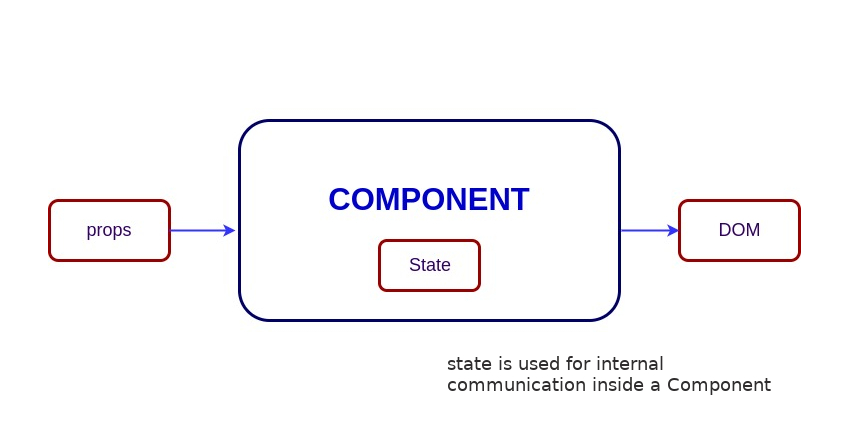
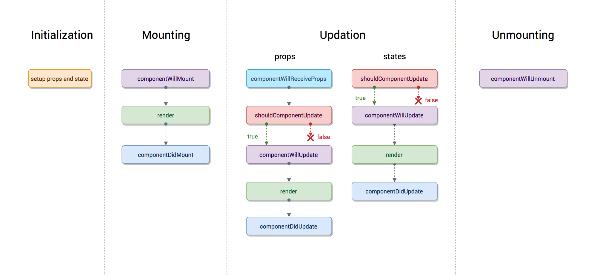
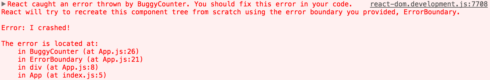

# React Interview Questions & Answers

> Click :star:if you like the project. Pull Request are highly appreciated.

### Table of Contents

| No. | Questions |
| --- | --------- |
|   | **Core React** |
|1  | [What is React?](#what-is-react) |
|2  | [What are the major features of React?](#what-are-the-major-features-of-react) |
|3  | [What is JSX?](#what-is-jsx) |
|4  | [What is the difference between Element and Component?](#what-is-the-difference-between-element-and-component) |
|5  | [How to create components in React?](#how-to-create-components-in-react) |
|6  | [When to use a Class Component over a Function Component?](#when-to-use-a-class-component-over-a-function-component) |
|7  | [What are Pure Components?](#what-are-pure-components) |
|8  | [What is state in React?](#what-is-state-in-react) |
|9  | [What are props in React?](#what-are-props-in-react) |
|10 | [What is the difference between state and props?](#what-is-the-difference-between-state-and-props) |
|11 | [Why should we not update the state directly?](#why-should-we-not-update-the-state-directly) |
|12 | [What is the purpose of callback function as an argument of setState()?](#what-is-the-purpose-of-callback-function-as-an-argument-of-setstate)
|13 | [What is the difference between HTML and React event handling?](#what-is-the-difference-between-html-and-react-event-handling) |
|14 | [How to bind methods or event handlers in JSX callbacks?](#how-to-bind-methods-or-event-handlers-in-jsx-callbacks) |
|15 | [How to pass a parameter to an event handler or callback?](#how-to-pass-a-parameter-to-an-event-handler-or-callback) |
|16 | [What are synthetic events in React?](#what-are-synthetic-events-in-react) |
|17 | [What is inline conditional expressions?](#what-is-inline-conditional-expressions) |
|18 | [What are "key" props and what is the benefit of using them in arrays of elements?](#what-are-key-props-and-what-is-the-benefit-of-using-them-in-arrays-of-elements) |
|19 | [What is the use of refs?](#what-is-the-use-of-refs) |
|20 | [How to create refs?](#how-to-create-refs)
|21 | [What are forward refs?](#what-are-forward-refs) |
|22 | [Which is preferred option with in callback refs and findDOMNode()?](#which-is-preferred-option-with-in-callback-refs-and-finddomnode) |
|23 | [Why are String Refs legacy?](#why-are-string-refs-legacy) |
|24 | [What is Virtual DOM?](#what-is-virtual-dom) |
|25 | [How Virtual DOM works?](#how-virtual-dom-works) |
|26 | [What is the difference between Shadow DOM and Virtual DOM?](#what-is-the-difference-between-shadow-dom-and-virtual-dom) |
|27 | [What is React Fiber?](#what-is-react-fiber) |
|28 | [What is the main goal of React Fiber?](#what-is-the-main-goal-of-react-fiber) |
|29 | [What are controlled components?](#what-are-controlled-components) |
|30 | [What are uncontrolled components?](#what-are-uncontrolled-components) |
|31 | [What is the difference between createElement and cloneElement?](#what-is-the-difference-between-createelement-and-cloneelement) |
|32 | [What is Lifting State Up in React?](#what-is-lifting-state-up-in-react) |
|33 | [What are the different phases of component lifecycle?](#what-are-the-different-phases-of-component-lifecycle) |
|34 | [What are the lifecycle methods of React?](#what-are-the-lifecycle-methods-of-react) |
|35 | [What are Higher-Order components?](#what-are-higher-order-components) |
|36 | [How to create props proxy for HOC component?](#how-to-create-props-proxy-for-hoc-component) |
|37 | [What is context?](#what-is-context) |
|38 | [What is children prop?](#what-is-children-prop) |
|39 | [How to write comments in React?](#how-to-write-comments-in-react) |
|40 | [What is the purpose of using super constructor with props argument?](#what-is-the-purpose-of-using-super-constructor-with-props-argument) |
|41 | [What is reconciliation?](#what-is-reconciliation) |
|42 | [How to set state with a dynamic key name?](#how-to-set-state-with-a-dynamic-key-name) |
|43 | [What would be the common mistake of function being called every time the component renders?](#what-would-be-the-common-mistake-of-function-being-called-every-time-the-component-renders) |
|44 | [Why is it necessary to capitalize component names?](#why-is-it-necessary-to-capitalize-component-names) |
|45 | [Why React uses className over class attribute?](#why-react-uses-classname-over-class-attribute) |
|46 | [What are fragments?](#what-are-fragments) |
|47 | [Why fragments are better than container divs?](#why-fragments-are-better-than-container-divs) |
|48 | [What are portals in React?](#what-are-portals-in-react) |
|49 | [What are stateless components?](#what-are-stateless-components) |
|50 | [What are stateful components?](#what-are-stateful-components) |
|51 | [How to apply validation on props in React?](#how-to-apply-validation-on-props-in-react) |
|52 | [What are the advantages of React?](#what-are-the-advantages-of-react) |
|53 | [What are the limitations of React?](#what-are-the-limitations-of-react) |
|54 | [What are error boundaries in React v16](#what-are-error-boundaries-in-react-v16) |
|55 | [How error boundaries handled in React v15?](#how-error-boundaries-handled-in-react-v15) |
|56 | [What are the recommended ways for static type checking?](#what-are-the-recommended-ways-for-static-type-checking) |
|57 | [What is the use of react-dom package?](#what-is-the-use-of-react-dom-package) |
|58 | [What is the purpose of render method of react-dom?](#what-is-the-purpose-of-render-method-of-react-dom) |
|59 | [What is ReactDOMServer?](#what-is-reactdomserver) |
|60 | [How to use InnerHtml in React?](#how-to-use-innerhtml-in-react) |
|61 | [How to use styles in React?](#how-to-use-styles-in-react) |
|62 | [How events are different in React?](#how-events-are-different-in-react) |
|63 | [What will happen if you use setState in constructor?](#what-will-happen-if-you-use-setstate-in-constructor) |
|64 | [What is the impact of indexes as keys?](#what-is-the-impact-of-indexes-as-keys) |
|65 | [Is it good to use setState() in componentWillMount() method?](#is-it-good-to-use-setstate-in-componentwillmount-method) |
|66 | [What will happen if you use props in initial state?](#what-will-happen-if-you-use-props-in-initial-state) |
|67 | [How do you conditionally render components?](#how-do-you-conditionally-render-components)
|68 | [Why we need to be careful when spreading props on DOM elements??](#why-we-need-to-be-careful-when-spreading-props-on-dom-elements) |
|69 | [How you use decorators in React?](#how-you-use-decorators-in-react) |
|70 | [How do you memoize a component?](#how-do-you-memoize-a-component) |
|71 | [How you implement Server-Side Rendering or SSR?](#how-you-implement-server-side-rendering-or-ssr) |
|72 | [How to enable production mode in React?](#how-to-enable-production-mode-in-react) |
|73 | [What is CRA and its benefits?](#what-is-cra-and-its-benefits) |
|74 | [What is the lifecycle methods order in mounting?](#what-is-the-lifecycle-methods-order-in-mounting) |
|75 | [What are the lifecycle methods going to be deprecated in React v16?](#what-are-the-lifecycle-methods-going-to-be-deprecated-in-react-v16) |
|76 | [What is the purpose of getDerivedStateFromProps() lifecycle method?](#what-is-the-purpose-of-getderivedstatefromprops-lifecycle-method) |
|77 | [What is the purpose of getSnapshotBeforeUpdate() lifecycle method?](#what-is-the-purpose-of-getsnapshotbeforeupdate-lifecycle-method) |
|78 | [What is the difference between createElement() and cloneElement() methods?](#what-is-the-difference-between-createelement-and-cloneelement-methods) |
|79 | [What is the recommended way for naming components?](#what-is-the-recommended-way-for-naming-components) |
|80 | [What is the recommended ordering of methods in component class?](#what-is-the-recommended-ordering-of-methods-in-component-class) |
|81 | [What is a switching component?](#what-is-a-switching-component) |
|82 | [Why we need to pass a function to setState()?](#why-we-need-to-pass-a-function-to-setstate) |
|83 | [What is strict mode in React?](#what-is-strict-mode-in-react) |
|84 | [What are React Mixins?](#what-are-react-mixins) |
|85 | [Why is isMounted() an anti-pattern and what is the proper solution?](#why-is-ismounted-an-anti-pattern-and-what-is-the-proper-solution) |
|86 | [What are the Pointer Events supported in React?](#what-are-the-pointer-events-supported-in-react) |
|87 | [Why should component names start with capital letter?](#why-should-component-names-start-with-capital-letter) |
|88 | [Are custom DOM attributes supported in React v16?](#are-custom-dom-attributes-supported-in-react-v16) |
|89 | [What is the difference between constructor and getInitialState?](#what-is-the-difference-between-constructor-and-getinitialstate) |
|90 | [Can you force a component to re-render without calling setState?](#can-you-force-a-component-to-re-render-without-calling-setstate) |
|91 | [What is the difference between super() and super(props) in React using ES6 classes?](#what-is-the-difference-between-super-and-superprops-in-react-using-es6-classes) |
|92 | [How to loop inside JSX?](#how-to-loop-inside-jsx) |
|93 | [How do you access props in attribute quotes?](#how-do-you-access-props-in-attribute-quotes) |
|94 | [What is React PropType array with shape?](#what-is-react-proptype-array-with-shape) |
|95 | [How conditionally apply class attributes?](#how-conditionally-apply-class-attributes) |
|96 | [What is the difference between React and ReactDOM?](#what-is-the-difference-between-react-and-reactdom) |
|97 | [Why ReactDOM is separated from React?](#why-reactdom-is-separated-from-react) |
|98 | [How to use React label element?](#how-to-use-react-label-element) |
|99 | [How to combine multiple inline style objects?](#how-to-combine-multiple-inline-style-objects) |
|100| [How to re-render the view when the browser is resized?](#how-to-re-render-the-view-when-the-browser-is-resized)
|101| [What is the difference between setState and replaceState methods?](#what-is-the-difference-between-setstate-and-replacestate-methods) |
|102| [How to listen to state changes?](#how-to-listen-to-state-changes) |
|103| [What is the recommended approach of removing an array element in react state?](#what-is-the-recommended-approach-of-removing-an-array-element-in-react-state) |
|104| [Is it possible to use React without rendering HTML?](#is-it-possible-to-use-react-without-rendering-html) |
|105| [How to pretty print JSON with React?](#how-to-pretty-print-json-with-react) |
|106| [Why you can't update props in React?](#why-you-cant-update-props-in-react) |
|107| [How to focus an input element on page load?](#how-to-focus-an-input-element-on-page-load) |
|108| [What are the possible ways of updating objects in state?](#what-are-the-possible-ways-of-updating-objects-in-state) |
|109| [Why function is preferred over object for setState?](#why-function-is-preferred-over-object-for-setstate) |
|110| [How can we find the version of React at runtime in the browser?](#how-can-we-find-the-version-of-react-at-runtime-in-the-browser) |
|111| [What are the approaches to include polyfills in your create-react-app?](#what-are-the-approaches-to-include-polyfills-in-your-create-react-app) |
|112| [How to use https instead of http in create-react-app?](#how-to-use-https-instead-of-http-in-create-react-app) |
|113| [How to avoid using relative path imports in create-react-app?](#how-to-avoid-using-relative-path-imports-in-create-react-app) |
|114| [How to add Google Analytics for react-router?](#how-to-add-google-analytics-for-react-router) |
|115| [How to update a component every second?](#how-to-update-a-component-every-second) |
|116| [How do you apply vendor prefixes to inline styles in React?](#how-do-you-apply-vendor-prefixes-to-inline-styles-in-react) |
|117| [How to import and export components using react and ES6?](#how-to-import-and-export-components-using-react-and-es6) |
|118| [Why React component names must begin with a capital letter?](#why-react-component-names-must-begin-with-a-capital-letter) |
|119| [Why is a component constructor called only once?](#why-is-a-component-constructor-called-only-once) |
|120| [How to define constants in React?](#how-to-define-constants-in-react) |
|121| [How to programmatically trigger click event in React?](#how-to-programmatically-trigger-click-event-in-react) |
|122| [Is it possible to use async/await in plain React?](#is-it-possible-to-use-asyncawait-in-plain-react) |
|123| [What are the common folder structures for React?](#what-are-the-common-folder-structures-for-react) |
|124| [What are the popular packages for animation?](#what-are-the-popular-packages-for-animation) |
|125| [What is the benefit of styles modules?](#what-is-the-benefit-of-styles-modules) |
|126| [What are the popular React-specific linters?](#what-are-the-popular-react-specific-linters) |
|127| [How to make AJAX call and In which component lifecycle methods should I make an AJAX call?](#how-to-make-ajax-call-and-in-which-component-lifecycle-methods-should-i-make-an-ajax-call) |
|128| [What are render props?](#what-are-render-props) |
|   | **React Router** |
|129| [What is React Router?](#what-is-react-router) |
|130| [How React Router is different from history library?](#how-react-router-is-different-from-history-library) |
|131| [What are the \<Router> components of React Router v4?](#what-are-the-router-components-of-react-router-v4) |
|132| [What is the purpose of push and replace methods of history?](#what-is-the-purpose-of-push-and-replace-methods-of-history) |
|133| [How do you programmatically navigate using React router v4?](#how-do-you-programmatically-navigate-using-react-router-v4) |
|134| [How to get query parameters in React Router v4](#how-to-get-query-parameters-in-react-router-v4) |
|135| [Why you get "Router may have only one child element" warning?](#why-you-get-router-may-have-only-one-child-element-warning) |
|136| [How to pass params to history.push method in React Router v4?](#how-to-pass-params-to-historypush-method-in-react-router-v4) |
|137| [How to implement default or NotFound page?](#how-to-implement-default-or-notfound-page) |
|138| [How to get history on React Router v4?](#how-to-get-history-on-react-router-v4) |
|139| [How to perform automatic redirect after login?](#how-to-perform-automatic-redirect-after-login) |
|   | **React Internationalization** |
|140| [What is React-Intl?](#what-is-react-intl) |
|141| [What are the main features of React Intl?](#what-are-the-main-features-of-react-intl) |
|142| [What are the two ways of formatting in React Intl?](#what-are-the-two-ways-of-formatting-in-react-intl) |
|143| [How to use FormattedMessage as placeholder using React Intl?](#how-to-use-formattedmessage-as-placeholder-using-react-intl) |
|144| [How to access current locale with React Intl](#how-to-access-current-locale-with-react-intl) |
|145| [How to format date using React Intl?](#how-to-format-date-using-react-intl) |
|   | **React Testing** |
|146| [What is Shallow Renderer in React testing?](#what-is-shallow-renderer-in-react-testing) |
|147| [What is TestRenderer package in React?](#what-is-testrenderer-package-in-react) |
|148| [What is the purpose of ReactTestUtils package?](#what-is-the-purpose-of-reacttestutils-package) |
|149| [What is Jest?](#what-is-jest) |
|150| [What are the advantages of Jest over Jasmine?](#what-are-the-advantages-of-jest-over-jasmine) |
|151| [Give a simple example of Jest test case](#give-a-simple-example-of-jest-test-case) |
|   | **React Redux** |
|152| [What is Flux?](#what-is-flux) |
|153| [What is Redux?](#what-is-redux) |
|154| [What are the core principles of Redux?](#what-are-the-core-principles-of-redux) |
|155| [What are the downsides of Redux compared to Flux?](#what-are-the-downsides-of-redux-compared-to-flux) |
|156| [What is the difference between mapStateToProps() and mapDispatchToProps()?](#what-is-the-difference-between-mapstatetoprops-and-mapdispatchtoprops) |
|157| [Can I dispatch an action in reducer?](#can-i-dispatch-an-action-in-reducer) |
|158| [How to access Redux store outside a component?](#how-to-access-redux-store-outside-a-component) |
|159| [What are the drawbacks of MVW pattern](#what-are-the-drawbacks-of-mvw-pattern) |
|160| [Are there any similarities between Redux and RxJS?](#are-there-any-similarities-between-redux-and-rxjs) |
|161| [How to dispatch an action on load?](#how-to-dispatch-an-action-on-load) |
|162| [How to use connect from React Redux?](#how-to-use-connect-from-react-redux) |
|163| [How to reset state in Redux?](#how-to-reset-state-in-redux) |
|164| [Whats the purpose of at symbol in the redux connect decorator?](#whats-the-purpose-of-at-symbol-in-the-redux-connect-decorator) |
|165| [What is the difference between React context and React Redux?](#what-is-the-difference-between-react-context-and-react-redux) |
|166| [Why are Redux state functions called reducers?](#why-are-redux-state-functions-called-reducers) |
|167| [How to make AJAX request in Redux?](#how-to-make-ajax-request-in-redux) |
|168| [Should I keep all component's state in Redux store?](#should-i-keep-all-components-state-in-redux-store) |
|169| [What is the proper way to access Redux store?](#what-is-the-proper-way-to-access-redux-store) |
|170| [What is the difference between component and container in React Redux?](#what-is-the-difference-between-component-and-container-in-react-redux) |
|171| [What is the purpose of the constants in Redux? ](#what-is-the-purpose-of-the-constants-in-redux) |
|172| [What are the different ways to write mapDispatchToProps()?](#what-are-the-different-ways-to-write-mapdispatchtoprops) |
|173| [What is the use of the ownProps parameter in mapStateToProps() and mapDispatchToProps()?](#what-is-the-use-of-the-ownprops-parameter-in-mapstatetoprops-and-mapdispatchtoprops) |
|174| [How to structure Redux top level directories?](#how-to-structure-redux-top-level-directories) |
|175| [What is redux-saga?](#what-is-redux-saga) |
|176| [What is the mental model of redux-saga?](#what-is-the-mental-model-of-redux-saga) |
|177| [What are the differences between call and put in redux-saga](#what-are-the-differences-between-call-and-put-in-redux-saga) |
|178| [What is Redux Thunk?](#what-is-redux-thunk) |
|179| [What are the differences between redux-saga and redux-thunk](#what-are-the-differences-between-redux-saga-and-redux-thunk) |
|180| [What is Redux DevTools?](#what-is-redux-devtools) |
|181| [What are the features of Redux DevTools?](#what-are-the-features-of-redux-devtools) |
|182| [What are Redux selectors and Why to use them?](#what-are-redux-selectors-and-why-to-use-them) |
|183| [What is Redux Form?](#what-is-redux-form) |
|184| [What are the main features of Redux Form?](#what-are-the-main-features-of-redux-form) |
|185| [How to add multiple middlewares to Redux?](#how-to-add-multiple-middlewares-to-redux) |
|186| [How to set initial state in Redux?](#how-to-set-initial-state-in-redux) |
|187| [How Relay is different from Redux?](#how-relay-is-different-from-redux) |
|   | **React Native** |
|188| [What is the difference between React Native and React?](#what-is-the-difference-between-react-native-and-react) |
|189| [How to test React Native apps?](#how-to-test-react-native-apps) |
|190| [How to do logging in React Native?](#how-to-do-logging-in-react-native) |
|191| [How to debug your React Native?](#how-to-debug-your-react-native) |
|   | **React supported libraries and Integration** |
|192| [What is reselect and how it works?](#what-is-reselect-and-how-it-works) |
|193| [What is Flow?](#what-is-flow) |
|194| [What is the difference between Flow and PropTypes?](#what-is-the-difference-between-flow-and-proptypes) |
|195| [How to use font-awesome icons in React?](#how-to-use-font-awesome-icons-in-react) |
|196| [What is React Dev Tools?](#what-is-react-dev-tools) |
|197| [Why is DevTools not loading in Chrome for local files?](#why-is-devtools-not-loading-in-chrome-for-local-files) |
|198| [How to use Polymer in React?](#how-to-use-polymer-in-react) |
|199| [What are the advantages of React over Vue.js?](#what-are-the-advantages-of-react-over-vuejs) |
|200| [What is the difference between React and Angular?](#what-is-the-difference-between-react-and-angular) |
|201| [Why React tab is not showing up in DevTools?](#why-react-tab-is-not-showing-up-in-devtools) |
|202| [What are styled components?](#what-are-styled-components) |
|203| [Give an example of Styled Components?](#give-an-example-of-styled-components) |
|204| [What is Relay?](#what-is-relay) |
|205| [How to use TypeScript in create-react-app application?](#how-to-use-typescript-in-create-react-app-application) |
|   | **Miscellaneous** |
|206| [What are the main features of reselect library?](#what-are-the-main-features-of-reselect-library) |
|207| [Give an example of reselect usage?](#give-an-example-of-reselect-usage) |
|208| [What is an action in Redux?](#what-is-an-action-in-redux) |
|209| [Does the statics object work with ES6 classes in React?](#does-the-statics-object-work-with-es6-classes-in-react) |
|210| [Can Redux only be used with React?](#can-redux-only-be-used-with-react) |
|211| [Do you need to have a particular build tool to use Redux?](#do-you-need-to-have-a-particular-build-tool-to-use-redux) |
|212| [How Redux Form initialValues get updated from state?](#how-redux-form-initialvalues-get-updated-from-state) |
|213| [How React PropTypes allow different type for one prop?](#how-react-proptypes-allow-different-types-for-one-prop) |
|214| [Can I import an SVG file as react component?](#can-i-import-an-svg-file-as-react-component) |
|215| [Why are inline ref callbacks or functions not recommended?](#why-are-inline-ref-callbacks-or-functions-not-recommended)|
|216| [What is render hijacking in React?](#what-is-render-hijacking-in-react)|
|217| [What are HOC factory implementations?](#what-are-hoc-factory-implementations)|
|218| [How to pass numbers to React component?](#how-to-pass-numbers-to-react-component)|
|219| [Do I need to keep all my state into Redux? Should I ever use react internal state?](#do-i-need-to-keep-all-my-state-into-redux-should-i-ever-use-react-internal-state)|
|220| [What is the purpose of registerServiceWorker in React?](#what-is-the-purpose-of-registerserviceworker-in-react)|
|221| [What is React memo function?](#what-is-react-memo-function)|
|222| [What is React lazy function?](#what-is-react-lazy-function)|
|223| [How to prevent unnecessary updates using setState?](#how-to-prevent-unnecessary-updates-using-setstate)|
|224| [How do you render Array, Strings and Numbers in React 16 Version?](#how-do-you-render-array-strings-and-numbers-in-react-16-version)|
|225| [How to use class field declarations syntax in React classes?](#how-to-use-class-field-declarations-syntax-in-react-classes)|
|226| [What are hooks?](#what-are-hooks)|
|227| [What are the rules needs to follow for hooks?](#what-are-the-rules-needs-to-follow-for-hooks)|
|228| [How to ensure hooks followed the rules in your project?](#how-to-ensure-hooks-followed-the-rules-in-your-project)|
|229| [What are the differences between Flux and Redux?](#what-are-the-differences-between-flux-and-redux)|
|230| [What are the benefits of React Router V4?](#what-are-the-benefits-of-react-router-v4)|
|231| [Can you describe about componentDidCatch lifecycle method signature?](#can-you-describe-about-componentdidcatch-lifecycle-method-signature)|
|232| [In which scenarios error boundaries do not catch errors?](#in-which-scenarios-error-boundaries-do-not-catch-errors)|
|233| [Why do not you need error boundaries for event handlers?](#why-do-not-you-need-error-boundaries-for-event0-handlers)|
|234| [What is the difference between try cath block and error boundaries?](#what-is-the-difference-between-try-catch-block-and-error-boundaries)|
|235| [What is the behavior of uncaught errors in react 16?](#what-is-the-behavior-of-uncaught-errors-in-react-16)|
|236| [What is the proper placement for error boundaries?](#what-is-the-proper-placement-for-error-boundaries)|
|237| [What is the benefit of component stack trace from error boundary?](#what-is-the-benefit-of-component-stack-trace-from-error-boundary)|
|238| [What is the required method to be defined for a class component?](#what-is-the-required-method-to-be-defined-for-a-class-component)|
|239| [What are the possible return types of render method?](#what-are-the-possible-return-types-of-render-method)|
|240| [What is the main purpose of constructor?](#what-is-the-main-purpose-of-constructor)|
|241| [Is it mandatory to define constructor for React component?](#is-it-mandatory-to-define-constructor-for-react-component)|
|242| [What are default props?](#what-are-default-props)|
|243| [Why should not call setState in componentWillUnmount?](#why-should-not-call-setstate-in-componentwillunmount)|
|244| [What is the purpose of getDerivedStateFromError?](#what-is-the-purpose-of-getderivedstatefromerror)|
|245| [What is the methods order when component re-rendered?](#what-is-the-methods-order-when-component-re-rendered)|
|246| [What are the methods invoked during error handling?](#what-are-the-methods-invoked-during-error-handling)|
|247| [What is the purpose of displayName class property?](#what-is-the-purpose-of-displayname-class-property)|
|248| [What is the browser support for react applications?](#what-is-the-browser-support-for-react-applications)|
|249| [What is the purpose of unmountComponentAtNode method?](#what-is-the-purpose-of-unmountcomponentatNode-method)|
|250| [What is code-splitting?](#what-is-code-splitting)|
|251| [What is the benefit of strict mode?](#what-is-the-benefit-of-strict-mode)|
|252| [What are Keyed Fragments?](#what-are-keyed-fragments)|
|253| [Is it React support all HTML attributes?](#is-it-react-support-all-html-attributes)|
|254| [What are the limitations with HOCs?](#what-are-the-limitations-with-hocs)|
|255| [How to debug forwardRefs in DevTools?](#how-to-debug-forwardrefs-in-devtools)|
|256| [When component props defaults to true?](#when-component-props-defaults-to-true)|
|257| [What is NextJS and major features of it?](#what-is-nextjs-and-major-features-of-it)|
|258| [How do you pass an event handler to a component?](#how-do-you-pass-an-event-handler-to-a-component)|
|259| [Is it good to use arrow functions in render methods?](#is-it-good-to-use-arrow-functions-in-render-methods)|
|260| [How to prevent a function from being called multiple times?](#how-to-prevent-a-function-from-being-called-multiple-times)|
|261| [How JSX prevents Injection Attacks?](#how-jsx-prevents-injection-attacks)|
|262| [How do you update rendered elements?](#how-do-you-update-rendered-elements)|
|263| [How do you say that props are read only?](#how-do-you-say-that-props-are-read-only)|
|264| [How do you say that state updates are merged?](#how-do-you-say-that-state-updates-are-merged)|
|265| [How do you pass arguments to an event handler?](#how-do-you-pass-arguments-to-an-event-handler)|
|266| [How to prevent component from rendering?](#how-to-prevent-component-from-rendering)|
|267| [What are the conditions to safely use the index as a key?](#What-are-the-conditions-to-safely-use-the-index-as-a-key)|
|268| [Is it keys should be globally unique?](#is-it-keys-should-be-globally-unique)|
|269| [What is the popular choice for form handling?](#what-is-the-popular-choice-for-form-handling)|
|270| [What are the advantages of formik over redux form library?](#what-are-the-advantages-of-formik-over-redux-form-library)|
|271| [Why do you not required to use inheritance?](#why-do-you-not-required-to-use-inheritance)|
|272| [Can I use web components in react application?](#can-i-use-web-components-in-react-application)|

## Core React

1. ### What is React?

    React is an **open-source frontend JavaScript library** which is used for building user interfaces especially for single page applications. It is used for handling view layer for web and mobile apps. React was created by Jordan Walke, a software engineer working for Facebook. React was first deployed on Facebook's News Feed in 2011 and on Instagram in 2012.

2. ### What are the major features of React?

    The major features of React are:

    * It uses **VirtualDOM** instead RealDOM considering that RealDOM manipulations are expensive.
    * Supports **server-side rendering**.
    * Follows *Unidirectional** data flow or data binding.
    * Uses **reusable/composable** UI components to develop the view.

3. ### What is JSX?

    *JSX* is a XML-like syntax extension to ECMAScript (the acronym stands for *JavaScript XML*). Basically it just provides syntactic sugar for the `React.createElement()` function, giving us expressiveness of JavaScript along with HTML like template syntax.

    In the example below text inside `<h1>` tag return as JavaScript function to the render function.

    ```jsx harmony
    class App extends React.Component {
      render() {
        return(
          <div>
            <h1>{'Welcome to React world!'}</h1>
          </div>
        )
      }
    }
    ```

4. ### What is the difference between Element and Component?

    An *Element* is a plain object describing what you want to appear on the screen in terms of the DOM nodes or other components. *Elements* can contain other *Elements* in their props. Creating a React element is cheap. Once an element is created, it is never mutated.

    The object representation of React Element would be as follows:

    ```javascript
    const element = React.createElement(
      'div',
      {id: 'login-btn'},
      'Login'
    )
    ```

    The above `React.createElement()` function returns an object:

    ```
    {
      type: 'div',
      props: {
        children: 'Login',
        id: 'login-btn'
      }
    }
    ```

    And finally it renders to the DOM using `ReactDOM.render()`:

    ```html
    <div id='login-btn'>Login</div>
    ```

    Whereas a **component** can be declared in several different ways. It can be a class with a `render()` method. Alternatively, in simple cases, it can be defined as a function. In either case, it takes props as an input, and returns an JSX tree as the output:

    ```javascript
    const Button = ({ onLogin }) =>
      <div id={'login-btn'} onClick={onLogin} />
    ```

    Then JSX gets transpiled to `React.createElement()` function tree:

    ```javascript
    const Button = ({ onLogin }) => React.createElement(
      'div',
      { id: 'login-btn', onClick: onLogin },
      'Login'
    )
    ```

5. ### How to create components in React?

    There are two possible ways to create a component.

    1. **Function Components:** This is the simplest way to create a component. Those are pure JavaScript functions that accept props object as first parameter and return React elements:

        ```jsx harmony
        function Greeting({ message }) {
          return <h1>{`Hello, ${message}`}</h1>

        }
        ```

    2. **Class Components:** You can also use ES6 class to define a component. The above function component can be written as:

        ```jsx harmony
        class Greeting extends React.Component {
          render() {
            return <h1>{`Hello, ${this.props.message}`}</h1>
          }
        }
        ```

6. ### When to use a Class Component over a Function Component?

    If the component needs *state or lifecycle methods* then use class component otherwise use function component.

7. ### What are Pure Components?

    *`React.PureComponent`* is exactly the same as *`React.Component`* except that it handles the `shouldComponentUpdate()` method for you. When props or state changes, *PureComponent* will do a shallow comparison on both props and state. *Component* on the other hand won't compare current props and state to next out of the box. Thus, the component will re-render by default whenever `shouldComponentUpdate` is called.

8. ### What is state in React?

    *State* of a component is an object that holds some information that may change over the lifetime of the component. We should always try to make our state as simple as possible and minimize the number of stateful components. Let's create an user component with message state,


    ```jsx harmony
    class User extends React.Component {
      constructor(props) {
        super(props)

        this.state = {
          message: 'Welcome to React world'
        }
      }

      render() {
        return (
          <div>
            <h1>{this.state.message}</h1>
          </div>
        )
      }
    }
    ```

    

    State is similar to props, but it is private and fully controlled by the component. i.e, It is not accessible to any component other than the one that owns and sets it.

9. ### What are props in React?

    *Props* are inputs to components. They are single values or objects containing a set of values that are passed to components on creation using a naming convention similar to HTML-tag attributes. They are data passed down from a parent component to a child component.

    The primary purpose of props in React is to provide following component functionality:

    1. Pass custom data to your component.
    2. Trigger state changes.
    3. Use via `this.props.reactProp` inside component's `render()` method.

    For example, let us create an element with `reactProp` property:

    ```jsx harmony
    <Element reactProp={'1'} />
    ```

    This `reactProp` (or whatever you came up with) name then becomes a property attached to React's native props object which originally already exists on all components created using React library.

    ```
    props.reactProp
    ```

10. ### What is the difference between state and props?

    Both *props* and *state* are plain JavaScript objects. While both of them hold information that influences the output of render, they are different in their functionality with respect to component. Props get passed to the component similar to function parameters whereas state is managed within the component similar to variables declared within a function.

11. ### Why should we not update the state directly?

    If you try to update state directly then it won't re-render the component.

    ```javascript
    //Wrong
    this.state.message = 'Hello world'
    ```

    Instead use `setState()` method. It schedules an update to a component's state object. When state changes, the component responds by re-rendering.

    ```javascript
    //Correct
    this.setState({ message: 'Hello World' })
    ```

    **Note:** You can directly assign to the state object either in *constructor* or using latest javascript's class field declaration syntax.

12. ### What is the purpose of callback function as an argument of `setState()`?

    The callback function is invoked when setState finished and the component gets rendered. Since `setState()` is **asynchronous** the callback function is used for any post action.

    **Note:** It is recommended to use lifecycle method rather than this callback function.

    ```javascript
    setState({ name: 'John' }, () => console.log('The name has updated and component re-rendered'))
    ```

13. ### What is the difference between HTML and React event handling?

    1. In HTML, the event name should be in *lowercase*:

    ```html
    <button onclick='activateLasers()'>
    ```

    Whereas in React it follows *camelCase* convention:

    ```jsx harmony
    <button onClick={activateLasers}>
    ```

    2. In HTML, you can return `false` to prevent default behavior:

    ```html
    <a href='#' onclick='console.log("The link was clicked."); return false;' />
    ```

    Whereas in React you must call `preventDefault()` explicitly:

    ```javascript
    function handleClick(event) {
      event.preventDefault()
      console.log('The link was clicked.')
    }
    ```

14. ### How to bind methods or event handlers in JSX callbacks?

    There are 3 possible ways to achieve this:

    1.	**Binding in Constructor:** In JavaScript classes, the methods are not bound by default. The same thing applies for React event handlers defined as class methods. Normally we bind them in constructor.

    ```javascript
    class Component extends React.Componenet {
      constructor(props) {
        super(props)
        this.handleClick = this.handleClick.bind(this)
      }

      handleClick() {
        // ...
      }
    }
    ```

    2. **Public class fields syntax:** If you don't like to use bind approach then *public class fields syntax* can be used to correctly bind callbacks.

    ```jsx harmony
    handleClick = () => {
      console.log('this is:', this)
    }
    ```

    ```jsx harmony
    <button onClick={this.handleClick}>
      {'Click me'}
    </button>
    ```

    3. **Arrow functions in callbacks:** You can use *arrow functions* directly in the callbacks.

    ```jsx harmony
    <button onClick={(event) => this.handleClick(event)}>
      {'Click me'}
    </button>
    ```

    **Note:** If the callback is passed as prop to child components, those components might do an extra re-rendering. In those cases, it is preferred to go with `.bind()` or *public class fields syntax* approach considering performance.

15. ### How to pass a parameter to an event handler or callback?

    You can use an *arrow function* to wrap around an *event handler* and pass parameters:

    ```jsx harmony
    <button onClick={() => this.handleClick(id)} />
    ```

    This is an equivalent to calling `.bind`:

    ```jsx harmony
    <button onClick={this.handleClick.bind(this, id)} />
    ```

16. ### What are synthetic events in React?

    `SyntheticEvent` is a cross-browser wrapper around the browser's native event. It's API is same as the browser's native event, including `stopPropagation()` and `preventDefault()`, except the events work identically across all browsers.

17. ### What is inline conditional expressions?

    You can use either *if statements* or *ternary expressions* which are available from JS to conditionally render expressions. Apart from these approaches, you can also embed any expressions in JSX by wrapping them in curly braces and then followed by JS logical operator `&&`.

    ```jsx harmony
    <h1>Hello!</h1>
    {
        messages.length > 0 && !isLogin?
          <h2>
              You have {messages.length} unread messages.
          </h2>
          :
          <h2>
              You don't have unread messages.
          </h2>
    }
    ```

18. ### What are "key" props and what is the benefit of using them in arrays of elements?

    A `key` is a special string attribute you **should** include when creating arrays of elements. *Keys* help React identify which items have changed, are added, or are removed.

    Most often we use IDs from our data as *keys*:

    ```jsx harmony
    const todoItems = todos.map((todo) =>
      <li key={todo.id}>
        {todo.text}
      </li>
    )
    ```

    When you don't have stable IDs for rendered items, you may use the item *index* as a *key* as a last resort:

    ```jsx harmony
    const todoItems = todos.map((todo, index) =>
      <li key={index}>
        {todo.text}
      </li>
    )
    ```

    **Note:**

    1. Using *indexes* for *keys* is **not recommended** if the order of items may change. This can negatively impact performance and may cause issues with component state.
    2. If you extract list item as separate component then apply *keys* on list component instead of `li` tag.
    3. There will be a warning message in the console if the `key` prop is not present on list items.

19. ### What is the use of refs?

    The *ref* is used to return a reference to the element. They *should be avoided* in most cases, however, they can be useful when you need a direct access to the DOM element or an instance of a component.

20. ### How to create refs?

    There are two approaches
    1. This is a recently added approach. *Refs* are created using `React.createRef()` method and attached to React elements via the `ref` attribute. In order to use *refs* throughout the component, just assign the *ref* to the instance property within constructor.

    ```jsx harmony
    class MyComponent extends React.Component {
      constructor(props) {
        super(props)
        this.myRef = React.createRef()
      }
      render() {
        return <div ref={this.myRef} />
      }
    }
    ```
    2. You can also use ref callbacks approach regardless of React version. For example, the search bar component's input element accessed as follows,
    ```jsx harmony
    class SearchBar extends Component {
       constructor(props) {
          super(props);
          this.txtSearch = null;
          this.state = { term: '' };
          this.setInputSearchRef = e => {
             this.txtSearch = e;
          }
       }
       onInputChange(event) {
          this.setState({ term: this.txtSearch.value });
       }
       render() {
          return (
             <input
                value={this.state.term}
                onChange={this.onInputChange.bind(this)}
                ref={this.setInputSearchRef} />
          );
       }
    }
    ```

    You can also use *refs* in function components using **closures**.
    **Note**: You can also use inline ref callbacks even though it is not a recommended approach
21. ### What are forward refs?

    *Ref forwarding* is a feature that lets some components take a *ref* they receive, and pass it further down to a child.

    ```jsx harmony
    const ButtonElement = React.forwardRef((props, ref) => (
      <button ref={ref} className="CustomButton">
        {props.children}
      </button>
    ));

    // Create ref to the DOM button:
    const ref = React.createRef();
    <ButtonElement ref={ref}>{'Forward Ref'}</ButtonElement>
    ```

22. ### Which is preferred option with in callback refs and findDOMNode()?

    It is preferred to use *callback refs* over `findDOMNode()` API. Because `findDOMNode()` prevents certain improvements in React in the future.

    The **legacy** approach of using `findDOMNode`:

    ```javascript
    class MyComponent extends Component {
      componentDidMount() {
        findDOMNode(this).scrollIntoView()
      }

      render() {
        return <div />
      }
    }
    ```

    The recommended approach is:

    ```javascript
    class MyComponent extends Component {
      componentDidMount() {
        this.node.scrollIntoView()
      }

      render() {
        return <div ref={node => this.node = node} />
      }
    }
    ```

23. ### Why are String Refs legacy?

    If you worked with React before, you might be familiar with an older API where the `ref` attribute is a string, like `ref={'textInput'}`, and the DOM node is accessed as `this.refs.textInput`. We advise against it because *string refs have below issues*, and are considered legacy. String refs were **removed in React v16**.

    1. They *force React to keep track of currently executing component*. This is problematic because it makes react module stateful, and thus causes weird errors when react module is duplicated in the bundle.
    2. They are *not composable* — if a library puts a ref on the passed child, the user can't put another ref on it. Callback refs are perfectly composable.
    3. They *don't work with static analysis* like Flow. Flow can't guess the magic that framework does to make the string ref appear on `this.refs`, as well as its type (which could be different). Callback refs are friendlier to static analysis.
    4. It doesn't work as most people would expect with the "render callback" pattern (e.g. <DataGrid renderRow={this.renderRow} />)
       ```jsx harmony
       class MyComponent extends Component {
         renderRow = (index) => {
           // This won't work. Ref will get attached to DataTable rather than MyComponent:
           return <input ref={'input-' + index} />;

           // This would work though! Callback refs are awesome.
           return <input ref={input => this['input-' + index] = input} />;
         }

         render() {
           return <DataTable data={this.props.data} renderRow={this.renderRow} />
         }
       }
       ```
24. ### What is Virtual DOM?

    The *Virtual DOM* (VDOM) is an in-memory representation of *Real DOM*. The representation of a UI is kept in memory and synced with the "real" DOM. It's a step that happens between the render function being called and the displaying of elements on the screen. This entire process is called *reconciliation*.

25. ### How Virtual DOM works?

    The *Virtual DOM* works in three simple steps.

    1. Whenever any underlying data changes, the entire UI is re-rendered in Virtual DOM representation.
        

    2. Then the difference between the previous DOM representation and the new one is calculated.
        

    3. Once the calculations are done, the real DOM will be updated with only the things that have actually changed.
        

26. ### What is the difference between Shadow DOM and Virtual DOM?

    The *Shadow DOM* is a browser technology designed primarily for scoping variables and CSS in *web components*. The *Virtual DOM* is a concept implemented by libraries in JavaScript on top of browser APIs.

27. ### What is React Fiber?

    Fiber is the new *reconciliation* engine or reimplementation of core algorithm in React v16. The goal of React Fiber is to increase its suitability for areas like animation, layout, gestures, ability to pause, abort, or reuse work and assign priority to different types of updates; and new concurrency primitives.

28. ### What is the main goal of React Fiber?

    The goal of *React Fiber* is to increase its suitability for areas like animation, layout, and gestures. Its headline feature is **incremental rendering**: the ability to split rendering work into chunks and spread it out over multiple frames.

29. ### What are controlled components?

    A component that controls the input elements within the forms on subsequent user input is called **Controlled Component**, i.e, every state mutation will have an associated handler function.

    For example, to write all the names in uppercase letters, we use handleChange as below,

    ```javascript
    handleChange(event) {
      this.setState({value: event.target.value.toUpperCase()})
    }
    ```

30. ### What are uncontrolled components?

    The **Uncontrolled Components** are the ones that store their own state internally, and you query the DOM using a ref to find its current value when you need it. This is a bit more like traditional HTML.

    In the below UserProfile component, the `name` input is accessed using ref.

    ```jsx harmony
    class UserProfile extends React.Component {
      constructor(props) {
        super(props)
        this.handleSubmit = this.handleSubmit.bind(this)
        this.input = React.createRef()
      }

      handleSubmit(event) {
        alert('A name was submitted: ' + this.input.current.value)
        event.preventDefault()
      }

      render() {
        return (
          <form onSubmit={this.handleSubmit}>
            <label>
              {'Name:'}
              <input type="text" ref={this.input} />
            </label>
            <input type="submit" value="Submit" />
          </form>
        );
      }
    }
    ```

    In most cases, it's recommend to use controlled components to implement forms.

31. ### What is the difference between createElement and cloneElement?

    JSX elements will be transpiled to `React.createElement()` functions to create React elements which are going to be used for the object representation of UI. Whereas `cloneElement` is used to clone an element and pass it new props.

32. ### What is Lifting State Up in React?

    When several components need to share the same changing data then it is recommended to *lift the shared state up* to their closest common ancestor. That means if two child components share the same data from its parent, then move the state to parent instead of maintaining local state in both of the child components.

33. ### What are the different phases of component lifecycle?

    There are four different phases of component lifecycle.

    1. **Initialization:** In this phase component prepares setting up the initial state and default props.

    2. **Mounting:** The component is ready to mount in the browser DOM. This phase covers `componentWillMount()` and `componentDidMount()` lifecycle methods.

    3. **Updating:** In this phase, the component get updated in two ways, sending the new props and updating the state. This phase covers `shouldComponentUpdate()`, `componentWillUpdate()` and `componentDidUpdate()` lifecycle methods.

    4. **Unmounting:** In this last phase, the component is not needed and get unmounted from the browser DOM. This phase includes `componentWillUnmount()` lifecycle method.
        

    <!-- TODO: new lifecycle methods in React v16 -->

34. ### What are the lifecycle methods of React?

    - **componentWillMount:** Executed before rendering and is used for App level configuration in your root component.
    - **componentDidMount:** Executed after first rendering and here all AJAX requests, DOM or state updates, and set up event listeners should occur.
    - **componentWillReceiveProps:** Executed when particular prop updates to trigger state transitions.
    - **shouldComponentUpdate:** Determines if the component will be updated or not. By default it returns true. If you are sure that the component doesn't need to render after state or props are updated, you can return false value. It is a great place to improve performance as it allows you to prevent a re-render if component receives new prop.
    - **componentWillUpdate:** Executed before re-rendering the component when there are props & state changes confirmed by `shouldComponentUpdate()` which returns true.
    - **componentDidUpdate:** Mostly it is used to update the DOM in response to prop or state changes.
    - **componentWillUnmount:** It will be used to cancel any outgoing network requests, or remove all event listeners associated with the component.

    <!-- TODO: new lifecycle methods in React v16 -->

35. ### What are Higher-Order Components?

    A *higher-order component* (*HOC*) is a function that takes a component and returns a new component. Basically, it's a pattern that is derived from React's compositional nature.

    We call them **pure components** because they can accept any dynamically provided child component but they won't modify or copy any behavior from their input components.

    ```javascript
    const EnhancedComponent = higherOrderComponent(WrappedComponent)
    ```

    HOC can be used for many use cases:

    1. Code reuse, logic and bootstrap abstraction.
    2. Render hijacking.
    3. State abstraction and manipulation.
    4. Props manipulation.

36. ### How to create props proxy for HOC component?

    You can add/edit props passed to the component using *props proxy* pattern like this:

    ```jsx harmony
    function HOC(WrappedComponent) {
      return class Test extends Component {
        render() {
          const newProps = {
            title: 'New Header',
            footer: false,
            showFeatureX: false,
            showFeatureY: true
          }

          return <WrappedComponent {...this.props} {...newProps} />
        }
      }
    }
    ```

37. ### What is context?

    *Context* provides a way to pass data through the component tree without having to pass props down manually at every level. For example, authenticated user, locale preference, UI theme need to be accessed in the application by many components.

    ```javascript
    const {Provider, Consumer} = React.createContext(defaultValue)
    ```

38. ### What is children prop?

    *Children* is a prop (`this.prop.children`) that allow you to pass components as data to other components, just like any other prop you use. Component tree put between component's opening and closing tag will be passed to that component as `children` prop.

    There are a number of methods available in the React API to work with this prop. These include `React.Children.map`, `React.Children.forEach`, `React.Children.count`, `React.Children.only`, `React.Children.toArray`.
    A simple usage of children prop looks as below,

    ```jsx harmony
    const MyDiv = React.createClass({
      render: function() {
        return <div>{this.props.children}</div>
      }
    })

    ReactDOM.render(
      <MyDiv>
        <span>{'Hello'}</span>
        <span>{'World'}</span>
      </MyDiv>,
      node
    )
    ```

39. ### How to write comments in React?

    The comments in React/JSX are similar to JavaScript Multiline comments but are wrapped in curly braces.

    **Single-line comments:**

    ```jsx harmony
    <div>
      {/* Single-line comments(In vanilla JavaScript, the single-line comments are represented by double slash(//)) */}
      {`Welcome ${user}, let's play React`}
    </div>
    ```

    **Multi-line comments:**

    ```jsx harmony
    <div>
      {/* Multi-line comments for more than
       one line */}
      {`Welcome ${user}, let's play React`}
    </div>
    ```

40. ### What is the purpose of using super constructor with props argument?

    A child class constructor cannot make use of `this` reference until `super()` method has been called. The same applies for ES6 sub-classes as well. The main reason of passing props parameter to `super()` call is to access `this.props` in your child constructors.

    **Passing props:**

    ```javascript
    class MyComponent extends React.Component {
      constructor(props) {
        super(props)

        console.log(this.props) // prints { name: 'John', age: 42 }
      }
    }
    ```

    **Not passing props:**

    ```javascript
    class MyComponent extends React.Component {
      constructor(props) {
        super()

        console.log(this.props) // prints undefined

        // but props parameter is still available
        console.log(props) // prints { name: 'John', age: 42 }
      }

      render() {
        // no difference outside constructor
        console.log(this.props) // prints { name: 'John', age: 42 }
      }
    }
    ```

    The above code snippets reveals that `this.props` is different only within the constructor. It would be the same outside the constructor.

41. ### What is reconciliation?

    When a component's props or state change, React decides whether an actual DOM update is necessary by comparing the newly returned element with the previously rendered one. When they are not equal, React will update the DOM. This process is called *reconciliation*.

42. ### How to set state with a dynamic key name?

    If you are using ES6 or the Babel transpiler to transform your JSX code then you can accomplish this with *computed property names*.

    ```javascript
    handleInputChange(event) {
      this.setState({ [event.target.id]: event.target.value })
    }
    ```

43. ### What would be the common mistake of function being called every time the component renders?

    You need to make sure that function is not being called while passing the function as a parameter.

    ```jsx harmony
    render() {
      // Wrong: handleClick is called instead of passed as a reference!
      return <button onClick={this.handleClick()}>{'Click Me'}</button>
    }
    ```

    Instead, pass the function itself without parenthesis:

    ```jsx harmony
    render() {
      // Correct: handleClick is passed as a reference!
      return <button onClick={this.handleClick}>{'Click Me'}</button>
    }
    ```

44. ### Why is it necessary to capitalize component names?

    It is necessary because components are not DOM elements, they are constructors. Also, in JSX lowercase tag names are referring to HTML elements, not components.

45. ### Why React uses `className` over `class` attribute?

    `class` is a keyword in JavaSript, and JSX is an extension of JavaScript. That's the principal reason why React uses `className` instead of `class`. Pass a string as the `className` prop.

    ```jsx harmony
    render() {
      return <span className={'menu navigation-menu'}>{'Menu'}</span>
    }
    ```

46. ### What are fragments?

    It's common pattern in React which is used for a component to return multiple elements. *Fragments* let you group a list of children without adding extra nodes to the DOM.

    ```jsx harmony
    render() {
      return (
        <React.Fragment>
          <ChildA />
          <ChildB />
          <ChildC />
        </React.Fragment>
      )
    }
    ```

    There is also a *shorter syntax*, but it's not supported in many tools:

    ```jsx harmony
    render() {
      return (
        <>
          <ChildA />
          <ChildB />
          <ChildC />
        </>
      )
    }
    ```

47. ### Why fragments are better than container divs?

    1. Fragments are a bit faster and use less memory by not creating an extra DOM node. This only has a real benefit on very large and deep trees.
    2. Some CSS mechanisms like *Flexbox* and *CSS Grid* have a special parent-child relationships, and adding divs in the middle makes it hard to keep the desired layout.
    3. The DOM Inspector is less cluttered.

48. ### What are portals in React?

    *Portal* is a recommended way to render children into a DOM node that exists outside the DOM hierarchy of the parent component.

    ```javascript
    ReactDOM.createPortal(child, container)
    ```

    The first argument is any render-able React child, such as an element, string, or fragment. The second argument is a DOM element.

49. ### What are stateless components?

    If the behaviour is independent of its state then it can be a stateless component. You can use either a function or a class for creating stateless components. But unless you need to use a lifecycle hook in your components, you should go for function components. There are a lot of benefits if you decide to use function components here; they are easy to write, understand, and test, a little faster, and you can avoid the `this` keyword altogether.

50. ### What are stateful components?

    If the behaviour of a component is dependent on the *state* of the component then it can be termed as stateful component. These *stateful components* are always *class components* and have a state that gets initialized in the `constructor`.

    ```javascript
    class App extends Component {
      constructor(props) {
        super(props)
        this.state = { count: 0 }
      }

      render() {
        // ...
      }
    }
    ```

51. ### How to apply validation on props in React?

    When the application is running in *development mode*, React will automatically check all props that we set on components to make sure they have *correct type*. If the type is incorrect, React will generate warning messages in the console. It's disabled in *production mode* due performance impact. The mandatory props are defined with `isRequired`.

    The set of predefined prop types:

    1. `PropTypes.number`
    2. `PropTypes.string`
    3. `PropTypes.array`
    4. `PropTypes.object`
    5. `PropTypes.func`
    6. `PropTypes.node`
    7. `PropTypes.element`
    8. `PropTypes.bool`
    9. `PropTypes.symbol`
    10. `PropTypes.any`

    We can define `propTypes` for `User` component as below:

    ```jsx harmony
    import React from 'react'
    import PropTypes from 'prop-types'

    class User extends React.Component {
      static propTypes = {
        name: PropTypes.string.isRequired,
        age: PropTypes.number.isRequired
      }

      render() {
        return (
          <>
            <h1>{`Welcome, ${this.props.name}`}</h1>
            <h2>{`Age, ${this.props.age}`}</h2>
          </>
        )
      }
    }
    ```

    **Note:** In React v15.5 *PropTypes* were moved from `React.PropTypes` to `prop-types` library.

52. ### What are the advantages of React?

    1. Increases the application's performance with *Virtual DOM*.
    2. JSX makes code easy to read and write.
    3. It renders both on client and server side (*SSR*).
    4. Easy to integrate with frameworks (Angular, Backbone) since it is only a view library.
    5. Easy to write unit and integration tests with tools such as Jest.

53. ### What are the limitations of React?

    1. React is just a view library, not a full framework.
    2. There is a learning curve for beginners who are new to web development.
    3. Integrating React into a traditional MVC framework requires some additional configuration.
    4. The code complexity increases with inline templating and JSX.
    5. Too many smaller components leading to over engineering or boilerplate.

54. ### What are error boundaries in React v16?

    *Error boundaries* are components that catch JavaScript errors anywhere in their child component tree, log those errors, and display a fallback UI instead of the component tree that crashed.

    A class component becomes an error boundary if it defines a new lifecycle method called `componentDidCatch(error, info)`:

    ```jsx harmony
    class ErrorBoundary extends React.Component {
      constructor(props) {
        super(props)
        this.state = { hasError: false }
      }

      componentDidCatch(error, info) {
        // Display fallback UI
        this.setState({ hasError: true })
        // You can also log the error to an error reporting service
        logErrorToMyService(error, info)
      }

      render() {
        if (this.state.hasError) {
          // You can render any custom fallback UI
          return <h1>{'Something went wrong.'}</h1>
        }
        return this.props.children
      }
    }
    ```

    After that use it as a regular component:

    ```jsx harmony
    <ErrorBoundary>
      <MyWidget />
    </ErrorBoundary>
    ```

55. ### How error boundaries handled in React v15?

    React v15 provided very basic support for *error boundaries* using `unstable_handleError` method. It has been renamed to `componentDidCatch` in React v16.

56. ### What are the recommended ways for static type checking?

    Normally we use *PropTypes library* (`React.PropTypes` moved to a `prop-types` package since React v15.5) for *type checking* in the React applications. For large code bases, it is recommended to use *static type checkers* such as Flow or TypeScript, that perform type checking at compile time and provide auto-completion features.

57. ### What is the use of `react-dom` package?

    The `react-dom` package provides *DOM-specific methods* that can be used at the top level of your app. Most of the components are not required to use this module. Some of the methods of this package are:

    1. `render()`
    2. `hydrate()`
    3. `unmountComponentAtNode()`
    4. `findDOMNode()`
    5. `createPortal()`

58. ### What is the purpose of render method of `react-dom`?

    This method is used to render a React element into the DOM in the supplied container and return a reference to the component. If the React element was previously rendered into container, it will perform an update on it and only mutate the DOM as necessary to reflect the latest changes.

    ```
    ReactDOM.render(element, container[, callback])
    ```

    If the optional callback is provided, it will be executed after the component is rendered or updated.

59. ### What is ReactDOMServer?

    The `ReactDOMServer` object enables you to render components to static markup (typically used on node server). This object is mainly used for *server-side rendering* (SSR). The following methods can be used in both the server and browser environments:

    1. `renderToString()`
    2. `renderToStaticMarkup()`

    For example, you generally run a Node-based web server like Express, Hapi, or Koa, and you call `renderToString` to render your root component to a string, which you then send as response.

    ```javascript
    // using Express
    import { renderToString } from 'react-dom/server'
    import MyPage from './MyPage'

    app.get('/', (req, res) => {
      res.write('<!DOCTYPE html><html><head><title>My Page</title></head><body>')
      res.write('<div id="content">')
      res.write(renderToString(<MyPage/>))
      res.write('</div></body></html>')
      res.end()
    })
    ```

60. ### How to use innerHTML in React?

    The `dangerouslySetInnerHTML` attribute is React's replacement for using `innerHTML` in the browser DOM. Just like `innerHTML`, it is risky to use this attribute considering cross-site scripting (XSS) attacks. You just need to pass a `__html` object as key and HTML text as value.

    In this example MyComponent uses `dangerouslySetInnerHTML` attribute for setting HTML markup:

    ```jsx harmony
    function createMarkup() {
      return { __html: 'First &middot; Second' }
    }

    function MyComponent() {
      return <div dangerouslySetInnerHTML={createMarkup()} />
    }
    ```

61. ### How to use styles in React?

    The `style` attribute accepts a JavaScript object with camelCased properties rather than a CSS string. This is consistent with the DOM style JavaScript property, is more efficient, and prevents XSS security holes.

    ```jsx harmony
    const divStyle = {
      color: 'blue',
      backgroundImage: 'url(' + imgUrl + ')'
    };

    function HelloWorldComponent() {
      return <div style={divStyle}>Hello World!</div>
    }
    ```

    Style keys are camelCased in order to be consistent with accessing the properties on DOM nodes in JavaScript (e.g. `node.style.backgroundImage`).

62. ### How events are different in React?

    Handling events in React elements has some syntactic differences:

    1. React event handlers are named using camelCase, rather than lowercase.
    2. With JSX you pass a function as the event handler, rather than a string.

63. ### What will happen if you use `setState()` in constructor?

    When you use `setState()`, then apart from assigning to the object state React also re-renders the component and all its children. You would get error like this: *Can only update a mounted or mounting component.* So we need to use `this.state` to initialize variables inside constructor.

64. ### What is the impact of indexes as keys?

    Keys should be stable, predictable, and unique so that React can keep track of elements.

    In the below code snippet each element's key will be based on ordering, rather than tied to the data that is being represented. This limits the optimizations that React can do.

    ```jsx harmony
    {todos.map((todo, index) =>
      <Todo
        {...todo}
        key={index}
      />
    )}
    ```

    If you use element data for unique key, assuming todo.id is unique to this list and stable, React would be able to reorder elements without needing to reevaluate them as much.

    ```jsx harmony
    {todos.map((todo) =>
      <Todo {...todo}
        key={todo.id} />
    )}
    ```

65. ### Is it good to use `setState()` in `componentWillMount()` method?

    It is recommended to avoid async initialization in `componentWillMount()` lifecycle method. `componentWillMount()` is invoked immediately before mounting occurs. It is called before `render()`, therefore setting state in this method will not trigger a re-render. Avoid introducing any side-effects or subscriptions in this method. We need to make sure async calls for component initialization happened in `componentDidMount()` instead of `componentWillMount()`.

    ```jsx harmony
    componentDidMount() {
      axios.get(`api/todos`)
        .then((result) => {
          this.setState({
            messages: [...result.data]
          })
        })
    }
    ```

66. ### What will happen if you use props in initial state?

    If the props on the component are changed without the component being refreshed, the new prop value will never be displayed because the constructor function will never update the current state of the component. The initialization of state from props only runs when the component is first created.

    The below component won't display the updated input value:

    ```jsx harmony
    class MyComponent extends React.Component {
      constructor(props) {
        super(props)

        this.state = {
          records: [],
          inputValue: this.props.inputValue
        };
      }

      render() {
        return <div>{this.state.inputValue}</div>
      }
    }
    ```

    Using props inside render method will update the value:

    ```jsx harmony
    class MyComponent extends React.Component {
      constructor(props) {
        super(props)

        this.state = {
          record: []
        }
      }

      render() {
        return <div>{this.props.inputValue}</div>
      }
    }
    ```

67. ### How do you conditionally render components?

    In some cases you want to render different components depending on some state. JSX does not render `false` or `undefined`, so you can use conditional *short-circuiting* to render a given part of your component only if a certain condition is true.

    ```jsx harmony
    const MyComponent = ({ name, address }) => (
      <div>
        <h2>{name}</h2>
        {address &&
          <p>{address}</p>
        }
      </div>
    )
    ```

    If you need an `if-else` condition then use *ternary operator*.

    ```jsx harmony
    const MyComponent = ({ name, address }) => (
      <div>
        <h2>{name}</h2>
        {address
          ? <p>{address}</p>
          : <p>{'Address is not available'}</p>
        }
      </div>
    )
    ```

68. ### Why we need to be careful when spreading props on DOM elements?

    When we *spread props* we run into the risk of adding unknown HTML attributes, which is a bad practice. Instead we can use prop destructuring with `...rest` operator, so it will add only required props. For example,

    ```jsx harmony
    const ComponentA = () =>
      <ComponentB isDisplay={true} className={'componentStyle'} />

    const ComponentB = ({ isDisplay, ...domProps }) =>
      <div {...domProps}>{'ComponentB'}</div>
    ```

69. ### How you use decorators in React?

    You can *decorate* your *class* components, which is the same as passing the component into a function. **Decorators** are flexible and readable way of modifying component functionality.

    ```jsx harmony
    @setTitle('Profile')
    class Profile extends React.Component {
        //....
    }

    /*
      title is a string that will be set as a document title
      WrappedComponent is what our decorator will receive when
      put directly above a component class as seen in the example above
    */
    const setTitle = (title) => (WrappedComponent) => {
      return class extends React.Component {
        componentDidMount() {
          document.title = title
        }

        render() {
          return <WrappedComponent {...this.props} />
        }
      }
    }
    ```

    **Note:** Decorators are a feature that didn't make it into ES7, but are currently a *stage 2 proposal*.

70. ### How do you memoize a component?

    There are memoize libraries available which can be used on function components. For example `moize` library can memoize the component in another component.

    ```jsx harmony
    import moize from 'moize'
    import Component from './components/Component' // this module exports a non-memoized component

    const MemoizedFoo = moize.react(Component)

    const Consumer = () => {
      <div>
        {'I will memoize the following entry:'}
        <MemoizedFoo/>
      </div>
    }
    ```

71. ### How you implement Server Side Rendering or SSR?

    React is already equipped to handle rendering on Node servers. A special version of the DOM renderer is available, which follows the same pattern as on the client side.

    ```jsx harmony
    import ReactDOMServer from 'react-dom/server'
    import App from './App'

    ReactDOMServer.renderToString(<App />)
    ```

    This method will output the regular HTML as a string, which can be then placed inside a page body as part of the server response. On the client side, React detects the pre-rendered content and seamlessly picks up where it left off.

72. ### How to enable production mode in React?

    You should use Webpack's `DefinePlugin` method to set `NODE_ENV` to `production`, by which it strip out things like propType validation and extra warnings. Apart from this, if you minify the code, for example, Uglify's dead-code elimination to strip out development only code and comments, it will drastically reduce the size of your bundle.

73. ### What is CRA and its benefits?

    The `create-react-app` CLI tool allows you to quickly create & run React applications with no configuration step.

    Let's create Todo App using *CRA*:

    ```console
    # Installation
    $ npm install -g create-react-app

    # Create new project
    $ create-react-app todo-app
    $ cd todo-app

    # Build, test and run
    $ npm run build
    $ npm run test
    $ npm start
    ```

74. ### What is the lifecycle methods order in mounting?

    The lifecycle methods are called in the following order when an instance of a component is being created and inserted into the DOM.

    1. `constructor()`
    2. `static getDerivedStateFromProps()`
    3. `render()`
    4. `componentDidMount()`

75. ### What are the lifecycle methods going to be deprecated in React v16?

    The following lifecycle methods going to be unsafe coding practices and will be more problematic with async rendering.

    1. `componentWillMount()`
    2. `componentWillReceiveProps()`
    3. `componentWillUpdate()`

    Starting with React v16.3 these methods are aliased with `UNSAFE_` prefix, and the unprefixed version will be removed in React v17.

76. ### What is the purpose of `getDerivedStateFromProps()` lifecycle method?

    The new static `getDerivedStateFromProps()` lifecycle method is invoked after a component is instantiated as well as before it is re-rendered. It can return an object to update state, or `null` to indicate that the new props do not require any state updates.

    ```javascript
    class MyComponent extends React.Component {
      static getDerivedStateFromProps(props, state) {
        // ...
      }
    }
    ```

    This lifecycle method along with `componentDidUpdate()` covers all the use cases of `componentWillReceiveProps()`.

77. ### What is the purpose of `getSnapshotBeforeUpdate()` lifecycle method?

    The new `getSnapshotBeforeUpdate()` lifecycle method is called right before DOM updates. The return value from this method will be passed as the third parameter to `componentDidUpdate()`.

    ```javascript
    class MyComponent extends React.Component {
      getSnapshotBeforeUpdate(prevProps, prevState) {
        // ...
      }
    }
    ```

    This lifecycle method along with `componentDidUpdate()` covers all the use cases of `componentWillUpdate()`.

78. ### What is the difference between createElement() and cloneElement() methods?

    In JSX the React element is transpiled to `React.createElement()` which represents an UI element. Whereas `React.cloneElement()` is used in order to clone an element and pass it new props.

79. ### What is the recommended way for naming components?

    It is recommended to name the component by reference instead of using `displayName`.

    Using `displayName` for naming component:

    ```javascript
    export default React.createClass({
      displayName: 'TodoApp',
      // ...
    })
    ```

    The **recommended** approach:

    ```javascript
    export default class TodoApp extends React.Component {
      // ...
    }
    ```

80. ### What is the recommended ordering of methods in component class?

    *Recommended* ordering of methods from *mounting* to *render stage*:

    1. `static` methods
    2. `constructor()`
    3. `getChildContext()`
    4. `componentWillMount()`
    5. `componentDidMount()`
    6. `componentWillReceiveProps()`
    7. `shouldComponentUpdate()`
    8. `componentWillUpdate()`
    9. `componentDidUpdate()`
    10. `componentWillUnmount()`
    11. click handlers or event handlers like `onClickSubmit()` or `onChangeDescription()`
    12. getter methods for render like `getSelectReason()` or `getFooterContent()`
    13. optional render methods like `renderNavigation()` or `renderProfilePicture()`
    14. `render()`

81. ### What is a switching component?

    A *switching component* is a component that renders one of many components. We need to use object to map prop values to components.

    For example, a switching component to display different pages based on `page` prop:

    ```jsx harmony
    import HomePage from './HomePage'
    import AboutPage from './AboutPage'
    import ServicesPage from './ServicesPage'
    import ContactPage from './ContactPage'

    const PAGES = {
      home: HomePage,
      about: AboutPage,
      services: ServicesPage,
      contact: ContactPage
    }

    const Page = (props) => {
      const Handler = PAGES[props.page] || ContactPage

      return <Handler {...props} />
    }

    // The keys of the PAGES object can be used in the prop types to catch dev-time errors.
    Page.propTypes = {
      page: PropTypes.oneOf(Object.keys(PAGES)).isRequired
    }
    ```

82. ### Why we need to pass a function to setState()?

    The reason behind for this is that `setState()` is an asynchronous operation. React batches state changes for performance reasons, so the state may not change immediately after `setState()` is called. That means you should not rely on the current state when calling `setState()` since you can't be sure what that state will be. The solution is to pass a function to `setState()`, with the previous state as an argument. By doing this you can avoid issues with the user getting the old state value on access due to the asynchronous nature of `setState()`.

    Let's say the initial count value is zero. After three consecutive increment operations, the value is going to be incremented only by one.

    ```javascript
    // assuming this.state.count === 0
    this.setState({ count: this.state.count + 1 })
    this.setState({ count: this.state.count + 1 })
    this.setState({ count: this.state.count + 1 })
    // this.state.count === 1, not 3
    ```

    If we pass a function to `setState()`, the count gets incremented correctly.

    ```javascript
    this.setState((prevState, props) => ({
      count: prevState.count + props.increment
    }))
    // this.state.count === 3 as expected
    ```

83. ### What is strict mode in React?

    `React.StrictMode` is an useful component for highlighting potential problems in an application. Just like `<Fragment>`, `<StrictMode>` does not render any extra DOM elements. It activates additional checks and warnings for its descendants. These checks apply for *development mode* only.

    ```jsx harmony
    import React from 'react'

    function ExampleApplication() {
      return (
        <div>
          <Header />
          <React.StrictMode>
            <div>
              <ComponentOne />
              <ComponentTwo />
            </div>
          </React.StrictMode>
          <Footer />
        </div>
      )
    }
    ```

    In the example above, the *strict mode* checks apply to `<ComponentOne>` and `<ComponentTwo>` components only.

84. ### What are React Mixins?

    *Mixins* are a way to totally separate components to have a common functionality. Mixins are **should not be used** and can be replaced with *higher-order components* or *decorators*.

    One of the most commonly used mixins is `PureRenderMixin`. You might be using it in some components to prevent unnecessary re-renders when the props and state are shallowly equal to the previous props and state:

    ```javascript
    const PureRenderMixin = require('react-addons-pure-render-mixin')

    const Button = React.createClass({
      mixins: [PureRenderMixin],
      // ...
    })
    ````
    <!-- TODO: mixins are deprecated -->

85. ### Why is `isMounted()` an anti-pattern and what is the proper solution?

    The primary use case for `isMounted()` is to avoid calling `setState()` after a component has been unmounted, because it will emit a warning.

    ```javascript
    if (this.isMounted()) {
      this.setState({...})
    }
    ```

    Checking `isMounted()` before calling `setState()` does eliminate the warning, but it also defeats the purpose of the warning. Using `isMounted()` is a code smell because the only reason you would check is because you think you might be holding a reference after the component has unmounted.

    An optimal solution would be to find places where `setState()` might be called after a component has unmounted, and fix them. Such situations most commonly occur due to callbacks, when a component is waiting for some data and gets unmounted before the data arrives. Ideally, any callbacks should be canceled in `componentWillUnmount()`, prior to unmounting.

86. ### What are the Pointer Events supported in React?

    *Pointer Events* provide a unified way of handling all input events. In the olden days we have a mouse and respective event listeners to handle them but nowadays we have many devices which don't correlate to having a mouse, like phones with touch surface or pens. We need to remember that these events will only work in browsers that support the *Pointer Events* specification.

    The following event types are now available in *React DOM*:

    1. `onPointerDown`
    2. `onPointerMove`
    3. `onPointerUp`
    4. `onPointerCancel`
    5. `onGotPointerCapture`
    6. `onLostPointerCaptur`
    7. `onPointerEnter`
    8. `onPointerLeave`
    9. `onPointerOver`
    10. `onPointerOut`

87. ### Why should component names start with capital letter?

    If you are rendering your component using JSX, the name of that component has to begin with a capital letter otherwise React will throw an error as unrecognized tag. This convention is because only HTML elements and SVG tags can begin with a lowercase letter.

    You can define component class which name starts with lowercase letter, but when it's imported it should have capital letter. Here lowercase is fine:

    ```jsx harmony
    class myComponent extends Component {
      render() {
        return <div />
      }
    }

    export default myComponent
    ```

    While when imported in another file it should start with capital letter:

    ```jsx harmony
    import MyComponent from './MyComponent'
    ```

88. ### Are custom DOM attributes supported in React v16?

    Yes. In the past, React used to ignore unknown DOM attributes. If you wrote JSX with an attribute that React doesn't recognize, React would just skip it. For example, this:

    ```jsx harmony
    <div mycustomattribute={'something'} />
    ```

    Would render an empty div to the DOM with React v15:

    ```html
    <div />
    ```

    In React v16 any unknown attributes will end up in the DOM:

    ```html
    <div mycustomattribute='something' />
    ```

    This is useful for supplying browser-specific non-standard attributes, trying new DOM APIs, and integrating with opinionated third-party libraries.

89. ### What is the difference between constructor and getInitialState?

    You should initialize state in the constructor when using ES6 classes, and `getInitialState()` method when using `React.createClass()`.

    Using ES6 classes:

    ```javascript
    class MyComponent extends React.Component {
      constructor(props) {
        super(props)
        this.state = { /* initial state */ }
      }
    }
    ```

    Using `React.createClass()`:

    ```javascript
    const MyComponent = React.createClass({
      getInitialState() {
        return { /* initial state */ }
      }
    })
    ```

    **Note:** `React.createClass()` is deprecated and removed in React v16. Use plain JavaScript classes instead.

90. ### Can you force a component to re-render without calling setState?

    By default, when your component's state or props change, your component will re-render. If your `render()` method depends on some other data, you can tell React that the component needs re-rendering by calling `forceUpdate()`.

    ```javascript
    component.forceUpdate(callback)
    ```

    It is recommended to avoid all uses of `forceUpdate()` and only read from `this.props` and `this.state` in `render()`.

91. ### What is the difference between `super()` and `super(props)` in React using ES6 classes?

    When you want to access `this.props` in `constructor()` then you should pass props to `super()` method.

    Using `super(props)`:

    ```javascript
    class MyComponent extends React.Component {
      constructor(props) {
        super(props)
        console.log(this.props) // { name: 'John', ... }
      }
    }
    ```

    Using `super()`:

    ```javascript
    class MyComponent extends React.Component {
      constructor(props) {
        super()
        console.log(this.props) // undefined
      }
    }
    ```

    Outside `constructor()` both will display same value for `this.props`.

92. ### How to loop inside JSX?

    You can simply use `Array.prototype.map` with ES6 *arrow function* syntax. For example, the `items` array of objects is mapped into an array of components:

    ```jsx harmony
    <tbody>
      {items.map(item => <SomeComponent key={item.id} name={item.name} />)}
    </tbody>
    ```

    You can't iterate using `for` loop:

    ```jsx harmony
    <tbody>
      for (let i = 0; i < items.length; i++) {
        <SomeComponent key={items[i].id} name={items[i].name} />
      }
    </tbody>
    ```

    This is because JSX tags are transpiled into *function calls*, and you can't use statements inside expressions. This may change thanks to `do` expressions which are *stage 1 proposal*.

93. ### How do you access props in attribute quotes?

    React (or JSX) doesn't support variable interpolation inside an attribute value. The below representation won't work:

    ```jsx harmony
    
    ```

    But you can put any JS expression inside curly braces as the entire attribute value. So the below expression works:

    ```jsx harmony
    
    ```

    Using *template strings* will also work:

    ```jsx harmony
    
    ```

94. ### What is React proptype array with shape?

    If you want to pass an array of objects to a component with a particular shape then use `React.PropTypes.shape()` as an argument to `React.PropTypes.arrayOf()`.

    ```javascript
    ReactComponent.propTypes = {
      arrayWithShape: React.PropTypes.arrayOf(React.PropTypes.shape({
        color: React.PropTypes.string.isRequired,
        fontSize: React.PropTypes.number.isRequired
      })).isRequired
    }
    ```

95. ### How conditionally apply class attributes?

    You shouldn't use curly braces inside quotes because it is going to be evaluated as a string.

    ```jsx harmony
    <div className="btn-panel {this.props.visible ? 'show' : 'hidden'}">
    ```

    Instead you need to move curly braces outside (don't forget to include spaces between class names):

    ```jsx harmony
    <div className={'btn-panel ' + (this.props.visible ? 'show' : 'hidden')}>
    ```

    *Template strings* will also work:

    ```jsx harmony
    <div className={`btn-panel ${this.props.visible ? 'show' : 'hidden'}`}>
    ```

96. ### What is the difference between React and ReactDOM?

    The `react` package contains `React.createElement()`, `React.Component`, `React.Children`, and other helpers related to elements and component classes. You can think of these as the isomorphic or universal helpers that you need to build components. The `react-dom` package contains `ReactDOM.render()`, and in `react-dom/server` we have *server-side rendering* support with `ReactDOMServer.renderToString()` and `ReactDOMServer.renderToStaticMarkup()`.

97. ### Why ReactDOM is separated from React?

    The React team worked on extracting all DOM-related features into a separate library called *ReactDOM*. React v0.14 is the first release in which the libraries are split. By looking at some of the packages, `react-native`, `react-art`, `react-canvas`, and `react-three`, it has become clear that the beauty and essence of React has nothing to do with browsers or the DOM. To build more environments that React can render to, React team planned to split the main React package into two: `react` and `react-dom`. This paves the way to writing components that can be shared between the web version of React and React Native.

98. ### How to use React label element?

    If you try to render a `<label>` element bound to a text input using the standard `for` attribute, then it produces HTML missing that attribute and prints a warning to the console.

    ```jsx harmony
    <label for={'user'}>{'User'}</label>
    <input type={'text'} id={'user'} />
    ```

    Since `for` is a reserved keyword in JavaScript, use `htmlFor` instead.

    ```jsx harmony
    <label htmlFor={'user'}>{'User'}</label>
    <input type={'text'} id={'user'} />
    ```

99. ### How to combine multiple inline style objects?

    You can use *spread operator* in regular React:

    ```jsx harmony
     <button style={{...styles.panel.button, ...styles.panel.submitButton}}>{'Submit'}</button>
    ```

    If you're using React Native then you can use the array notation:

    ```jsx harmony
    <button style={[styles.panel.button, styles.panel.submitButton]}>{'Submit'}</button>
    ```

100. ### How to re-render the view when the browser is resized?

     You can listen to the `resize` event in `componentDidMount()` and then update the dimensions (`width` and `height`). You should remove the listener in `componentWillUnmount()` method.

     ```javascript
     class WindowDimensions extends React.Component {
       componentWillMount() {
         this.updateDimensions()
       }

       componentDidMount() {
         window.addEventListener('resize', this.updateDimensions)
       }

       componentWillUnmount() {
         window.removeEventListener('resize', this.updateDimensions)
       }

       updateDimensions() {
         this.setState({width: $(window).width(), height: $(window).height()})
       }

       render() {
         return <span>{this.state.width} x {this.state.height}</span>
       }
     }
     ```

101. ### What is the difference between `setState()` and `replaceState()` methods?

     When you use `setState()` the current and previous states are merged. `replaceState()` throws out the current state, and replaces it with only what you provide. Usually `setState()` is used unless you really need to remove all previous keys for some reason. You can also set state to `false`/`null` in `setState()` instead of using `replaceState()`.

102. ### How to listen to state changes?

     The following lifecycle methods will be called when state changes. You can compare provided state and props values with current state and props to determine if something meaningful changed.

     ```
     componentWillUpdate(object nextProps, object nextState)
     componentDidUpdate(object prevProps, object prevState)
     ```

103. ### What is the recommended approach of removing an array element in React state?

     The better approach is to use `Array.prototype.filter()` method.

     For example, let's create a `removeItem()` method for updating the state.

     ```javascript
     removeItem(index) {
       this.setState({
         data: this.state.data.filter((item, i) => i !== index)
       })
     }
     ```

104. ### Is it possible to use React without rendering HTML?

     It is possible with latest version (>=16.2). Below are the possible options:

     ```jsx harmony
     render() {
       return false
     }
     ```

     ```jsx harmony
     render() {
       return null
     }
     ```

     ```jsx harmony
     render() {
       return []
     }
     ```

     ```jsx harmony
     render() {
       return <React.Fragment></React.Fragment>
     }
     ```

     ```jsx harmony
     render() {
       return <></>
     }
     ```

     Returning `undefined` won't work.

105. ### How to pretty print JSON with React?

     We can use `<pre>` tag so that the formatting of the `JSON.stringify()` is retained:

     ```jsx harmony
     const data = { name: 'John', age: 42 }

     class User extends React.Component {
       render() {
         return (
           <pre>
             {JSON.stringify(data, null, 2)}
           </pre>
         )
       }
     }

     React.render(<User />, document.getElementById('container'))
     ```

106. ### Why you can't update props in React?

     The React philosophy is that props should be *immutable* and *top-down*. This means that a parent can send any prop values to a child, but the child can't modify received props.

107. ### How to focus an input element on page load?

     You can do it by creating *ref* for `input` element and using it in `componentDidMount()`:

     ```jsx harmony
     class App extends React.Component{
       componentDidMount() {
         this.nameInput.focus()
       }

       render() {
         return (
           <div>
             <input
               defaultValue={'Won\'t focus'}
             />
             <input
               ref={(input) => this.nameInput = input}
               defaultValue={'Will focus'}
             />
           </div>
         )
       }
     }

     ReactDOM.render(<App />, document.getElementById('app'))
     ```

108. ### What are the possible ways of updating objects in state?

     1. **Calling `setState()` with an object to merge with state:**

         * Using `Object.assign()` to create a copy of the object:

             ```javascript
             const user = Object.assign({}, this.state.user, { age: 42 })
             this.setState({ user })
             ```

         * Using *spread operator*:

             ```javascript
             const user = { ...this.state.user, age: 42 }
             this.setState({ user })
             ```

     2. **Calling `setState()` with a function:**

         ```javascript
         this.setState(prevState => ({
           user: {
             ...prevState.user,
             age: 42
           }
         }))
         ```

109. ### Why function is preferred over object for `setState()`?

     React may batch multiple `setState()` calls into a single update for performance. Because `this.props` and `this.state` may be updated asynchronously, you should not rely on their values for calculating the next state.

     This counter example will fail to update as expected:

     ```javascript
     // Wrong
     this.setState({
       counter: this.state.counter + this.props.increment,
     })
     ```

     The preferred approach is to call `setState()` with function rather than object. That function will receive the previous state as the first argument, and the props at the time the update is applied as the second argument.

     ```javascript
     // Correct
     this.setState((prevState, props) => ({
       counter: prevState.counter + props.increment
     }))
     ```

110. ### How can we find the version of React at runtime in the browser?

     You can use `React.version` to get the version.

     ```jsx harmony
     const REACT_VERSION = React.version

     ReactDOM.render(
       <div>{`React version: ${REACT_VERSION}`}</div>,
       document.getElementById('app')
     )
     ```

111. ### What are the approaches to include polyfills in your `create-react-app`?

     1. **Manual import from `core-js`:**

         Create a file called (something like) `polyfills.js` and import it into root `index.js` file. Run `npm install core-js` or `yarn add core-js` and import your specific required features.

         ```javascript
         import 'core-js/fn/array/find'
         import 'core-js/fn/array/includes'
         import 'core-js/fn/number/is-nan'
         ```

     2. **Using Polyfill service:**

         Use the polyfill.io CDN to retrieve custom, browser-specific polyfills by adding this line to `index.html`:

         ```html
         <script src='https://cdn.polyfill.io/v2/polyfill.min.js?features=default,Array.prototype.includes'></script>
         ```

         In the above script we had to explicitly request the `Array.prototype.includes` feature as it is not included in the default feature set.

112. ### How to use https instead of http in create-react-app?

     You just need to use `HTTPS=true` configuration. You can edit your `package.json` scripts section:

     ```json
     "scripts": {
       "start": "set HTTPS=true && react-scripts start"
     }
     ```

     or just run `set HTTPS=true && npm start`

113. ### How to avoid using relative path imports in create-react-app?

     Create a file called `.env` in the project root and write the import path:

     ```
     NODE_PATH=src/app
     ```

     After that restart the development server. Now you should be able to import anything inside `src/app` without relative paths.

114. ### How to add Google Analytics for React Router?

     Add a listener on the `history` object to record each page view:

     ```javascript
     history.listen(function (location) {
       window.ga('set', 'page', location.pathname + location.search)
       window.ga('send', 'pageview', location.pathname + location.search)
     })
     ```

115. ### How to update a component every second?

     You need to use `setInterval()` to trigger the change, but you also need to clear the timer when the component unmounts to prevent errors and memory leaks.

     ```javascript
     componentDidMount() {
       this.interval = setInterval(() => this.setState({ time: Date.now() }), 1000)
     }

     componentWillUnmount() {
       clearInterval(this.interval)
     }
     ```

116. ### How do you apply vendor prefixes to inline styles in React?

     React *does not* apply *vendor prefixes* automatically. You need to add vendor prefixes manually.

     ```jsx harmony
     <div style={{
       transform: 'rotate(90deg)',
       WebkitTransform: 'rotate(90deg)', // note the capital 'W' here
       msTransform: 'rotate(90deg)' // 'ms' is the only lowercase vendor prefix
     }} />
     ```

117. ### How to import and export components using React and ES6?

     You should use default for exporting the components

     ```jsx harmony
     import React from 'react'
     import User from 'user'

     export default class MyProfile extends React.Component {
       render(){
         return (
           <User type="customer">
             //...
           </User>
         )
       }
     }
     ```

     With the export specifier, the MyProfile is going to be the member and exported to this module and the same can be imported without mentioning the name in other components.

118. ### Why React component names must begin with a capital letter?

     In JSX, lowercase tag names are considered to be HTML tags. However, capitalized and lowercase tag names with a dot (property accessors) aren't.

     1. `<component />` compiles to `React.createElement('component')` (i.e, HTML tag)
     2. `<obj.component />` compiles to `React.createElement(obj.component)`
     3. `<Component />` compiles to `React.createElement(Component)`

119. ### Why is a component constructor called only once?

     React's *reconciliation* algorithm assumes that without any information to the contrary, if a custom component appears in the same place on subsequent renders, it's the same component as before, so reuses the previous instance rather than creating a new one.

120. ### How to define constants in React?

     You can use ES7 `static` field to define constant.

     ```javascript
     class MyComponent extends React.Component {
       static DEFAULT_PAGINATION = 10
     }
     ```

     *Static fields* are part of the *Class Fields* stage 3 proposal.

121. ### How to programmatically trigger click event in React?

     You could use the ref prop to acquire a reference to the underlying `HTMLInputElement` object through a callback, store the reference as a class property, then use that reference to later trigger a click from your event handlers using the `HTMLElement.click` method. This can be done in two steps:

     1. Create ref in render method:

         ```jsx harmony
         <input ref={input => this.inputElement = input} />
         ```

     2. Apply click event in your event handler:

         ```javascript
         this.inputElement.click()
         ```

122. ### Is it possible to use async/await in plain React?

     If you want to use `async`/`await` in React, you will need *Babel* and [transform-async-to-generator](https://babeljs.io/docs/en/babel-plugin-transform-async-to-generator) plugin. React Native ships with Babel and a set of transforms.

123. ### What are the common folder structures for React?

     There are two common practices for React project file structure.

     1. **Grouping by features or routes:**

         One common way to structure projects is locate CSS, JS, and tests together, grouped by feature or route.

         ```
         common/
         ├─ Avatar.js
         ├─ Avatar.css
         ├─ APIUtils.js
         └─ APIUtils.test.js
         feed/
         ├─ index.js
         ├─ Feed.js
         ├─ Feed.css
         ├─ FeedStory.js
         ├─ FeedStory.test.js
         └─ FeedAPI.js
         profile/
         ├─ index.js
         ├─ Profile.js
         ├─ ProfileHeader.js
         ├─ ProfileHeader.css
         └─ ProfileAPI.js
         ```

     2. **Grouping by file type:**

         Another popular way to structure projects is to group similar files together.

         ```
         api/
         ├─ APIUtils.js
         ├─ APIUtils.test.js
         ├─ ProfileAPI.js
         └─ UserAPI.js
         components/
         ├─ Avatar.js
         ├─ Avatar.css
         ├─ Feed.js
         ├─ Feed.css
         ├─ FeedStory.js
         ├─ FeedStory.test.js
         ├─ Profile.js
         ├─ ProfileHeader.js
         └─ ProfileHeader.css
         ```

124. ### What are the popular packages for animation?

     *React Transition Group* and *React Motion* are popular animation packages in React ecosystem.

125. ### What is the benefit of styles modules?

     It is recommended to avoid hard coding style values in components. Any values that are likely to be used across different UI components should be extracted into their own modules.

     For example, these styles could be extracted into a separate component:

     ```javascript
     export const colors = {
       white,
       black,
       blue
     }

     export const space = [
       0,
       8,
       16,
       32,
       64
     ]
     ```

     And then imported individually in other components:

     ```javascript
     import { space, colors } from './styles'
     ```

126. ### What are the popular React-specific linters?

     ESLint is a popular JavaScript linter. There are plugins available that analyse specific code styles. One of the most common for React is an npm package called `eslint-plugin-react`. By default, it will check a number of best practices, with rules checking things from keys in iterators to a complete set of prop types. Another popular plugin is `eslint-plugin-jsx-a11y`, which will help fix common issues with accessibility. As JSX offers slightly different syntax to regular HTML, issues with `alt` text and `tabindex`, for example, will not be picked up by regular plugins.

127. ### How to make AJAX call and in which component lifecycle methods should I make an AJAX call?

     You can use AJAX libraries such as Axios, jQuery AJAX, and the browser built-in `fetch`. You should fetch data in the `componentDidMount()` lifecycle method. This is so you can use `setState()` to update your component when the data is retrieved.

     For example, the employees list fetched from API and set local state:

     ```jsx harmony
     class MyComponent extends React.Component {
       constructor(props) {
         super(props)
         this.state = {
           employees: [],
           error: null
         }
       }

       componentDidMount() {
         fetch('https://api.example.com/items')
           .then(res => res.json())
           .then(
             (result) => {
               this.setState({
                 employees: result.employees
               })
             },
             (error) => {
               this.setState({ error })
             }
           )
       }

       render() {
         const { error, employees } = this.state
         if (error) {
           return <div>Error: {error.message}</div>;
         } else {
           return (
             <ul>
               {employees.map(item => (
                 <li key={employee.name}>
                   {employee.name}-{employees.experience}
                 </li>
               ))}
             </ul>
           )
         }
       }
     }
     ```

128. ### What are render props?

     **Render Props** is a simple technique for sharing code between components using a prop whose value is a function. The below component uses render prop which returns a React element.

     ```jsx harmony
     <DataProvider render={data => (
       <h1>{`Hello ${data.target}`}</h1>
     )}/>
     ```

     Libraries such as React Router and DownShift are using this pattern.

## React Router

129. ### What is React Router?

     React Router is a powerful routing library built on top of React that helps you add new screens and flows to your application incredibly quickly, all while keeping the URL in sync with what's being displayed on the page.

130. ### How React Router is different from history library?

     React Router is a wrapper around the `history` library which handles interaction with the browser's `window.history` with its browser and hash histories. It also provides memory history which is useful for environments that don't have global history, such as mobile app development (React Native) and unit testing with Node.

131. ### What are the `<Router>` components of React Router v4?

     React Router v4 provides below 3 `<Router>` components:

     1. `<BrowserRouter>`
     2. `<HashRouter>`
     3. `<MemoryRouter>`

     The above components will create *browser*, *hash*, and *memory* history instances. React Router v4 makes the properties and methods of the `history` instance associated with your router available through the context in the `router` object.

132. ### What is the purpose of `push()` and `replace()` methods of `history`?

     A history instance has two methods for navigation purpose.

     1. `push()`
     2. `replace()`

     If you think of the history as an array of visited locations, `push()` will add a new location to the array and `replace()` will replace the current location in the array with the new one.

133. ### How do you programmatically navigate using React Router v4?

     There are three different ways to achieve programmatic routing/navigation within components.

     1. **Using the `withRouter()` higher-order function:**

         The `withRouter()` higher-order function will inject the history object as a prop of the component. This object provides `push()` and `replace()` methods to avoid the usage of context.

         ```jsx harmony
         import { withRouter } from 'react-router-dom' // this also works with 'react-router-native'

         const Button = withRouter(({ history }) => (
           <button
             type='button'
             onClick={() => { history.push('/new-location') }}
           >
             {'Click Me!'}
           </button>
         ))
         ```

     2. **Using `<Route>` component and render props pattern:**

         The `<Route>` component passes the same props as `withRouter()`, so you will be able to access the history methods through the history prop.

         ```jsx harmony
         import { Route } from 'react-router-dom'

         const Button = () => (
           <Route render={({ history }) => (
             <button
               type='button'
               onClick={() => { history.push('/new-location') }}
             >
               {'Click Me!'}
             </button>
           )} />
         )
         ```

     3. **Using context:**

         This option is not recommended and treated as unstable API.

         ```jsx harmony
         const Button = (props, context) => (
           <button
             type='button'
             onClick={() => {
               context.history.push('/new-location')
             }}
           >
             {'Click Me!'}
           </button>
         )

         Button.contextTypes = {
           history: React.PropTypes.shape({
             push: React.PropTypes.func.isRequired
           })
         }
         ```

134. ### How to get query parameters in React Router v4?

     The ability to parse query strings was taken out of React Router v4 because there have been user requests over the years to support different implementation. So the decision has been given to users to choose the implementation they like. The recommended approach is to use query strings library.

     ```javascript
     const queryString = require('query-string');
     const parsed = queryString.parse(props.location.search);
     ```

     You can also use `URLSearchParams` if you want something native:

     ```javascript
     const params = new URLSearchParams(props.location.search)
     const foo = params.get('name')
     ```

     You should use a *polyfill* for IE11.

135. ### Why you get "Router may have only one child element" warning?

     You have to wrap your Route's in a `<Switch>` block because `<Switch>` is unique in that it renders a route exclusively.

     At first you need to add `Switch` to your imports:

     ```javascript
     import { Switch, Router, Route } from 'react-router'
     ```

     Then define the routes within `<Switch>` block:

     ```jsx harmony
     <Router>
       <Switch>
         <Route {/* ... */} />
         <Route {/* ... */} />
       </Switch>
     </Router>
     ```

136. ### How to pass params to `history.push` method in React Router v4?

     While navigating you can pass props to the `history` object:

     ```javascript
     this.props.history.push({
       pathname: '/template',
       search: '?name=sudheer',
       state: { detail: response.data }
     })
     ```

     The `search` property is used to pass query params in `push()` method.

137. ### How to implement *default* or *NotFound* page?

     A `<Switch>` renders the first child `<Route>` that matches. A `<Route>` with no path always matches. So you just need to simply drop path attribute as below

     ```jsx harmony
     <Switch>
       <Route exact path="/" component={Home}/>
       <Route path="/user" component={User}/>
       <Route component={NotFound} />
     </Switch>
     ```

138. ### How to get history on React Router v4?

     1. Create a module that exports a `history` object and import this module across the project.

         For example, create `history.js` file:

         ```javascript
         import { createBrowserHistory } from 'history'

         export default createBrowserHistory({
           /* pass a configuration object here if needed */
         })
         ```

     2. You should use the `<Router>` component instead of built-in routers. Imported the above `history.js` inside `index.js` file:

         ```jsx harmony
         import { Router } from 'react-router-dom'
         import history from './history'
         import App from './App'

         ReactDOM.render((
           <Router history={history}>
             <App />
           </Router>
         ), holder)
         ```

     3. You can also use push method of `history` object similar to built-in history object:

         ```javascript
         // some-other-file.js
         import history from './history'

         history.push('/go-here')
         ```

139. ### How to perform automatic redirect after login?

     The `react-router` package provides `<Redirect>` component in React Router. Rendering a `<Redirect>` will navigate to a new location. Like server-side redirects, the new location will override the current location in the history stack.

     ```javascript
     import React, { Component } from 'react'
     import { Redirect } from 'react-router'

     export default class LoginComponent extends Component {
       render() {
         if (this.state.isLoggedIn === true) {
           return <Redirect to="/your/redirect/page" />
         } else {
           return <div>{'Login Please'}</div>
         }
       }
     }
     ```

## React Internationalization

140. ### What is React Intl?

     The *React Intl* library makes internalization in React straightforward, with off-the-shelf components and an API that can handle everything from formatting strings, dates, and numbers, to pluralization. React Intl is part of *FormatJS* which provides bindings to React via its components and API.

141. ### What are the main features of React Intl?

     1. Display numbers with separators.
     2. Display dates and times correctly.
     3. Display dates relative to "now".
     4. Pluralize labels in strings.
     5. Support for 150+ languages.
     6. Runs in the browser and Node.
     7. Built on standards.

142. ### What are the two ways of formatting in React Intl?

     The library provides two ways to format strings, numbers, and dates: react components or an API.

     ```jsx harmony
     <FormattedMessage
       id={'account'}
       defaultMessage={'The amount is less than minimum balance.'}
     />
     ```

     ```javascript
     const messages = defineMessages({
       accountMessage: {
         id: 'account',
         defaultMessage: 'The amount is less than minimum balance.',
       }
     })

     formatMessage(messages.accountMessage)
     ```

143. ### How to use `<FormattedMessage>` as placeholder using React Intl?

     The `<Formatted... />` components from `react-intl` return elements, not plain text, so they can't be used for placeholders, alt text, etc. In that case, you should use lower level API `formatMessage()`. You can inject the `intl` object into your component using `injectIntl()` higher-order component and then format the message using `formatMessage()` available on that object.

     ```jsx harmony
     import React from 'react'
     import { injectIntl, intlShape } from 'react-intl'

     const MyComponent = ({ intl }) => {
       const placeholder = intl.formatMessage({id: 'messageId'})
       return <input placeholder={placeholder} />
     }

     MyComponent.propTypes = {
       intl: intlShape.isRequired
     }

     export default injectIntl(MyComponent)
     ```

144. ### How to access current locale with React Intl?

     You can get the current locale in any component of your application using `injectIntl()`:

     ```jsx harmony
     import { injectIntl, intlShape } from 'react-intl'

     const MyComponent = ({ intl }) => (
       <div>{`The current locale is ${intl.locale}`}</div>
     )

     MyComponent.propTypes = {
       intl: intlShape.isRequired
     }

     export default injectIntl(MyComponent)
     ```

145. ### How to format date using React Intl?

     The `injectIntl()` higher-order component will give you access to the `formatDate()` method via the props in your component. The method is used internally by instances of `FormattedDate` and it returns the string representation of the formatted date.

     ```jsx harmony
     import { injectIntl, intlShape } from 'react-intl'

     const stringDate = this.props.intl.formatDate(date, {
       year: 'numeric',
       month: 'numeric',
       day: 'numeric'
     })

     const MyComponent = ({intl}) => (
       <div>{`The formatted date is ${stringDate}`}</div>
     )

     MyComponent.propTypes = {
       intl: intlShape.isRequired
     }

     export default injectIntl(MyComponent)
     ```

## React Testing

146. ### What is Shallow Renderer in React testing?

     *Shallow rendering* is useful for writing unit test cases in React. It lets you render a component *one level deep* and assert facts about what its render method returns, without worrying about the behavior of child components, which are not instantiated or rendered.

     For example, if you have the following component:

     ```javascript
     function MyComponent() {
       return (
         <div>
           <span className={'heading'}>{'Title'}</span>
           <span className={'description'}>{'Description'}</span>
         </div>
       )
     }
     ```

     Then you can assert as follows:

     ```jsx harmony
     import ShallowRenderer from 'react-test-renderer/shallow'

     // in your test
     const renderer = new ShallowRenderer()
     renderer.render(<MyComponent />)

     const result = renderer.getRenderOutput()

     expect(result.type).toBe('div')
     expect(result.props.children).toEqual([
       <span className={'heading'}>{'Title'}</span>,
       <span className={'description'}>{'Description'}</span>
     ])
     ```

147. ### What is `TestRenderer` package in React?

     This package provides a renderer that can be used to render components to pure JavaScript objects, without depending on the DOM or a native mobile environment. This package makes it easy to grab a snapshot of the platform view hierarchy (similar to a DOM tree) rendered by a ReactDOM or React Native without using a browser or `jsdom`.

     ```jsx harmony
     import TestRenderer from 'react-test-renderer'

     const Link = ({page, children}) => <a href={page}>{children}</a>

     const testRenderer = TestRenderer.create(
       <Link page={'https://www.facebook.com/'}>{'Facebook'}</Link>
     )

     console.log(testRenderer.toJSON())
     // {
     //   type: 'a',
     //   props: { href: 'https://www.facebook.com/' },
     //   children: [ 'Facebook' ]
     // }
     ```

148. ### What is the purpose of ReactTestUtils package?

     *ReactTestUtils* are provided in the `with-addons` package and allow you to perform actions against a simulated DOM for the purpose of unit testing.

149. ### What is Jest?

     *Jest* is a JavaScript unit testing framework created by Facebook based on Jasmine and provides automated mock creation and a `jsdom` environment. It's often used for testing components.

150. ### What are the advantages of Jest over Jasmine?

     There are couple of advantages compared to Jasmine:

     - Automatically finds tests to execute in your source code.
     - Automatically mocks dependencies when running your tests.
     - Allows you to test asynchronous code synchronously.
     - Runs your tests with a fake DOM implementation (via `jsdom`) so that your tests can be run on the command line.
     - Runs tests in parallel processes so that they finish sooner.

151. ### Give a simple example of Jest test case

     Let's write a test for a function that adds two numbers in `sum.js` file:

     ```javascript
     const sum = (a, b) => a + b

     export default sum
     ```

     Create a file named `sum.test.js` which contains actual test:

     ```javascript
     import sum from './sum'

     test('adds 1 + 2 to equal 3', () => {
       expect(sum(1, 2)).toBe(3)
     })
     ```

     And then add the following section to your `package.json`:

     ```json
     {
       "scripts": {
         "test": "jest"
       }
     }
     ```

     Finally, run `yarn test` or `npm test` and Jest will print a result:

     ```console
     $ yarn test
     PASS ./sum.test.js
     ✓ adds 1 + 2 to equal 3 (2ms)
     ```

## React Redux

152. ### What is flux?

     *Flux* is an *application design paradigm* used as a replacement for the more traditional MVC pattern. It is not a framework or a library but a new kind of architecture that complements React and the concept of Unidirectional Data Flow. Facebook uses this pattern internally when working with React.

     The workflow between dispatcher, stores and views components with distinct inputs and outputs as follows:

     

153. ### What is Redux?

     *Redux* is a predictable state container for JavaScript apps based on the *Flux design pattern*. Redux can be used together with React, or with any other view library. It is tiny (about 2kB) and has no dependencies.

154. ### What are the core principles of Redux?

     Redux follows three fundamental principles:

     1. **Single source of truth:** The state of your whole application is stored in an object tree within a single store. The single state tree makes it easier to keep track of changes over time and debug or inspect the application.
     2. **State is read-only:** The only way to change the state is to emit an action, an object describing what happened. This ensures that neither the views nor the network callbacks will ever write directly to the state.
     3. **Changes are made with pure functions:** To specify how the state tree is transformed by actions, you write reducers. Reducers are just pure functions that take the previous state and an action as parameters, and return the next state.

155. ### What are the downsides of Redux compared to Flux?

     Instead of saying downsides we can say that there are few compromises of using Redux over Flux. Those are as follows:

     1. **You will need to learn to avoid mutations:** Flux is un-opinionated about mutating data, but Redux doesn't like mutations and many packages complementary to Redux assume you never mutate the state. You can enforce this with dev-only packages like `redux-immutable-state-invariant`, Immutable.js, or instructing your team to write non-mutating code.
     2. **You're going to have to carefully pick your packages:** While Flux explicitly doesn't try to solve problems such as undo/redo, persistence, or forms, Redux has extension points such as middleware and store enhancers, and it has spawned a rich ecosystem.
     3. **There is no nice Flow integration yet:** Flux currently lets you do very impressive static type checks which Redux doesn't support yet.

156. ### What is the difference between `mapStateToProps()` and `mapDispatchToProps()`?

     `mapStateToProps()` is a utility which helps your component get updated state (which is updated by some other components):

     ```javascript
     const mapStateToProps = (state) => {
       return {
         todos: getVisibleTodos(state.todos, state.visibilityFilter)
       }
     }
     ```

     `mapDispatchToProps()` is a utility which will help your component to fire an action event (dispatching action which may cause change of application state):

     ```javascript
     const mapDispatchToProps = (dispatch) => {
       return {
         onTodoClick: (id) => {
           dispatch(toggleTodo(id))
         }
       }
     }
     ```

157. ### Can I dispatch an action in reducer?

     Dispatching an action within a reducer is an **anti-pattern**. Your reducer should be *without side effects*, simply digesting the action payload and returning a new state object. Adding listeners and dispatching actions within the reducer can lead to chained actions and other side effects.

158. ### How to access Redux store outside a component?

     Yes. You just need to export the store from the module where it created with `createStore()`. Also, it shouldn't pollute the global window object.

     ```javascript
     store = createStore(myReducer)

     export default store
     ```

159. ### What are the drawbacks of MVW pattern?

     1. The DOM manipulation is very expensive which causes applications behaves slowly and inefficient.
     3. Due to circular dependencies, a complicated model was created around models and views.
     3. Lot of data changes happens for collaborative applications(like Google Docs).
     4. No way to do undo (travel back in time) easily without adding so much extra code.

160. ### Are there any similarities between Redux and RxJS?

     These libraries are very different for very different purposes, but there are some vague similarities.

     Redux is a tool for managing state throughout the application. It is usually used as an architecture for UIs. Think of it as an alternative to (half of) Angular. RxJS is a reactive programming library. It is usually used as a tool to accomplish asynchronous tasks in JavaScript. Think of it as an alternative to Promises. Redux uses the Reactive paradigm because the Store is reactive. The Store observes actions from a distance, and changes itself. RxJS also uses the Reactive paradigm, but instead of being an architecture, it gives you basic building blocks, Observables, to accomplish this pattern.

161. ### How to dispatch an action on load?

     You can dispatch an action in `componentDidMount()` method and in `render()` method you can verify the data.

     ```javascript
     class App extends Component {
       componentDidMount() {
         this.props.fetchData()
       }

       render() {
         return this.props.isLoaded
           ? <div>{'Loaded'}</div>
           : <div>{'Not Loaded'}</div>
       }
     }

     const mapStateToProps = (state) => ({
       isLoaded: state.isLoaded
     })

     const mapDispatchToProps = { fetchData }

     export default connect(mapStateToProps, mapDispatchToProps)(App)
     ```

162. ### How to use `connect()` from React Redux?

     You need to follow two steps to use your store in your container:

     1. **Use `mapStateToProps()`:** It maps the state variables from your store to the props that you specify.
     2. **Connect the above props to your container:** The object returned by the `mapStateToProps` function is connected to the container. You can import `connect()` from `react-redux`.

         ```jsx harmony
         import React from 'react'
         import { connect } from 'react-redux'

         class App extends React.Component {
           render() {
             return <div>{this.props.containerData}</div>
           }
         }

         function mapStateToProps(state) {
           return { containerData: state.data }
         }

         export default connect(mapStateToProps)(App)
         ```

163. ### How to reset state in Redux?

     You need to write a *root reducer* in your application which delegate handling the action to the reducer generated by `combineReducers()`.

     For example, let us take `rootReducer()` to return the initial state after `USER_LOGOUT` action. As we know, reducers are supposed to return the initial state when they are called with `undefined` as the first argument, no matter the action.

     ```javascript
     const appReducer = combineReducers({
       /* your app's top-level reducers */
     })

     const rootReducer = (state, action) => {
       if (action.type === 'USER_LOGOUT') {
         state = undefined
       }

       return appReducer(state, action)
     }
     ```

     In case of using `redux-persist`, you may also need to clean your storage. `redux-persist` keeps a copy of your state in a storage engine. First, you need to import the appropriate storage engine and then, to parse the state before setting it to undefined and clean each storage state key.

     ```javascript
     const appReducer = combineReducers({
       /* your app's top-level reducers */
     })

     const rootReducer = (state, action) => {
       if (action.type === 'USER_LOGOUT') {
         Object.keys(state).forEach(key => {
           storage.removeItem(`persist:${key}`)
         })

         state = undefined
       }

       return appReducer(state, action)
     }
     ```

164. ### Whats the purpose of `at` symbol in the Redux connect decorator?

     The **@** symbol is in fact a JavaScript expression used to signify decorators. *Decorators* make it possible to annotate and modify classes and properties at design time.

     Let's take an example setting up Redux without and with a decorator.

     * **Without decorator:**

         ```javascript
         import React from 'react'
         import * as actionCreators from './actionCreators'
         import { bindActionCreators } from 'redux'
         import { connect } from 'react-redux'

         function mapStateToProps(state) {
           return { todos: state.todos }
         }

         function mapDispatchToProps(dispatch) {
           return { actions: bindActionCreators(actionCreators, dispatch) }
         }

         class MyApp extends React.Component {
           // ...define your main app here
         }

         export default connect(mapStateToProps, mapDispatchToProps)(MyApp)
         ```

     * **With decorator:**

         ```javascript
         import React from 'react'
         import * as actionCreators from './actionCreators'
         import { bindActionCreators } from 'redux'
         import { connect } from 'react-redux'

         function mapStateToProps(state) {
           return { todos: state.todos }
         }

         function mapDispatchToProps(dispatch) {
           return { actions: bindActionCreators(actionCreators, dispatch) }
         }

         @connect(mapStateToProps, mapDispatchToProps)
         export default class MyApp extends React.Component {
           // ...define your main app here
         }
         ```

     The above examples are almost similar except the usage of decorator. The decorator syntax isn't built into any JavaScript runtimes yet, and is still experimental and subject to change. You can use babel for the decorators support.

165. ### What is the difference between React context and React Redux?

     You can use **Context** in your application directly and is going to be great for passing down data to deeply nested components which what it was designed for. Whereas **Redux** is much more powerful and provides a large number of features that the Context API doesn't provide. Also, React Redux uses context internally but it doesn't expose this fact in the public API.

166. ### Why are Redux state functions called reducers?

     Reducers always return the accumulation of the state (based on all previous and current actions). Therefore, they act as a reducer of state. Each time a Redux reducer is called, the state and action are passed as parameters. This state is then reduced (or accumulated) based on the action, and then the next state is returned. You could *reduce* a collection of actions and an initial state (of the store) on which to perform these actions to get the resulting final state.

167. ### How to make AJAX request in Redux?

     You can use `redux-thunk` middleware which allows you to define async actions.

     Let's take an example of fetching specific account as an AJAX call using *fetch API*:

     ```javascript
     export function fetchAccount(id) {
       return dispatch => {
         dispatch(setLoadingAccountState()) // Show a loading spinner
         fetch(`/account/${id}`, (response) => {
           dispatch(doneFetchingAccount()) // Hide loading spinner
           if (response.status === 200) {
             dispatch(setAccount(response.json)) // Use a normal function to set the received state
           } else {
             dispatch(someError)
           }
         })
       }
     }

     function setAccount(data) {
      return { type: 'SET_Account', data: data }
     }
     ```

168. ### Should I keep all component's state in Redux store?

      Keep your data in the Redux store, and the UI related state internally in the component.

169. ### What is the proper way to access Redux store?

     The best way to access your store in a component is to use the `connect()` function, that creates a new component that wraps around your existing one. This pattern is called *Higher-Order Components*, and is generally the preferred way of extending a component's functionality in React. This allows you to map state and action creators to your component, and have them passed in automatically as your store updates.

     Let's take an example of `<FilterLink>` component using connect:

     ```javascript
     import { connect } from 'react-redux'
     import { setVisibilityFilter } from '../actions'
     import Link from '../components/Link'

     const mapStateToProps = (state, ownProps) => ({
       active: ownProps.filter === state.visibilityFilter
     })

     const mapDispatchToProps = (dispatch, ownProps) => ({
       onClick: () => dispatch(setVisibilityFilter(ownProps.filter))
     })

     const FilterLink = connect(
       mapStateToProps,
       mapDispatchToProps
     )(Link)

     export default FilterLink
     ```

     Due to it having quite a few performance optimizations and generally being less likely to cause bugs, the Redux developers almost always recommend using `connect()` over accessing the store directly (using context API).

     ```javascript
     class MyComponent {
       someMethod() {
         doSomethingWith(this.context.store)
       }
     }
     ```

170. ### What is the difference between component and container in React Redux?

     **Component** is a class or function component that describes the presentational part of your application.

     **Container** is an informal term for a component that is connected to a Redux store. Containers *subscribe* to Redux state updates and *dispatch* actions, and they usually don't render DOM elements; they delegate rendering to presentational child components.

171. ### What is the purpose of the constants in Redux?

     Constants allows you to easily find all usages of that specific functionality across the project when you use an IDE. It also prevents you from introducing silly bugs caused by typos – in which case, you will get a `ReferenceError` immediately.

     Normally we will save them in a single file (`constants.js` or `actionTypes.js`).

     ```javascript
     export const ADD_TODO = 'ADD_TODO'
     export const DELETE_TODO = 'DELETE_TODO'
     export const EDIT_TODO = 'EDIT_TODO'
     export const COMPLETE_TODO = 'COMPLETE_TODO'
     export const COMPLETE_ALL = 'COMPLETE_ALL'
     export const CLEAR_COMPLETED = 'CLEAR_COMPLETED'
     ```

     In Redux you use them in two places:

     1. **During action creation:**

         Let's take `actions.js`:

         ```javascript
         import { ADD_TODO } from './actionTypes';

         export function addTodo(text) {
           return { type: ADD_TODO, text }
         }
         ```

     2. **In reducers:**

         Let's create `reducer.js`:

         ```javascript
         import { ADD_TODO } from './actionTypes'

         export default (state = [], action) => {
           switch (action.type) {
             case ADD_TODO:
               return [
                 ...state,
                 {
                   text: action.text,
                   completed: false
                 }
               ];
             default:
               return state
           }
         }
         ```

172. ### What are the different ways to write `mapDispatchToProps()`?

     There are a few ways of binding *action creators* to `dispatch()` in `mapDispatchToProps()`. Below are the possible options:

     ```javascript
     const mapDispatchToProps = (dispatch) => ({
      action: () => dispatch(action())
     })
     ```

     ```javascript
     const mapDispatchToProps = (dispatch) => ({
      action: bindActionCreators(action, dispatch)
     })
     ```

     ```javascript
     const mapDispatchToProps = { action }
     ```

     The third option is just a shorthand for the first one.

173. ### What is the use of the `ownProps` parameter in `mapStateToProps()` and `mapDispatchToProps()`?

     If the `ownProps` parameter is specified, React Redux will pass the props that were passed to the component into your *connect* functions. So, if you use a connected component:

     ```jsx harmony
     import ConnectedComponent from './containers/ConnectedComponent';

     <ConnectedComponent user={'john'} />
     ```

     The `ownProps` inside your `mapStateToProps()` and `mapDispatchToProps()` functions will be an object:

     ```javascript
     { user: 'john' }
     ```

     You can use this object to decide what to return from those functions.

174. ### How to structure Redux top level directories?

     Most of the applications has several top-level directories as below:

     1. **Components**: Used for *dumb* components unaware of Redux.
     2. **Containers**: Used for *smart* components connected to Redux.
     3. **Actions**: Used for all action creators, where file names correspond to part of the app.
     4. **Reducers**: Used for all reducers, where files name correspond to state key.
     5. **Store**: Used for store initialization.

     This structure works well for small and medium size apps.

175. ### What is redux-saga?

     `redux-saga` is a library that aims to make side effects (asynchronous things like data fetching and impure things like accessing the browser cache) in React/Redux applications easier and better.

     It is available in NPM:

     ```console
     $ npm install --save redux-saga
     ```

176. ### What is the mental model of redux-saga?

     *Saga* is like a separate thread in your application, that's solely responsible for side effects. `redux-saga` is a redux *middleware*, which means this thread can be started, paused and cancelled from the main application with normal Redux actions, it has access to the full Redux application state and it can dispatch Redux actions as well.

177. ### What are the differences between `call()` and `put()` in redux-saga?

     Both `call()` and `put()` are effect creator functions. `call()` function is used to create effect description, which instructs middleware to call the promise. `put()` function creates an effect, which instructs middleware to dispatch an action to the store.

     Let's take example of how these effects work for fetching particular user data.

     ```javascript
     function* fetchUserSaga(action) {
       // `call` function accepts rest arguments, which will be passed to `api.fetchUser` function.
       // Instructing middleware to call promise, it resolved value will be assigned to `userData` variable
       const userData = yield call(api.fetchUser, action.userId)

       // Instructing middleware to dispatch corresponding action.
       yield put({
         type: 'FETCH_USER_SUCCESS',
         userData
       })
     }
     ```

178. ### What is Redux Thunk?

     *Redux Thunk* middleware allows you to write action creators that return a function instead of an action. The thunk can be used to delay the dispatch of an action, or to dispatch only if a certain condition is met. The inner function receives the store methods `dispatch()` and `getState()` as parameters.

179. ### What are the differences between `redux-saga` and `redux-thunk`?

     Both *Redux Thunk* and *Redux Saga* take care of dealing with side effects. In most of the scenarios, Thunk uses *Promises* to deal with them, whereas Saga uses *Generators*. Thunk is simple to use and Promises are familiar to many developers, Sagas/Generators are more powerful but you will need to learn them. But both middleware can coexist, so you can start with Thunks and introduce Sagas when/if you need them.

180. ### What is Redux DevTools?

     *Redux DevTools* is a live-editing time travel environment for Redux with hot reloading, action replay, and customizable UI. If you don't want to bother with installing Redux DevTools and integrating it into your project, consider using Redux DevTools Extension for Chrome and Firefox.

181. ### What are the features of Redux DevTools?

     1. Lets you inspect every state and action payload.
     2. Lets you go back in time by *cancelling* actions.
     3. If you change the reducer code, each *staged* action will be re-evaluated.
     4. If the reducers throw, you will see during which action this happened, and what the error was.
     5. With `persistState()` store enhancer, you can persist debug sessions across page reloads.

182. ### What are Redux selectors and why to use them?

     *Selectors* are functions that take Redux state as an argument and return some data to pass to the component.

     For example, to get user details from the state:

     ```javascript
     const getUserData = state => state.user.data
     ```

183. ### What is Redux Form?

     *Redux Form* works with React and Redux to enable a form in React to use Redux to store all of its state. Redux Form can be used with raw HTML5 inputs, but it also works very well with common UI frameworks like Material UI, React Widgets and React Bootstrap.

184. ### What are the main features of Redux Form?

       1. Field values persistence via Redux store.
       2. Validation (sync/async) and submission.
       3. Formatting, parsing and normalization of field values.

185. ### How to add multiple middlewares to Redux?

     You can use `applyMiddleware()`.

     For example, you can add `redux-thunk` and `logger` passing them as arguments to `applyMiddleware()`:

     ```javascript
     import { createStore, applyMiddleware } from 'redux'
     const createStoreWithMiddleware = applyMiddleware(ReduxThunk, logger)(createStore)
     ```

186. ### How to set initial state in Redux?

     You need to pass initial state as second argument to createStore:

     ```javascript
     const rootReducer = combineReducers({
       todos: todos,
       visibilityFilter: visibilityFilter
     })

     const initialState = {
       todos: [{ id: 123, name: 'example', completed: false }]
     }

     const store = createStore(
       rootReducer,
       initialState
     )
     ```

187. ### How Relay is different from Redux?

     Relay is similar to Redux in that they both use a single store. The main difference is that relay only manages state originated from the server, and all access to the state is used via *GraphQL* queries (for reading data) and mutations (for changing data). Relay caches the data for you and optimizes data fetching for you, by fetching only changed data and nothing more.

## React Native

188. ### What is the difference between React Native and React?

     **React** is a JavaScript library, supporting both front end web and being run on the server, for building user interfaces and web applications.

     **React Native** is a mobile framework that compiles to native app components, allowing you to build native mobile applications (iOS, Android, and Windows) in JavaScript that allows you to use React to build your components, and implements React under the hood.

189. ### How to test React Native apps?

     React Native can be tested only in mobile simulators like iOS and Android. You can run the app in your mobile using expo app (https://expo.io) Where it syncs using QR code, your mobile and computer should be in same wireless network.

190. ### How to do logging in React Native?

     You can use `console.log`, `console.warn`, etc. As of React Native v0.29 you can simply run the following to see logs in the console:

     ```
     $ react-native log-ios
     $ react-native log-android
     ```

191. ### How to debug your React Native?

     Follow the below steps to debug React Native app:

     1. Run your application in the iOS simulator.
     2. Press `Command + D` and a webpage should open up at `http://localhost:8081/debugger-ui`.
     3. Enable *Pause On Caught Exceptions* for a better debugging experience.
     4. Press `Command + Option + I` to open the Chrome Developer tools, or open it via `View` -> `Developer` -> `Developer Tools`.
     5. You should now be able to debug as you normally would.

## React supported libraries & Integration

192. ### What is reselect and how it works?

     *Reselect* is a **selector library** (for Redux) which uses *memoization* concept. It was originally written to compute derived data from Redux-like applications state, but it can't be tied to any architecture or library.

     Reselect keeps a copy of the last inputs/outputs of the last call, and recomputes the result only if one of the inputs changes. If the the same inputs are provided twice in a row, Reselect returns the cached output. It's memoization and cache are fully customizable.

193. ### What is Flow?

     *Flow* is a *static type checker* designed to find type errors in JavaScript. Flow types can express much more fine-grained distinctions than traditional type systems. For example, Flow helps you catch errors involving `null`, unlike most type systems.

194. ### What is the difference between Flow and PropTypes?

     Flow is a *static analysis tool* (static checker) which uses a superset of the language, allowing you to add type annotations to all of your code and catch an entire class of bugs at compile time. PropTypes is a *basic type checker* (runtime checker) which has been patched onto React. It can't check anything other than the types of the props being passed to a given component. If you want more flexible typechecking for your entire project Flow/TypeScript are appropriate choices.

195. ### How to use Font Awesome icons in React?

     The below steps followed to include Font Awesome in React:

     1. Install `font-awesome`:

     ```console
     $ npm install --save font-awesome
     ```

     2. Import `font-awesome` in your `index.js` file:

     ```javascript
     import 'font-awesome/css/font-awesome.min.css'
     ```

     3. Add Font Awesome classes in `className`:

     ```javascript
     render() {
       return <div><i className={'fa fa-spinner'} /></div>
     }
     ```

196. ### What is React Dev Tools?

     *React Developer Tools* let you inspect the component hierarchy, including component props and state. It exists both as a browser extension (for Chrome and Firefox), and as a standalone app (works with other environments including Safari, IE, and React Native).

     The official extensions available for different browsers or environments.
     1. **Chrome extension**
     2. **Firefox extension**
     3. **Standalone app** (Safari, React Native, etc)

197. ### Why is DevTools not loading in Chrome for local files?

     If you opened a local HTML file in your browser (`file://...`) then you must first open *Chrome Extensions* and check `Allow access to file URLs`.

198. ### How to use Polymer in React?

     1. Create a Polymer element:

         ```jsx harmony
         <link rel='import' href='../../bower_components/polymer/polymer.html' />
         Polymer({
           is: 'calender-element',
           ready: function() {
             this.textContent = 'I am a calender'
           }
         })
         ```

     2. Create the Polymer component HTML tag by importing it in a HTML document, e.g. import it in the `index.html` of your React application:

         ```html
         <link rel='import' href='./src/polymer-components/calender-element.html'>
         ```

         3. Use that element in the JSX file:

         ```javascript
         import React from 'react'

         class MyComponent extends React.Component {
           render() {
             return (
               <calender-element />
             )
           }
         }

         export default MyComponent
         ```

199. ### What are the advantages of React over Vue.js?

     React has the following advantages over Vue.js:

     1. Gives more flexibility in large apps developing.
     2. Easier to test.
     3. Suitable for mobile apps creating.
     4. More information and solutions available.

200. ### What is the difference between React and Angular?

     | React | Angular |
     | ----- | ------- |
     | React is a library and has only the View layer | Angular is a framework and has complete MVC functionality |
     | React handles rendering on the server side | AngularJS renders only on the client side but Angular 2 and above renders on the server side |
     | React uses JSX that looks like HTML in JS which can be confusing | Angular follows the template approach for HTML, which makes code shorter and easy to understand |
     | React Native, which is a React type to build mobile applications are faster and more stable | Ionic, Angular's mobile native app is relatively less stable and slower |
     | In React, data flows only in one way and hence debugging is easy | In Angular, data flows both way i.e it has two-way data binding between children and parent and hence debugging is often difficult |

201. ### Why React tab is not showing up in DevTools?

     When the page loads, *React DevTools* sets a global named `__REACT_DEVTOOLS_GLOBAL_HOOK__`, then React communicates with that hook during initialization. If the website is not using React or if React fails to communicate with DevTools then it won't show up the tab.

202. ### What are Styled Components?

     `styled-components` is a JavaScript library for styling React applications. It removes the mapping between styles and components, and lets you write actual CSS augmented with JavaScript.

203. ### Give an example of Styled Components?

     Lets create `<Title>` and `<Wrapper>` components with specific styles for each.

     ```javascript
     import React from 'react'
     import styled from 'styled-components'

     // Create a <Title> component that renders an <h1> which is centered, red and sized at 1.5em
     const Title = styled.h1`
       font-size: 1.5em;
       text-align: center;
       color: palevioletred;
     `

     // Create a <Wrapper> component that renders a <section> with some padding and a papayawhip background
     const Wrapper = styled.section`
       padding: 4em;
       background: papayawhip;
     `
     ```

     These two variables, `Title` and `Wrapper`, are now components that you can render just like any other react component.

     ```jsx harmony
     <Wrapper>
       <Title>{'Lets start first styled component!'}</Title>
     </Wrapper>
     ```

204. ### What is Relay?

     Relay is a JavaScript framework for providing a data layer and client-server communication to web applications using the React view layer.

205. ### How to use TypeScript in `create-react-app` application?

     When you create a new project supply `--scripts-version` option as `react-scripts-ts`. `react-scripts-ts` is a set of adjustments to take the standard `create-react-app` project pipeline and bring TypeScript into the mix.

     Now the project layout should look like the following:

     ```
     my-app/
     ├─ .gitignore
     ├─ images.d.ts
     ├─ node_modules/
     ├─ public/
     ├─ src/
     │  └─ ...
     ├─ package.json
     ├─ tsconfig.json
     ├─ tsconfig.prod.json
     ├─ tsconfig.test.json
     └─ tslint.json
     ```

## Miscellaneous

206. ### What are the main features of Reselect library?

       1. Selectors can compute derived data, allowing Redux to store the minimal possible state.
       2. Selectors are efficient. A selector is not recomputed unless one of its arguments changes.
       3. Selectors are composable. They can be used as input to other selectors.

207. #### Give an example of Reselect usage?

     Let's take calculations and different amounts of a shipment order with the simplified usage of Reselect:

     ```javascript
     import { createSelector } from 'reselect'

     const shopItemsSelector = state => state.shop.items
     const taxPercentSelector = state => state.shop.taxPercent

     const subtotalSelector = createSelector(
       shopItemsSelector,
       items => items.reduce((acc, item) => acc + item.value, 0)
     )

     const taxSelector = createSelector(
       subtotalSelector,
       taxPercentSelector,
       (subtotal, taxPercent) => subtotal * (taxPercent / 100)
     )

     export const totalSelector = createSelector(
       subtotalSelector,
       taxSelector,
       (subtotal, tax) => ({ total: subtotal + tax })
     )

     let exampleState = {
       shop: {
         taxPercent: 8,
         items: [
           { name: 'apple', value: 1.20 },
           { name: 'orange', value: 0.95 },
         ]
       }
     }

     console.log(subtotalSelector(exampleState)) // 2.15
     console.log(taxSelector(exampleState))      // 0.172
     console.log(totalSelector(exampleState))    // { total: 2.322 }
     ```

208. ### What is an action in Redux?

     *Actions* are plain JavaScript objects or payloads of information that send data from your application to your store. They are the only source of information for the store. Actions must have a type property that indicates the type of action being performed.

     For example an example action which represents adding a new todo item:

     ```
     {
       type: ADD_TODO,
       text: 'Add todo item'
     }
     ```

209. ### Does the statics object work with ES6 classes in React?

     No, `statics` only works with `React.createClass()`:

     ```javascript
     someComponent= React.createClass({
       statics: {
         someMethod: function() {
           // ..
         }
       }
     })
     ```

     But you can write statics inside ES6+ classes like this:

     ```javascript
     class Component extends React.Component {
       static propTypes = {
         // ...
       }

       static someMethod() {
         // ...
       }
     }
     ```

210. ### Can Redux only be used with React?

     Redux can be used as a data store for any UI layer. The most common usage is with React and React Native, but there are bindings available for Angular, Angular 2, Vue, Mithril, and more. Redux simply provides a subscription mechanism which can be used by any other code.

211. ### Do you need to have a particular build tool to use Redux?

     Redux is originally written in ES6 and transpiled for production into ES5 with Webpack and Babel. You should be able to use it regardless of your JavaScript build process. Redux also offers a UMD build that can be used directly without any build process at all.

212. ### How Redux Form `initialValues` get updated from state?

     You need to add `enableReinitialize : true` setting.

     ```javascript
     const InitializeFromStateForm = reduxForm({
       form: 'initializeFromState',
       enableReinitialize : true
     })(UserEdit)
     ```

     If your `initialValues` prop gets updated, your form will update too.

213. ### How React PropTypes allow different types for one prop?

     You can use `oneOfType()` method of `PropTypes`.

     For example, the height property can be defined with either `string` or `number` type as below:

     ```javascript
     Component.PropTypes = {
       size: PropTypes.oneOfType([
         PropTypes.string,
         PropTypes.number
       ])
     }
     ```

214. ### Can I import an SVG file as react component?

     You can import SVG directly as component instead of loading it as a file. This feature is available with `react-scripts@2.0.0` and higher.

     ```jsx harmony
     import { ReactComponent as Logo } from './logo.svg'

     const App = () => (
       <div>
         {/* Logo is an actual react component */}
         <Logo />
       </div>
     )
     ```

     **Note**: Don't forget about the curly braces in the import.

215. ### Why are inline ref callbacks or functions not recommended?

     If the ref callback is defined as an inline function, it will get called twice during updates, first with null and then again with the DOM element. This is because a new instance of the function is created with each render, so React needs to clear the old ref and set up the new one.

     ```jsx
     class UserForm extends Component {
       handleSubmit = () => {
         console.log("Input Value is: ", this.input.value)
       }


       render () {
        return (
          <form onSubmit={this.handleSubmit}>
            <input
              type='text'
              ref={(input) => this.input = input} /> // Access DOM input in handle submit
            <button type='submit'>Submit</button>
          </form>
        )
      }
     }
     ```

     But our expectation is for the ref callback to get called once, when the component mounts. One quick fix is to use the ES7 class property syntax to define the function

     ```jsx
     class UserForm extends Component {
      handleSubmit = () => {
        console.log("Input Value is: ", this.input.value)
      }

      setSearchInput = (input) => {
        this.input = input
      }

      render () {
        return (
          <form onSubmit={this.handleSubmit}>
            <input
              type='text'
              ref={this.setSearchInput} /> // Access DOM input in handle submit
            <button type='submit'>Submit</button>
          </form>
        )
      }
     }
     ```

216. ### What is render hijacking in react?

     The concept of render hijacking is the ability to control what a component will output from another component. It actually means that you decorate your component by wrapping it into a Higher-Order component. By wrapping you can inject additional props or make other changes, which can cause changing logic of rendering. It does not actually enables hijacking, but by using HOC you make your component behave in different way.

217. ### What are HOC factory implementations?
     There are two main ways of implementing HOCs in React. 1. Props Proxy (PP) and 2. Inheritance Inversion (II). They follow different approaches for manipulating the *WrappedComponent*.
     **Props Proxy**

     In this approach, the render method of the HOC returns a React Element of the type of the WrappedComponent. We also pass through the props that the HOC receives, hence the name **Props Proxy**.

     ```jsx

     function ppHOC(WrappedComponent) {
      return class PP extends React.Component {
        render() {
          return <WrappedComponent {...this.props}/>
        }
      }
     }
     ```
     **Inheritance Inversion**
     In this approach, the returned HOC class (Enhancer) extends the WrappedComponent. It is called Inheritance Inversion because instead of the WrappedComponent extending some Enhancer class, it is passively extended by the Enhancer. In this way the relationship between them seems **inverse**.

     ```jsx
     function iiHOC(WrappedComponent) {
      return class Enhancer extends WrappedComponent {
        render() {
          return super.render()
        }
      }
     }
     ```
218. ### How to pass numbers to React component?

     You should be passing the numbers via curly braces({}) where as strings inn quotes

     ```jsx
        React.render(<User age={30} department={"IT"} />, document.getElementById('container'));
     ```
219. ### Do I need to keep all my state into Redux? Should I ever use react internal state?
     It is up to developer decision. i.e, It is developer job to determine what kinds of state make up your application, and where each piece of state should liveSome users prefer to keep every single piece of data in Redux, to maintain a fully serializable and controlled version of their application at all times. Others prefer to keep non-critical or UI state, such as “is this dropdown currently open”, inside a component's internal state.

     Below are the thumb rules to determine what kind of data should be put into Redux
     1. Do other parts of the application care about this data?
     2. Do you need to be able to create further derived data based on this original data?
     3. Is the same data being used to drive multiple components?
     4. Is there value to you in being able to restore this state to a given point in time (ie, time travel debugging)?
     5. Do you want to cache the data (ie, use what's in state if it's already there instead of re-requesting it)?

220. ### What is the purpose of registerServiceWorker in React?

     React creates a service worker for you without any configuration by default. The service worker is a web API that helps you cache your assets and other files so that when the user is offline or on slow network, he/she can still see results on the screen, as such, it helps you build a better user experience, that's what you should know about service worker's for now. It's all about adding offline capabilities to your site.

     ```jsx
        import React from 'react';
        import ReactDOM from 'react-dom';
        import App from './App';
        import registerServiceWorker from './registerServiceWorker';

        ReactDOM.render(<App />, document.getElementById('root'));
        registerServiceWorker();
     ```
221. ### What is React memo function?

     Class components can be restricted from rendering when their input props are the same using **PureComponent or shouldComponentUpdate**. Now you can do the same with function components by wrapping them in **React.memo**.
     ```jsx
     const MyComponent = React.memo(function MyComponent(props) {
      /* only rerenders if props change */
     });
     ```
222. ### What is React lazy function?
     The React.lazy function lets you render an dynamic import as a regular component. It will automatically load the bundle containing the OtherComponent when the component gets rendered. This must return a Promise which resolves to a module with a default export containing a React component.
     ```jsx
     const OtherComponent = React.lazy(() => import('./OtherComponent'));

     function MyComponent() {
      return (
        <div>
          <OtherComponent />
        </div>
      );
     }
     ```
     **Note:**
     React.lazy and Suspense is not yet available for server-side rendering. If you want to do code-splitting in a server rendered app, we still recommend React Loadable.
223. ### How to prevent unnecessary updates using setState?
     You can compare current value of the state with an existing state value and decide whether to rerender the page or not. If the values are same then you need to return **null** to stop rerendering otherwise return the latest state value. For example, the user profile information is conditionally rendered as follows,
     ```jsx
     getUserProfile = user => {
       const latestAddress = user.address;
       this.setState(state => {
         if (state.address === latestAddress) {
           return null;
         } else {
           return { title: latestAddress };
         }
       });
     };
     ```
224. ### How do you render Array, Strings and Numbers in React 16 Version?
     **Arrays**: Unlike older releases, you don't need to make sure **render** method return a single element in React16. You are able to return multiple sibling elements without a wrapping element by returning an array. For example, let us take the below list of developers,
     ```jsx
     const ReactJSDevs = () => {
       return [
         <li key="1">John</li>,
         <li key="2">Jackie</li>,
         <li key="3">Jordan</li>
       ];
     }
     ```
     You can also merge this array of items in another array component
     ```jsx
     const JSDevs = () => {
       return (
         <ul>
           <li>Brad</li>
           <li>Brodge</li>
           <ReactJSDevs/>
           <li>Brandon</li>
         </ul>
       );
     }
     ```
     **Strings and Numbers:** You can also return string and number type from the render method
     ```jsx
     render() {
      return 'Welcome to ReactJS questions';
     }
     // Number
     render() {
      return 2018;
     }
     ```
225. ### How to use class field declarations syntax in React classes?
     React Class Components can be made much more concise using the class field declarations. You can initialize local state without using the constructor and declare class methods by using arrow functions without the extra need to bind them. Let's take a counter example to demonstrate class field declarations for state without using constructor and methods without binding,
     ```jsx
     class Counter extends Component {
       state = { value: 0 };

       handleIncrement = () => {
         this.setState(prevState => ({
           value: prevState.value + 1
         }));
       };

       handleDecrement = () => {
         this.setState(prevState => ({
           value: prevState.value - 1
         }));
       };

       render() {
         return (
           <div>
             {this.state.value}

             <button onClick={this.handleIncrement}>+</button>
             <button onClick={this.handleDecrement}>-</button>
           </div>
         )
       }
     }
     ```
226. ### What are hooks?
     Hooks are a new feature proposal that lets you use state and other React features without writing a class. Let's see an example of useState hook example,
     ```jsx
     import { useState } from 'react';

     function Example() {
       // Declare a new state variable, which we'll call "count"
       const [count, setCount] = useState(0);

       return (
         <div>
           <p>You clicked {count} times</p>
           <button onClick={() => setCount(count + 1)}>
             Click me
           </button>
         </div>
       );
     }
     ```
227. ### What are the rules needs to follow for hooks?

     You need to follow two rules inorder to use hooks
     1. Call Hooks only at the top level of your react functions. i.e, You shouldn’t call Hooks inside loops, conditions, or nested functions. This will ensure that Hooks are called in the same order each time a component renders and it preserves the state of Hooks between multiple useState and useEffect calls.
     2. Call Hooks from React Functions only. i.e, You shouldn’t call Hooks from regular JavaScript functions.

228. ### How to ensure hooks followed the rules in your project?
     React team released an ESLint plugin called **eslint-plugin-react-hooks** that enforces these two rules. You can add this plugin to your project using the below command,
     ```javascript
     npm install eslint-plugin-react-hooks@next
     ```
     And apply the below config in your ESLint config file,
     ```javascript
     // Your ESLint configuration
     {
       "plugins": [
         // ...
         "react-hooks"
       ],
       "rules": {
         // ...
         "react-hooks/rules-of-hooks": "error"
       }
     }
     ```
     **Note:** This plugin is intended to use in Create React App by default.

229. ### What are the differences between Flux and Redux?
     Below are the major differences between Flux and Redux

     | Flux | Redux |
     | ----- | ------- |
     | State is mutable | State is immutable |
     | The Store contains both state and change logic | The Store and change logic are separate |
     | There are multiple stores exist | There is only one store exist |
     | All the stores are disconnected and flat | Single store with hierarchical reducers|
     | It has a singleton dispatcher | There is no concept of dispatcher |
     | React components subscribe to the store | Container components uses connect function|
230. ### What are the benefits of React Router V4?
     Below are the main benefits of React Router V4 module,
     1. In React Router v4(version 4), the API is completely about components. A router can be visualized as a single component(<BrowserRouter>) which wraps specific child router components(<Route>).
     2. You don't need to manually set history. The router module will take care history by wrapping routes with  <BrowserRouter> component.
     3. The application size is reduced by adding only the specific router module(Web, core, or native)
231. ### Can you describe about componentDidCatch lifecycle method signature?
     The **componentDidCatch** lifecycle method is invoked after an error has been thrown by a descendant component. The method receives two parameters,
     1. error: - The error object which was thrown
     2. info: - An object with a componentStack key contains the information about which component threw the error.

     The method structure would be as follows
     ```javascript
     componentDidCatch(error, info)
     ```
232. ### In which scenarios error boundaries do not catch errors?
     Below are the cases in which error boundaries doesn't work
     1. Inside Event handlers
     2. Asynchronous code using **setTimeout or requestAnimationFrame** callbacks
     3. During Server side rendering
     4. When errors thrown in the error boundary code itself
233. ### Why do not you need error boundaries for event handlers?
     Error boundaries do not catch errors inside event handlers. Event handlers don't happened or invoked during rendering time unlike render method or lifecycle methods. So React knows how to recover these kind of errors in event handlers.
     If still you need to catch an error inside event handler, use the regular JavaScript try / catch statement as below
     ```javascript
     class MyComponent extends React.Component {
       constructor(props) {
         super(props);
         this.state = { error: null };
       }

       handleClick = () => {
         try {
           // Do something that could throw
         } catch (error) {
           this.setState({ error });
         }
       }

       render() {
         if (this.state.error) {
           return <h1>Caught an error.</h1>
         }
         return <div onClick={this.handleClick}>Click Me</div>
       }
     }
     ```
     The above code is catching the error using vanilla javascript try/catch block instead of error boundaries.
234. ### What is the difference between try catch block and error boundaries?
     Try catch block works with imperative code whereas error boundaries are meant for declarative code to render on the screen.
     For example, the try catch block used for below imperative code
     ```javascript
     try {
       showButton();
     } catch (error) {
       // ...
     }
     ```
     Whereas error boundaries wrap declarative code as below,
     ```javascript
     <ErrorBoundary>
       <MyComponent />
     </ErrorBoundary>
     ```
     So if an error occurs in a **componentDidUpdate** method caused by a **setState** somewhere deep in the tree, it will still correctly propagate to the closest error boundary.

235. ### What is the behavior of uncaught errors in react 16?
     In React 16, errors that were not caught by any error boundary will result in unmounting of the whole React component tree. The reason behind this decision is that it is worse to leave corrupted UI in place than to completely remove it. For example, it is worse for a payments app to display a wrong amount than to render nothing.
236. ### What is the proper placement for error boundaries?
     The granularity of error boundaries usage is up to the developer based on project needs. You can follow either of these approaches,
     1. You can wrap top-level route components to display a generic error message for the entire application.
     2. You can also wrap individual components in an error boundary to protect them from crashing the rest of the application.
237. ### What is the benefit of component stack trace from error boundary?
     Apart from error messages and javascript stack, React16 will display the component stack trace with file names and line numbers using error boundary concept. For example, BuggyCounter component displays the component stack trace as below,

     

238. ### What is the required method to be defined for a class component?
     The render() method is the only required method in a class component. i.e, All methods other than render method are optional for a class component.
239. ### What are the possible return types of render method?
     Below are the list of following types used and return from render method,
     1. **React elements:** Elements that instruct React to render a DOM node. It includes html elements such as <div/> and user defined elements.
     2. **Arrays and fragments:** Return multiple elements to render as Arrays and Fragments to wrap multiple elements
     3. **Portals:** Render children into a different DOM subtree.
     4. **String and numbers:** Render both Strings and Numbers as text nodes in the DOM
     5. **Booleans or null:** Doesn't render anything but these types are used to conditionally render content.

240. ### What is the main purpose of constructor?
     The constructor is mainly used for two purposes,
     1. To initialize local state by assigning object to this.state
     2. For binding event handler methods to the instatnce
     For example, the below code covers both the above casess,
     ```javascript
     constructor(props) {
       super(props);
       // Don't call this.setState() here!
       this.state = { counter: 0 };
       this.handleClick = this.handleClick.bind(this);
     }
     ```
241. ### Is it mandatory to define constructor for React component?
     No, it is not mandatory. i.e, If you don’t initialize state and you don’t bind methods, you don’t need to implement a constructor for your React component.
242. ### What are default props?
     The defaultProps are defined as a property on the component class to set the default props for the class. This is used for undefined props, but not for null props. For example, let us create color default prop for the button component,
     ```javascript
     class MyButton extends React.Component {
       // ...
     }

     MyButton.defaultProps = {
       color: 'red'
     };

     ```

     If props.color is not provided then it will set the default value to 'red'. i.e, Whenever you try to access the color prop it uses default value
     ```javascript
     render() {
        return <MyButton /> ; // props.color will be set to red
      }
     ```
     **Note:** If you provide null value then it remains null value.
243. ### Why should not call setState in componentWillUnmount?
     You should not call setState() in componentWillUnmount() because Once a component instance is unmounted, it will never be mounted again.
244. ### What is the purpose of getDerivedStateFromError?
     This lifecycle method is invoked after an error has been thrown by a descendant component. It receives the error that was thrown as a parameter and should return a value to update state. The signature of the lifecycle method is as follows,
     ```javascript
     static getDerivedStateFromError(error)
     ```
     Let us take error boundary use case with the above lifecycle method for demonistration purpose,
     ```javascript
     class ErrorBoundary extends React.Component {
       constructor(props) {
         super(props);
         this.state = { hasError: false };
       }

       static getDerivedStateFromError(error) {
         // Update state so the next render will show the fallback UI.
         return { hasError: true };
       }

       render() {
         if (this.state.hasError) {
           // You can render any custom fallback UI
           return <h1>Something went wrong.</h1>;
         }

         return this.props.children;
       }
     }
     ```
245. ### What is the methods order when component re-rendered?
     An update can be caused by changes to props or state. The below methods are called in the following order when a component is being re-rendered.
     1. static getDerivedStateFromProps()
     2. shouldComponentUpdate()
     3. render()
     4. getSnapshotBeforeUpdate()
     5. componentDidUpdate()

246. ### What are the methods invoked during error handling?
     Below methods are called when there is an error during rendering, in a lifecycle method, or in the constructor of any child component.
     1. static getDerivedStateFromError()
     2. componentDidCatch()
247. ### What is the purpose of displayName class property?
     The displayName string is used in debugging messages. Usually, you don’t need to set it explicitly because it’s inferred from the name of the function or class that defines the component. You might want to set it explicitly if you want to display a different name for debugging purposes or when you create a higher-order component.
     For example, To ease debugging, choose a display name that communicates that it’s the result of a withSubscription HOC.
     ```javascript
     function withSubscription(WrappedComponent) {
       class WithSubscription extends React.Component {/* ... */}
       WithSubscription.displayName = `WithSubscription(${getDisplayName(WrappedComponent)})`;
       return WithSubscription;
     }
     function getDisplayName(WrappedComponent) {
       return WrappedComponent.displayName || WrappedComponent.name || 'Component';
     }
     ```
248. ### What is the browser support for react applications?
     React supports all popular browsers, including Internet Explorer 9 and above, although some polyfills are required for older browsers such as IE 9 and IE 10. If you use  **es5-shim and es5-sham** polyfill then it even support old browsers that doesn't support ES5 methods.
249. ### What is the purpose of unmountComponentAtNode method?
     This method is available from react-dom package and it removes a mounted React component from the DOM and clean up its event handlers and state. If no component was mounted in the container, calling this function does nothing. Returns true if a component was unmounted and false if there was no component to unmount.
     The method signature would be as follows,
     ```javascript
     ReactDOM.unmountComponentAtNode(container)
     ```
250. ### What is code-splitting?
     Code-Splitting is a feature supported by bundlers like Webpack and Browserify which can create multiple bundles that can be dynamically loaded at runtime. The react project supports code splitting via dynamic import() feature.
     For example, in the below code snippets, it will make moduleA.js and all its unique dependencies as a separate chunk that only loads after the user clicks the 'Load' button.
     **moduleA.js**
     ```javascript
     const moduleA = 'Hello';

     export { moduleA };
     ```
     **App.js**
     ```javascript
     import React, { Component } from 'react';

     class App extends Component {
       handleClick = () => {
         import('./moduleA')
           .then(({ moduleA }) => {
             // Use moduleA
           })
           .catch(err => {
             // Handle failure
           });
       };

       render() {
         return (
           <div>
             <button onClick={this.handleClick}>Load</button>
           </div>
         );
       }
     }

     export default App;

     ```
251. ### What is the benefit of strict mode?
     The <StrictMode> will be  helpful in the below cases

     1. Identifying components with **unsafe lifecycle methods**.
     2. Warning about **legacy string ref** API usage.
     3. Detecting unexpected **side effects**.
     4. Detecting **legacy context** API.
     5. Warning about deprecated findDOMNode usage
252. ### What are Keyed Fragments?
     The Fragments declared with the explicit <React.Fragment> syntax may have keys. The general usecase is mapping a collection to an array of fragments as below,
     ```javascript
     function Glossary(props) {
       return (
         <dl>
           {props.items.map(item => (
             // Without the `key`, React will fire a key warning
             <React.Fragment key={item.id}>
               <dt>{item.term}</dt>
               <dd>{item.description}</dd>
             </React.Fragment>
           ))}
         </dl>
       );
     }
     ```
     **Note:** key is the only attribute that can be passed to Fragment. In the future, there might be a support for additional attributes, such as event handlers.
253. ### Is it React support all HTML attributes?
     As of React 16, both standard or custom DOM attributes are fully supported. Since React components often take both custom and DOM-related props, React uses the camelCase convention just like the DOM APIs. Let us take few props with respect to standard HTML attributes,
     ```javascript
     <div tabIndex="-1" />      // Just like node.tabIndex DOM API
     <div className="Button" /> // Just like node.className DOM API
     <input readOnly={true} />  // Just like node.readOnly DOM API
     ```
     These props work similarly to the corresponding HTML attributes, with the exception of the special cases. It also support all SVG attributes.
254. ### What are the limitations with HOCs?

     Higher-order components come with a few caveats apart from its benefits. Below are the few listed in an order
     1. **Don’t Use HOCs Inside the render Method:**
        It is not recommended to apply a HOC to a component within the render method of a component.
        ```javascript
        render() {
          // A new version of EnhancedComponent is created on every render
          // EnhancedComponent1 !== EnhancedComponent2
          const EnhancedComponent = enhance(MyComponent);
          // That causes the entire subtree to unmount/remount each time!
          return <EnhancedComponent />;
        }
        ```
        The above code impact performance by remounting a component that causes the state of that component and all of its children to be lost. Instead, apply HOCs outside the component definition so that the resulting component is created only once
     2. **Static Methods Must Be Copied Over:**
        When you apply a HOC to a component the new component does not have any of the static methods of the original component
        ```javascript
        // Define a static method
        WrappedComponent.staticMethod = function() {/*...*/}
        // Now apply a HOC
        const EnhancedComponent = enhance(WrappedComponent);

        // The enhanced component has no static method
        typeof EnhancedComponent.staticMethod === 'undefined' // true
        ```
        You can overcome this by copying the methods onto the container before returning it
        ```javascript
        function enhance(WrappedComponent) {
          class Enhance extends React.Component {/*...*/}
          // Must know exactly which method(s) to copy :(
          Enhance.staticMethod = WrappedComponent.staticMethod;
          return Enhance;
        }
        ```
     3. **Refs Aren’t Passed Through:**
        For HOCs you need to pass through all props to the wrapped component but this does not work for refs. This is because ref is not really a prop similar to key. In this case you need to use the React.forwardRef API
255. ### How to debug forwardRefs in DevTools?

     **React.forwardRef** accepts a render function as parameter and DevTools uses this function to determine what to display for the ref forwarding component. For example, If you don't name the render function or not using displayName property then it will appear as ”ForwardRef” in the DevTools,
     ```javascript
     const WrappedComponent = React.forwardRef((props, ref) => {
       return <LogProps {...props} forwardedRef={ref} />;
     });
     ```
     But If you name the render function then it will appear as **”ForwardRef(myFunction)”**
     ```javascript
     const WrappedComponent = React.forwardRef(
       function myFunction(props, ref) {
         return <LogProps {...props} forwardedRef={ref} />;
       }
     );
     ```
     As an alternative, You can also set displayName property for forwardRef function,
     ```javascript
     function logProps(Component) {
       class LogProps extends React.Component {
         // ...
       }

       function forwardRef(props, ref) {
         return <LogProps {...props} forwardedRef={ref} />;
       }

       // Give this component a more helpful display name in DevTools.
       // e.g. "ForwardRef(logProps(MyComponent))"
       const name = Component.displayName || Component.name;
       forwardRef.displayName = `logProps(${name})`;

       return React.forwardRef(forwardRef);
     }
     ```
256. ### When component props defaults to true?
     If you pass no value for a prop, it defaults to true. This behavior is available so that it matches the behavior of HTML. For example, below expressions are equivalent,
     ```javascript
     <MyInput autocomplete />

     <MyInput autocomplete={true} />
     ```
     **Note:** It is not recommend using this approach because it can be confused with the ES6 object shorthand (example, {name} which is short for {name: name})
257. ### What is NextJS and major features of it?
     Next.js is a popular and lightweight framework for static and server‑rendered applications built with React. It also provides styling and routing solutions. Below are the major features provided by NextJS,
     1. Server-rendered by default
     2. Automatic code splitting for faster page loads
     3. Simple client-side routing (page based)
     4. Webpack-based dev environment which supports (HMR)
     5. Able to implement with Express or any other Node.js HTTP server
     6. Customizable with your own Babel and Webpack configurations
258. ### How do you pass an event handler to a component?
     You can pass event handlers and other functions as props to child components. It can be used in child component as  below,
     ```
     <button onClick={this.handleClick}>
     ```
259. ### Is it good to use arrow functions in render methods?
     Yes, You can use. It is often the easiest way to pass parameters to callback functions. But you need to optimize the performance while using it.
     ```javascript
     class Foo extends Component {
       handleClick() {
         console.log('Click happened');
       }
       render() {
         return <button onClick={() => this.handleClick()}>Click Me</button>;
       }
     }
     ```
     **Note:** Using an arrow function in render method creates a new function each time the component renders, which may have performance implications
260. ### How to prevent a function from being called multiple times?
     If you use an event handler such as **onClick or onScroll** and want to prevent the callback from being fired too quickly, then you can limit the rate at which callback is executed. This can be achieved in the below possible ways,
     1. **Throttling:** Changes based on a time based frequency. For example, it can be used using _.throttle lodash function
     2. **Debouncing:** Publish changes after a period of inactivity. For example, it can be used using _.debounce lodash function
     3. **RequestAnimationFrame throttling:** Changes based on requestAnimationFrame. For example, it can be used using raf-schd lodash function
261. ### How JSX prevents Injection Attacks?
     React DOM escapes any values embedded in JSX before rendering them. Thus it ensures that you can never inject anything that’s not explicitly written in your application. Everything is converted to a string before being rendered. For example, you can embed user input as below,
     ```javascript
     const name = response.potentiallyMaliciousInput;
     const element = <h1>{name}</h1>;
     ```
     This way you can prevent XSS(Cross-site-scripting) attacks in the application.
262. ### How do you update rendered elements?
     You can update UI(represented by rendered element) by passing the newly created element to ReactDOM's render method. For example, lets take a ticking clock example, where it updates the time by calling render method multiple times,
     ```javascript
     function tick() {
       const element = (
         <div>
           <h1>Hello, world!</h1>
           <h2>It is {new Date().toLocaleTimeString()}.</h2>
         </div>
       );
       ReactDOM.render(element, document.getElementById('root'));
     }

     setInterval(tick, 1000);
     ```
263. ### How do you say that props are read only?
     When you declare a component as a function or a class, it must never modify its own props. Let us take a below capital function,
     ```javascript
     function capital(amount, interest) {
        return amount + interest;
     }
     ```
     The above function is called “pure” because it does not attempt to change their inputs, and always return the same result for the same inputs. Hence, React has a single rule saying "All React components must act like pure functions with respect to their props."
264. ### How do you say that state updates are merged?
     When you call setState() in the component, React merges the object you provide into the current state. For example, let us take a facebook user with posts and comments details as state variables,
     ```javascript
       constructor(props) {
         super(props);
         this.state = {
           posts: [],
           comments: []
         };
       }
     ```
     Now you can update them independently with separate setState() calls as below,
     ```javascript
      componentDidMount() {
         fetchPosts().then(response => {
           this.setState({
             posts: response.posts
           });
         });

         fetchComments().then(response => {
           this.setState({
             comments: response.comments
           });
         });
       }
     ```
     As mentioned in the above code snippets, this.setState({comments}) updates only comments variable without modifying or replacing posts variable.
265. ### How do you pass arguments to an event handler?
     During iterations or loops, it is common to pass an extra parameter to an event handler. This can be achieved through arrow functions or bind method. Let us take an example of user details updated in a grid,
     ```javascript
     <button onClick={(e) => this.updateUser(userId, e)}>Update User details</button>
     <button onClick={this.updateUser.bind(this, userId)}>Update User details</button>
     ```
     In both the approaches, the synthetic argument e is passed as a second argument. You need to pass it explicitly for arrow functions and it forwarded automatically for bind method.
266. ### How to prevent component from rendering?
     You can prevent component from rendering by returning null based on specific condition. This way it can conditionally render component.
     ```javascript
     function Greeting(props) {
       if (!props.loggedIn) {
         return null;
       }

       return (
         <div className="greeting">
           welcome, {props.name}
         </div>
       );
     }
     ```
     ```javascript
     class User extends React.Component {
       constructor(props) {
         super(props);
         this.state = {loggedIn: false, name: 'John'};
       }

       render() {
        return (
            <div>
              //Prevent component render if it is not loggedIn
              <Greeting loggedIn={this.state.loggedIn} />
              <UserDetails name={this.state.name}>
            </div>
        );
       }
     ```
     In the above example, the greeting component skips its rendering section by applying condition and returning null value.
267. ### What are the conditions to safely use the index as a key?
     There are three conditions to make sure, it is safe use the index as a key.
     1. The list and items are static– they are not computed and do not change
     2. The items in the list have no ids
     3. The list is never reordered or filtered.

268. ### Is it keys should be globally unique?
     Keys used within arrays should be unique among their siblings but they don’t need to be globally unique. i.e, You can use the same keys withtwo different arrays. For example, the below book component uses two arrays with different arrays,
     ```javascript
     function Book(props) {
       const index = (
         <ul>
           {props.pages.map((page) =>
             <li key={page.id}>
               {page.title}
             </li>
           )}
         </ul>
       );
       const content = props.pages.map((page) =>
         <div key={page.id}>
           <h3>{page.title}</h3>
           <p>{page.content}</p>
           <p>{page.pageNumber}</p>
         </div>
       );
       return (
         <div>
           {index}
           <hr />
           {content}
         </div>
       );
     }
     ```
269. ### What is the popular choice for form handling?
     Formik is a form library for react which provides solutions such as validation, keeping track of the visited fields, and handling form submission. In detail, You can categorize them as follows,

     1. Getting values in and out of form state
     2. Validation and error messages
     3. Handling form submission

     It is used to create a scalable, performant, form helper with a minimal API to solve annoying stuff.
270. ### What are the advantages of formik over redux form library?
     Below are the main reasons to recommend formik over redux form library
     1. The form state is inherently short-term and local, so tracking it in Redux (or any kind of Flux library) is unnecessary.
     2. Redux-Form calls your entire top-level Redux reducer multiple times ON EVERY SINGLE KEYSTROKE. This way it increases input latency for large apps.
     3. Redux-Form is 22.5 kB minified gzipped whereas Formik is 12.7 kB

271. ### Why do you not required to use inheritance?
     In React, it is recommend using composition instead of inheritance to reuse code between components. Both Props and composition give you all the flexibility you need to customize a component’s look and behavior in an explicit and safe way.
     Whereas, If you want to reuse non-UI functionality between components, it is suggested to extracting it into a separate JavaScript module. Later components import it and use that function, object, or a class, without extending it.
272. ### Can I use web components in react application?
     Yes, you can user web components in a react application. Even though many developers won't use this combination, it may require especially if you are using third-party UI components that are written using Web Components. For example, let us  use Vaadin date picker web component as below,
     ```javascript
     import React, { Component } from 'react';
     import './App.css';
     import '@vaadin/vaadin-date-picker';
     class App extends Component {
       render() {
         return (
           <div className="App">
             <vaadin-date-picker label="When were you born?"></vaadin-date-picker>
           </div>
         );
       }
     }
     export default App;
     ```