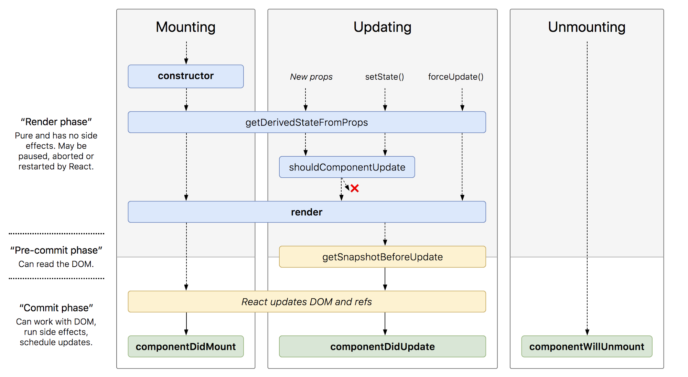

# React Interview Questions & Answers

> Click :star:if you like the project. Pull Request are highly appreciated. Follow me [@SudheerJonna](https://twitter.com/SudheerJonna) for technical updates.

---

<div>
Learn to code and get hired with <a href="https://zerotomastery.io/?utm_source=github&utm_medium=sponsor&utm_campaign=reactjs-interview-questions">Zero To Mastery:</a>
<ol>
<li>This <a href="https://links.zerotomastery.io/react_sudheer">React course</a> is good if you’re struggling to learn React beyond the basics</li>
<li>This <a href="http://links.zerotomastery.io/mci_sudheer">coding interview bootcamp</a> is helpful if you’re serious about getting hired as a developer</li>
</ol>
</div>

---

**Note:** This repository is specific to ReactJS. Please check [Javascript Interview questions](https://github.com/sudheerj/javascript-interview-questions) for core javascript questions.

## Downloading PDF/Epub formats

You can download the PDF and Epub version of this repository from the latest run on the [actions tab](https://github.com/sudheerj/reactjs-interview-questions/actions).

### Table of Contents

| No. | Questions                                                                                                                                                                                  |
| --- | ------------------------------------------------------------------------------------------------------------------------------------------------------------------------------------------ |
|     | **Core React**                                                                                                                                                                             |
| 1   | [What is React?](#what-is-react)                                                                                                                                                           |
| 2   | [What are the major features of React?](#what-are-the-major-features-of-react)                                                                                                             |
| 3   | [What is JSX?](#what-is-jsx)                                                                                                                                                               |
| 4   | [What is the difference between Element and Component?](#what-is-the-difference-between-element-and-component)                                                                             |
| 5   | [How to create components in React?](#how-to-create-components-in-react)                                                                                                                   |
| 6   | [When to use a Class Component over a Function Component?](#when-to-use-a-class-component-over-a-function-component)                                                                       |
| 7   | [What are Pure Components?](#what-are-pure-components)                                                                                                                                     |
| 8   | [What is state in React?](#what-is-state-in-react)                                                                                                                                         |
| 9   | [What are props in React?](#what-are-props-in-react)                                                                                                                                       |
| 10  | [What is the difference between state and props?](#what-is-the-difference-between-state-and-props)                                                                                         |
| 11  | [Why should we not update the state directly?](#why-should-we-not-update-the-state-directly)                                                                                               |
| 12  | [What is the purpose of callback function as an argument of setState()?](#what-is-the-purpose-of-callback-function-as-an-argument-of-setstate)                                             |
| 13  | [What is the difference between HTML and React event handling?](#what-is-the-difference-between-html-and-react-event-handling)                                                             |
| 14  | [How to bind methods or event handlers in JSX callbacks?](#how-to-bind-methods-or-event-handlers-in-jsx-callbacks)                                                                         |
| 15  | [How to pass a parameter to an event handler or callback?](#how-to-pass-a-parameter-to-an-event-handler-or-callback)                                                                       |
| 16  | [What are synthetic events in React?](#what-are-synthetic-events-in-react)                                                                                                                 |
| 17  | [What are inline conditional expressions?](#what-are-inline-conditional-expressions)                                                                                                       |
| 18  | [What is "key" prop and what is the benefit of using it in arrays of elements?](#what-is-key-prop-and-what-is-the-benefit-of-using-it-in-arrays-of-elements)                               |
| 19  | [What is the use of refs?](#what-is-the-use-of-refs)                                                                                                                                       |
| 20  | [How to create refs?](#how-to-create-refs)                                                                                                                                                 |
| 21  | [What are forward refs?](#what-are-forward-refs)                                                                                                                                           |
| 22  | [Which is preferred option with in callback refs and findDOMNode()?](#which-is-preferred-option-with-in-callback-refs-and-finddomnode)                                                     |
| 23  | [Why are String Refs legacy?](#why-are-string-refs-legacy)                                                                                                                                 |
| 24  | [What is Virtual DOM?](#what-is-virtual-dom)                                                                                                                                               |
| 25  | [How Virtual DOM works?](#how-virtual-dom-works)                                                                                                                                           |
| 26  | [What is the difference between Shadow DOM and Virtual DOM?](#what-is-the-difference-between-shadow-dom-and-virtual-dom)                                                                   |
| 27  | [What is React Fiber?](#what-is-react-fiber)                                                                                                                                               |
| 28  | [What is the main goal of React Fiber?](#what-is-the-main-goal-of-react-fiber)                                                                                                             |
| 29  | [What are controlled components?](#what-are-controlled-components)                                                                                                                         |
| 30  | [What are uncontrolled components?](#what-are-uncontrolled-components)                                                                                                                     |
| 31  | [What is the difference between createElement and cloneElement?](#what-is-the-difference-between-createelement-and-cloneelement)                                                           |
| 32  | [What is Lifting State Up in React?](#what-is-lifting-state-up-in-react)                                                                                                                   |
| 33  | [What are the different phases of component lifecycle?](#what-are-the-different-phases-of-component-lifecycle)                                                                             |
| 34  | [What are the lifecycle methods of React?](#what-are-the-lifecycle-methods-of-react)                                                                                                       |
| 35  | [What are Higher-Order components?](#what-are-higher-order-components)                                                                                                                     |
| 36  | [How to create props proxy for HOC component?](#how-to-create-props-proxy-for-hoc-component)                                                                                               |
| 37  | [What is context?](#what-is-context)                                                                                                                                                       |
| 38  | [What is children prop?](#what-is-children-prop)                                                                                                                                           |
| 39  | [How to write comments in React?](#how-to-write-comments-in-react)                                                                                                                         |
| 40  | [What is the purpose of using super constructor with props argument?](#what-is-the-purpose-of-using-super-constructor-with-props-argument)                                                 |
| 41  | [What is reconciliation?](#what-is-reconciliation)                                                                                                                                         |
| 42  | [How to set state with a dynamic key name?](#how-to-set-state-with-a-dynamic-key-name)                                                                                                     |
| 43  | [What would be the common mistake of function being called every time the component renders?](#what-would-be-the-common-mistake-of-function-being-called-every-time-the-component-renders) |
| 44  | [Is lazy function supports named exports?](#is-lazy-function-supports-named-exports)                                                                                                       |
| 45  | [Why React uses className over class attribute?](#why-react-uses-classname-over-class-attribute)                                                                                           |
| 46  | [What are fragments?](#what-are-fragments)                                                                                                                                                 |
| 47  | [Why fragments are better than container divs?](#why-fragments-are-better-than-container-divs)                                                                                             |
| 48  | [What are portals in React?](#what-are-portals-in-react)                                                                                                                                   |
| 49  | [What are stateless components?](#what-are-stateless-components)                                                                                                                           |
| 50  | [What are stateful components?](#what-are-stateful-components)                                                                                                                             |
| 51  | [How to apply validation on props in React?](#how-to-apply-validation-on-props-in-react)                                                                                                   |
| 52  | [What are the advantages of React?](#what-are-the-advantages-of-react)                                                                                                                     |
| 53  | [What are the limitations of React?](#what-are-the-limitations-of-react)                                                                                                                   |
| 54  | [What are error boundaries in React v16](#what-are-error-boundaries-in-react-v16)                                                                                                          |
| 55  | [How error boundaries handled in React v15?](#how-error-boundaries-handled-in-react-v15)                                                                                                   |
| 56  | [What are the recommended ways for static type checking?](#what-are-the-recommended-ways-for-static-type-checking)                                                                         |
| 57  | [What is the use of react-dom package?](#what-is-the-use-of-react-dom-package)                                                                                                             |
| 58  | [What is the purpose of render method of react-dom?](#what-is-the-purpose-of-render-method-of-react-dom)                                                                                   |
| 59  | [What is ReactDOMServer?](#what-is-reactdomserver)                                                                                                                                         |
| 60  | [How to use InnerHtml in React?](#how-to-use-innerhtml-in-react)                                                                                                                           |
| 61  | [How to use styles in React?](#how-to-use-styles-in-react)                                                                                                                                 |
| 62  | [How events are different in React?](#how-events-are-different-in-react)                                                                                                                   |
| 63  | [What will happen if you use setState in constructor?](#what-will-happen-if-you-use-setstate-in-constructor)                                                                               |
| 64  | [What is the impact of indexes as keys?](#what-is-the-impact-of-indexes-as-keys)                                                                                                           |
| 65  | [Is it good to use setState() in componentWillMount() method?](#is-it-good-to-use-setstate-in-componentwillmount-method)                                                                   |
| 66  | [What will happen if you use props in initial state?](#what-will-happen-if-you-use-props-in-initial-state)                                                                                 |
| 67  | [How do you conditionally render components?](#how-do-you-conditionally-render-components)                                                                                                 |
| 68  | [Why we need to be careful when spreading props on DOM elements??](#why-we-need-to-be-careful-when-spreading-props-on-dom-elements)                                                        |
| 69  | [How you use decorators in React?](#how-you-use-decorators-in-react)                                                                                                                       |
| 70  | [How do you memoize a component?](#how-do-you-memoize-a-component)                                                                                                                         |
| 71  | [How you implement Server-Side Rendering or SSR?](#how-you-implement-server-side-rendering-or-ssr)                                                                                         |
| 72  | [How to enable production mode in React?](#how-to-enable-production-mode-in-react)                                                                                                         |
| 73  | [What is CRA and its benefits?](#what-is-cra-and-its-benefits)                                                                                                                             |
| 74  | [What is the lifecycle methods order in mounting?](#what-is-the-lifecycle-methods-order-in-mounting)                                                                                       |
| 75  | [What are the lifecycle methods going to be deprecated in React v16?](#what-are-the-lifecycle-methods-going-to-be-deprecated-in-react-v16)                                                 |
| 76  | [What is the purpose of getDerivedStateFromProps() lifecycle method?](#what-is-the-purpose-of-getderivedstatefromprops-lifecycle-method)                                                   |
| 77  | [What is the purpose of getSnapshotBeforeUpdate() lifecycle method?](#what-is-the-purpose-of-getsnapshotbeforeupdate-lifecycle-method)                                                     |
| 78  | [Do Hooks replace render props and higher order components?](#do-hooks-replace-render-props-and-higher-order-components)                                                                   |
| 79  | [What is the recommended way for naming components?](#what-is-the-recommended-way-for-naming-components)                                                                                   |
| 80  | [What is the recommended ordering of methods in component class?](#what-is-the-recommended-ordering-of-methods-in-component-class)                                                         |
| 81  | [What is a switching component?](#what-is-a-switching-component)                                                                                                                           |
| 82  | [Why we need to pass a function to setState()?](#why-we-need-to-pass-a-function-to-setstate)                                                                                               |
| 83  | [What is strict mode in React?](#what-is-strict-mode-in-react)                                                                                                                             |
| 84  | [What are React Mixins?](#what-are-react-mixins)                                                                                                                                           |
| 85  | [Why is isMounted() an anti-pattern and what is the proper solution?](#why-is-ismounted-an-anti-pattern-and-what-is-the-proper-solution)                                                   |
| 86  | [What are the Pointer Events supported in React?](#what-are-the-pointer-events-supported-in-react)                                                                                         |
| 87  | [Why should component names start with capital letter?](#why-should-component-names-start-with-capital-letter)                                                                             |
| 88  | [Are custom DOM attributes supported in React v16?](#are-custom-dom-attributes-supported-in-react-v16)                                                                                     |
| 89  | [What is the difference between constructor and getInitialState?](#what-is-the-difference-between-constructor-and-getinitialstate)                                                         |
| 90  | [Can you force a component to re-render without calling setState?](#can-you-force-a-component-to-re-render-without-calling-setstate)                                                       |
| 91  | [What is the difference between super() and super(props) in React using ES6 classes?](#what-is-the-difference-between-super-and-superprops-in-react-using-es6-classes)                     |
| 92  | [How to loop inside JSX?](#how-to-loop-inside-jsx)                                                                                                                                         |
| 93  | [How do you access props in attribute quotes?](#how-do-you-access-props-in-attribute-quotes)                                                                                               |
| 94  | [What is React PropType array with shape?](#what-is-react-proptype-array-with-shape)                                                                                                       |
| 95  | [How to conditionally apply class attributes?](#how-to-conditionally-apply-class-attributes)                                                                                               |
| 96  | [What is the difference between React and ReactDOM?](#what-is-the-difference-between-react-and-reactdom)                                                                                   |
| 97  | [Why ReactDOM is separated from React?](#why-reactdom-is-separated-from-react)                                                                                                             |
| 98  | [How to use React label element?](#how-to-use-react-label-element)                                                                                                                         |
| 99  | [How to combine multiple inline style objects?](#how-to-combine-multiple-inline-style-objects)                                                                                             |
| 100 | [How to re-render the view when the browser is resized?](#how-to-re-render-the-view-when-the-browser-is-resized)                                                                           |
| 101 | [What is the difference between setState and replaceState methods?](#what-is-the-difference-between-setstate-and-replacestate-methods)                                                     |
| 102 | [How to listen to state changes?](#how-to-listen-to-state-changes)                                                                                                                         |
| 103 | [What is the recommended approach of removing an array element in react state?](#what-is-the-recommended-approach-of-removing-an-array-element-in-react-state)                             |
| 104 | [Is it possible to use React without rendering HTML?](#is-it-possible-to-use-react-without-rendering-html)                                                                                 |
| 105 | [How to pretty print JSON with React?](#how-to-pretty-print-json-with-react)                                                                                                               |
| 106 | [Why you can't update props in React?](#why-you-cant-update-props-in-react)                                                                                                                |
| 107 | [How to focus an input element on page load?](#how-to-focus-an-input-element-on-page-load)                                                                                                 |
| 108 | [What are the possible ways of updating objects in state?](#what-are-the-possible-ways-of-updating-objects-in-state)                                                                       |
| 110 | [How can we find the version of React at runtime in the browser?](#how-can-we-find-the-version-of-react-at-runtime-in-the-browser)                                                         |
| 111 | [What are the approaches to include polyfills in your create-react-app?](#what-are-the-approaches-to-include-polyfills-in-your-create-react-app)                                           |
| 112 | [How to use https instead of http in create-react-app?](#how-to-use-https-instead-of-http-in-create-react-app)                                                                             |
| 113 | [How to avoid using relative path imports in create-react-app?](#how-to-avoid-using-relative-path-imports-in-create-react-app)                                                             |
| 114 | [How to add Google Analytics for react-router?](#how-to-add-google-analytics-for-react-router)                                                                                             |
| 115 | [How to update a component every second?](#how-to-update-a-component-every-second)                                                                                                         |
| 116 | [How do you apply vendor prefixes to inline styles in React?](#how-do-you-apply-vendor-prefixes-to-inline-styles-in-react)                                                                 |
| 117 | [How to import and export components using react and ES6?](#how-to-import-and-export-components-using-react-and-es6)                                                                       |
| 118 | [What are the exceptions on React component naming?](#what-are-the-exceptions-on-react-component-naming)                                                                                   |
| 119 | [Why is a component constructor called only once?](#why-is-a-component-constructor-called-only-once)                                                                                       |
| 120 | [How to define constants in React?](#how-to-define-constants-in-react)                                                                                                                     |
| 121 | [How to programmatically trigger click event in React?](#how-to-programmatically-trigger-click-event-in-react)                                                                             |
| 122 | [Is it possible to use async/await in plain React?](#is-it-possible-to-use-asyncawait-in-plain-react)                                                                                      |
| 123 | [What are the common folder structures for React?](#what-are-the-common-folder-structures-for-react)                                                                                       |
| 124 | [What are the popular packages for animation?](#what-are-the-popular-packages-for-animation)                                                                                               |
| 125 | [What is the benefit of styles modules?](#what-is-the-benefit-of-styles-modules)                                                                                                           |
| 126 | [What are the popular React-specific linters?](#what-are-the-popular-react-specific-linters)                                                                                               |
| 127 | [How to make AJAX call and In which component lifecycle methods should I make an AJAX call?](#how-to-make-ajax-call-and-in-which-component-lifecycle-methods-should-i-make-an-ajax-call)   |
| 128 | [What are render props?](#what-are-render-props)                                                                                                                                           |
|     | **React Router**                                                                                                                                                                           |
| 129 | [What is React Router?](#what-is-react-router)                                                                                                                                             |
| 130 | [How React Router is different from history library?](#how-react-router-is-different-from-history-library)                                                                                 |
| 131 | [What are the \<Router> components of React Router v4?](#what-are-the-router-components-of-react-router-v4)                                                                                |
| 132 | [What is the purpose of push and replace methods of history?](#what-is-the-purpose-of-push-and-replace-methods-of-history)                                                                 |
| 133 | [How do you programmatically navigate using React router v4?](#how-do-you-programmatically-navigate-using-react-router-v4)                                                                 |
| 134 | [How to get query parameters in React Router v4](#how-to-get-query-parameters-in-react-router-v4)                                                                                          |
| 135 | [Why you get "Router may have only one child element" warning?](#why-you-get-router-may-have-only-one-child-element-warning)                                                               |
| 136 | [How to pass params to history.push method in React Router v4?](#how-to-pass-params-to-historypush-method-in-react-router-v4)                                                              |
| 137 | [How to implement default or NotFound page?](#how-to-implement-default-or-notfound-page)                                                                                                   |
| 138 | [How to get history on React Router v4?](#how-to-get-history-on-react-router-v4)                                                                                                           |
| 139 | [How to perform automatic redirect after login?](#how-to-perform-automatic-redirect-after-login)                                                                                           |
|     | **React Redux**                                                                                                                                                                            |
| 152 | [What is Flux?](#what-is-flux)                                                                                                                                                             |
| 153 | [What is Redux?](#what-is-redux)                                                                                                                                                           |
| 154 | [What are the core principles of Redux?](#what-are-the-core-principles-of-redux)                                                                                                           |
| 155 | [What are the downsides of Redux compared to Flux?](#what-are-the-downsides-of-redux-compared-to-flux)                                                                                     |
| 156 | [What is the difference between mapStateToProps() and mapDispatchToProps()?](#what-is-the-difference-between-mapstatetoprops-and-mapdispatchtoprops)                                       |
| 157 | [Can I dispatch an action in reducer?](#can-i-dispatch-an-action-in-reducer)                                                                                                               |
| 158 | [How to access Redux store outside a component?](#how-to-access-redux-store-outside-a-component)                                                                                           |
| 159 | [What are the drawbacks of MVW pattern](#what-are-the-drawbacks-of-mvw-pattern)                                                                                                            |
| 160 | [Are there any similarities between Redux and RxJS?](#are-there-any-similarities-between-redux-and-rxjs)                                                                                   |
| 161 | [How to dispatch an action on load?](#how-to-dispatch-an-action-on-load)                                                                                                                   |
| 162 | [How to use connect from React Redux?](#how-to-use-connect-from-react-redux)                                                                                                               |
| 163 | [How to reset state in Redux?](#how-to-reset-state-in-redux)                                                                                                                               |
| 164 | [Whats the purpose of at symbol in the redux connect decorator?](#whats-the-purpose-of-at-symbol-in-the-redux-connect-decorator)                                                           |
| 165 | [What is the difference between React context and React Redux?](#what-is-the-difference-between-react-context-and-react-redux)                                                             |
| 166 | [Why are Redux state functions called reducers?](#why-are-redux-state-functions-called-reducers)                                                                                           |
| 167 | [How to make AJAX request in Redux?](#how-to-make-ajax-request-in-redux)                                                                                                                   |
| 168 | [Should I keep all component's state in Redux store?](#should-i-keep-all-components-state-in-redux-store)                                                                                  |
| 169 | [What is the proper way to access Redux store?](#what-is-the-proper-way-to-access-redux-store)                                                                                             |
| 170 | [What is the difference between component and container in React Redux?](#what-is-the-difference-between-component-and-container-in-react-redux)                                           |
| 171 | [What is the purpose of the constants in Redux? ](#what-is-the-purpose-of-the-constants-in-redux)                                                                                          |
| 172 | [What are the different ways to write mapDispatchToProps()?](#what-are-the-different-ways-to-write-mapdispatchtoprops)                                                                     |
| 173 | [What is the use of the ownProps parameter in mapStateToProps() and mapDispatchToProps()?](#what-is-the-use-of-the-ownprops-parameter-in-mapstatetoprops-and-mapdispatchtoprops)           |
| 174 | [How to structure Redux top level directories?](#how-to-structure-redux-top-level-directories)                                                                                             |
| 175 | [What is redux-saga?](#what-is-redux-saga)                                                                                                                                                 |
| 176 | [What is the mental model of redux-saga?](#what-is-the-mental-model-of-redux-saga)                                                                                                         |
| 177 | [What are the differences between call and put in redux-saga](#what-are-the-differences-between-call-and-put-in-redux-saga)                                                                |
| 178 | [What is Redux Thunk?](#what-is-redux-thunk)                                                                                                                                               |
| 179 | [What are the differences between redux-saga and redux-thunk](#what-are-the-differences-between-redux-saga-and-redux-thunk)                                                                |
| 180 | [What is Redux DevTools?](#what-is-redux-devtools)                                                                                                                                         |
| 181 | [What are the features of Redux DevTools?](#what-are-the-features-of-redux-devtools)                                                                                                       |
| 182 | [What are Redux selectors and Why to use them?](#what-are-redux-selectors-and-why-to-use-them)                                                                                             |
| 183 | [What is Redux Form?](#what-is-redux-form)                                                                                                                                                 |
| 184 | [What are the main features of Redux Form?](#what-are-the-main-features-of-redux-form)                                                                                                     |
| 185 | [How to add multiple middlewares to Redux?](#how-to-add-multiple-middlewares-to-redux)                                                                                                     |
| 186 | [How to set initial state in Redux?](#how-to-set-initial-state-in-redux)                                                                                                                   |
| 187 | [How Relay is different from Redux?](#how-relay-is-different-from-redux)                                                                                                                   |
| 188 | [What is an action in Redux?](#what-is-an-action-in-redux)                                                                                                                                 |

## Core React

1.  ### What is React?

    React is an **open-source front-end JavaScript library** that is used for building user interfaces, especially for single-page applications. It is used for handling view layer for web and mobile apps. React was created by [Jordan Walke](https://github.com/jordwalke), a software engineer working for Facebook. React was first deployed on Facebook's News Feed in 2011 and on Instagram in 2012.

    **[⬆ Back to Top](#table-of-contents)**

2.  ### What are the major features of React?

    The major features of React are:

    - It uses **VirtualDOM** instead of RealDOM considering that RealDOM manipulations are expensive.
    - Supports **server-side rendering**.
    - Follows **Unidirectional** data flow or data binding.
    - Uses **reusable/composable** UI components to develop the view.

    **[⬆ Back to Top](#table-of-contents)**

3.  ### What is JSX?

    _JSX_ is a XML-like syntax extension to ECMAScript (the acronym stands for _JavaScript XML_). Basically it just provides syntactic sugar for the `React.createElement()` function, giving us expressiveness of JavaScript along with HTML like template syntax.

    In the example below text inside `<h1>` tag is returned as JavaScript function to the render function.

    ```jsx harmony
    class App extends React.Component {
      render() {
        return (
          <div>
            <h1>{"Welcome to React world!"}</h1>
          </div>
        );
      }
    }
    ```

    **[⬆ Back to Top](#table-of-contents)**

4.  ### What is the difference between Element and Component?

    An _Element_ is a plain object describing what you want to appear on the screen in terms of the DOM nodes or other components. _Elements_ can contain other _Elements_ in their props. Creating a React element is cheap. Once an element is created, it is never mutated.

    The object representation of React Element would be as follows:

    ```javascript
    const element = React.createElement("div", { id: "login-btn" }, "Login");
    ```

    The above `React.createElement()` function returns an object:

    ```
    {
      type: 'div',
      props: {
        children: 'Login',
        id: 'login-btn'
      }
    }
    ```

    And finally it renders to the DOM using `ReactDOM.render()`:

    ```html
    <div id="login-btn">Login</div>
    ```

    Whereas a **component** can be declared in several different ways. It can be a class with a `render()` method or it can be defined as a function. In either case, it takes props as an input, and returns a JSX tree as the output:

    ```javascript
    const Button = ({ onLogin }) => (
      <div id={"login-btn"} onClick={onLogin}>
        Login
      </div>
    );
    ```

    Then JSX gets transpiled to a `React.createElement()` function tree:

    ```javascript
    const Button = ({ onLogin }) =>
      React.createElement(
        "div",
        { id: "login-btn", onClick: onLogin },
        "Login"
      );
    ```

    **[⬆ Back to Top](#table-of-contents)**

5.  ### How to create components in React?

    There are two possible ways to create a component.

    1. **Function Components:** This is the simplest way to create a component. Those are pure JavaScript functions that accept props object as the first parameter and return React elements:

       ```jsx harmony
       function Greeting({ message }) {
         return <h1>{`Hello, ${message}`}</h1>;
       }
       ```

    2. **Class Components:** You can also use ES6 class to define a component. The above function component can be written as:

       ```jsx harmony
       class Greeting extends React.Component {
         render() {
           return <h1>{`Hello, ${this.props.message}`}</h1>;
         }
       }
       ```

    **[⬆ Back to Top](#table-of-contents)**

6.  ### When to use a Class Component over a Function Component?

    If the component needs _state or lifecycle methods_ then use class component otherwise use function component.
    _However, from React 16.8 with the addition of Hooks, you could use state , lifecycle methods and other features that were only available in class component right in your function component._
    _So, it is always recommended to use Function components, unless you need a React functionality whose Function component equivalent is not present yet, like Error Boundaries _

    **[⬆ Back to Top](#table-of-contents)**

7.  ### What are Pure Components?

    _`React.PureComponent`_ is exactly the same as _`React.Component`_ except that it handles the `shouldComponentUpdate()` method for you. When props or state changes, _PureComponent_ will do a shallow comparison on both props and state. _Component_ on the other hand won't compare current props and state to next out of the box. Thus, the component will re-render by default whenever `shouldComponentUpdate` is called.

    **[⬆ Back to Top](#table-of-contents)**

8.  ### What is state in React?

    _State_ of a component is an object that holds some information that may change over the lifetime of the component. We should always try to make our state as simple as possible and minimize the number of stateful components.

    Let's create a user component with message state,

    ```jsx harmony
    class User extends React.Component {
      constructor(props) {
        super(props);

        this.state = {
          message: "Welcome to React world",
        };
      }

      render() {
        return (
          <div>
            <h1>{this.state.message}</h1>
          </div>
        );
      }
    }
    ```

    

    State is similar to props, but it is private and fully controlled by the component ,i.e., it is not accessible to any other component till the owner component decides to pass it.

    **[⬆ Back to Top](#table-of-contents)**

9.  ### What are props in React?

    _Props_ are inputs to components. They are single values or objects containing a set of values that are passed to components on creation using a naming convention similar to HTML-tag attributes. They are data passed down from a parent component to a child component.

    The primary purpose of props in React is to provide following component functionality:

    1. Pass custom data to your component.
    2. Trigger state changes.
    3. Use via `this.props.reactProp` inside component's `render()` method.

    For example, let us create an element with `reactProp` property:

    ```jsx harmony
    <Element reactProp={"1"} />
    ```

    This `reactProp` (or whatever you came up with) name then becomes a property attached to React's native props object which originally already exists on all components created using React library.

    ```
    props.reactProp
    ```

    **[⬆ Back to Top](#table-of-contents)**

10. ### What is the difference between state and props?

    Both _props_ and _state_ are plain JavaScript objects. While both of them hold information that influences the output of render, they are different in their functionality with respect to component. Props get passed to the component similar to function parameters whereas state is managed within the component similar to variables declared within a function.

    **[⬆ Back to Top](#table-of-contents)**

11. ### Why should we not update the state directly?

    If you try to update the state directly then it won't re-render the component.

    ```javascript
    //Wrong
    this.state.message = "Hello world";
    ```

    Instead use `setState()` method. It schedules an update to a component's state object. When state changes, the component responds by re-rendering.

    ```javascript
    //Correct
    this.setState({ message: "Hello World" });
    ```

    **Note:** You can directly assign to the state object either in _constructor_ or using latest javascript's class field declaration syntax.

    **[⬆ Back to Top](#table-of-contents)**

12. ### What is the purpose of callback function as an argument of `setState()`?

    The callback function is invoked when setState finished and the component gets rendered. Since `setState()` is **asynchronous** the callback function is used for any post action.

    **Note:** It is recommended to use lifecycle method rather than this callback function.

    ```javascript
    setState({ name: "John" }, () =>
      console.log("The name has updated and component re-rendered")
    );
    ```

    **[⬆ Back to Top](#table-of-contents)**

13. ### What is the difference between HTML and React event handling?

    Below are some of the main differences between HTML and React event handling,

    1. In HTML, the event name usually represents in _lowercase_ as a convention:

       ```html
       <button onclick="activateLasers()"></button>
       ```

       Whereas in React it follows _camelCase_ convention:

       ```jsx harmony
       <button onClick={activateLasers}>
       ```

    2. In HTML, you can return `false` to prevent default behavior:

       ```html
       <a
         href="#"
         onclick='console.log("The link was clicked."); return false;'
       />
       ```

       Whereas in React you must call `preventDefault()` explicitly:

       ```javascript
       function handleClick(event) {
         event.preventDefault();
         console.log("The link was clicked.");
       }
       ```

    3. In HTML, you need to invoke the function by appending `()`
       Whereas in react you should not append `()` with the function name. (refer "activateLasers" function in the first point for example)

    **[⬆ Back to Top](#table-of-contents)**

14. ### How to bind methods or event handlers in JSX callbacks?

    There are 3 possible ways to achieve this:

    1. **Binding in Constructor:** In JavaScript classes, the methods are not bound by default. The same thing applies for React event handlers defined as class methods. Normally we bind them in constructor.

       ```javascript
       class Foo extends Component {
         constructor(props) {
           super(props);
           this.handleClick = this.handleClick.bind(this);
         }
         handleClick() {
           console.log("Click happened");
         }
         render() {
           return <button onClick={this.handleClick}>Click Me</button>;
         }
       }
       ```

    2. **Public class fields syntax:** If you don't like to use bind approach then _public class fields syntax_ can be used to correctly bind callbacks.

       ```jsx harmony
       handleClick = () => {
         console.log("this is:", this);
       };
       ```

       ```jsx harmony
       <button onClick={this.handleClick}>{"Click me"}</button>
       ```

    3. **Arrow functions in callbacks:** You can use _arrow functions_ directly in the callbacks.

       ```jsx harmony
       handleClick() {
           console.log('Click happened');
       }
       render() {
           return <button onClick={() => this.handleClick()}>Click Me</button>;
       }
       ```

    **Note:** If the callback is passed as prop to child components, those components might do an extra re-rendering. In those cases, it is preferred to go with `.bind()` or _public class fields syntax_ approach considering performance.

    **[⬆ Back to Top](#table-of-contents)**

15. ### How to pass a parameter to an event handler or callback?

    You can use an _arrow function_ to wrap around an _event handler_ and pass parameters:

    ```jsx harmony
    <button onClick={() => this.handleClick(id)} />
    ```

    This is an equivalent to calling `.bind`:

    ```jsx harmony
    <button onClick={this.handleClick.bind(this, id)} />
    ```

    Apart from these two approaches, you can also pass arguments to a function which is defined as arrow function

    ```jsx harmony
    <button onClick={this.handleClick(id)} />;
    handleClick = (id) => () => {
      console.log("Hello, your ticket number is", id);
    };
    ```

    **[⬆ Back to Top](#table-of-contents)**

16. ### What are synthetic events in React?

    `SyntheticEvent` is a cross-browser wrapper around the browser's native event. Its API is same as the browser's native event, including `stopPropagation()` and `preventDefault()`, except the events work identically across all browsers.

    **[⬆ Back to Top](#table-of-contents)**

17. ### What are inline conditional expressions?

    You can use either _if statements_ or _ternary expressions_ which are available from JS to conditionally render expressions. Apart from these approaches, you can also embed any expressions in JSX by wrapping them in curly braces and then followed by JS logical operator `&&`.

    ```jsx harmony
    <h1>Hello!</h1>;
    {
      messages.length > 0 && !isLogin ? (
        <h2>You have {messages.length} unread messages.</h2>
      ) : (
        <h2>You don't have unread messages.</h2>
      );
    }
    ```

    **[⬆ Back to Top](#table-of-contents)**

18. ### What is "key" prop and what is the benefit of using it in arrays of elements?

    A `key` is a special string attribute you **should** include when creating arrays of elements. _Key_ prop helps React identify which items have changed, are added, or are removed.

    Most often we use ID from our data as _key_:

    ```jsx harmony
    const todoItems = todos.map((todo) => <li key={todo.id}>{todo.text}</li>);
    ```

    When you don't have stable IDs for rendered items, you may use the item _index_ as a _key_ as a last resort:

    ```jsx harmony
    const todoItems = todos.map((todo, index) => (
      <li key={index}>{todo.text}</li>
    ));
    ```

    **Note:**

    1. Using _indexes_ for _keys_ is **not recommended** if the order of items may change. This can negatively impact performance and may cause issues with component state.
    2. If you extract list item as separate component then apply _keys_ on list component instead of `li` tag.
    3. There will be a warning message in the console if the `key` prop is not present on list items.

    **[⬆ Back to Top](#table-of-contents)**

19. ### What is the use of refs?

    The _ref_ is used to return a reference to the element. They _should be avoided_ in most cases, however, they can be useful when you need a direct access to the DOM element or an instance of a component.

    **[⬆ Back to Top](#table-of-contents)**

20. ### How to create refs?

    There are two approaches

    1. This is a recently added approach. _Refs_ are created using `React.createRef()` method and attached to React elements via the `ref` attribute. In order to use _refs_ throughout the component, just assign the _ref_ to the instance property within constructor.

       ```jsx harmony
       class MyComponent extends React.Component {
         constructor(props) {
           super(props);
           this.myRef = React.createRef();
         }
         render() {
           return <div ref={this.myRef} />;
         }
       }
       ```

    2. You can also use ref callbacks approach regardless of React version. For example, the search bar component's input element is accessed as follows,
       ```jsx harmony
       class SearchBar extends Component {
         constructor(props) {
           super(props);
           this.txtSearch = null;
           this.state = { term: "" };
           this.setInputSearchRef = (e) => {
             this.txtSearch = e;
           };
         }
         onInputChange(event) {
           this.setState({ term: this.txtSearch.value });
         }
         render() {
           return (
             <input
               value={this.state.term}
               onChange={this.onInputChange.bind(this)}
               ref={this.setInputSearchRef}
             />
           );
         }
       }
       ```

    You can also use _refs_ in function components using **closures**.
    **Note**: You can also use inline ref callbacks even though it is not a recommended approach.

    **[⬆ Back to Top](#table-of-contents)**

21. ### What are forward refs?

    _Ref forwarding_ is a feature that lets some components take a _ref_ they receive, and pass it further down to a child.

    ```jsx harmony
    const ButtonElement = React.forwardRef((props, ref) => (
      <button ref={ref} className="CustomButton">
        {props.children}
      </button>
    ));

    // Create ref to the DOM button:
    const ref = React.createRef();
    <ButtonElement ref={ref}>{"Forward Ref"}</ButtonElement>;
    ```

    **[⬆ Back to Top](#table-of-contents)**

22. ### Which is preferred option with in callback refs and findDOMNode()?

    It is preferred to use _callback refs_ over `findDOMNode()` API. Because `findDOMNode()` prevents certain improvements in React in the future.

    The **legacy** approach of using `findDOMNode`:

    ```javascript
    class MyComponent extends Component {
      componentDidMount() {
        findDOMNode(this).scrollIntoView();
      }

      render() {
        return <div />;
      }
    }
    ```

    The recommended approach is:

    ```javascript
    class MyComponent extends Component {
      constructor(props) {
        super(props);
        this.node = createRef();
      }
      componentDidMount() {
        this.node.current.scrollIntoView();
      }

      render() {
        return <div ref={this.node} />;
      }
    }
    ```

    **[⬆ Back to Top](#table-of-contents)**

23. ### Why are String Refs legacy?

    If you worked with React before, you might be familiar with an older API where the `ref` attribute is a string, like `ref={'textInput'}`, and the DOM node is accessed as `this.refs.textInput`. We advise against it because _string refs have below issues_, and are considered legacy. String refs were **removed in React v16**.

    1. They _force React to keep track of currently executing component_. This is problematic because it makes react module stateful, and thus causes weird errors when react module is duplicated in the bundle.
    2. They are _not composable_ — if a library puts a ref on the passed child, the user can't put another ref on it. Callback refs are perfectly composable.
    3. They _don't work with static analysis_ like Flow. Flow can't guess the magic that framework does to make the string ref appear on `this.refs`, as well as its type (which could be different). Callback refs are friendlier to static analysis.
    4. It doesn't work as most people would expect with the "render callback" pattern (e.g. <DataGrid renderRow={this.renderRow} />)

       ```jsx harmony
       class MyComponent extends Component {
         renderRow = (index) => {
           // This won't work. Ref will get attached to DataTable rather than MyComponent:
           return <input ref={"input-" + index} />;

           // This would work though! Callback refs are awesome.
           return <input ref={(input) => (this["input-" + index] = input)} />;
         };

         render() {
           return (
             <DataTable data={this.props.data} renderRow={this.renderRow} />
           );
         }
       }
       ```

    **[⬆ Back to Top](#table-of-contents)**

24. ### What is Virtual DOM?

    The _Virtual DOM_ (VDOM) is an in-memory representation of _Real DOM_. The representation of a UI is kept in memory and synced with the "real" DOM. It's a step that happens between the render function being called and the displaying of elements on the screen. This entire process is called _reconciliation_.

    **[⬆ Back to Top](#table-of-contents)**

25. ### How Virtual DOM works?

    The _Virtual DOM_ works in three simple steps.

    1. Whenever any underlying data changes, the entire UI is re-rendered in Virtual DOM representation.

       

    2. Then the difference between the previous DOM representation and the new one is calculated.

       

    3. Once the calculations are done, the real DOM will be updated with only the things that have actually changed.

       

    **[⬆ Back to Top](#table-of-contents)**

26. ### What is the difference between Shadow DOM and Virtual DOM?

    The _Shadow DOM_ is a browser technology designed primarily for scoping variables and CSS in _web components_. The _Virtual DOM_ is a concept implemented by libraries in JavaScript on top of browser APIs.

    **[⬆ Back to Top](#table-of-contents)**

27. ### What is React Fiber?

    Fiber is the new _reconciliation_ engine or reimplementation of core algorithm in React v16. The goal of React Fiber is to increase its suitability for areas like animation, layout, gestures, ability to pause, abort, or reuse work and assign priority to different types of updates; and new concurrency primitives.

    **[⬆ Back to Top](#table-of-contents)**

28. ### What is the main goal of React Fiber?

    The goal of _React Fiber_ is to increase its suitability for areas like animation, layout, and gestures. Its headline feature is **incremental rendering**: the ability to split rendering work into chunks and spread it out over multiple frames.

    _from documentation_

    Its main goals are:

    1. Ability to split interruptible work in chunks.
    2. Ability to prioritize, rebase and reuse work in progress.
    3. Ability to yield back and forth between parents and children to support layout in React.
    4. Ability to return multiple elements from render().
    5. Better support for error boundaries.

    **[⬆ Back to Top](#table-of-contents)**

29. ### What are controlled components?

    A component that controls the input elements within the forms on subsequent user input is called **Controlled Component**, i.e, every state mutation will have an associated handler function.

    For example, to write all the names in uppercase letters, we use handleChange as below,

    ```javascript
    handleChange(event) {
      this.setState({value: event.target.value.toUpperCase()})
    }
    ```

    **[⬆ Back to Top](#table-of-contents)**

30. ### What are uncontrolled components?

    The **Uncontrolled Components** are the ones that store their own state internally, and you query the DOM using a ref to find its current value when you need it. This is a bit more like traditional HTML.

    In the below UserProfile component, the `name` input is accessed using ref.

    ```jsx harmony
    class UserProfile extends React.Component {
      constructor(props) {
        super(props);
        this.handleSubmit = this.handleSubmit.bind(this);
        this.input = React.createRef();
      }

      handleSubmit(event) {
        alert("A name was submitted: " + this.input.current.value);
        event.preventDefault();
      }

      render() {
        return (
          <form onSubmit={this.handleSubmit}>
            <label>
              {"Name:"}
              <input type="text" ref={this.input} />
            </label>
            <input type="submit" value="Submit" />
          </form>
        );
      }
    }
    ```

    In most cases, it's recommend to use controlled components to implement forms. In a controlled component, form data is handled by a React component. The alternative is uncontrolled components, where form data is handled by the DOM itself.

    **[⬆ Back to Top](#table-of-contents)**

31. ### What is the difference between createElement and cloneElement?

    JSX elements will be transpiled to `React.createElement()` functions to create React elements which are going to be used for the object representation of UI. Whereas `cloneElement` is used to clone an element and pass it new props.

    **[⬆ Back to Top](#table-of-contents)**

32. ### What is Lifting State Up in React?

    When several components need to share the same changing data then it is recommended to _lift the shared state up_ to their closest common ancestor. That means if two child components share the same data from its parent, then move the state to parent instead of maintaining local state in both of the child components.

    **[⬆ Back to Top](#table-of-contents)**

33. ### What are the different phases of component lifecycle?

    The component lifecycle has three distinct lifecycle phases:

    1. **Mounting:** The component is ready to mount in the browser DOM. This phase covers initialization from `constructor()`, `getDerivedStateFromProps()`, `render()`, and `componentDidMount()` lifecycle methods.

    2. **Updating:** In this phase, the component gets updated in two ways, sending the new props and updating the state either from `setState()` or `forceUpdate()`. This phase covers `getDerivedStateFromProps()`, `shouldComponentUpdate()`, `render()`, `getSnapshotBeforeUpdate()` and `componentDidUpdate()` lifecycle methods.

    3. **Unmounting:** In this last phase, the component is not needed and gets unmounted from the browser DOM. This phase includes `componentWillUnmount()` lifecycle method.

    It's worth mentioning that React internally has a concept of phases when applying changes to the DOM. They are separated as follows

    1. **Render** The component will render without any side effects. This applies to Pure components and in this phase, React can pause, abort, or restart the render.

    2. **Pre-commit** Before the component actually applies the changes to the DOM, there is a moment that allows React to read from the DOM through the `getSnapshotBeforeUpdate()`.

    3. **Commit** React works with the DOM and executes the final lifecycles respectively `componentDidMount()` for mounting, `componentDidUpdate()` for updating, and `componentWillUnmount()` for unmounting.

    React 16.3+ Phases (or an [interactive version](http://projects.wojtekmaj.pl/react-lifecycle-methods-diagram/))

    

    Before React 16.3

    

    **[⬆ Back to Top](#table-of-contents)**

34. ### What are the lifecycle methods of React?

    Before React 16.3

    - **componentWillMount:** Executed before rendering and is used for App level configuration in your root component.
    - **componentDidMount:** Executed after first rendering and here all AJAX requests, DOM or state updates, and set up event listeners should occur.
    - **componentWillReceiveProps:** Executed when particular prop updates to trigger state transitions.
    - **shouldComponentUpdate:** Determines if the component will be updated or not. By default it returns `true`. If you are sure that the component doesn't need to render after state or props are updated, you can return false value. It is a great place to improve performance as it allows you to prevent a re-render if component receives new prop.
    - **componentWillUpdate:** Executed before re-rendering the component when there are props & state changes confirmed by `shouldComponentUpdate()` which returns true.
    - **componentDidUpdate:** Mostly it is used to update the DOM in response to prop or state changes.
    - **componentWillUnmount:** It will be used to cancel any outgoing network requests, or remove all event listeners associated with the component.

    React 16.3+

    - **getDerivedStateFromProps:** Invoked right before calling `render()` and is invoked on _every_ render. This exists for rare use cases where you need a derived state. Worth reading [if you need derived state](https://reactjs.org/blog/2018/06/07/you-probably-dont-need-derived-state.html).
    - **componentDidMount:** Executed after first rendering and where all AJAX requests, DOM or state updates, and set up event listeners should occur.
    - **shouldComponentUpdate:** Determines if the component will be updated or not. By default, it returns `true`. If you are sure that the component doesn't need to render after the state or props are updated, you can return a false value. It is a great place to improve performance as it allows you to prevent a re-render if component receives a new prop.
    - **getSnapshotBeforeUpdate:** Executed right before rendered output is committed to the DOM. Any value returned by this will be passed into `componentDidUpdate()`. This is useful to capture information from the DOM i.e. scroll position.
    - **componentDidUpdate:** Mostly it is used to update the DOM in response to prop or state changes. This will not fire if `shouldComponentUpdate()` returns `false`.
    - **componentWillUnmount** It will be used to cancel any outgoing network requests, or remove all event listeners associated with the component.

    **[⬆ Back to Top](#table-of-contents)**

35. ### What are Higher-Order Components?

    A _higher-order component_ (_HOC_) is a function that takes a component and returns a new component. Basically, it's a pattern that is derived from React's compositional nature.

    We call them **pure components** because they can accept any dynamically provided child component but they won't modify or copy any behavior from their input components.

    ```javascript
    const EnhancedComponent = higherOrderComponent(WrappedComponent);
    ```

    HOC can be used for many use cases:

    1. Code reuse, logic and bootstrap abstraction.
    2. Render hijacking.
    3. State abstraction and manipulation.
    4. Props manipulation.

    **[⬆ Back to Top](#table-of-contents)**

36. ### How to create props proxy for HOC component?

    You can add/edit props passed to the component using _props proxy_ pattern like this:

    ```jsx harmony
    function HOC(WrappedComponent) {
      return class Test extends Component {
        render() {
          const newProps = {
            title: "New Header",
            footer: false,
            showFeatureX: false,
            showFeatureY: true,
          };

          return <WrappedComponent {...this.props} {...newProps} />;
        }
      };
    }
    ```

    **[⬆ Back to Top](#table-of-contents)**

37. ### What is context?

    _Context_ provides a way to pass data through the component tree without having to pass props down manually at every level.

    For example, authenticated users, locale preferences, UI themes need to be accessed in the application by many components.

    ```javascript
    const { Provider, Consumer } = React.createContext(defaultValue);
    ```

    **[⬆ Back to Top](#table-of-contents)**

38. ### What is children prop?

    _Children_ is a prop (`this.props.children`) that allows you to pass components as data to other components, just like any other prop you use. Component tree put between component's opening and closing tag will be passed to that component as `children` prop.

    There are several methods available in the React API to work with this prop. These include `React.Children.map`, `React.Children.forEach`, `React.Children.count`, `React.Children.only`, `React.Children.toArray`.

    A simple usage of children prop looks as below,

    ```jsx harmony
    const MyDiv = React.createClass({
      render: function () {
        return <div>{this.props.children}</div>;
      },
    });

    ReactDOM.render(
      <MyDiv>
        <span>{"Hello"}</span>
        <span>{"World"}</span>
      </MyDiv>,
      node
    );
    ```

    **[⬆ Back to Top](#table-of-contents)**

39. ### How to write comments in React?

    The comments in React/JSX are similar to JavaScript Multiline comments but are wrapped in curly braces.

    **Single-line comments:**

    ```jsx harmony
    <div>
      {/* Single-line comments(In vanilla JavaScript, the single-line comments are represented by double slash(//)) */}
      {`Welcome ${user}, let's play React`}
    </div>
    ```

    **Multi-line comments:**

    ```jsx harmony
    <div>
      {/* Multi-line comments for more than
       one line */}
      {`Welcome ${user}, let's play React`}
    </div>
    ```

    **[⬆ Back to Top](#table-of-contents)**

40. ### What is the purpose of using super constructor with props argument?

    A child class constructor cannot make use of `this` reference until the `super()` method has been called. The same applies to ES6 sub-classes as well. The main reason for passing props parameter to `super()` call is to access `this.props` in your child constructors.

    **Passing props:**

    ```javascript
    class MyComponent extends React.Component {
      constructor(props) {
        super(props);

        console.log(this.props); // prints { name: 'John', age: 42 }
      }
    }
    ```

    **Not passing props:**

    ```javascript
    class MyComponent extends React.Component {
      constructor(props) {
        super();

        console.log(this.props); // prints undefined

        // but props parameter is still available
        console.log(props); // prints { name: 'John', age: 42 }
      }

      render() {
        // no difference outside constructor
        console.log(this.props); // prints { name: 'John', age: 42 }
      }
    }
    ```

    The above code snippets reveals that `this.props` is different only within the constructor. It would be the same outside the constructor.

    **[⬆ Back to Top](#table-of-contents)**

41. ### What is reconciliation?

    When a component's props or state change, React decides whether an actual DOM update is necessary by comparing the newly returned element with the previously rendered one. When they are not equal, React will update the DOM. This process is called _reconciliation_.

    **[⬆ Back to Top](#table-of-contents)**

42. ### How to set state with a dynamic key name?

    If you are using ES6 or the Babel transpiler to transform your JSX code then you can accomplish this with _computed property names_.

    ```javascript
    handleInputChange(event) {
      this.setState({ [event.target.id]: event.target.value })
    }
    ```

    **[⬆ Back to Top](#table-of-contents)**

43. ### What would be the common mistake of function being called every time the component renders?

    You need to make sure that function is not being called while passing the function as a parameter.

    ```jsx harmony
    render() {
      // Wrong: handleClick is called instead of passed as a reference!
      return <button onClick={this.handleClick()}>{'Click Me'}</button>
    }
    ```

    Instead, pass the function itself without parenthesis:

    ```jsx harmony
    render() {
      // Correct: handleClick is passed as a reference!
      return <button onClick={this.handleClick}>{'Click Me'}</button>
    }
    ```

    **[⬆ Back to Top](#table-of-contents)**

44. ### Is lazy function supports named exports?

    No, currently `React.lazy` function supports default exports only. If you would like to import modules which are named exports, you can create an intermediate module that reexports it as the default. It also ensures that tree shaking keeps working and don’t pull unused components.
    Let's take a component file which exports multiple named components,

    ```javascript
    // MoreComponents.js
    export const SomeComponent = /* ... */;
    export const UnusedComponent = /* ... */;
    ```

    and reexport `MoreComponents.js` components in an intermediate file `IntermediateComponent.js`

    ```javascript
    // IntermediateComponent.js
    export { SomeComponent as default } from "./MoreComponents.js";
    ```

    Now you can import the module using lazy function as below,

    ```javascript
    import React, { lazy } from "react";
    const SomeComponent = lazy(() => import("./IntermediateComponent.js"));
    ```

    **[⬆ Back to Top](#table-of-contents)**

45. ### Why React uses `className` over `class` attribute?

    `class` is a keyword in JavaScript, and JSX is an extension of JavaScript. That's the principal reason why React uses `className` instead of `class`. Pass a string as the `className` prop.

    ```jsx harmony
    render() {
      return <span className={'menu navigation-menu'}>{'Menu'}</span>
    }
    ```

    **[⬆ Back to Top](#table-of-contents)**

46. ### What are fragments?

    It's a common pattern in React which is used for a component to return multiple elements. _Fragments_ let you group a list of children without adding extra nodes to the DOM.

    ```jsx harmony
    render() {
      return (
        <React.Fragment>
          <ChildA />
          <ChildB />
          <ChildC />
        </React.Fragment>
      )
    }
    ```

    There is also a _shorter syntax_, but it's not supported in many tools:

    ```jsx harmony
    render() {
      return (
        <>
          <ChildA />
          <ChildB />
          <ChildC />
        </>
      )
    }
    ```

    **[⬆ Back to Top](#table-of-contents)**

47. ### Why fragments are better than container divs?

    Below are the list of reasons,

    1. Fragments are a bit faster and use less memory by not creating an extra DOM node. This only has a real benefit on very large and deep trees.
    2. Some CSS mechanisms like _Flexbox_ and _CSS Grid_ have a special parent-child relationships, and adding divs in the middle makes it hard to keep the desired layout.
    3. The DOM Inspector is less cluttered.

    **[⬆ Back to Top](#table-of-contents)**

48. ### What are portals in React?

    _Portal_ is a recommended way to render children into a DOM node that exists outside the DOM hierarchy of the parent component.

    ```javascript
    ReactDOM.createPortal(child, container);
    ```

    The first argument is any render-able React child, such as an element, string, or fragment. The second argument is a DOM element.

    **[⬆ Back to Top](#table-of-contents)**

49. ### What are stateless components?

    If the behaviour of a component is independent of its state then it can be a stateless component. You can use either a function or a class for creating stateless components. But unless you need to use a lifecycle hook in your components, you should go for function components. There are a lot of benefits if you decide to use function components here; they are easy to write, understand, and test, a little faster, and you can avoid the `this` keyword altogether.

    **[⬆ Back to Top](#table-of-contents)**

50. ### What are stateful components?

    If the behaviour of a component is dependent on the _state_ of the component then it can be termed as stateful component. These _stateful components_ are always _class components_ and have a state that gets initialized in the `constructor`.

    ```javascript
    class App extends Component {
      constructor(props) {
        super(props);
        this.state = { count: 0 };
      }

      render() {
        // ...
      }
    }
    ```

    **React 16.8 Update:**

    Hooks let you use state and other React features without writing classes.

    _The Equivalent Functional Component_

        ```javascript
         import React, {useState} from 'react';

         const App = (props) => {
           const [count, setCount] = useState(0);

           return (
             // JSX
           )
         }
        ```

    **[⬆ Back to Top](#table-of-contents)**

## React Redux

**[⬆ Back to Top](#table-of-contents)**

152. ### What is flux?

     _Flux_ is an _application design paradigm_ used as a replacement for the more traditional MVC pattern. It is not a framework or a library but a new kind of architecture that complements React and the concept of Unidirectional Data Flow. Facebook uses this pattern internally when working with React.

     The workflow between dispatcher, stores and views components with distinct inputs and outputs as follows:

     

**[⬆ Back to Top](#table-of-contents)**

153. ### What is Redux?

     _Redux_ is a predictable state container for JavaScript apps based on the _Flux design pattern_. Redux can be used together with React, or with any other view library. It is tiny (about 2kB) and has no dependencies.

**[⬆ Back to Top](#table-of-contents)**

154. ### What are the core principles of Redux?

     Redux follows three fundamental principles:

     1. **Single source of truth:** The state of your whole application is stored in an object tree within a single store. The single state tree makes it easier to keep track of changes over time and debug or inspect the application.
     2. **State is read-only:** The only way to change the state is to emit an action, an object describing what happened. This ensures that neither the views nor the network callbacks will ever write directly to the state.
     3. **Changes are made with pure functions:** To specify how the state tree is transformed by actions, you write reducers. Reducers are just pure functions that take the previous state and an action as parameters, and return the next state.

**[⬆ Back to Top](#table-of-contents)**

155. ### What are the downsides of Redux compared to Flux?

     Instead of saying downsides we can say that there are few compromises of using Redux over Flux. Those are as follows:

     1. **You will need to learn to avoid mutations:** Flux is un-opinionated about mutating data, but Redux doesn't like mutations and many packages complementary to Redux assume you never mutate the state. You can enforce this with dev-only packages like `redux-immutable-state-invariant`, Immutable.js, or instructing your team to write non-mutating code.
     2. **You're going to have to carefully pick your packages:** While Flux explicitly doesn't try to solve problems such as undo/redo, persistence, or forms, Redux has extension points such as middleware and store enhancers, and it has spawned a rich ecosystem.
     3. **There is no nice Flow integration yet:** Flux currently lets you do very impressive static type checks which Redux doesn't support yet.

**[⬆ Back to Top](#table-of-contents)**

156. ### What is the difference between `mapStateToProps()` and `mapDispatchToProps()`?

     `mapStateToProps()` is a utility which helps your component get updated state (which is updated by some other components):

     ```javascript
     const mapStateToProps = (state) => {
       return {
         todos: getVisibleTodos(state.todos, state.visibilityFilter),
       };
     };
     ```

     `mapDispatchToProps()` is a utility which will help your component to fire an action event (dispatching action which may cause change of application state):

     ```javascript
     const mapDispatchToProps = (dispatch) => {
       return {
         onTodoClick: (id) => {
           dispatch(toggleTodo(id));
         },
       };
     };
     ```

     It is recommended to always use the “object shorthand” form for the `mapDispatchToProps`.

     Redux wraps it in another function that looks like (…args) => dispatch(onTodoClick(…args)), and pass that wrapper function as a prop to your component.

     ```javascript
     const mapDispatchToProps = {
       onTodoClick,
     };
     ```

**[⬆ Back to Top](#table-of-contents)**

157. ### Can I dispatch an action in reducer?

     Dispatching an action within a reducer is an **anti-pattern**. Your reducer should be _without side effects_, simply digesting the action payload and returning a new state object. Adding listeners and dispatching actions within the reducer can lead to chained actions and other side effects.

**[⬆ Back to Top](#table-of-contents)**

158. ### How to access Redux store outside a component?

     You just need to export the store from the module where it created with `createStore()`. Also, it shouldn't pollute the global window object.

     ```javascript
     store = createStore(myReducer);

     export default store;
     ```

**[⬆ Back to Top](#table-of-contents)**

159. ### What are the drawbacks of MVW pattern?

     1. DOM manipulation is very expensive which causes applications to behave slow and inefficient.
     2. Due to circular dependencies, a complicated model was created around models and views.
     3. Lot of data changes happens for collaborative applications(like Google Docs).
     4. No way to do undo (travel back in time) easily without adding so much extra code.

**[⬆ Back to Top](#table-of-contents)**

160. ### Are there any similarities between Redux and RxJS?

     These libraries are very different for very different purposes, but there are some vague similarities.

     Redux is a tool for managing state throughout the application. It is usually used as an architecture for UIs. Think of it as an alternative to (half of) Angular. RxJS is a reactive programming library. It is usually used as a tool to accomplish asynchronous tasks in JavaScript. Think of it as an alternative to Promises. Redux uses the Reactive paradigm because the Store is reactive. The Store observes actions from a distance, and changes itself. RxJS also uses the Reactive paradigm, but instead of being an architecture, it gives you basic building blocks, Observables, to accomplish this pattern.

**[⬆ Back to Top](#table-of-contents)**

161. ### How to dispatch an action on load?

     You can dispatch an action in `componentDidMount()` method and in `render()` method you can verify the data.

     ```javascript
     class App extends Component {
       componentDidMount() {
         this.props.fetchData();
       }

       render() {
         return this.props.isLoaded ? (
           <div>{"Loaded"}</div>
         ) : (
           <div>{"Not Loaded"}</div>
         );
       }
     }

     const mapStateToProps = (state) => ({
       isLoaded: state.isLoaded,
     });

     const mapDispatchToProps = { fetchData };

     export default connect(mapStateToProps, mapDispatchToProps)(App);
     ```

**[⬆ Back to Top](#table-of-contents)**

162. ### How to use `connect()` from React Redux?

     You need to follow two steps to use your store in your container:

     1. **Use `mapStateToProps()`:** It maps the state variables from your store to the props that you specify.
     2. **Connect the above props to your container:** The object returned by the `mapStateToProps` function is connected to the container. You can import `connect()` from `react-redux`.

        ```jsx harmony
        import React from "react";
        import { connect } from "react-redux";

        class App extends React.Component {
          render() {
            return <div>{this.props.containerData}</div>;
          }
        }

        function mapStateToProps(state) {
          return { containerData: state.data };
        }

        export default connect(mapStateToProps)(App);
        ```

**[⬆ Back to Top](#table-of-contents)**

163. ### How to reset state in Redux?

     You need to write a _root reducer_ in your application which delegate handling the action to the reducer generated by `combineReducers()`.

     For example, let us take `rootReducer()` to return the initial state after `USER_LOGOUT` action. As we know, reducers are supposed to return the initial state when they are called with `undefined` as the first argument, no matter the action.

     ```javascript
     const appReducer = combineReducers({
       /* your app's top-level reducers */
     });

     const rootReducer = (state, action) => {
       if (action.type === "USER_LOGOUT") {
         state = undefined;
       }

       return appReducer(state, action);
     };
     ```

     In case of using `redux-persist`, you may also need to clean your storage. `redux-persist` keeps a copy of your state in a storage engine. First, you need to import the appropriate storage engine and then, to parse the state before setting it to undefined and clean each storage state key.

     ```javascript
     const appReducer = combineReducers({
       /* your app's top-level reducers */
     });

     const rootReducer = (state, action) => {
       if (action.type === "USER_LOGOUT") {
         Object.keys(state).forEach((key) => {
           storage.removeItem(`persist:${key}`);
         });

         state = undefined;
       }

       return appReducer(state, action);
     };
     ```

**[⬆ Back to Top](#table-of-contents)**

164. ### Whats the purpose of `at` symbol in the Redux connect decorator?

     The **@** symbol is in fact a JavaScript expression used to signify decorators. _Decorators_ make it possible to annotate and modify classes and properties at design time.

     Let's take an example setting up Redux without and with a decorator.

     - **Without decorator:**

       ```javascript
       import React from "react";
       import * as actionCreators from "./actionCreators";
       import { bindActionCreators } from "redux";
       import { connect } from "react-redux";

       function mapStateToProps(state) {
         return { todos: state.todos };
       }

       function mapDispatchToProps(dispatch) {
         return { actions: bindActionCreators(actionCreators, dispatch) };
       }

       class MyApp extends React.Component {
         // ...define your main app here
       }

       export default connect(mapStateToProps, mapDispatchToProps)(MyApp);
       ```

     - **With decorator:**

       ```javascript
       import React from "react";
       import * as actionCreators from "./actionCreators";
       import { bindActionCreators } from "redux";
       import { connect } from "react-redux";

       function mapStateToProps(state) {
         return { todos: state.todos };
       }

       function mapDispatchToProps(dispatch) {
         return { actions: bindActionCreators(actionCreators, dispatch) };
       }

       @connect(mapStateToProps, mapDispatchToProps)
       export default class MyApp extends React.Component {
         // ...define your main app here
       }
       ```

     The above examples are almost similar except the usage of decorator. The decorator syntax isn't built into any JavaScript runtimes yet, and is still experimental and subject to change. You can use babel for the decorators support.

**[⬆ Back to Top](#table-of-contents)**

165. ### What is the difference between React context and React Redux?

     You can use **Context** in your application directly and is going to be great for passing down data to deeply nested components which what it was designed for.

     Whereas **Redux** is much more powerful and provides a large number of features that the Context API doesn't provide. Also, React Redux uses context internally but it doesn't expose this fact in the public API.

**[⬆ Back to Top](#table-of-contents)**

166. ### Why are Redux state functions called reducers?

     Reducers always return the accumulation of the state (based on all previous and current actions). Therefore, they act as a reducer of state. Each time a Redux reducer is called, the state and action are passed as parameters. This state is then reduced (or accumulated) based on the action, and then the next state is returned. You could _reduce_ a collection of actions and an initial state (of the store) on which to perform these actions to get the resulting final state.

**[⬆ Back to Top](#table-of-contents)**

167. ### How to make AJAX request in Redux?

     You can use `redux-thunk` middleware which allows you to define async actions.

     Let's take an example of fetching specific account as an AJAX call using _fetch API_:

     ```javascript
     export function fetchAccount(id) {
       return (dispatch) => {
         dispatch(setLoadingAccountState()); // Show a loading spinner
         fetch(`/account/${id}`, (response) => {
           dispatch(doneFetchingAccount()); // Hide loading spinner
           if (response.status === 200) {
             dispatch(setAccount(response.json)); // Use a normal function to set the received state
           } else {
             dispatch(someError);
           }
         });
       };
     }

     function setAccount(data) {
       return { type: "SET_Account", data: data };
     }
     ```

**[⬆ Back to Top](#table-of-contents)**

168. ### Should I keep all component's state in Redux store?

     Keep your data in the Redux store, and the UI related state internally in the component.

**[⬆ Back to Top](#table-of-contents)**

169. ### What is the proper way to access Redux store?

     The best way to access your store in a component is to use the `connect()` function, that creates a new component that wraps around your existing one. This pattern is called _Higher-Order Components_, and is generally the preferred way of extending a component's functionality in React. This allows you to map state and action creators to your component, and have them passed in automatically as your store updates.

     Let's take an example of `<FilterLink>` component using connect:

     ```javascript
     import { connect } from "react-redux";
     import { setVisibilityFilter } from "../actions";
     import Link from "../components/Link";

     const mapStateToProps = (state, ownProps) => ({
       active: ownProps.filter === state.visibilityFilter,
     });

     const mapDispatchToProps = (dispatch, ownProps) => ({
       onClick: () => dispatch(setVisibilityFilter(ownProps.filter)),
     });

     const FilterLink = connect(mapStateToProps, mapDispatchToProps)(Link);

     export default FilterLink;
     ```

     Due to it having quite a few performance optimizations and generally being less likely to cause bugs, the Redux developers almost always recommend using `connect()` over accessing the store directly (using context API).

     ```javascript
     class MyComponent {
       someMethod() {
         doSomethingWith(this.context.store);
       }
     }
     ```

**[⬆ Back to Top](#table-of-contents)**

170. ### What is the difference between component and container in React Redux?

     **Component** is a class or function component that describes the presentational part of your application.

     **Container** is an informal term for a component that is connected to a Redux store. Containers _subscribe_ to Redux state updates and _dispatch_ actions, and they usually don't render DOM elements; they delegate rendering to presentational child components.

**[⬆ Back to Top](#table-of-contents)**

171. ### What is the purpose of the constants in Redux?

     Constants allows you to easily find all usages of that specific functionality across the project when you use an IDE. It also prevents you from introducing silly bugs caused by typos – in which case, you will get a `ReferenceError` immediately.

     Normally we will save them in a single file (`constants.js` or `actionTypes.js`).

     ```javascript
     export const ADD_TODO = "ADD_TODO";
     export const DELETE_TODO = "DELETE_TODO";
     export const EDIT_TODO = "EDIT_TODO";
     export const COMPLETE_TODO = "COMPLETE_TODO";
     export const COMPLETE_ALL = "COMPLETE_ALL";
     export const CLEAR_COMPLETED = "CLEAR_COMPLETED";
     ```

     In Redux, you use them in two places:

     1. **During action creation:**

        Let's take `actions.js`:

        ```javascript
        import { ADD_TODO } from "./actionTypes";

        export function addTodo(text) {
          return { type: ADD_TODO, text };
        }
        ```

     2. **In reducers:**

        Let's create `reducer.js`:

        ```javascript
        import { ADD_TODO } from "./actionTypes";

        export default (state = [], action) => {
          switch (action.type) {
            case ADD_TODO:
              return [
                ...state,
                {
                  text: action.text,
                  completed: false,
                },
              ];
            default:
              return state;
          }
        };
        ```

**[⬆ Back to Top](#table-of-contents)**

172. ### What are the different ways to write `mapDispatchToProps()`?

     There are a few ways of binding _action creators_ to `dispatch()` in `mapDispatchToProps()`.

     Below are the possible options:

     ```javascript
     const mapDispatchToProps = (dispatch) => ({
       action: () => dispatch(action()),
     });
     ```

     ```javascript
     const mapDispatchToProps = (dispatch) => ({
       action: bindActionCreators(action, dispatch),
     });
     ```

     ```javascript
     const mapDispatchToProps = { action };
     ```

     The third option is just a shorthand for the first one.

**[⬆ Back to Top](#table-of-contents)**

173. ### What is the use of the `ownProps` parameter in `mapStateToProps()` and `mapDispatchToProps()`?

     If the `ownProps` parameter is specified, React Redux will pass the props that were passed to the component into your _connect_ functions. So, if you use a connected component:

     ```jsx harmony
     import ConnectedComponent from "./containers/ConnectedComponent";

     <ConnectedComponent user={"john"} />;
     ```

     The `ownProps` inside your `mapStateToProps()` and `mapDispatchToProps()` functions will be an object:

     ```javascript
     {
       user: "john";
     }
     ```

     You can use this object to decide what to return from those functions.

**[⬆ Back to Top](#table-of-contents)**

174. ### How to structure Redux top level directories?

     Most of the applications has several top-level directories as below:

     1. **Components**: Used for _dumb_ components unaware of Redux.
     2. **Containers**: Used for _smart_ components connected to Redux.
     3. **Actions**: Used for all action creators, where file names correspond to part of the app.
     4. **Reducers**: Used for all reducers, where files name correspond to state key.
     5. **Store**: Used for store initialization.

     This structure works well for small and medium size apps.

**[⬆ Back to Top](#table-of-contents)**

175. ### What is redux-saga?

     `redux-saga` is a library that aims to make side effects (asynchronous things like data fetching and impure things like accessing the browser cache) in React/Redux applications easier and better.

     It is available in NPM:

     ```console
     $ npm install --save redux-saga
     ```

**[⬆ Back to Top](#table-of-contents)**

176. ### What is the mental model of redux-saga?

     _Saga_ is like a separate thread in your application, that's solely responsible for side effects. `redux-saga` is a redux _middleware_, which means this thread can be started, paused and cancelled from the main application with normal Redux actions, it has access to the full Redux application state and it can dispatch Redux actions as well.

**[⬆ Back to Top](#table-of-contents)**

177. ### What are the differences between `call()` and `put()` in redux-saga?

     Both `call()` and `put()` are effect creator functions. `call()` function is used to create effect description, which instructs middleware to call the promise. `put()` function creates an effect, which instructs middleware to dispatch an action to the store.

     Let's take example of how these effects work for fetching particular user data.

     ```javascript
     function* fetchUserSaga(action) {
       // `call` function accepts rest arguments, which will be passed to `api.fetchUser` function.
       // Instructing middleware to call promise, it resolved value will be assigned to `userData` variable
       const userData = yield call(api.fetchUser, action.userId);

       // Instructing middleware to dispatch corresponding action.
       yield put({
         type: "FETCH_USER_SUCCESS",
         userData,
       });
     }
     ```

**[⬆ Back to Top](#table-of-contents)**

178. ### What is Redux Thunk?

     _Redux Thunk_ middleware allows you to write action creators that return a function instead of an action. The thunk can be used to delay the dispatch of an action, or to dispatch only if a certain condition is met. The inner function receives the store methods `dispatch()` and `getState()` as parameters.

**[⬆ Back to Top](#table-of-contents)**

179. ### What are the differences between `redux-saga` and `redux-thunk`?

     Both _Redux Thunk_ and _Redux Saga_ take care of dealing with side effects. In most of the scenarios, Thunk uses _Promises_ to deal with them, whereas Saga uses _Generators_. Thunk is simple to use and Promises are familiar to many developers, Sagas/Generators are more powerful but you will need to learn them. But both middleware can coexist, so you can start with Thunks and introduce Sagas when/if you need them.

**[⬆ Back to Top](#table-of-contents)**

180. ### What is Redux DevTools?

     _Redux DevTools_ is a live-editing time travel environment for Redux with hot reloading, action replay, and customizable UI. If you don't want to bother with installing Redux DevTools and integrating it into your project, consider using Redux DevTools Extension for Chrome and Firefox.

**[⬆ Back to Top](#table-of-contents)**

181. ### What are the features of Redux DevTools?

     Some of the main features of Redux DevTools are below,

     1. Lets you inspect every state and action payload.
     2. Lets you go back in time by _cancelling_ actions.
     3. If you change the reducer code, each _staged_ action will be re-evaluated.
     4. If the reducers throw, you will see during which action this happened, and what the error was.
     5. With `persistState()` store enhancer, you can persist debug sessions across page reloads.

**[⬆ Back to Top](#table-of-contents)**

182. ### What are Redux selectors and why to use them?

     _Selectors_ are functions that take Redux state as an argument and return some data to pass to the component.

     For example, to get user details from the state:

     ```javascript
     const getUserData = (state) => state.user.data;
     ```

     These selectors have two main benefits,

     1. The selector can compute derived data, allowing Redux to store the minimal possible state
     2. The selector is not recomputed unless one of its arguments changes

**[⬆ Back to Top](#table-of-contents)**

183. ### What is Redux Form?

     _Redux Form_ works with React and Redux to enable a form in React to use Redux to store all of its state. Redux Form can be used with raw HTML5 inputs, but it also works very well with common UI frameworks like Material UI, React Widgets and React Bootstrap.

**[⬆ Back to Top](#table-of-contents)**

184. ### What are the main features of Redux Form?

     Some of the main features of Redux Form are:

     1. Field values persistence via Redux store.
     2. Validation (sync/async) and submission.
     3. Formatting, parsing and normalization of field values.

**[⬆ Back to Top](#table-of-contents)**

185. ### How to add multiple middlewares to Redux?

     You can use `applyMiddleware()`.

     For example, you can add `redux-thunk` and `logger` passing them as arguments to `applyMiddleware()`:

     ```javascript
     import { createStore, applyMiddleware } from "redux";
     const createStoreWithMiddleware = applyMiddleware(
       ReduxThunk,
       logger
     )(createStore);
     ```

**[⬆ Back to Top](#table-of-contents)**

186. ### How to set initial state in Redux?

     You need to pass initial state as second argument to createStore:

     ```javascript
     const rootReducer = combineReducers({
       todos: todos,
       visibilityFilter: visibilityFilter,
     });

     const initialState = {
       todos: [{ id: 123, name: "example", completed: false }],
     };

     const store = createStore(rootReducer, initialState);
     ```

**[⬆ Back to Top](#table-of-contents)**

187. ### How Relay is different from Redux?

     Relay is similar to Redux in that they both use a single store. The main difference is that relay only manages state originated from the server, and all access to the state is used via _GraphQL_ queries (for reading data) and mutations (for changing data). Relay caches the data for you and optimizes data fetching for you, by fetching only changed data and nothing more.

188. ### What is an action in Redux?

     _Actions_ are plain JavaScript objects or payloads of information that send data from your application to your store. They are the only source of information for the store. Actions must have a type property that indicates the type of action being performed.

     For example, let's take an action which represents adding a new todo item:

     ```
     {
       type: ADD_TODO,
       text: 'Add todo item'
     }
     ```

**[⬆ Back to Top](#table-of-contents)**

## React supported libraries & Integration

**[⬆ Back to Top](#table-of-contents)**

192. ### What is reselect and how it works?

     _Reselect_ is a **selector library** (for Redux) which uses _memoization_ concept. It was originally written to compute derived data from Redux-like applications state, but it can't be tied to any architecture or library.

     Reselect keeps a copy of the last inputs/outputs of the last call, and recomputes the result only if one of the inputs changes. If the the same inputs are provided twice in a row, Reselect returns the cached output. It's memoization and cache are fully customizable.

**[⬆ Back to Top](#table-of-contents)**

193. ### What is Flow?

     _Flow_ is a _static type checker_ designed to find type errors in JavaScript. Flow types can express much more fine-grained distinctions than traditional type systems. For example, Flow helps you catch errors involving `null`, unlike most type systems.

**[⬆ Back to Top](#table-of-contents)**

194. ### What is the difference between Flow and PropTypes?

     Flow is a _static analysis tool_ (static checker) which uses a superset of the language, allowing you to add type annotations to all of your code and catch an entire class of bugs at compile time.

     PropTypes is a _basic type checker_ (runtime checker) which has been patched onto React. It can't check anything other than the types of the props being passed to a given component. If you want more flexible typechecking for your entire project Flow/TypeScript are appropriate choices.

**[⬆ Back to Top](#table-of-contents)**

195. ### How to use Font Awesome icons in React?

     The below steps followed to include Font Awesome in React:

     1. Install `font-awesome`:

        ```console
        $ npm install --save font-awesome
        ```

     2. Import `font-awesome` in your `index.js` file:

        ```javascript
        import "font-awesome/css/font-awesome.min.css";
        ```

     3. Add Font Awesome classes in `className`:

        ```javascript
        render() {
          return <div><i className={'fa fa-spinner'} /></div>
        }
        ```

**[⬆ Back to Top](#table-of-contents)**

196. ### What is React Dev Tools?

     _React Developer Tools_ let you inspect the component hierarchy, including component props and state. It exists both as a browser extension (for Chrome and Firefox), and as a standalone app (works with other environments including Safari, IE, and React Native).

     The official extensions available for different browsers or environments.

     1. **Chrome extension**
     2. **Firefox extension**
     3. **Standalone app** (Safari, React Native, etc)

**[⬆ Back to Top](#table-of-contents)**

197. ### Why is DevTools not loading in Chrome for local files?

     If you opened a local HTML file in your browser (`file://...`) then you must first open _Chrome Extensions_ and check `Allow access to file URLs`.

**[⬆ Back to Top](#table-of-contents)**

198. ### How to use Polymer in React?

     You need to follow below steps to use Polymer in React,

     1. Create a Polymer element:

        ```jsx harmony
        <link
          rel="import"
          href="../../bower_components/polymer/polymer.html"
        />;
        Polymer({
          is: "calender-element",
          ready: function () {
            this.textContent = "I am a calender";
          },
        });
        ```

     2. Create the Polymer component HTML tag by importing it in a HTML document, e.g. import it in the `index.html` of your React application:

        ```html
        <link
          rel="import"
          href="./src/polymer-components/calender-element.html"
        />
        ```

     3. Use that element in the JSX file:

        ```javascript
        import React from "react";

        class MyComponent extends React.Component {
          render() {
            return <calender-element />;
          }
        }

        export default MyComponent;
        ```

**[⬆ Back to Top](#table-of-contents)**

199. ### What are the advantages of React over Vue.js?

     React has the following advantages over Vue.js:

     1. Gives more flexibility in large apps developing.
     2. Easier to test.
     3. Suitable for mobile apps creating.
     4. More information and solutions available.

**Note:** The above list of advantages are purely opinionated and it vary based on the professional experience. But they are helpful as base parameters.

**[⬆ Back to Top](#table-of-contents)**

200. ### What is the difference between React and Angular?

     Let's see the difference between React and Angular in a table format.

     | React                                                                                       | Angular                                                                                                                            |
     | ------------------------------------------------------------------------------------------- | ---------------------------------------------------------------------------------------------------------------------------------- |
     | React is a library and has only the View layer                                              | Angular is a framework and has complete MVC functionality                                                                          |
     | React handles rendering on the server side                                                  | AngularJS renders only on the client side but Angular 2 and above renders on the server side                                       |
     | React uses JSX that looks like HTML in JS which can be confusing                            | Angular follows the template approach for HTML, which makes code shorter and easy to understand                                    |
     | React Native, which is a React type to build mobile applications are faster and more stable | Ionic, Angular's mobile native app is relatively less stable and slower                                                            |
     | In React, data flows only in one way and hence debugging is easy                            | In Angular, data flows both way i.e it has two-way data binding between children and parent and hence debugging is often difficult |

**Note:** The above list of differences are purely opinionated and it vary based on the professional experience. But they are helpful as base parameters.

**[⬆ Back to Top](#table-of-contents)**

201. ### Why React tab is not showing up in DevTools?

     When the page loads, _React DevTools_ sets a global named `__REACT_DEVTOOLS_GLOBAL_HOOK__`, then React communicates with that hook during initialization. If the website is not using React or if React fails to communicate with DevTools then it won't show up the tab.

**[⬆ Back to Top](#table-of-contents)**

202. ### What are Styled Components?

     `styled-components` is a JavaScript library for styling React applications. It removes the mapping between styles and components, and lets you write actual CSS augmented with JavaScript.

**[⬆ Back to Top](#table-of-contents)**

203. ### Give an example of Styled Components?

     Lets create `<Title>` and `<Wrapper>` components with specific styles for each.

     ```javascript
     import React from "react";
     import styled from "styled-components";

     // Create a <Title> component that renders an <h1> which is centered, red and sized at 1.5em
     const Title = styled.h1`
       font-size: 1.5em;
       text-align: center;
       color: palevioletred;
     `;

     // Create a <Wrapper> component that renders a <section> with some padding and a papayawhip background
     const Wrapper = styled.section`
       padding: 4em;
       background: papayawhip;
     `;
     ```

     These two variables, `Title` and `Wrapper`, are now components that you can render just like any other react component.

     ```jsx harmony
     <Wrapper>
       <Title>{"Lets start first styled component!"}</Title>
     </Wrapper>
     ```

**[⬆ Back to Top](#table-of-contents)**

204. ### What is Relay?

     Relay is a JavaScript framework for providing a data layer and client-server communication to web applications using the React view layer.

**[⬆ Back to Top](#table-of-contents)**

205. ### How to use TypeScript in `create-react-app` application?

     Starting from react-scripts@2.1.0 or higher, there is a built-in support for typescript. i.e, `create-react-app` now supports typescript natively. You can just pass `--typescript` option as below

     ```bash
     npx create-react-app my-app --typescript

     # or

     yarn create react-app my-app --typescript
     ```

     But for lower versions of react scripts, just supply `--scripts-version` option as `react-scripts-ts` while you create a new project. `react-scripts-ts` is a set of adjustments to take the standard `create-react-app` project pipeline and bring TypeScript into the mix.

     Now the project layout should look like the following:

     ```
     my-app/
     ├─ .gitignore
     ├─ images.d.ts
     ├─ node_modules/
     ├─ public/
     ├─ src/
     │  └─ ...
     ├─ package.json
     ├─ tsconfig.json
     ├─ tsconfig.prod.json
     ├─ tsconfig.test.json
     └─ tslint.json
     ```
