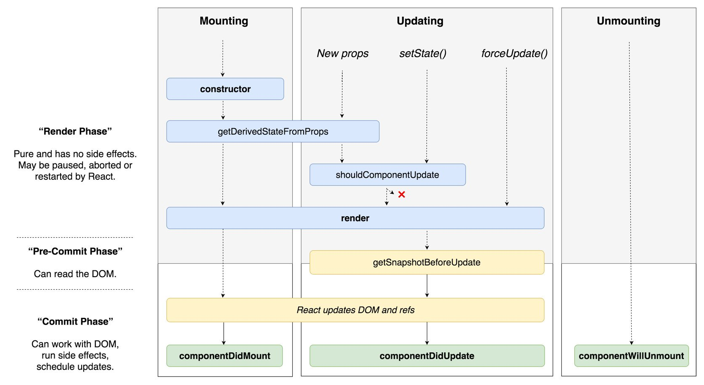

<div dir="rtl">

# مجموعه سوالات استخدامی ری‌اکت

> اگه خوشتون اومد روی :star: کلیک کنیم. اگر هم قصد مشارکت داشتید خیلی خوشحال می‌شیم :)


## دانلود کتاب به فرمت‌های PDF/Epub

می‌تونید از لینک [اکشن‌ها](https://github.com/mariotek/reactjs-persian-interview-questions/actions) دانلود کنیم.


### جدول محتوا

| ردیف. | سوال |
| --- | --------- |
|   | **هسته ری‌اکت** |
|1  | [ری‌اکت چیه؟](#ریاکت-چیه) |
|2  | [اصلی‌ترین ویژگی‌های ری‌اکت چیا هستن؟](#اصلیترین-ویژگیهای-ریاکت-چیا-هستن) |
|3  | [JSX چیه؟](#JSX-چیه) |
|4  | [تفاوت‌های Element و Component چیه؟](#تفاوتهای-Element-و-Component-چیه) |
|5  | [تو ری‌اکت چطوری کامپوننت می‌سازیم؟](#تو-ریاکت-چطوری-کامپوننت-میسازیم) |
|6  | [کی باید از Class Component بجای Function Component استفاده کنیم؟](#کی-باید-از-Class-Component-بجای-Function-Component-استفاده-کنیم) |
|7  | [Pure Components چیه؟](#Pure-Components-چیه) |
|8  | [state تو ری‌اکت چیکار می‌کنه؟](#state-تو-ریاکت-چیکار-میکنه) |
|9  | [props تو ری‌اکت چیکار می‌کنه؟](#props-تو-ریاکت-چیکار-میکنه) |
|10 | [تفاوت state و props چیه؟](#تفاوت-state-و-props-چیه) |
|11 | [چرا نباید state رو مستقیما آپدیت کنیم؟](#چرا-نباید-state-رو-مستقیما-آپدیت-کنیم) |
|12 | [هدف از متدهای callback توی استفاده از setState چیه؟](#هدف-از-متدهای-callback-توی-استفاده-از-setState-چیه)
|13 | [تفاوت بین نحوه مدیریت رویداد HTML و React چیه؟](#تفاوت-بین-نحوه-مدیریت-رویداد-HTML-و-React-چیه) |
|14 | [چطوری متد یا event رو به تابع callback توی JSX bind کنیم؟](#چطوری-متد-یا-event-رو-به-تابع-callback-توی-JSX-bind-کنیم) |
|15 | [چطوری میشه یک مقدار رو به یه تابع callback یا eventHandler پاس بدیم؟](#چطوری-میشه-یک-مقدار-رو-به-یه-تابع-callback-یا-eventHandler-پاس-بدیم) |
|16 | [Synthetic events(رویدادهای مصنوعی) تو ری‌اکت چیا هستن؟](#Synthetic-eventsرویدادهای-مصنوعی-تو-ریاکت-چیا-هستن(رویدادهای-مصنوعی)-تو-ری‌اکت-چیا-هستن؟) |
|17 | [عبارات شرطی درون خطی چیه؟](#عبارات-شرطی-درون-خطی-چیه) |
|18 | [props های "key" چی هستن و مزایای استفاده از آنها در آرایه عناصر چیه؟](#props-های-key-چی-هستن-و-مزایای-استفاده-از-آنها-در-آرایه-عناصر-چیه"key"-چی-هستن-و-مزایای-استفاده-از-آنها-در-آرایه-عناصر-چیه؟) |
|19 | [کاربرد refها چیه؟](#کاربرد-refها-چیه) |
|20 | [چطوری از ref استفاده کنیم؟](#چطوری-از-ref-استفاده-کنیم)
|21 | [forward ref چیه؟](#forward-ref-چیه) |
|22 | [بین callback refs و تابع findDOMNode کدوم رو ترجیح میدی؟](#بین-callback-refs-و-تابع-findDOMNode-کدوم-رو-ترجیح-میدی) |
|23 | [چرا Refهای متنی منقضی محسوب می‌شوند؟](#چرا-Refهای-متنی-منقضی-محسوب-میشوند) |
|24 | [Virtual DOM چیه؟](#Virtual-DOM-چیه) |
|25 | [Virtual DOM چطوری کار می‌کنه؟](#Virtual-DOM-چطوری-کار-میکنه) |
|26 | [تفاوت بین Shadow DOM و Virtual DOM چیه؟](#تفاوت-بین-Shadow-DOM-و-Virtual-DOM-چیه) |
|27 | [React Fiber چیه؟](#React-Fiber-چیه) |
|28 | [هدف اصلی React Fiber چیه؟](#هدف-اصلی-React-Fiber-چیه) |
|29 | [کامپوننت‌های کنترل شده چی هستن؟](#کامپوننتهای-کنترل-شده-چی-هستن) |
|30 | [کامپوننت‌های کنترل نشده چی هستن؟](#کامپوننتهای-کنترل-نشده-چی-هستن) |
|31 | [تفاوت‌های بین createElement و cloneElement چیا هستن؟](#تفاوتهای-بین-createElement-و-cloneElement-چیا-هستن) |
|32 | [مفهوم lift state up یا مدیریت state در لول بالاتر رو توضیح میدی؟](#مفهوم-lift-state-up-یا-مدیریت-state-در-لول-بالاتر-رو-توضیح-میدی) |
|33 | [فازهای مختلف از lifecycle کامپوننت چیا هستن؟](#فازهای-مختلف-از-lifecycle-کامپوننت-چیا-هستن) |
|34 | [متدهای lifecycle کامپوننت چیا هستن؟](#متدهای-lifecycle-کامپوننت-چیا-هستن) |
|35 | [کامپوننت‌های Higher-Order چی هستن؟](#کامپوننتهای-Higher-Order-چی-هستن) |
|36 | [چطوری می‌تونیم props proxy برای کامپوننت‌های HOC ایجاد کنیم؟](#چطوری-میتونیم-props-proxy-برای-کامپوننتهای-HOC-ایجاد-کنیم) |
|37 | [context چیه؟](#context-چیه) |
|38 | [children prop چیه؟](#children-prop-چیه) |
|39 | [چطوری میشه تو React کامنت نوشت؟](#چطوری-میشه-تو-React-کامنت-نوشت) |
|40 | [چرا توی کامپوننت‌های کلاس باید توی constructor تابع super رو با مقدار props صدا بزنیم؟](#چرا-توی-کامپوننتهای-کلاس-باید-توی-constructor-تابع-super-رو-با-مقدار-props-صدا-بزنیم) |
|41 | [reconciliation چیه؟](#reconciliation-چیه) |
|42 | [چطوری با یه اسم داینامیک set state کنیم؟](#چطوری-با-یه-اسم-داینامیک-set-state-کنیم) |
|43 | [یه اشتباه رایج برای مدیریت توابع eventها که باعث میشه با هر رندر توابع مجدد ساخته بشن چی هستش؟](#یه-اشتباه-رایج-برای-مدیریت-توابع-eventها-که-باعث-میشه-با-هر-رندر-توابع-مجدد-ساخته-بشن-چی-هستش) |
|44 | [تابع lazy که برای lazy load استفاده میشه رو می‌تونیم به صورت name export خروجی بگیریم؟](#تابع-lazy-که-برای-lazy-load-استفاده-میشه-رو-میتونیم-به-صورت-name-export-خروجی-بگیریم) |
|45 | [چرا ری‌اکت از className بجای class استفاده می‌کنه؟](#چرا-ریاکت-از-className-بجای-class-استفاده-میکنه) |
|46 | [fragmentها چی هستن؟](#fragmentها-چی-هستن) |
|47 | [چرا fragmentها از تگ‌های div بهترن؟](#چرا-fragmentها-از-تگهای-div-بهترن) |
|48 | [توی ری‌اکت portal‌ها چیکار می‌کنن؟](#توی-ریاکت-portalها-چیکار-میکنن) |
|49 | [کامپوننت stateless چیه؟](#کامپوننت-stateless-چیه) |
|50 | [کامپوننت stateful چیه؟](#کامپوننت-stateful-چیه) |
|51 | [چطوری prop‌های کامپوننت رو اعتبارسنجی کنیم؟](#چطوری-propهای-کامپوننت-رو-اعتبارسنجی-کنیم) |
|52 | [مزایای React چیه؟](#مزایای-React-چیه) |
|53 | [محدودیت های React چیه؟](#محدودیت-های-React-چیه) |
|54 | [error boundaryها توی ری‌اکت نسخه 16 چیکار می‌کنن؟](#error-boundaryها-توی-ریاکت-نسخه-16-چیکار-میکنن) |
|55 | [چطوری از error boundaryها توی نسخه ۱۵ ریکت مدیریت شدن؟](#چطوری-از-error-boundaryها-توی-نسخه-۱۵-ریکت-مدیریت-شدن) |
|56 | [روش‌های پیشنهادی برای type checking چیه؟](#روشهای-پیشنهادی-برای-type-checking-چیه) |
|57 | [کاربرد پکیج react-dom چیه؟](#کاربرد-پکیج-react-dom-چیه) |
|58 | [کاربرد متد render از پکیج react-dom چیه؟](#کاربرد-متد-render-از-پکیج-react-dom-چیه) |
|59 | [ReactDOMServer چیه؟](#ReactDOMServer-چیه) |
|60 | [چطوری از InnerHtml توی ری‌اکت استفاده کنیم؟](#چطوری-از-InnerHtml-توی-ریاکت-استفاده-کنیم) |
|61 | [چطوری توی ری‌اکت استایل‌دهی می‌کنیم؟](#چطوری-توی-ریاکت-استایلدهی-میکنیم) |
|62 | [تفاوت eventهای ری‌اکت چیه؟](#تفاوت-eventهای-ریاکت-چیه) |
|63 | [اگه توی constructor بیاییم و setState کنیم چی میشه؟](#اگه-توی-constructor-بیاییم-و-setState-کنیم-چی-میشه) |
|64 | [تاثیر استفاده از اینرکس به عنوان key چیه؟](#تاثیر-استفاده-از-اینرکس-به-عنوان-key-چیه) |
|65 | [نظرت راجع به استفاده از setState توی متد componentWillMount چیه؟](#نظرت-راجع-به-استفاده-از-setState-توی-متد-componentWillMount-چیه) |
|66 | [اگه از prop توی مقداردهی اولیه state استفاده کنیم چی میشه؟](#اگه-از-prop-توی-مقداردهی-اولیه-state-استفاده-کنیم-چی-میشه) |
|67 | [چطوری کامپوننت رو با بررسی یه شریط رندر می‌کنیم؟](#چطوری-کامپوننت-رو-با-بررسی-یه-شریط-رندر-میکنیم)
|68 | [چرا وقتی propها رو روی یه DOM Elemnt می‌آییم spread می‌کنیم باید مراقب باشیم؟](#چرا-وقتی-propها-رو-روی-یه-DOM-Elemnt-میآییم-spread-میکنیم-باید-مراقب-باشیم) |
|69 | [چطوری از decoratorها توی ری‌اکت استفاده کنیم؟](#چطوری-از-decoratorها-توی-ریاکت-استفاده-کنیم) |
|70 | [چطوری یه کامپوننت رو memoize می‌کنیم؟](#چطوری-یه-کامپوننت-رو-memoize-میکنیم) |
|71 | [چطوری باید Server-Side Rendering یا SSR رو توی ری‌اکت پیاده کنیم؟](#چطوری-باید-Server-Side-Rendering-یا-SSR-رو-توی-ریاکت-پیاده-کنیم) |
|72 | [چطوری حالت production رو برای ری‌اکت فعال کنیم؟](#چطوری-حالت-production-رو-برای-ریاکت-فعال-کنیم) |
|73 | [CRA چیه و چه مزایایی داره؟](#CRA-چیه-و-چه-مزایایی-داره) |
|74 | [ترتیب اجرا شدن متد‌های life cycle چطوریه؟](#ترتیب-اجرا-شدن-متدهای-life-cycle-چطوریه) |
|75 | [کدوم متد‌های life cycle توی نسخه 16 ری‌اکت منسوخ شدن؟](#کدوم-متدهای-life-cycle-توی-نسخه-16-ریاکت-منسوخ-شدن) |
|76 | [کاربرد متد getDerivedStateFromProps چیه؟](#کاربرد-متد-getDerivedStateFromProps-چیه) |
|77 | [کاربرد متد getSnapshotBeforeUpdate چیه؟](#کاربرد-متد-getSnapshotBeforeUpdate-چیه) |
|78 | [آیا هوک‌ها جای render props و HOC رو می‌گیرن؟](#آیا-هوکها-جای-render-props-و-HOC-رو-میگیرن) |
|79 | [روش توضیه شده برای نام‌گذاری کامپوننت‌ها چیه؟](#روش-توضیه-شده-برای-نامگذاری-کامپوننتها-چیه) |
|80 | [روش توصیه شده برای ترتیب متدها در کلاس کامپوننت‌ها چیه؟](#روش-توصیه-شده-برای-ترتیب-متدها-در-کلاس-کامپوننتها-چیه) |
|81 | [کامپوننت تعویض کننده یا switching چیه؟](#کامپوننت-تعویض-کننده-یا-switching-چیه) |
|82 | [چرت نیاز میشه به تایع setState یه فانکشن callback پاس بدیم؟](#چرت-نیاز-میشه-به-تایع-setState-یه-فانکشن-callback-پاس-بدیم) |
|83 | [حالت strict توی ری‌اکت چیکار می‌کنه؟](#حالت-strict-توی-ریاکت-چیکار-میکنه) |
|84 | [Mixin‌های ری‌اکت چی هستن؟](#Mixinهای-ریاکت-چی-هستن) |
|85 | [چرا isMounted آنتی پترن هست و روش بهتر انجامش چیه؟](#چرا-isMounted-آنتی-پترن-هست-و-روش-بهتر-انجامش-چیه) |
|86 | [پشتیبانی ری‌اکت از pointer eventها چطوریه؟](#پشتیبانی-ریاکت-از-pointer-eventها-چطوریه) |
|87 | [چرا باید اسم کامپوننت با حرف بزرگ شروع بشه؟](#چرا-باید-اسم-کامپوننت-با-حرف-بزرگ-شروع-بشه) |
|88 | [آیا propهای custom توی ری‌اکت پشتیبانی میشن؟](#آیا-propهای-custom-توی-ریاکت-پشتیبانی-میشن) |
|89 | [تفاوت‌های  constructor و getInitialState چیه؟](#تفاوتهای-constructor-و-getInitialState-چیه) |
|90 | [می‌تونیم یه کامپوننت رو بدون setState ری‌رندر کنیم؟](#میتونیم-یه-کامپوننت-رو-بدون-setState-ریرندر-کنیم) |
|91 | [تفاوت‌های فراخوانی super(-) و super(props) توی کلاس کامپوننت‌های ری‌اکت چیه؟](#تفاوتهای-فراخوانی-super-و-superprops-توی-کلاس-کامپوننتهای-ریاکت-چیه) |
|92 | [چطوری توی JSX حلقه یا همون لوپ رو داشته باشیم؟](#چطوری-توی-JSX-حلقه-یا-همون-لوپ-رو-داشته-باشیم) |
|93 | [توی attributeها چطوری به prop دسترسی داشته باشیم؟](#توی-attributeها-چطوری-به-prop-دسترسی-داشته-باشیم) |
|94 | [چطوری یه PropType برای ‌آرایه‌ای از objectها با shape داشته باشیم؟](#چطوری-یه-PropType-برای-آرایهای-از-objectها-با-shape-داشته-باشیم) |
|95 | [چطوری classهای یه المنت رو به صورت شرطی رندر کنیم؟](#چطوری-classهای-یه-المنت-رو-به-صورت-شرطی-رندر-کنیم) |
|96 | [تفاوت‌های React و ReactDOM چیه؟](#تفاوتهای-React-و-ReactDOM-چیه) |
|97 | [چرا ReactDOM رو از React جدا کردن؟](#چرا-ReactDOM-رو-از-React-جدا-کردن) |
|98 | [چطوری از label تو ری‌اکت استفاده کنیم؟](#چطوری-از-label-تو-ریاکت-استفاده-کنیم) |
|99 | [چطوری می‌تونیم چندتا object از استایل‌های درون خطی رو با هم ترکیب کنیم؟](#چطوری-میتونیم-چندتا-object-از-استایلهای-درون-خطی-رو-با-هم-ترکیب-کنیم) |
|100| [چطوری با resize شدن مرورگر یه ویو رو ری‌رندر کنیم؟](#چطوری-با-resize-شدن-مرورگر-یه-ویو-رو-ریرندر-کنیم)
|101| [تفاوت متدهای setState و replaceState چیه؟](#تفاوت-متدهای-setState-و-replaceState-چیه) |
|102| [چطوری به تغییرات state گوش بدیم؟](#چطوری-به-تغییرات-state-گوش-بدیم) |
|103| [روش توصیه شده برای حذف یک عنصر از آرایه توی state چیه؟](#روش-توصیه-شده-برای-حذف-یک-عنصر-از-آرایه-توی-state-چیه) |
|104| [امکانش هست که ری‌اکت رو بدون رندر کردن HTML استفاده کنیم؟](#امکانش-هست-که-ریاکت-رو-بدون-رندر-کردن-HTML-استفاده-کنیم) |
|105| [چطوری میشه با ری‌اکت یه JSON به شکل beautify شده نشون داد؟](#چطوری-میشه-با-ریاکت-یه-JSON-به-شکل-beautify-شده-نشون-داد) |
|106| [چرا نمی‌تونیم prop رو آپدیت کنیم؟](#چرا-نمیتونیم-prop-رو-آپدیت-کنیم) |
|107| [چطوری می‌تونیم موقع لود صفحه روی یه input فوکوس کنیم؟](#چطوری-میتونیم-موقع-لود-صفحه-روی-یه-input-فوکوس-کنیم) |
|108| [روش‌های ممکن برای آپدیت کردن object توی state چیا هستن؟](#روشهای-ممکن-برای-آپدیت-کردن-object-توی-state-چیا-هستن) |
|109| [چرا توابع به جای object در setState ترجیح داده می‌شوند؟](#چرا-توابع-به-جای-object-در-setState-ترجیح-داده-میشوند) |
|110| [چطوری می‌‌تونیم نسخه ری‌اکت جاری رو توی محیط اجرایی بفهمیم؟](#چطوری-میتونیم-نسخه-ریاکت-جاری-رو-توی-محیط-اجرایی-بفهمیم) |
|111| [روش‌های لود کردن polyfill توی CRA چیا هستن؟](#روشهای-لود-کردن-polyfill-توی-CRA-چیا-هستن) |
|112| [توی CRA چطوری از https به‌جای http استفاده کنیم؟](#توی-CRA-چطوری-از-https-بهجای-http-استفاده-کنیم) |
|113| [توی CRA چطوری میشه از مسیر‌های طولانی برای ایمپورت جلوگیری کرد؟](#توی-CRA-چطوری-میشه-از-مسیرهای-طولانی-برای-ایمپورت-جلوگیری-کرد) |
|114| [چطوری میشه Google Analytics رو به react-router اضافه کرد؟](#چطوری-میشه-Google-Analytics-رو-به-react-router-اضافه-کرد) |
|115| [چطوری یه کامپوننت رو هر ثانیه به روز کنیم؟](#چطوری-یه-کامپوننت-رو-هر-ثانیه-به-روز-کنیم) |
|116| [برای استایل‌دهی‌های درون خطی چطوری باید پیشوند‌های مخصوص مرورگرها رو اضافه کرد؟](#برای-استایلدهیهای-درون-خطی-چطوری-باید-پیشوندهای-مخصوص-مرورگرها-رو-اضافه-کرد) |
|117| [چطوری کامپوننت‌های ری‌اکت رو با es6 می‌تونیم import و export کنیم؟](#چطوری-کامپوننتهای-ریاکت-رو-با-es6-میتونیم-import-و-export-کنیم) |
|118| [استثنایی که برای نام‌گذاری کامپوننت اجازه استفاده از حرف کوچک رو میده چیه؟](#استثنایی-که-برای-نامگذاری-کامپوننت-اجازه-استفاده-از-حرف-کوچک-رو-میده-چیه) |
|119| [چرا تابع سازنده کلاس کامپوننت یکبار صدا زده میشه؟](#چرا-تابع-سازنده-کلاس-کامپوننت-یکبار-صدا-زده-میشه) |
|120| [توی ری‌اکت چطوری مقدار ثابت تعریف کنیم؟](#توی-ریاکت-چطوری-مقدار-ثابت-تعریف-کنیم) |
|121| [چطوری توی برنامه event کلیک شدن رو trigger کنیم؟](#چطوری-توی-برنامه-event-کلیک-شدن-رو-trigger-کنیم) |
|122| [آیا استفاده از async/await توی ری‌اکت ممکنه؟](#آیا-استفاده-از-async/await-توی-ریاکت-ممکنه) |
|123| [ساختار پوشه‌بندی معروف برا ری‌اکت چطوریه؟](#ساختار-پوشهبندی-معروف-برا-ریاکت-چطوریه) |
|124| [پکیج‌های مشهور برای انیمیشن چیا هستن؟](#پکیجهای-مشهور-برای-انیمیشن-چیا-هستن) |
|125| [مزایای ماژول‌های style چیه؟](#مزایای-ماژولهای-style-چیه) |
|126| [معروف‌ترین linterهای ری‌اکت کدوما هستن؟](#معروفترین-linterهای-ریاکت-کدوما-هستن) |
|127| [چطوری باید توی کامپوننت درخواست api call بزنیم؟](#چطوری-باید-توی-کامپوننت-درخواست-api-call-بزنیم) |
|128| [render props چیه؟](#render-props-چیه) |
|   | **رووتر ری‌اکت** |
|129| [React Router چیه؟](#React-Router-چیه) |
|130| [ارتباط React Router و کتابخونه history چیه؟](#ارتباط-React-Router-و-کتابخونه-history-چیه) |
|131| [کامپوننت‌های router توی نسخه۴ چیا هستن؟](#کامپوننتهای-router-توی-نسخه۴-چیا-هستن) |
|132| [هدف از متدهای push و replace توی history چیه؟](#هدف-از-متدهای-push-و-replace-توی-history-چیه) |
|133| [چطوری توی برنامه به route خاص جابجا بشیم؟](#چطوری-توی-برنامه-به-route-خاص-جابجا-بشیم) |
|134| [چطوری میشه query پارامترها رو توی ری‌اکت روتر نسخه۴ گرفت؟](#چطوری-میشه-query-پارامترها-رو-توی-ریاکت-روتر-نسخه۴-گرفت) |
|135| [دلیل خطای "Router may have only one child element" چیه؟](#دلیل-خطای-"Router-may-have-only-one-child-element"-چیه) |
|136| [چطوری میشه به متد history.push پارامتر اضافه کرد؟](#چطوری-میشه-به-متد-history.push-پارامتر-اضافه-کرد) |
|137| [چطوری میشه صفحه ۴۰۴ ساخت؟](#چطوری-میشه-صفحه-۴۰۴-ساخت) |
|138| [توی ری‌اکت روتر نسخه۴ چطوری میشه history رو گرفت؟](#توی-ریاکت-روتر-نسخه۴-چطوری-میشه-history-رو-گرفت) |
|139| [چطوری بعد از لاگین به شکل خودکار ریدایرکت کنیم؟](#چطوری-بعد-از-لاگین-به-شکل-خودکار-ریدایرکت-کنیم) |
|   | **چند زبانگی در ری‌اکت** |
|140| [React-Intl چیه؟](#React-Intl-چیه) |
|141| [اصلی‌ترین ویژگی‌های React Intl چیا هستن؟](#اصلیترین-ویژگیهای-React-Intl-چیا-هستن) |
|142| [دو روش فرمت کردن توی React Intl چیا هستن؟](#دو-روش-فرمت-کردن-توی-React-Intl-چیا-هستن) |
|143| [چطوری از FormattedMessage به عنوان یه placeholder میشه استفاده کرد؟](#چطوری-از-FormattedMessage-به-عنوان-یه-placeholder-میشه-استفاده-کرد) |
|144| [چطوری میشه locale فعلی رو توی React Intl بدست آورد؟](#چطوری-میشه-localeفعلی-رو-توی-React-Intl-بدست-آورد) |
|145| [چطوری با استفاده از React Intl یه تاریخ رو فرمت‌بندی کنیم؟](#چطوری-با-استفاده-از-React-Intl-یه-تاریخ-رو-فرمتبندی-کنیم) |
|   | **تست کردن ری‌اکت** |
|146| [توی تست ری‌اکت Shallow Renderer چیه؟](#توی-تست-ریاکت-Shallow-Renderer-چیه) |
|147| [پکیج TestRenderer توی ری‌اکت چیه؟](#پکیج-TestRenderer-توی-ریاکت-چیه) |
|148| [هدف از پکیج ReactTestUtils چیه؟](#هدف-از-پکیج-ReactTestUtils-چیه) |
|149| [Jest چیه؟](#Jest-چیه) |
|150| [مزایای jest نسبت به jasmine چیا هستن؟](#مزایای-jest-نسبت-به-jasmine-چیا-هستن) |
|151| [یه مثال ساده از تست با jest بزن؟](#یه-مثال-ساده-از-تست-با-jest-بزن) |
|   | **React Redux** |
|152| [Flux چیه؟](#Flux-چیه) |
|153| [Redux چیه؟](#Redux-چیه) |
|154| [مبانی اصلی ریداکس چیا هستن؟](#مبانی-اصلی-ریداکس-چیا-هستن) |
|155| [کاستی‌های redux نسبت به flux چیا هستن؟](#کاستیهای-redux-نسبت-به-flux-چیا-هستن) |
|156| [تفاوت‌های mapStateToProps و mapDispatchToProps چی هست؟](#تفاوتهای-mapStateToProps-و-mapDispatchToProps-چی-هست) |
|157| [توی ریدیوسر می‌تونیم یه actionی رو dispatch کنیم؟](#توی-ریدیوسر-میتونیم-یه-actionی-رو-dispatch-کنیم) |
|158| [چطوری میشه خارج از کامپوننت میشه store ریداکس دسترسی داشت؟](#چطوری-میشه-خارج-از-کامپوننت-میشه-store-ریداکس-دسترسی-داشت) |
|159| [اشکالات پترن MVW چیا هستن؟](#اشکالات-پترن-MVW-چیا-هستن) |
|160| [تشابهی بین Redux و RxJS هست؟](#تشابهی-بین-Redux-و-RxJS-هست) |
|161| [چطوری میشه یه اکشن رو موقع لود dispatch کرد؟](#چطوری-میشه-یه-اکشن-رو-موقع-لود-dispatch-کرد) |
|162| [چطوری از متد connect از پکیج react-redux استفاده می‌کنیم؟](#چطوری-از-متد-connect-از-پکیج-react-redux-استفاده-میکنیم) |
|163| [چطوری میشه state ریداکس رو ریست کرد؟](#چطوری-میشه-state-ریداکس-رو-ریست-کرد) |
|164| [هدف از کاراکتر @ توی decorator متد connect چیه؟](#هدف-از-کاراکتر-@-توی-decorator-متد-connect-چیه) |
|165| [تفاوت‌های context و React Redux چیه؟](#تفاوتهای-context-و-React-Redux-چیه) |
|166| [چرا به توابع state ریداکس reducer میگن؟](#چرا-به-توابع-state-ریداکس-reducer-میگن) |
|167| [توی redux چطوری میشه api request زد؟](#توی-redux-چطوری-میشه-api-request-زد) |
|168| [آیا لازمه همه state همه کامپوننت‌هامونو توی ریداکس نگهداری کنیم؟](#آیا-لازمه-همه-state-همه-کامپوننتهامونو-توی-ریداکس-نگهداری-کنیم) |
|169| [روش صحیح برای دسترسی به store ریداکس چیه؟](#روش-صحیح-برای-دسترسی-به-store-ریداکس-چیه) |
|170| [تفاوت‌های component و container توی ریداکس چی هست؟](#تفاوتهای-component-و-container-توی-ریداکس-چی-هست) |
|171| [هدف از constantها تا typeها توی ریداکس چیه؟](#هدف-از-constantها-تا-typeها-توی-ریداکس-چیه) |
|172| [روش‌های مختلف برای نوشتن mapDispatchToProps چیه؟](#روشهای-مختلف-برای-نوشتن-mapDispatchToProps-چیه) |
|173| [کاربرد پارامتر ownProps توی mapStateToProps و mapDispatchToProps چیه؟](#کاربرد-پارامتر-ownProps-توی-mapStateToProps-و-mapDispatchToProps-چیه) |
|174| [ساختار پوشه‌بندی ریشه ریداکس اکثرا چطوریه؟](#ساختار-پوشهبندی-ریشه-ریداکس-اکثرا-چطوریه) |
|175| [redux-saga جیه؟](#redux-saga-جیه) |
|176| [مدل ذهنی redux-saga چطوریه؟](#مدل-ذهنی-redux-saga-چطوریه) |
|177| [تفاوت افکت‌های call و put توی redux-saga چی هست؟](#تفاوت-افکتهای-call-و-put-توی-redux-saga-چی-هست) |
|178| [Redux Thunk چیه؟](#Redux-Thunk-چیه) |
|179| [تفاوت‌های redux-saga و redux-thunk جیا هستن؟](#تفاوتهای-redux-saga-و-redux-thunk-جیا-هستن) |
|180| [Redux DevTools چیه؟](#Redux-DevTools-چیه) |
|181| [ویژگی‌های Redux DevTools چیا هستن؟](#ویژگیهای-Redux-DevTools-چیا-هستن) |
|182| [سلکتورهای ریداکس چی هستن و چرا باید ازشون استفاده کنیم؟](#سلکتورهای-ریداکس-چی-هستن-و-چرا-باید-ازشون-استفاده-کنیم) |
|183| [Redux Form چیه؟](#Redux-Form-چیه) |
|184| [اصلی‌ترین ویژگی‌های Redux Form چیه؟](#اصلیترین-ویژگیهای-Redux-Form-چیه) |
|185| [چطوری میشه چندتا middleware به ریداکس اضافه کرد؟](#چطوری-میشه-چندتا-middleware-به-ریداکس-اضافه-کرد) |
|186| [چطوری میشه توی ریداکس initial state تعریف کرد؟](#چطوری-میشه-توی-ریداکس-initial-state-تعریف-کرد) |
|187| [تفاوت‌های Relay با Redux چیا هستن؟](#تفاوتهای-Relay-با-Redux-چیا-هستن) |
|   | **React Native** |
|188| [تفاوت‌های React Native و React چیا هستن؟](#تفاوتهای-React-Native-و-React-چیا-هستن) |
|189| [چطوری میشه برنامه React Native رو تست کرد؟](#چطوری-میشه-برنامه-React-Native-رو-تست-کرد) |
|190| [چطوری میشه توی React Native لاگ کرد؟](#چطوری-میشه-توی-React-Native-لاگ-کرد) |
|191| [چطوری میشه React Native رو دیباگ کرد؟](#چطوری-میشه-React-Native-رو-دیباگ-کرد) |
|   | **کتابخانه‌های مورد استفاده با ری‌اکت** |
|192| [کتابخونه reselect چیه و چطوری کار می‌کنه؟](#کتابخونه-reselect-چیه-و-چطوری-کار-میکنه) |
|193| [Flow چیه؟](#Flow-چیه) |
|194| [تفاوت‌های Flow و PropTypes چیا هستن؟](#تفاوتهای-Flow-و-PropTypes-چیا-هستن) |
|195| [چطوری از آیکون‌های font-awesome توی ری‌اکت استفاده کنیم؟](#چطوری-از-آیکونهای-font-awesome-توی-ریاکت-استفاده-کنیم) |
|196| [React Dev Tools چیه؟](#React-Dev-Tools-چیه) |
|197| [چرا توی کروم devtools برای فایل‌های local لود نمیشه؟](#چرا-توی-کروم-devtools-برای-فایلهای-local-لود-نمیشه) |
|198| [چطوری از Polymer توی React استفاده کنیم؟](#چطوری-از-Polymer-توی-React-استفاده-کنیم) |
|199| [مزایای React نسبت به Vue.js چیا هستن؟](#مزایای-React-نسبت-به-Vue.js-چیا-هستن) |
|200| [تفاوت‌های React و Angular چیا هستن؟](#تفاوتهای-React-و-Angular-چیا-هستن) |
|201| [چرا تب React در DevTools نشان داده نمی‌شود؟](#چرا-تب-React-در-DevTools-نشان-داده-نمیشود) |
|202| [Styled components چیه؟](#Styled-components-چیه) |
|203| [یه مثال از Styled Components می‌تونی بگی؟](#یه-مثال-از-Styled-Components-میتونی-بگی) |
|204| [Relay چیه؟](#Relay-چیه) |
|205| [چطوری میشه از تایپ اسکریپت توی create-react-app استفاده کرد؟](#چطوری-میشه-از-تایپ-اسکریپت-توی-create-react-app-استفاده-کرد) |
|   | **متفرقه** |
|206| [اصلی‌ترین ویژگی‌های کتابخونه reselect چیا هستن؟](#اصلیترین-ویژگیهای-کتابخونه-reselect-چیا-هستن) |
|207| [یه مثال از کارکرد کتابخونه reselect بزن؟](#یه-مثال-از-کارکرد-کتابخونهreselect-بزن) |
|208| [توی Redux اکشن چیکار می‌کنه؟](#توی-Redux-اکشن-چیکار-میکنه) |
|209| [استاتیک شی با کلاس های ES6 در React کار می کنه؟](#استاتیک-شی-با-کلاس-های-ES6-در-React-کار-می-کنه) |
|210| [ریداکس رو قفط با ری‌اکت میشه استفاده کرد؟](#ریداکس-رو-قفط-با-ریاکت-میشه-استفاده-کرد) |
|211| [برای استفاده از Redux به ابزار build خاصی احتیاج داریم؟](#برای-استفاده-از-Redux-به-ابزار-build-خاصی-احتیاج-داریم) |
|212| [مقادیر پیش‌فرض ریداکس فرم چطوری تغییرات رو از state می‌گیرن؟](#مقادیر-پیشفرض-ریداکس-فرم-چطوری-تغییرات-رو-از-state-میگیرن) |
|213| [توی PropTypeهای ری‌اکت چطوری میشه برای یه prop چند نوع داده مجاز مشخص کرد؟](#توی-PropTypeهای-ریاکت-چطوری-میشه-برای-یه-prop-چند-نوع-داده-مجاز-مشخص-کرد) |
|214| [می‌تونیم فایل svg رو به عنوان کامپوننت import کنیم؟](#میتونیم-فایل-svg-رو-به-عنوان-کامپوننت-import-کنیم) |
|215| [چرا استفاده از توابع ref callback درون خطی توصیه نمیشه؟](#چرا-استفاده-از-توابع-ref-callback-درون-خطی-توصیه-نمیشه)|
|216| [render hijacking توی ری‌اکت چیه؟](#render-hijacking-توی-ریاکت-چیه)|
|217| [پیاده‌سازی factory یا سازنده HOC چطوریه؟](#پیادهسازی-factory-یا-سازنده-HOC-چطوریه)|
|218| [چطوری به یه کامپوننت ری‌اکت عدد پاس بدیم؟](#چطوری-به-یه-کامپوننت-ریاکت-عدد-پاس-بدیم)|
|219| [لازمه همه stateها رو توی ریداکس مدیریت کنیم؟ لزومی به استفاده از state داخلی داریم؟](#لازمه-همه-stateها-رو-توی-ریداکس-مدیریت-کنیم-لزومی-به-استفاده-از-state-داخلی-داریم)|
|220| [هدف از متد registerServiceWorker توی ری‌اکت چیه؟](#هدف-از-متد-registerServiceWorker-توی-ریاکت-چیه)|
|221| [تابع memo ری‌اکت چیه؟](#تابع-memo-ریاکت-چیه)|
|222| [تابع lazy ری‌اکت چیه؟](#تابع-lazy-ریاکت-چیه)|
|223| [چطوری با استفاده از تابع setState از رندر غیرضروری جلوگیری کنیم؟](#چطوری-با-استفاده-از-تابع-setState-از-رندر-غیرضروری-جلوگیری-کنیم)|
|224| [توی نسخه ۱۶ ری‌اکت چطوری میشه آرایه، Strings و یا عدد رو رندر کنیم؟](#توی-نسخه-۱۶-ریاکت-چطوری-میشه-آرایه،-Strings-و-یا-عدد-رو-رندر-کنیم)|
|225| [چطوری میشه از تعریف ویژگی در کلاس کامپوننت استفاده کرد؟](#چطوری-میشه-از-تعریف-ویژگی-در-کلاس-کامپوننت-استفاده-کرد)|
|226| [hookها چی هستن؟](#hookها-چی-هستن)|
|227| [چه قوانینی برای هوک‌ها باید رعایت بشن؟](#چه-قوانینی-برای-هوکها-باید-رعایت-بشن)|
|228| [چطوری میشه از استفاده درست هوک‌ها اطمینان حاصل کرد؟](#چطوری-میشه-از-استفاده-درست-هوکها-اطمینان-حاصل-کرد)|
|229| [تفاوت‌های Flux و Redux چیا هستن؟](#تفاوتهای-Flux-و-Redux-چیا-هستن)|
|230| [مزایای ری‌اکت روتر نسخه۴ چیه؟](#مزایای-ریاکت-روتر-نسخه۴-چیه)|
|231| [می‌تونی راجع به متد componentDidCatch توضیح بدی؟](#میتونی-راجع-به-متد-componentDidCatch-توضیح-بدی)|
|232| [در چه سناریویی error boundary خطا رو catch نمی‌کنه؟](#در-چه-سناریویی-error-boundary-خطا-رو-catch-نمیکنه)|
|233| [چرا نیازی به error boundaries برای event handlerها نیست؟](#چرا-نیازی-به-error-boundaries-برای-event-handlerها-نیست)|
|234| [تفاوت بلوک try catch و error boundaryها چیه؟](#تفاوت-بلوک-try-catch-و-error-boundaryها-چیه)|
|235| [رفتار خطاهای uncaught در ری‌اکت 16 چیه؟](#رفتار-خطاهای-uncaught-در-ریاکت-16-چیه)|
|236| [محل مناسب برای قرار دادن error boundary کجاست؟](#محل-مناسب-برای-قرار-دادن-error-boundary-کجاست)|
|237| [مزیت چاپ شدن stack trace کامپوننت‌ها توی متن ارور boundary ری‌اکت چیه؟](#مزیت-چاپ-شدن-stack-trace-کامپوننتها-توی-متن-ارور-boundary-ریاکت-چیه)|
|238| [متدی که در تعریف کامپوننت‌های class الزامیه؟](#متدی-که-در-تعریف-کامپوننتهای-class-الزامیه)|
|239| [نوع‌های ممکن برای مقدار بازگشتی متد render چیا هستن؟](#نوعهای-ممکن-برای-مقدار-بازگشتی-متد-render-چیا-هستن)|
|240| [هدف اصلی از متد constructor چیه؟](#هدف-اصلی-از-متد-constructor-چیه)|
|241| [آیا تعریف متد سازنده توی ری‌اکت الزامیه؟](#آیا-تعریف-متد-سازنده-توی-ریاکت-الزامیه)|
|242| [Default propها چی هستن؟](#Default-propها-چی-هستن)|
|243| [چرا نباید تابع setState رو توی متد componentWillUnmount فراخوانی کرد؟](#چرا-نباید-تابع-setState-رو-توی-متد-componentWillUnmount-فراخوانی-کرد)|
|244| [کاربرد متد getDerivedStateFromError چیه؟](#کاربرد-متد-getDerivedStateFromError-چیه)|
|245| [کدوم متدها و به چه ترتیبی در طول ری‌رندر فراخوانی میشن؟](#کدوم-متدها-و-به-چه-ترتیبی-در-طول-ریرندر-فراخوانی-میشن)|
|246| [کدوم متد‌ها موقع error handling فراخوانی میشن؟](#کدوم-متدها-موقع-error-handling-فراخوانی-میشن)|
|247| [کارکرد ویژگی displayName چیه؟](#کارکرد-ویژگی-displayName-چیه)|
|248| [ساپورت مرورگرها برای برنامه ری‌اکتی چطوریه؟](#ساپورت-مرورگرها-برای-برنامه-ریاکتی-چطوریه)|
|249| [هدف از متد unmountComponentAtNode چیه؟](#هدف-از-متد-unmountComponentAtNode-چیه)|
|250| [code-splitting چیه؟](#code-splitting-چیه)|
|251| [مزایای حالت strict چیه؟](#مزایای-حالت-strict-چیه)|
|252| [Fragmentهای دارای key هستن؟](#Fragmentهای-دارای-key-هستن)|
|253| [آیا ری‌اکت از همه‌ی attributeهای HTML پشتیبانی می‌کنه؟](#آیا-ریاکت-از-همهی-attributeهای-HTML-پشتیبانی-میکنه)|
|254| [محدودیت‌های HOCها چی هستن؟](#محدودیتهای-HOCها-چی-هستن)|
|255| [چطوری میشه forwardRefs رو توی DevTools دیباگ کرد؟](#چطوری-میشه-forwardRefs-رو-توی-DevTools-دیباگ-کرد)|
|256| [مقدار یه props کامپوننت کی true میشه؟](#مقدار-یه-props-کامپوننت-کی-true-میشه)|
|257| [NextJS چیه و ویژگی‌های اصلیش چیا هستن؟](#NextJS-چیه-و-ویژگیهای-اصلیش-چیا-هستن)|
|258| [چط،وی کی‌تونیم یه تابع event handler رو به یه کامپوننت پاس بدیم؟](#چط،وی-کیتونیم-یه-تابع-event-handler-رو-به-یه-کامپوننت-پاس-بدیم)|
|259| [استفاده از توابع arrow برای متدهای render خوبه؟](#استفاده-از-توابع-arrow-برای-متدهای-render-خوبه)|
|260| [چطوری از اجرای چندباره یه تابع جلوگیری کنیم؟](#چطوری-از-اجرای-چندباره-یه-تابع-جلوگیری-کنیم)|
|261| [JSX چطوری از حمله‌های Injection جلوگیری می‌کنه؟](#JSX-چطوری-از-حملههای-Injection-جلوگیری-میکنه)|
|262| [چطوری elementهای رندر شده رو آپدیت کنیم؟](#چطوری-elementهای-رندر-شده-رو-آپدیت-کنیم)|
|263| [چرا propها read only هستن؟](#چرا-propها-read-only-هستن)|
|264| [چرا میگیم تابع setState از طریق merge کردن state را مدیریت می‌کنه؟](#چرا-میگیم-تابع-setState-از-طریق-merge-کردن-state-را-مدیریت-میکند)|
|265| [چطوری می‌تونیم به متد event handler پارامتر پاس بدیم؟](#چطوری-میتونیم-به-متد-event-handler-پارامتر-پاس-بدیم)|
|266| [چطوری از رندر مجدد کامپوننت‌ها جلوگیری کنیم؟](#چطوری-از-رندر-مجدد-کامپوننتها-جلوگیری-کنیم)|
|267| [شرایطی که بدون مشکل پرفورمنس بتونیم از ایندکس به عنوان key استفاده کنیم چی هست؟](#شرایطی-که-بدون-مشکل-پرفورمنس-بتونیم-از-ایندکس-به-عنوان-key-استفاده-کنیم-چی-هست)|
|268| [keyهای ری‌اکت باید به صورت عمومی منحصر بفرد باشن؟](#keyهای-ریاکت-باید-به-صورت-عمومی-منحصر-بفرد-باشن)|
|269| [گزینه‌های محبوب برای مدیریت فرم‌ها توی ری‌اکت چیا هستن؟](#گزینههای-محبوب-برای-مدیریت-فرما-توی-ریاکت-چیا-هستن)|
|270| [مزایای کتابخانه فرمیک نبست به redux form چیه؟](#مزایای-کتابخانه-فرمیک-نبست-به-redux-form-چیه)|
|271| [چرا اجباری برای استفاده از ارث‌بری توی ری‌اکت نیست؟ مزیتی داره؟](#چرا-اجباری-برای-استفاده-از-ارثبری-توی-ریاکت-نیست-مزیتی-داره)|
|272| [می‌تونیم از web components توی برنامه ری‌اکت استفاده کنیم؟](#میتونیم-از-web-components-توی-برنامه-ریاکت-استفاده-کنیم)|
|273| [dynamic import چیه؟](#dynamic-import-چیه)|
|274| [loadable componentها چی هستن؟](#loadable-componentها-چی-هستن)|
|275| [کامپوننت suspense چیه؟](#کامپوننت-suspense-چیه)|
|276| [چطوری به ازای route می‌تونیم code splitting داشته باشیم؟](#چطوری-به-ازای-route-میتونیم-code-splitting-داشته-باشیم)|
|277| [یه مثال از نحوه استفاده از context میزنی؟](#یه-مثال-از-نحوه-استفاده-از-context-میزنی)|
|278| [هدف از مقدار پیش‌فرض توی context چیه؟](#هدف-از-مقدار-پیشفرض-توی-context-چیه)|
|279| [چظوری از contextType استفاده می‌کنین؟](#چظوری-از-contextType-استفاده-میکنین)|
|280| [consumer چیه؟](#consumer-چیه)|
|281| [چطوری مسائل مربوط به پرفورمنس با context رو حل می‌کنین؟](#چطوری-مسائل-مربوط-به-پرفورمنس-با-context-رو-حل-میکنین)|
|282| [هدف از forward ref توی HOCها چیه؟](#هدف-از-forward-ref-توی-HOCها-چیه)|
|283| [توی کامپوننت‌ها می‌تونیم پراپ ref داشته باشیم؟](#توی-کامپوننتها-میتونیم-پراپ-ref-داشته-باشیم)|
|284| [چرا در هنگام استفاده از ForwardRefها نیاز به احتیاط بیشتری در استفاده از کتابخانه های جانبی داریم؟](#چرا-در-هنگام-استفاده-از-ForwardRefها-نیاز-به-احتیاط-بیشتری-در-استفاده-از-کتابخانه-های-جانبی-داریم)|
|285| [چطوری بدون استفاده از ES6 کلاس کامپوننت بسازیم؟](#چطوری-بدون-استفاده-از-ES6-کلاس-کامپوننت-بسازیم)|
|286| [استفاده از ری‌اکت بدون JSX ممکن است؟](#استفاده-از-ریاکت-بدون-JSX-ممکن-است)|
|287| [الگوریتم‌های diffing ری‌اکت چی هستن؟](#الگوریتمهای-diffing-ریاکت-چی-هستن)|
|288| [قوانینی که توسط الگوریتم‌های diffing پوشش داده می‌شوند کدام هستند؟](#قوانینی-که-توسط-الگوریتمهای-diffing-پوشش-داده-میشوند-کدام-هستند)|
|289| [چه موقعی نیاز هست که از refها استفاده کنیم؟](#چه-موقعی-نیاز-هست-که-از-refها-استفاده-کنیم)|
|290| [برای استفاده از render propها لازمه که اسم prop رو render بزاریم؟](#برای-استفاده-از-render-propها-لازمه-که-اسم-prop-رو-render-بزاریم)|
|291| [مشکل استفاده از render props با pure componentها چیه؟](#مشکل-استفاده-از-render-props-با-pure-componentها-چیه)|
|292| [چطوری با استفاده از render props می‌تونیم HOC ایجاد کنیم؟](#چطوری-با-استفاده-از-render-props-میتونیم-HOC-ایجاد-کنیم)|
|293| [تکنیک windowing چیه؟](#تکنیک-windowing-چیه)|
|294| [توی JSX یه مقدار falsy رو چطوری چاپ کنیم؟](#توی-JSX-یه-مقدار-falsy-رو-چطوری-چاپ-کنیم)|
|295| [یه مورد استفاده معمول از portals مثال میزنی؟](#یه-مورد-استفاده-معمول-از-portals-مثال-میزنی)|
|296| [توی کامپوننت‌های کنترل نشده چطوری مقداری پیش فرض اضافه کنیم؟](#توی-کامپوننتهای-کنترل-نشده-چطوری-مقداری-پیش-فرض-اضافه-کنیم)|
|297| [stack موردعلاقه شما برای کانفیگ پروژه ری‌اکت چیه؟](#stack-موردعلاقه-شما-برای-کانفیگ-پروژه-ریاکت-چیه)|
|298| [تفاوت‌ DOM واقعی و  Virtual DOM چیه؟](#تفاوت-DOM-واقعی-و-Virtual-DOM-چیه)|
|299| [چطوری Bootstrap رو به یه برنامه ری‌اکتی اضافه کنیم؟](#چطوری-Bootstrap-رو-به-یه-برنامه-ریاکتی-اضافه-کنیم)|
|300| [می‌تونی یه لیسستی از معروف‌ترین وب‌سایت‌هایی که از ری‌اکت استفاده می‌کنن رو بگی؟](#میتونی-یه-لیسستی-از-معروفترین-وبسایتهایی-که-از-ریاکت-استفاده-میکنن-رو-بگی)|
|301| [استفاده از تکنیک  CSS In JS تو ری‌اکت توصیه میشه؟](#استفاده-از-تکنیک-CSS-In-JS-تو-ریاکت-توصیه-میشه)|
|302| [لازمه همه کلاس کامپوننت‌ها رو تبدیل کنیم به هوک؟](#لازمه-همه-کلاس-کامپوننتها-رو-تبدیل-کنیم-به-هوک)|
|303| [چطوری میشه با هوک‌های ری‌اکت دیتا fetch کرد؟](#چطوری-میشه-با-هوکهای-ریاکت-دیتا-fetch-کرد)|
|304| [هوک‌ها همه موارد کاربرد کلاس‌ها رو پوشش میده؟](#هوکها-همه-موارد-کاربرد-کلاسها-رو-پوشش-میده)|
|305| [نسخه پایدار ری‌اکت که از هوک پشتیبانی می‌کنه کدومه؟](#نسخه-پایدار-ریاکت-که-از-هوک-پشتیبانی-میکنه-کدومه)|
|306| [چرا از حالت  destructuring آرایه برای useState استفاده می‌کنیم؟](#چرا-از-حالت-destructuring-آرایه-برای-useState-استفاده-میکنیم)|
|307| [منابعی که باعث معرفی ایده هوک‌ها شدن چیا بودن؟](#منابعی-که-باعث-معرفی-هوکها-شدن-چیا-بودن)|
|308| [چطوری به APIهای ضروری اجزای وب دسترسی پیدا کنیم؟](#چطوری-به-APIهای-ضروری-اجزای-وب-دسترسی-پیدا-کنیم)|
|309| [formik چیه؟](#formik-چیه)|
|310| [middlewareهای مرسوم برای مدیریت ارتباط‌های asynchronous توی Redux چیا هستن؟](#middlewareهای-مرسوم-برای-مدیریت-ارتباطهای-asynchronous-توی-Redux-چیا-هستن)|
|311| [مرورگرها کد JSX رو متوجه میشن؟](#مرورگرها-کد-JSX-رو-متوجه-میشن)|
|312| [Data flow یا جریان داده ری‌اکت رو توضیح میدی؟](#Data-flow-یا-جریان-داده-ریاکت-رو-توضیح-میدی)|
|313| [react scripts چیه؟](#react-scripts-چیه)|
|314| [ویژگی‌های  create react app چیه؟](#ویژگیهای-create-react-app-چیه)|
|315| [هدف از متد renderToNodeStream چیه؟](#هدف-از-متد-renderToNodeStream-چیه)|
|316| [MobX چیه؟](#MobX-چیه)|
|317| [تفاوت‌های بین Redux و MobX چیا هستن؟](#تفاوتهای-بین-Redux-و-MobX-چیا-هستن)|
|318| [لازمه قبل از شروع ری‌اکت ES6 رو یاد گرفت؟](#لازمه-قبل-از-شروع-ریاکت-ES6-رو-یاد-گرفت)|
|319| [Concurrent Rendering چیه؟](#Concurrent-Rendering-چیه)|
|320| [تفاوت بین حالت  async و concurrent چیه؟](#تفاوت-بین-حالت-async-و-concurrent-چیه)|
|321| [می تونیم از آدرس‌های دارای url جاواسکریپت در ری‌اکت 16.9 استفاده کرد؟](#می-تونیم-از-آدرسهای-دارای-url-جاواسکریپت-در-ریاکت-16.9-استفاده-کرد)|
|322| [هدف از پلاگین eslint برای هوک‌ها چیه؟](#هدف-از-پلاگین-eslint-برای-هوکها-چیه)|
|323| [تفاوت‌های Imperative و Declarative توی ری‌اکت چیه؟](#تفاوتهای-Imperative-و-Declarative-توی-ریاکت-چیه)|
|324| [مزایای استفاده از تایپ اسکریپت با ری‌اکت چیه؟](#مزایای-استفاده-از-تایپ-اسکریپت-با-ریاکت-چیه)|

## Core React


1. ### ری‌اکت چیه؟

    ری‌اکت یه **کتابخونه متن‌باز** هست که برای ساختن رابط کاربری مخصوصا برنامه‌های تک صفحه‌ای استفاده میشه. از این کتابخونه برای مدیریت لایه view توی برنامه‌های وب و موبایل استفاده میشه. توسط [Jordan Walke](https://github.com/jordwalke) تولید شده که یه مهندس نرم‌افزار توی شرکت فیس‌بوک هستش. اولین بار سال ۲۰۱۱ و روی برنامه اینستاگرام مورد استفاده قرار گرفت

     **[⬆ برگشت به بالا](#جدول-محتوا)**

2. ### اصلی‌ترین ویژگی‌های ری‌اکت چیا هستن؟

    اصلی‌ترین ویژگی‌های ری‌اکت اینا هستن:

    * از **VirtualDOM** به جای RealDOM استفاده میکنه چون هزینه تغییرات RealDOM زیاده(یعنی پیدا کردن DOM Element و حذف یا به روز رسانی با سرعت کمتری انجام میشه)
    * از **SSR(server side rendering)** پشتیبانی میکنه
    * از جریان داده ها یا data binding به صورت **یک طرفه (unidirectional)** پیروی میکنه
    * برای توسعه view از UI کامپوننت‌های ‌**reusable/composable** استفاده میکنه

     **[⬆ برگشت به بالا](#جدول-محتوا)**

3. ### JSX چیه؟

    *JSX* یه افزونه با سینتکسی شبیه به XML  برای ECMAScript است ( مخفف *Javascript XML* ) . اگه بخوایم ساده بگیم وظیفه اش اینه که سینتکسی ساده تر از `React.createElement` دراختیارتون قرار میده, شما میتونید Javascript رو در کنار ساختاری شبیه به HTML داشته باشید.

    تو مثال زیر می‌بینید که نوشته داخل تگ h1 مثل یک تابع Javascript  به تابع render تحویل داده میشه.

    <span align="left" dir="ltr">

    ```jsx
    class App extends React.Component {
      render() {
        return(
          <div>
            <h1>{'Welcome to React world!'}</h1>
          </div>
        )
      }
    }
     ```

     </span>

     **[⬆ برگشت به بالا](#جدول-محتوا)**

4. ### تفاوت‌های Element و Component چیه؟

    *Element* یک شی ساده است که وظیفه داره اون چیزی که روی صفحه نمایش داده میشه رو توصیف کنه حالا ممکنه به صورت یک DOM node باشه یه به صورت componentهای دیگه.*Elements* میتونن شامل *Elements* دیگه به عنوان props باشند. ساختن یک Element در React کار ساده و کم دردسریه اما وقتی که ساخته شد هیچ وقت نمیشه تغییرش داد.

    تو مثال زیر یک شی که توسط React Element ساخته شده رو میبینیم :

    <span align="left" dir="ltr">

    ```javascript
    const element = React.createElement(
      'div',
      {id: 'login-btn'},
      'Login'
    )
     ```

     </span>

    تابع `React.createElement` که توی قطعه کد بالا میبینید  یه object شبیه به این برمیگردونه:

    <span align="left" dir="ltr">

    ```
    {
      type: 'div',
      props: {
        children: 'Login',
        id: 'login-btn'
      }
    }
     ```

     </span>

    و آخرش هم با استفاده از `ReactDOM.render` میتونیم توی DOM , Render کنیم

    <span align="left" dir="ltr">

    ```html
    <div id='login-btn'>Login</div>
     ```

     </span>

    درحالیکه یه **component** میتونه به روشهای مختلفی ساخته بشه. میتونه یه class باشه با یه متد `render`. یا حتی به عنوان یه جایگزین ساده‌تر به صورت یک تابع تعریف بشه. در هر دو حالت کامپوننت ساخته شده props رو به عنوان ورودی دریافت میکنه و یه خروجی رو به صورت یه JSX tree برمیگردونه. به مثال زیر دقت کنیم که چطور با استفاده از یه تابع و JSX یک کامپوننت ساخته میشه:

    <span align="left" dir="ltr">

    ```jsx
    const Button = ({ onLogin }) =>
      <div id={'login-btn'} onClick={onLogin}>Login</div>
     ```

     </span>

     JSX به `React.createElement` transplie میشه :

    <span align="left" dir="ltr">

    ```javascript
    const Button = ({ onLogin }) => React.createElement(
      'div',
      { id: 'login-btn', onClick: onLogin },
      'Login'
    )
     ```

     </span>

     **[⬆ برگشت به بالا](#جدول-محتوا)**

5. ### تو ری‌اکت چطوری کامپوننت می‌سازیم؟

    تو سوال قبل یه اشاره کوچیک کردیم که دوتا راه برای ساختن کامپوننت وجود داره.
   ۱. **Function Components**: این ساده‌ترین راه برای ساختن یه کامپوننته. یه  *Pure Javascript Function* رو در نظر بگیرید که Props که خودش یه object هست رو به عنوان پارامتر ورودی میگیره و یه React Element به عنوان خروجی برمیگردونه مثل همین مثال پایین:

    <span align="left" dir="ltr">

    ```jsx harmony
        function Greeting({ message }) {
          return <h1>{`Hello, ${message}`}</h1>
        }
     ```

     </span>

    ۲. **Class Components:** شما میتونید از class که در ES6 به جاوااسکریپت اضافه شده برای این کار استفاده کنیم. کامپوننت مثال قبلی رو اگه بخواییم با class پیاده سازی کنیم اینجوری میشه:

    <span align="left" dir="ltr">

    ```jsx harmony
        class Greeting extends React.Component {
          render() {
            return <h1>{`Hello, ${this.props.message}`}</h1>
          }
        }
     ```

     </span>

     فقط یادتون نره تو این روش متد`render` یه جورایی required میشه.

     **[⬆ برگشت به بالا](#جدول-محتوا)**

6. ### کی باید از Class Component بجای Function Component استفاده کنیم؟

     اگه کامپوننت نیاز به *state یا lifecycle methods* داشت از کلاس کامپوننت‌ها استفاده میکنیم در غیر این صورت میریم سراغ فانکسن کامپوننتها.
     *با این حال از ورژن 16.8 ری‌اکت به بعد و با اضافه شدن هوکها به فانکشن کامپوننت ها، شما میتونید از state یا lifecycle methodها یا تمامی فیچرهایی که قبلا فقط در کلاس کامپوننت ‌ها قابل استفاده بود توی فانکشن کامپوننتتون استفاده کنید*

     **[⬆ برگشت به بالا](#جدول-محتوا)**

7. ### Pure Components چیه؟

    *`React.PureComponent`* دقیقا مثل *`React.Component`* میمونه فقط تنها تفاوتی که داره اینه که برخلاف *`Component`* خودش به صورت خودکار متد *`shouldComponentUpdate()`* رو هندل میکنه.
    وقتی که props یا state در کامپوننت تغییر میکنه، *`PureComponent`* یه مقایسه سطحی روی props و state انجام میده (shallow comparison) در حالیکه *Component* این مقایسه رو به صورت خودکار انجام نمیده و به طور پیش‌فرض کامپوننت هربار که `shouldCompnentUpdate` فراخوانی بشه re-render میشه. بنابراین توی Component باید این متد override بشه.

     **[⬆ برگشت به بالا](#جدول-محتوا)**

8. ### state تو ری‌اکت چیکار می‌کنه؟

   *State* در هر کامپوننت یه آبجکته که یه سری اطلاعات که در طول عمر کامپوننت ما ممکنه تغییر کنه رو در خودش ذخیره میکنه.  ما باید تمام تلاشمون رو بکنیم که state‌مون در ساده ترین حالت ممکن باشه و تاجایی که میتونیم تعداد کامپوننت هایی که stateful هستن رو کاهش بدیم. به عنوان مثال بیایید یه کامپوننت User رو که یه state داره بسازیم:

    <span align="left" dir="ltr">

    ```jsx harmony
    class User extends React.Component {
      constructor(props) {
        super(props)

        this.state = {
          message: 'Welcome to React world'
        }
      }

      render() {
        return (
          <div>
            <h1>{this.state.message}</h1>
          </div>
        )
      }
    }
    ```

     </span>

    

   State و Props بهم شبیه هستن  ولی State کاملا در کنترل کامپوننت هستن و فقط مختص به همون کامپوننت هستن(private). یعنی state‌ها در هیچ کامپوننتی به غیر از اونی که مالکstate هست در دسترس نخواهند بود.

     **[⬆ برگشت به بالا](#جدول-محتوا)**

9. ### props تو ری‌اکت چیکار می‌کنه؟

    *Props* ورودی کامپوننتها هستن. میتونن یه مقدار ساده یا یه شی شامل یه مجموعه مقدار باشن که در لحظه ایجاد کامپوننت و بر اساس یه یه قاعده نام گذاری که خیلی شبیه به HTML-tag attributes هست، به کامپوننت پاس داده میشن. در واقع اینها داده‌هایی هستن که از کامپوننت پدر به فرزند تحویل داده میشن.

    هدف اصلی وجود Props در ری‌اکت ایجاد ساختارهای زیر در یک کامپوننته:

    1 - پاس دادن مقادیر به کامپوننت شما

    2 - trigger کردن یک متد در زمان تغییر state

    3 - استفاده از مقادیر داخل متد render (`this.props.reactProps`)

    به عنوان مثال ، یه کامپوننت با استفاده از`reactProps` میسازیم:

    <span align="left" dir="ltr">

    ```jsx harmony
    <Element reactProp={'1'} />
     ```

     </span>

    این `reactProps` (یا هرچیزی که شما اسمشو میزارید)  در نهایت تبدیل به یک property خواهد شد که داخل props object ،که داخل تمامی کامپوننت های react از ابتدا وجود داره ، قرار میگیره. و به شکل زیر قابل دسترس هست

    <span align="left" dir="ltr">

    ```
    props.reactProp
     ```
    ```
    this.props.reactProp
    ```

     </span>

     **[⬆ برگشت به بالا](#جدول-محتوا)**

10. ### تفاوت state و props چیه؟

    هردو javascript plain object  هستن . هردو وظیفه دارن مقادیری که روی render تاثیر گذار هست رو نگه داری کنن اما عملکردشون با توجه به کامپوننت متفاوت خواهد بود. Props شبیه به پارامترهای ورودی یک فانکشن، به کامپوننت پاس داده میشن در حالیکه state شبیه به متغییرهایی که داخل فانکشن ساخته شدن ، توسط خود کامپوننت ایجاد و مدیریت میشه.

     **[⬆ برگشت به بالا](#جدول-محتوا)**

11. ### چرا نباید state رو مستقیما آپدیت کنیم؟

    اگه یه بار تلاش کنید که مستقیما state رو آپدیت کنید متوجه میشید که کامپوننت شما مجددا render نمیشه.

    <span align="left" dir="ltr">

    ```javascript
    //Wrong
    this.state.message = 'Hello world'
     ```

     </span>
    به جای اینکه مستقیما state رو آپدیت کنیم میتونیم از متد setState  در Class Component  و از useState  در Function Components  استفاده کنیم. این متدها یک آپدیت در شی state رو برنامه ریزی و مدیریت میکنن و وقتی تغییر انجام شد کامپوننت شما re-render خواهد شد.

    <span align="left" dir="ltr">

    ```javascript
    //Correct
    this.setState({ message: 'Hello World' })
     ```

    ```javascript
    const [message, setMessage] = React.useState('Hello world')

    setMessage("New Hello world")
    ```
     </span>

    **نکته مهم:** شما میتونید در سازنده کلاس یا در ورژن جدید جاوااسکریپت به عنوان فیلد کلاس هر چیزی رو به شی state خودتون assign کنید.

     **[⬆ برگشت به بالا](#جدول-محتوا)**

12. ### هدف از متدهای callback توی استفاده از setState چیه؟

    callback function زمانی که setState تموم شد و کامپوننت مجددا render شد فراخوانی میشه. از اونجایی که `setState()` **asynchronous** یا همون غیرهمزمانه از callback برای کارهایی استفاده میشه که بعد از تابع setState قراره اجرا بشن.

    **نکته مهم:** بهتره که به جای callback از lifecycle method ها استفاده کنیم.

    <span align="left" dir="ltr">

    ```javascript
    setState({ name: 'John' }, () => console.log('The name has updated and component re-rendered'))
     ```

     </span>

     **[⬆ برگشت به بالا](#جدول-محتوا)**

13. ### تفاوت بین نحوه مدیریت رویداد HTML و React چیه؟

    1. توی HTML، عنوان رخداد حتما باید با حرف کوچیک شروع بشه یا اصطلاحا *lowercase* باشه:

    <span align="left" dir="ltr">

    ```html
    <button onclick='activateLasers()'>
     ```

     </span>

    ولی توی ری‌اکت از *camelCase* پیروی می‌کنه:

    <span align="left" dir="ltr">

    ```jsx harmony
    <button onClick={activateLasers}>Test</button>
     ```

     </span>

    2. توی HTML می‌تونیم برای جلوگیری از اجرای رفتار پیش‌فرض(preventDefault) یه مقدار `false` برگرودونیم:

    <span align="left" dir="ltr">

    ```html
    <a href='#' onclick='console.log("The link was clicked."); return false;' />
     ```

     </span>

    ولی توی ری‌اکت برای انجام این مورد حتما باید از `preventDefault` استفاده بشه :

    <span align="left" dir="ltr">

    ```javascript
    function handleClick(event) {
      event.preventDefault();
      console.log('The link was clicked.')
    }
     ```

     </span>

    3. توی HTML برای اجرای تابع حتما باید اونو با گذاشتن پرانتزهایی که بعد اسمش میزاریم invoke کنیم`()`
    ولی توی ری‌اکت اجباری به گذاشتن `()` جلوی اسم تابع نیست.(برای مثال به کد اول و تابع "activateLasers" دقت کنید)

     **[⬆ برگشت به بالا](#جدول-محتوا)**

14. ### چطوری متد یا event رو به تابع callback توی JSX bind کنیم؟

    سه روش مختلف برای انجام این مورد هست:

    1.	**Bind کردن توی Constructor:** توی کلاس‌های جاواسکریپتی متدها به صورت پیش‌فرض bound نمیشن. همین موضوع توی کلاس کامپوننت‌های ری‌اکتی برای متدهای موجود هم رخ میده که اکثرا توی متد سازنده یا همون constructor می‌آییم bind می‌کنیم.

    <span align="left" dir="ltr">

    ```javascript
    class Component extends React.Componenet {
      constructor(props) {
        super(props);
        this.handleClick = this.handleClick.bind(this)
      }

      handleClick() {
        // ...
      }
    }
     ```

     </span>

    2. **استفاده از فیلد عمومی کلاس(public):** اگه از روش اول خوشتون نمیاد این روش هم می‌تونه context درست رو موقع callbackها براتون فراهم کنه.

    <span align="left" dir="ltr">

    ```jsx harmony
    handleClick = () => {
      console.log('this is:', this)
    }
     ```

     </span>

    <span align="left" dir="ltr">

    ```jsx harmony
    <button onClick={this.handleClick}>
      {'Click me'}
    </button>
     ```

     </span>

    3. **توابع arrow توی callback:** می‌تونین از توابع فلش به شکل مستقیم توی callbackها استفاده کنین.

    <span align="left" dir="ltr">

    ```jsx harmony
    <button onClick={(event) => this.handleClick(event)}>
      {'Click me'}
    </button>
     ```

     </span>

    **نکته:** اگه متد‌های callback به عنوان prop به کامپوننت‌های فرزندشون پاس داده بشن، ممکنه اون کامپوننت‌ها re-renderingهای ناخواسته‌ای داشته باشن. توی اینگونه موارد روش توصیه شده استفاده از `.bind()` یا *فیلد عمومی کلاس* برای مدیریت پرفورمنس هستش.

     **[⬆ برگشت به بالا](#جدول-محتوا)**

15. ### چطوری میشه یک مقدار رو به یه تابع callback یا eventHandler پاس بدیم؟

    می‌تونیم از *توابع arrow* استفاده کنیم که با wrap کردن دور *event handler* و پاس دادن مقدار بهش نیاز مورد نظرمونو انجام بدیم:

    <span align="left" dir="ltr">

    ```jsx harmony
    <button onClick={() => this.handleClick(id)} >Test</button>
     ```

     </span>


    این حالت دقیقا مثل فراخوانی `.bind` هستش:

    <span align="left" dir="ltr">

    ```jsx harmony
    <button onClick={this.handleClick.bind(this, id)} />
     ```

     </span>


    جدا از این روش‌ها، میشه با ایجاد یه curry، یه تابع دیگه دور تابع هندلر خودمون wrap کنیم و پارامتر رو به اون پاس بدیم:


    <span align="left" dir="ltr">

    ```jsx harmony
    <button onClick={this.handleClick(id)} />
    handleClick = (id) => () => {
        console.log("Hello, your ticket number is", id)
    };
     ```

     </span>


     **[⬆ برگشت به بالا](#جدول-محتوا)**

16. ### Synthetic events(رویدادهای مصنوعی) تو ری‌اکت چیا هستن؟

    `SyntheticEvent` یه رخداد cross-browser هست که به‌عنوان یه wrapper دور eventهای اصلی مرورگر هستش. رابط API برای کارکردن با اون عینا مثل رخداد native مرورگرهاست که شامل `stopPropagation()` و `preventDefault()` میشه، با این تفاوت که این رخداد‌ها بر روی همه مرورگرها کار می‌کنن.

     **[⬆ برگشت به بالا](#جدول-محتوا)**

17. ### عبارات شرطی درون خطی چیه؟

    You can use either *if statements* or *ternary expressions* which are available from JS to conditionally render expressions. Apart from these approaches, you can also embed any expressions in JSX by wrapping them in curly braces and then followed by JS logical operator `&&`.

    <span align="left" dir="ltr">

    ```jsx harmony
    <h1>Hello!</h1>
    {
        messages.length > 0 && !isLogin?
          <h2>
              You have {messages.length} unread messages.
          </h2>
          :
          <h2>
              You don't have unread messages.
          </h2>
    }
     ```

     </span>

     **[⬆ برگشت به بالا](#جدول-محتوا)**

18. ### props های "key" چی هستن و مزایای استفاده از آنها در آرایه عناصر چیه؟

    A `key` is a special string attribute you **should** include when creating arrays of elements. *Keys* help React identify which items have changed, are added, or are removed.

    Most often we use IDs from our data as *keys*:

    <span align="left" dir="ltr">

    ```jsx harmony
    const todoItems = todos.map((todo) =>
      <li key={todo.id}>
        {todo.text}
      </li>
    )
     ```

     </span>

    When you don't have stable IDs for rendered items, you may use the item *index* as a *key* as a last resort:

    <span align="left" dir="ltr">

    ```jsx harmony
    const todoItems = todos.map((todo, index) =>
      <li key={index}>
        {todo.text}
      </li>
    )
     ```

     </span>

    **Note:**

    1. Using *indexes* for *keys* is **not recommended** if the order of items may change. This can negatively impact performance and may cause issues with component state.
    2. If you extract list item as separate component then apply *keys* on list component instead of `li` tag.
    3. There will be a warning message in the console if the `key` prop is not present on list items.

     **[⬆ برگشت به بالا](#جدول-محتوا)**

19. ### کاربرد refها چیه؟

    The *ref* is used to return a reference to the element. They *should be avoided* in most cases, however, they can be useful when you need a direct access to the DOM element or an instance of a component.

     **[⬆ برگشت به بالا](#جدول-محتوا)**

20. ### چطوری از ref استفاده کنیم؟

    There are two approaches
    1. This is a recently added approach. *Refs* are created using `React.createRef()` method and attached to React elements via the `ref` attribute. In order to use *refs* throughout the component, just assign the *ref* to the instance property within constructor.

    <span align="left" dir="ltr">

    ```jsx harmony
    class MyComponent extends React.Component {
      constructor(props) {
        super(props)
        this.myRef = React.createRef()
      }
      render() {
        return <div ref={this.myRef} />
      }
    }
     ```

     </span>
    2. You can also use ref callbacks approach regardless of React version. For example, the search bar component's input element accessed as follows,
    <span align="left" dir="ltr">

    ```jsx harmony
    class SearchBar extends Component {
       constructor(props) {
          super(props);
          this.txtSearch = null;
          this.state = { term: '' };
          this.setInputSearchRef = e => {
             this.txtSearch = e;
          }
       }
       onInputChange(event) {
          this.setState({ term: this.txtSearch.value });
       }
       render() {
          return (
             <input
                value={this.state.term}
                onChange={this.onInputChange.bind(this)}
                ref={this.setInputSearchRef} />
          );
       }
    }
     ```

     </span>

    You can also use *refs* in function components using **closures**.
    **Note**: You can also use inline ref callbacks even though it is not a recommended approach

     **[⬆ برگشت به بالا](#جدول-محتوا)**

21. ### forward ref چیه؟

    *Ref forwarding* is a feature that lets some components take a *ref* they receive, and pass it further down to a child.

    <span align="left" dir="ltr">

    ```jsx harmony
    const ButtonElement = React.forwardRef((props, ref) => (
      <button ref={ref} className="CustomButton">
        {props.children}
      </button>
    ));

    // Create ref to the DOM button:
    const ref = React.createRef();
    <ButtonElement ref={ref}>{'Forward Ref'}</ButtonElement>
     ```

     </span>

     **[⬆ برگشت به بالا](#جدول-محتوا)**

22. ### بین callback refs و تابع findDOMNode کدوم رو ترجیح میدی؟

    It is preferred to use *callback refs* over `findDOMNode()` API. Because `findDOMNode()` prevents certain improvements in React in the future.

    The **legacy** approach of using `findDOMNode`:

    <span align="left" dir="ltr">

    ```javascript
    class MyComponent extends Component {
      componentDidMount() {
        findDOMNode(this).scrollIntoView()
      }

      render() {
        return <div></div>
      }
    }
     ```

     </span>

    The recommended approach is:

    <span align="left" dir="ltr">

    ```javascript
    class MyComponent extends Component {
      constructor(props){
        super(props);
        this.node = createRef();
      }
      componentDidMount() {
        this.node.current.scrollIntoView();
      }

      render() {
        return <div ref={this.node} />
      }
    }
     ```

     </span>

     **[⬆ برگشت به بالا](#جدول-محتوا)**

23. ### چرا Refهای متنی منقضی محسوب می‌شوند؟

    If you worked with React before, you might be familiar with an older API where the `ref` attribute is a string, like `ref={'textInput'}`, and the DOM node is accessed as `this.refs.textInput`. We advise against it because *string refs have below issues*, and are considered legacy. String refs were **removed in React v16**.

    1. They *force React to keep track of currently executing component*. This is problematic because it makes react module stateful, and thus causes weird errors when react module is duplicated in the bundle.
    2. They are *not composable* — if a library puts a ref on the passed child, the user can't put another ref on it. Callback refs are perfectly composable.
    3. They *don't work with static analysis* like Flow. Flow can't guess the magic that framework does to make the string ref appear on `this.refs`, as well as its type (which could be different). Callback refs are friendlier to static analysis.
    4. It doesn't work as most people would expect with the "render callback" pattern (e.g. <DataGrid renderRow={this.renderRow} />)

    <span align="left" dir="ltr">

    ```jsx harmony
       class MyComponent extends Component {
         renderRow = (index) => {
           // This won't work. Ref will get attached to DataTable rather than MyComponent:
           return <input ref={'input-' + index} />;

           // This would work though! Callback refs are awesome.
           return <input ref={input => this['input-' + index] = input} />;
         }

         render() {
           return <DataTable data={this.props.data} renderRow={this.renderRow} />
         }
       }
     ```

     </span>

     **[⬆ برگشت به بالا](#جدول-محتوا)**

24. ### Virtual DOM چیه؟

    The *Virtual DOM* (VDOM) is an in-memory representation of *Real DOM*. The representation of a UI is kept in memory and synced with the "real" DOM. It's a step that happens between the render function being called and the displaying of elements on the screen. This entire process is called *reconciliation*.

     **[⬆ برگشت به بالا](#جدول-محتوا)**

25. ### Virtual DOM چطوری کار می‌کنه؟

    The *Virtual DOM* works in three simple steps.

    1. Whenever any underlying data changes, the entire UI is re-rendered in Virtual DOM representation.

        

    2. Then the difference between the previous DOM representation and the new one is calculated.

        

    3. Once the calculations are done, the real DOM will be updated with only the things that have actually changed.

        

     **[⬆ برگشت به بالا](#جدول-محتوا)**

26. ### تفاوت بین Shadow DOM و Virtual DOM چیه؟

    The *Shadow DOM* is a browser technology designed primarily for scoping variables and CSS in *web components*. The *Virtual DOM* is a concept implemented by libraries in JavaScript on top of browser APIs.

     **[⬆ برگشت به بالا](#جدول-محتوا)**

27. ### React Fiber چیه؟

    Fiber is the new *reconciliation* engine or reimplementation of core algorithm in React v16. The goal of React Fiber is to increase its suitability for areas like animation, layout, gestures, ability to pause, abort, or reuse work and assign priority to different types of updates; and new concurrency primitives.

     **[⬆ برگشت به بالا](#جدول-محتوا)**

28. ### هدف اصلی React Fiber چیه؟

    The goal of *React Fiber* is to increase its suitability for areas like animation, layout, and gestures. Its headline feature is **incremental rendering**: the ability to split rendering work into chunks and spread it out over multiple frames.

     **[⬆ برگشت به بالا](#جدول-محتوا)**

29. ### کامپوننت‌های کنترل شده چی هستن؟

    A component that controls the input elements within the forms on subsequent user input is called **Controlled Component**, i.e, every state mutation will have an associated handler function.

    For example, to write all the names in uppercase letters, we use handleChange as below,

    <span align="left" dir="ltr">

    ```javascript
    handleChange(event) {
      this.setState({value: event.target.value.toUpperCase()})
    }
     ```

     </span>

     **[⬆ برگشت به بالا](#جدول-محتوا)**

30. ### کامپوننت‌های کنترل نشده چی هستن؟

    The **Uncontrolled Components** are the ones that store their own state internally, and you query the DOM using a ref to find its current value when you need it. This is a bit more like traditional HTML.

    In the below UserProfile component, the `name` input is accessed using ref.

    <span align="left" dir="ltr">

    ```jsx harmony
    class UserProfile extends React.Component {
      constructor(props) {
        super(props)
        this.handleSubmit = this.handleSubmit.bind(this)
        this.input = React.createRef()
      }

      handleSubmit(event) {
        alert('A name was submitted: ' + this.input.current.value)
        event.preventDefault()
      }

      render() {
        return (
          <form onSubmit={this.handleSubmit}>
            <label>
              {'Name:'}
              <input type="text" ref={this.input} />
            </label>
            <input type="submit" value="Submit" />
          </form>
        );
      }
    }
     ```

     </span>

    In most cases, it's recommend to use controlled components to implement forms.

     **[⬆ برگشت به بالا](#جدول-محتوا)**

31. ### تفاوت‌های بین createElement و cloneElement چیا هستن؟

    JSX elements will be transpiled to `React.createElement()` functions to create React elements which are going to be used for the object representation of UI. Whereas `cloneElement` is used to clone an element and pass it new props.

     **[⬆ برگشت به بالا](#جدول-محتوا)**

32. ### مفهوم lift state up یا مدیریت state در لول بالاتر رو توضیح میدی؟

    When several components need to share the same changing data then it is recommended to *lift the shared state up* to their closest common ancestor. That means if two child components share the same data from its parent, then move the state to parent instead of maintaining local state in both of the child components.

     **[⬆ برگشت به بالا](#جدول-محتوا)**

33. ### فازهای مختلف از lifecycle کامپوننت چیا هستن؟

    The component lifecycle has three distinct lifecycle phases:

    1. **Mounting:** The component is ready to mount in the browser DOM. This phase covers initialization from `constructor()`, `getDerivedStateFromProps()`, `render()`, and `componentDidMount()` lifecycle methods.

    2. **Updating:** In this phase, the component get updated in two ways, sending the new props and updating the state either from `setState()` or `forceUpdate()`. This phase covers `getDerivedStateFromProps()`, `shouldComponentUpdate()`, `render()`, `getSnapshotBeforeUpdate()` and `componentDidUpdate()` lifecycle methods.

    3. **Unmounting:** In this last phase, the component is not needed and get unmounted from the browser DOM. This phase includes `componentWillUnmount()` lifecycle method.

    It's worth mentioning that React internally has a concept of phases when applying changes to the DOM. They are separated as follows

    1. **Render** The component will render without any side-effects. This applies for Pure components and in this phase, React can pause, abort, or restart the render.

    2. **Pre-commit** Before the component actually applies the changes to the DOM, there is a moment that allows React to read from the DOM through the `getSnapshotBeforeUpdate()`.

    3. **Commit** React works with the DOM and executes the final lifecycles respectively `componentDidMount()` for mounting, `componentDidUpdate()` for updating, and `componentWillUnmount()` for unmounting.

    React 16.3+ Phases (or an [interactive version](http://projects.wojtekmaj.pl/react-lifecycle-methods-diagram/))

    

    Before React 16.3

    

     **[⬆ برگشت به بالا](#جدول-محتوا)**

34. ### متدهای lifecycle کامپوننت چیا هستن؟

    React 16.3+

    - **getDerivedStateFromProps:** Invoked right before calling `render()` and is invoked on *every* render. This exists for rare use cases where you need derived state. Worth reading [if you need derived state](https://reactjs.org/blog/2018/06/07/you-probably-dont-need-derived-state.html).
    - **componentDidMount:** Executed after first rendering and here all AJAX requests, DOM or state updates, and set up event listeners should occur.
    - **shouldComponentUpdate:** Determines if the component will be updated or not. By default it returns `true`. If you are sure that the component doesn't need to render after state or props are updated, you can return false value. It is a great place to improve performance as it allows you to prevent a re-render if component receives new prop.
    - **getSnapshotBeforeUpdate:** Executed right before rendered output is committed to the DOM. Any value returned by this will be passed into `componentDidUpdate()`. This is useful to capture information from the DOM i.e. scroll position.
    - **componentDidUpdate:** Mostly it is used to update the DOM in response to prop or state changes. This will not fire if `shouldComponentUpdate()` returns `false`.
    - **componentWillUnmount** It will be used to cancel any outgoing network requests, or remove all event listeners associated with the component.

    Before 16.3

    - **componentWillMount:** Executed before rendering and is used for App level configuration in your root component.
    - **componentDidMount:** Executed after first rendering and here all AJAX requests, DOM or state updates, and set up event listeners should occur.
    - **componentWillReceiveProps:** Executed when particular prop updates to trigger state transitions.
    - **shouldComponentUpdate:** Determines if the component will be updated or not. By default it returns `true`. If you are sure that the component doesn't need to render after state or props are updated, you can return false value. It is a great place to improve performance as it allows you to prevent a re-render if component receives new prop.
    - **componentWillUpdate:** Executed before re-rendering the component when there are props & state changes confirmed by `shouldComponentUpdate()` which returns true.
    - **componentDidUpdate:** Mostly it is used to update the DOM in response to prop or state changes.
    - **componentWillUnmount:** It will be used to cancel any outgoing network requests, or remove all event listeners associated with the component.

     **[⬆ برگشت به بالا](#جدول-محتوا)**

35. ### کامپوننت‌های Higher-Order چی هستن؟

    A *higher-order component* (*HOC*) is a function that takes a component and returns a new component. Basically, it's a pattern that is derived from React's compositional nature.

    We call them **pure components** because they can accept any dynamically provided child component but they won't modify or copy any behavior from their input components.

    <span align="left" dir="ltr">

    ```javascript
    const EnhancedComponent = higherOrderComponent(WrappedComponent)
     ```

     </span>

    HOC can be used for many use cases:

    1. Code reuse, logic and bootstrap abstraction.
    2. Render hijacking.
    3. State abstraction and manipulation.
    4. Props manipulation.

     **[⬆ برگشت به بالا](#جدول-محتوا)**

36. ### چطوری می‌تونیم props proxy برای کامپوننت‌های HOC ایجاد کنیم؟

    You can add/edit props passed to the component using *props proxy* pattern like this:

    <span align="left" dir="ltr">

    ```jsx harmony
    function HOC(WrappedComponent) {
      return class Test extends Component {
        render() {
          const newProps = {
            title: 'New Header',
            footer: false,
            showFeatureX: false,
            showFeatureY: true
          }

          return <WrappedComponent {...this.props} {...newProps} />
        }
      }
    }
     ```

     </span>

     **[⬆ برگشت به بالا](#جدول-محتوا)**

37. ### context چیه؟

    *Context* provides a way to pass data through the component tree without having to pass props down manually at every level. For example, authenticated user, locale preference, UI theme need to be accessed in the application by many components.

    <span align="left" dir="ltr">

    ```javascript
    const {Provider, Consumer} = React.createContext(defaultValue)
     ```

     </span>

     **[⬆ برگشت به بالا](#جدول-محتوا)**

38. ### children prop چیه؟

    *Children* is a prop (`this.prop.children`) that allow you to pass components as data to other components, just like any other prop you use. Component tree put between component's opening and closing tag will be passed to that component as `children` prop.

    There are a number of methods available in the React API to work with this prop. These include `React.Children.map`, `React.Children.forEach`, `React.Children.count`, `React.Children.only`, `React.Children.toArray`.
    A simple usage of children prop looks as below,

    <span align="left" dir="ltr">

    ```jsx harmony
    const MyDiv = React.createClass({
      render: function() {
        return <div>{this.props.children}</div>
      }
    })

    ReactDOM.render(
      <MyDiv>
        <span>{'Hello'}</span>
        <span>{'World'}</span>
      </MyDiv>,
      node
    )
     ```

     </span>

     **[⬆ برگشت به بالا](#جدول-محتوا)**

39. ### چطوری میشه تو React کامنت نوشت؟

    The comments in React/JSX are similar to JavaScript Multiline comments but are wrapped in curly braces.

    **Single-line comments:**

    <span align="left" dir="ltr">

    ```jsx harmony
    <div>
      {/* Single-line comments(In vanilla JavaScript, the single-line comments are represented by double slash(//)) */}
      {`Welcome ${user}, let's play React`}
    </div>
     ```

     </span>

    **Multi-line comments:**

    <span align="left" dir="ltr">

    ```jsx harmony
    <div>
      {/* Multi-line comments for more than
       one line */}
      {`Welcome ${user}, let's play React`}
    </div>
     ```

     </span>

     **[⬆ برگشت به بالا](#جدول-محتوا)**

40. ### چرا توی کامپوننت‌های کلاس باید توی constructor تابع super رو با مقدار props صدا بزنیم؟

    A child class constructor cannot make use of `this` reference until `super()` method has been called. The same applies for ES6 sub-classes as well. The main reason of passing props parameter to `super()` call is to access `this.props` in your child constructors.

    **Passing props:**

    <span align="left" dir="ltr">

    ```javascript
    class MyComponent extends React.Component {
      constructor(props) {
        super(props)

        console.log(this.props) // prints { name: 'John', age: 42 }
      }
    }
     ```

     </span>

    **Not passing props:**

    <span align="left" dir="ltr">

    ```javascript
    class MyComponent extends React.Component {
      constructor(props) {
        super()

        console.log(this.props) // prints undefined

        // but props parameter is still available
        console.log(props) // prints { name: 'John', age: 42 }
      }

      render() {
        // no difference outside constructor
        console.log(this.props) // prints { name: 'John', age: 42 }
      }
    }
     ```

     </span>

    The above code snippets reveals that `this.props` is different only within the constructor. It would be the same outside the constructor.

     **[⬆ برگشت به بالا](#جدول-محتوا)**

41. ### reconciliation چیه؟

    When a component's props or state change, React decides whether an actual DOM update is necessary by comparing the newly returned element with the previously rendered one. When they are not equal, React will update the DOM. This process is called *reconciliation*.

     **[⬆ برگشت به بالا](#جدول-محتوا)**

42. ### چطوری با یه اسم داینامیک set state کنیم؟

    If you are using ES6 or the Babel transpiler to transform your JSX code then you can accomplish this with *computed property names*.

    <span align="left" dir="ltr">

    ```javascript
    handleInputChange(event) {
      this.setState({ [event.target.id]: event.target.value })
    }
     ```

     </span>

     **[⬆ برگشت به بالا](#جدول-محتوا)**

43. ### یه اشتباه رایج برای مدیریت توابع eventها که باعث میشه با هر رندر توابع مجدد ساخته بشن چی هستش؟

    You need to make sure that function is not being called while passing the function as a parameter.

    <span align="left" dir="ltr">

    ```jsx harmony
    render() {
      // Wrong: handleClick is called instead of passed as a reference!
      return <button onClick={this.handleClick()}>{'Click Me'}</button>
    }
     ```

     </span>

    Instead, pass the function itself without parenthesis:

    <span align="left" dir="ltr">

    ```jsx harmony
    render() {
      // Correct: handleClick is passed as a reference!
      return <button onClick={this.handleClick}>{'Click Me'}</button>
    }
     ```

     </span>

     **[⬆ برگشت به بالا](#جدول-محتوا)**

44. ### تابع lazy که برای lazy load استفاده میشه رو می‌تونیم به صورت name export خروجی بگیریم؟
    No, currently `React.lazy` function supports default exports only. If you would like to import modules which are named exports, you can create an intermediate module that reexports it as the default. It also ensures that tree shaking keeps working and don’t pull unused components.
    Let's take a component file which exports multiple named components,

    <span align="left" dir="ltr">

    ```javascript
    // MoreComponents.js
    export const SomeComponent = /* ... */;
    export const UnusedComponent = /* ... */;
    ```

    </span>
    and reexport `MoreComponents.js` components in an intermediate file `IntermediateComponent.js`

    <span align="left" dir="ltr">

    ```javascript
    // IntermediateComponent.js
    export { SomeComponent as default } from "./MoreComponents.js";
    ```

    </span>
    Now you can import the module using lazy function as below,
    <span align="left" dir="ltr">

    ```javascript
    import React, { lazy } from 'react';
    const SomeComponent = lazy(() => import("./IntermediateComponent.js"));
     ```

     </span>

     **[⬆ برگشت به بالا](#جدول-محتوا)**

45. ### چرا ری‌اکت از className بجای class استفاده می‌کنه؟

    `class` is a keyword in JavaScript, and JSX is an extension of JavaScript. That's the principal reason why React uses `className` instead of `class`. Pass a string as the `className` prop.

    <span align="left" dir="ltr">

    ```jsx harmony
    render() {
      return <span className={'menu navigation-menu'}>{'Menu'}</span>
    }
     ```

     </span>

     **[⬆ برگشت به بالا](#جدول-محتوا)**

46. ### fragmentها چی هستن؟

    It's common pattern in React which is used for a component to return multiple elements. *Fragments* let you group a list of children without adding extra nodes to the DOM.

    <span align="left" dir="ltr">

    ```jsx harmony
    render() {
      return (
        <React.Fragment>
          <ChildA />
          <ChildB />
          <ChildC />
        </React.Fragment>
      )
    }
     ```

     </span>

    There is also a *shorter syntax*, but it's not supported in many tools:

    <span align="left" dir="ltr">

    ```jsx harmony
    render() {
      return (
        <>
          <ChildA />
          <ChildB />
          <ChildC />
        </>
      )
    }
     ```

     </span>

     **[⬆ برگشت به بالا](#جدول-محتوا)**

47. ### چرا fragmentها از تگ‌های div بهترن؟

    1. Fragments are a bit faster and use less memory by not creating an extra DOM node. This only has a real benefit on very large and deep trees.
    2. Some CSS mechanisms like *Flexbox* and *CSS Grid* have a special parent-child relationships, and adding divs in the middle makes it hard to keep the desired layout.
    3. The DOM Inspector is less cluttered.

     **[⬆ برگشت به بالا](#جدول-محتوا)**

48. ### توی ری‌اکت portal‌ها چیکار می‌کنن؟

    *Portal* is a recommended way to render children into a DOM node that exists outside the DOM hierarchy of the parent component.

    <span align="left" dir="ltr">

    ```javascript
    ReactDOM.createPortal(child, container)
     ```

     </span>

    The first argument is any render-able React child, such as an element, string, or fragment. The second argument is a DOM element.

     **[⬆ برگشت به بالا](#جدول-محتوا)**

49. ### کامپوننت stateless چیه؟

    If the behaviour is independent of its state then it can be a stateless component. You can use either a function or a class for creating stateless components. But unless you need to use a lifecycle hook in your components, you should go for function components. There are a lot of benefits if you decide to use function components here; they are easy to write, understand, and test, a little faster, and you can avoid the `this` keyword altogether.

     **[⬆ برگشت به بالا](#جدول-محتوا)**

50. ### کامپوننت stateful چیه؟

    اگه رفتار یه کامپوننتی به *state* اون کامپوننت وابسته باشه، می‌تونیم بهش عنوان یه کامپوننت statefull رو بدیم.
    مثلا به *کلاس کامپوننت ها* پایین یه نگاهی بندازین:

    <span align="left" dir="ltr">

    ```javascript
    class App extends Component {
      constructor(props) {
        super(props)
        this.state = { count: 0 }
      }

      render() {
        // ...
      }
    }
     ```

    </span>


    **نسخه 16.8 ری‌اکت:**
    هوک‌ها این امکان رو بهمون میدن که بدون نوشتن کلاس ها بتونیم از state و ویژگی‌های دیگه ری‌اکت استفاده کنیم.

    *کامپوننت‌های Equivalent Functional*

    <span align="left" dir="ltr">

    ```javascript
    import React, {useState} from 'react';

    const App = (props) => {
      const [count, setCount] = useState(0);

      return (
        // JSX
      )
    }
     ```

     </span>

     **[⬆ برگشت به بالا](#جدول-محتوا)**

51. ### چطوری prop‌های کامپوننت رو اعتبارسنجی کنیم؟

   وقتی برنامه توی حالت *development* یا توسعه هست، ری‌اکت به شکل خودکار تمام propهایی که ما توی کامپوننت استفاده کردیم رو چک می‌کنه تا مطمئن بشه همه‌شون type درستی دارن. اگه هر کدوم از propها *type درستی* نداشته باشن توی کنسول بهمون یه warning نشون میده، البته توی حالت *production* این حالت غیر فعاله.
    prop‌های اجباری با پراپرتی isRequired مشخص میشن، همچنین یه‌سری انواع prop پیش‌فرض وجود دارن که پایین میاریمشون:

    1. `PropTypes.number`
    2. `PropTypes.string`
    3. `PropTypes.array`
    4. `PropTypes.object`
    5. `PropTypes.func`
    6. `PropTypes.node`
    7. `PropTypes.element`
    8. `PropTypes.bool`
    9. `PropTypes.symbol`
    10. `PropTypes.any`

    ‍`PropType`ها رو برای یه کامپوننت تستی به اسم `User` اینطوری میشه تعریف کرد :

    <span align="left" dir="ltr">

    ```jsx harmony
    import React from 'react'
    import PropTypes from 'prop-types'

    class User extends React.Component {
      static propTypes = {
        name: PropTypes.string.isRequired,
        age: PropTypes.number.isRequired
      }

      render() {
        return (
          <>
            <h1>{`Welcome, ${this.props.name}`}</h1>
            <h2>{`Age, ${this.props.age}`}</h2>
          </>
        )
      }
    }
     ```

     </span>

    **نکته:** در ورژن 15.5 ری‌اکت *propType*ها از ‍`React.PropType` به کتابخونه `prop-types` انتقال پیدا کردن.

     **[⬆ برگشت به بالا](#جدول-محتوا)**

52. ### مزایای React چیه؟

    1. افزایش عملکرد برنامه با *Virtual DOM*.
    2. خوندن و نوشتن راحتتر کد ها با JSX.
    3. رندر کردن در هر دو سمت کاربر و سرور (*SSR*).
    4. ادغام راحت با فریم ورک ها (Angular, Backbone).
    5. امکان نوشتن تست‌های واحد یا ادغام شده از طریق ابزارهایی مثل Jest.

     **[⬆ برگشت به بالا](#جدول-محتوا)**

53. ### محدودیت‌های React چیه؟

    1. ری‌اکت یک کتابخونه برای ساخت لایه view هستش نه یک فریمورک کامل.
    2. وجود یک منحنی یادگیری(سختی یادگیری) برای کسانی که به تازگی می خوان برنامه نویسی وب رو یاد بگیرن.
    3. یکپارچه‌سازی ری‌اکت در فریمورک‌های مبتنی بر MVC به یه کانفیگ اضافه‌ای نیاز داره.
    4. پیچیدگی کد با inline templating و JSX افزایش پیدا میکنه.
    5. خیلی کامپوننت‌های کوچیک یا boilerplateهای کوچیک براش ساخته شدن و ممکنه کمی گیج کننده باشه.

     **[⬆ برگشت به بالا](#جدول-محتوا)**

54. ### error boundaryها توی ری‌اکت نسخه 16 چیکار می‌کنن؟

    *Error boundaries* are components that catch JavaScript errors anywhere in their child component tree, log those errors, and display a fallback UI instead of the component tree that crashed.

    A class component becomes an error boundary if it defines a new lifecycle method called `componentDidCatch(error, info)` or `static getDerivedStateFromError() `:

    <span align="left" dir="ltr">

    ```jsx harmony
    class ErrorBoundary extends React.Component {
      constructor(props) {
        super(props)
        this.state = { hasError: false }
      }

      componentDidCatch(error, info) {
        // You can also log the error to an error reporting service
        logErrorToMyService(error, info)
      }

      static getDerivedStateFromError(error) {
         // Update state so the next render will show the fallback UI.
         return { hasError: true };
       }

      render() {
        if (this.state.hasError) {
          // You can render any custom fallback UI
          return <h1>{'Something went wrong.'}</h1>
        }
        return this.props.children
      }
    }
     ```

     </span>

    After that use it as a regular component:

    <span align="left" dir="ltr">

    ```jsx harmony
    <ErrorBoundary>
      <MyWidget />
    </ErrorBoundary>
     ```

     </span>

     **[⬆ برگشت به بالا](#جدول-محتوا)**

55. ### چطوری از error boundaryها توی نسخه ۱۵ ریکت مدیریت شدن؟

    ری‌اکت توی نسخه 15 با استفاده از متد `unstabled_handleError` *error boundary*ها رو مدیریت کرده .
    این متد توی نسخه 16 به ‍‍`componentDidCatch` تغییر کرده.

     **[⬆ برگشت به بالا](#جدول-محتوا)**

56. ### روش‌های پیشنهادی برای type checking چیه؟

    به طور معمول ما از کتابخانه propTypes ها (در ورژن ۱۵.۵ ری‌اکت `‍Rect.propTypes` به پکیج `react-types` انتقال پیدا کرده) برای چک کردن نوع prop در برنامه‌های ری‌اکت استفاده می‌کنیم . برای برنامه ایی با کد‌های بیشتر توصیه میشه از *static type checker* هایی مثل flow یا typeScript استفاده بشه که چک کردن رو در زمان کامپایل انجام میده ویژگی‌های مثل auto-completion ‌رو ارائه میده.


     **[⬆ برگشت به بالا](#جدول-محتوا)**

57. ### کاربرد پکیج react-dom چیه؟

    پکیج `react-dom` متدهای DOM-specific یا مخصوص DOM رو ارائه میده که میتونه توی سطوح بالای برنامه شما استفاده بشه.
    اکثر کامپوننت ها نیازی به استفاده از این ماژول‌ها ندارن. تعدادی از متد‌های این پکیج این‌ها هستند :

    1. `render()`
    2. `hydrate()`
    3. `unmountComponentAtNode()`
    4. `findDOMNode()`
    5. `createPortal()`

     **[⬆ برگشت به بالا](#جدول-محتوا)**

58. ### کاربرد متد render از پکیج react-dom چیه؟

    This method is used to render a React element into the DOM in the supplied container and return a reference to the component. If the React element was previously rendered into container, it will perform an update on it and only mutate the DOM as necessary to reflect the latest changes.

    <span align="left" dir="ltr">

    ```javascript
    ReactDOM.render(element, container[, callback])
    ```

    </span>

    If the optional callback is provided, it will be executed after the component is rendered or updated.

     **[⬆ برگشت به بالا](#جدول-محتوا)**

59. ### ReactDOMServer چیه؟

    `ReactDOMServer` این امکان رو بهمون میده که کامپوننت‌ها رو به صورت استاتیک رندر کنیم (معمولا روی node server  استفاده میشه). ReactDOMServer عمدتا برای پیاده سازی سمت سرور استفاده میشه (SSR).

    1. `renderToString()`
    2. `renderToStaticMarkup()`

    For example, you generally run a Node-based web server like Express, Hapi, or Koa, and you call `renderToString` to render your root component to a string, which you then send as response.

    <span align="left" dir="ltr">

    ```javascript
    // using Express
    import { renderToString } from 'react-dom/server'
    import MyPage from './MyPage'

    app.get('/', (req, res) => {
      res.write('<!DOCTYPE html><html><head><title>My Page</title></head><body>')
      res.write('<div id="content">')
      res.write(renderToString(<MyPage/>))
      res.write('</div></body></html>')
      res.end()
    })
     ```

     </span>

     **[⬆ برگشت به بالا](#جدول-محتوا)**

60. ### چطوری از InnerHtml توی ری‌اکت استفاده کنیم؟

    ویژگی `dangerouslySetInnerHTML` جایگزین ری‌اکت واسه استفاده از `innerHTML` توی DOM مرورگره و کارکردش درست مثل `innerHTML` هستش، استفاده از این ویژگی به خاطر حملات cross-site-scripting(XSS) ریسک بالایی داره.
    برای این‌کار باید یه آبجکت `innerHTML` به عنوان key و یه متن html به عنوان value به این prop بفرستیم(یا شاید همون پاس بدیم).

    توی مثال پایینی کامپوننت از ویژگی `dangerouslySetInnerHTML` برای قرار دادن HTML استفاده کرده.

    <span align="left" dir="ltr">

    ```jsx harmony
    function createMarkup() {
      return { __html: 'First &middot; Second' }
    }

    function MyComponent() {
      return <div dangerouslySetInnerHTML={createMarkup()} />
    }
     ```

     </span>

     **[⬆ برگشت به بالا](#جدول-محتوا)**

61. ### چطوری توی ری‌اکت استایل‌دهی می‌کنیم؟

    The `style` attribute accepts a JavaScript object with camelCased properties rather than a CSS string. This is consistent with the DOM style JavaScript property, is more efficient, and prevents XSS security holes.

    <span align="left" dir="ltr">

    ```jsx harmony
    const divStyle = {
      color: 'blue',
      backgroundImage: 'url(' + imgUrl + ')'
    };

    function HelloWorldComponent() {
      return <div style={divStyle}>Hello World!</div>
    }
     ```

     </span>

    Style keys are camelCased in order to be consistent with accessing the properties on DOM nodes in JavaScript (e.g. `node.style.backgroundImage`).

     **[⬆ برگشت به بالا](#جدول-محتوا)**

62. ### تفاوت eventهای ری‌اکت چیه؟

    رویداد‌های handling در المان‌های ری‌اکت یه سری تفاوت‌های نحوی دارن :

    1. event handler‌های ری‌اکت یه جای حروف کوچیک به صورت حروف بزرگ نامگذاری شدن.
    2. با JSX ما یه تابع رو به جای رشته به عنوان event handler پاس میدیم.

     **[⬆ برگشت به بالا](#جدول-محتوا)**

63. ### اگه توی constructor بیاییم و setState کنیم چی میشه؟

    وقتی از `setState()` استفاده می‌کنیم, جدا از اینکه به یه آبجکت استیتی اختصاص داده میشه ری‌اکت اون کامپوننت و تمام فرزندان اون کامپوننت رو دوباره رندر میکنه. ممکنه این ارور رو بگیرین : *شما فقط می تونید کامپوننت mount شده یا در حال mount رو به روز رسانی کنید.* پس باید از `this.state` برای ساخت یه متغیر توی constructor استفاده کنیم.

     **[⬆ برگشت به بالا](#جدول-محتوا)**

64. ### تاثیر استفاده از اینرکس به عنوان key چیه؟

    key ها باید پایدار، قابل پیش بینی و منحصر به فرد باشن تا React بتونن المان‌ها رو قابل رهگیری کنن.
    تو کد زیر key هر عنصر براساس ترتیبی که توی لیست داره مقدار قرار می گیره و به داده هایی که میگیرن ربطی نداره. این کار بهینه سازی هایی که می‌تونه توسط ری‌اکت انجام بشه رو محدود میکنه.


    <span align="left" dir="ltr">

    ```jsx harmony
    {todos.map((todo, index) =>
      <Todo
        {...todo}
        key={index}
      />
    )}
     ```

     </span>

   اگه از داده‌های همون element به عنوان کلید بخوایم استفاده کنیم، فرض کنین todo.id. چونکه همه ویژگی‌هایی که یه کلید باید داشته باشه رو داره، هم استیبله و هم منحصر به فرد، توی این حالت ری‌اکت می‌تونه بدون اینکه لازم باشه دوباره همه اونا رو ارزیابی کنه element هارو مجددا مرتب کنه.

    <span align="left" dir="ltr">

    ```jsx harmony
    {todos.map((todo) =>
      <Todo {...todo}
        key={todo.id} />
    )}
     ```

     </span>

     **[⬆ برگشت به بالا](#جدول-محتوا)**

65. ### نظرت راجع به استفاده از setState توی متد componentWillMount چیه؟

    توصیه میشه که از مقدار دهی اولیه غیر هم زمان در متد `componentWillMount()` استفاده نشه. `componentWillMount()` درست قبل از mount شدن اجرا میشه و قبل از متد `render()` صدا زده میشه بنابراین setState کردن توی این متد باعث re-render شدن نمیشه. باید از ایجاد هر ساید افکتی توی این متد خودداری کنیم و دقت کنیم که اگه مقدار دهی اولیه غیر هم زمانی داریم این کار رو توی متد `componentDidMount()` انجام بدیم نه در متد `componentWillMount()`.


    <span align="left" dir="ltr">

    ```jsx harmony
    componentDidMount() {
      axios.get(`api/todos`)
        .then((result) => {
          this.setState({
            messages: [...result.data]
          })
        })
    }
     ```

     </span>

     **[⬆ برگشت به بالا](#جدول-محتوا)**

66. ### اگه از prop توی مقداردهی اولیه state استفاده کنیم چی میشه؟

    اگه prop‌های یه کامپوننت بدون اینکه اون کامپوننت رفرش بشه تغییر کنه، مقدار جدید اون prop نمایش داده نمیشه چون تابع state ،constructor جاری اون کامپوننت رو به روز رسانی نمیکنه، مقدار دهی اولیه state از prop ها فقط زمانی که کامپوننت برای بار اول ساخته شده اجرا میشه.
    کامپوننت زیر مقدار به روزرسانی شده رو نشون نمیده :

    <span align="left" dir="ltr">

    ```jsx harmony
    class MyComponent extends React.Component {
      constructor(props) {
        super(props)

        this.state = {
          records: [],
          inputValue: this.props.inputValue
        };
      }

      render() {
        return <div>{this.state.inputValue}</div>
      }
    }
     ```

     </span>

    استفاده از prop ها توی متد render مقدار رو به روز رسانی میکنه :

    <span align="left" dir="ltr">

    ```jsx harmony
    class MyComponent extends React.Component {
      constructor(props) {
        super(props)

        this.state = {
          record: []
        }
      }

      render() {
        return <div>{this.props.inputValue}</div>
      }
    }
     ```

     </span>

     **[⬆ برگشت به بالا](#جدول-محتوا)**

67. ### چطوری کامپوننت رو با بررسی یه شرط رندر می‌کنیم؟

    بعضی وقتا ما می خوایم کامپوننت‌های مختلفی رو بسته به بعضی state ها رندر کنیم. JSX مقدار `false` یا `undefined` رو رندر نمیکنه، بنابراین ما میتونیم از *short-circuiting* شرطی برای رندر کردن بخش مشخصی از کامپوننتتون استفاده کنیم در صورتی که اون شرط مقدار true رو برگردونده باشه.

    <span align="left" dir="ltr">

    ```jsx harmony
    const MyComponent = ({ name, address }) => (
      <div>
        <h2>{name}</h2>
        {address &&
          <p>{address}</p>
        }
      </div>
    )
    ```

    </span>

    اگه به یه شرط `if-else` نیاز دارین از *ternary operator* استفاده کنین.

    <span align="left" dir="ltr">

    ```jsx harmony
    const MyComponent = ({ name, address }) => (
      <div>
        <h2>{name}</h2>
        {address
          ? <p>{address}</p>
          : <p>{'Address is not available'}</p>
        }
      </div>
    )
    ```

    </span>

     **[⬆ برگشت به بالا](#جدول-محتوا)**

68. ### چرا وقتی propها رو روی یه DOM Elemnt می‌آییم spread می‌کنیم باید مراقب باشیم؟

    وقتی ما prop هارو spread می‌کنیم این کارو با ریسک اضافه کردن اتریبیوت‌های HTML انجام میدیم که این کار خوبی نیست، به جای این کار میتونیم از ...rest استفاده کنیم که فقط prop‌های مورد نیاز رو اضافه میکنه.

    <span align="left" dir="ltr">

    ```jsx harmony
    const ComponentA = () =>
      <ComponentB isDisplay={true} className={'componentStyle'} />

    const ComponentB = ({ isDisplay, ...domProps }) =>
      <div {...domProps}>{'ComponentB'}</div>
     ```

     </span>

     **[⬆ برگشت به بالا](#جدول-محتوا)**

69. ### چطوری از decoratorها توی ری‌اکت استفاده کنیم؟

    می تونیم *کلاس کامپوننت ها* رو *decorate* کنید، که درست مثل پاس دادن کامپوننت ها به تابع هستش. **Decorator** ها روش قابل خواندن و انعطاف پذیرتری برای تغییر فانکشنالیتی کامپوننت‌ها هستن.

    <span align="left" dir="ltr">

    ```jsx harmony
    @setTitle('Profile')
    class Profile extends React.Component {
        //....
    }

    /*
      title is a string that will be set as a document title
      WrappedComponent is what our decorator will receive when
      put directly above a component class as seen in the example above
    */
    const setTitle = (title) => (WrappedComponent) => {
      return class extends React.Component {
        componentDidMount() {
          document.title = title
        }

        render() {
          return <WrappedComponent {...this.props} />
        }
      }
    }
     ```

     </span>

    **نکته:** Decorator ها ویژگی هایی هستن که اونو به ES7 تبدیل نکردن، اما در حال حاضر پیشنهاد *stage 2* هستن.

     **[⬆ برگشت به بالا](#جدول-محتوا)**

70. ### چطوری یه کامپوننت رو memoize می‌کنیم؟

     در حال حاظر کتابخانه هایی وجود داره که memoize هستن و میتونن توی کامپوننت‌های تابع استفاده بشن، به عنوان مثال کتابخونه `moize` میتونه یه کامپوننت رو توی بقیه کامپوننت ها memoize کنه.

    <span align="left" dir="ltr">

    ```jsx harmony
    import moize from 'moize'
    import Component from './components/Component' // this module exports a non-memoized component

    const MemoizedFoo = moize.react(Component)

    const Consumer = () => {
      <div>
        {'I will memoize the following entry:'}
        <MemoizedFoo/>
      </div>
    }
    ```

    </span>

    **به روز رسانی:** توی ورژن 16.6.0 ری‌اکت ،`React.memo` رو داریم که کارش اینه که یه کامپوننت با الویت بالاتر فراهم میکنه که کامپوننت رو تا زمانی که prop ها تغییر کنن memoize میکنه. برای استفاده ازش کافیه زمان ساخت کامپوننت از React.memo استفاده کنیم.

    <span align="left" dir="ltr">

    ```js
    const MemoComponent = React.memo(function MemoComponent(props) {
      /* render using props */
    });
    // OR
    export default React.memo(MyFunctionComponent);
    ```

    </span>

    **[⬆ برگشت به بالا](#جدول-محتوا)**

71. ### چطوری باید Server-Side Rendering یا SSR رو توی ری‌اکت پیاده کنیم؟

    ری‌اکت در حال حاضر به رندر سمت نود سرور مجهزه، یه ورژن خاصی از DOM رندر در دسترسه که دقیقا از همون الگوی سمت کاربر پیروی می‌کنه.

    <span align="left" dir="ltr">

    ```jsx harmony
    import ReactDOMServer from 'react-dom/server'
    import App from './App'

    ReactDOMServer.renderToString(<App />)
     ```

     </span>

    خروجی این روش یه HTML معمولی به عنوان رشته ست که داخل body صفحه به عنوان ریسپانس سرور قرار می‌گیره.
    در سمت کاربر، ری‌اکت محتوای از قبل رندر شده رو تشخیص میده و به صورت یکپارچه اونا رو انتخاب می‌کنه.


     **[⬆ برگشت به بالا](#جدول-محتوا)**

72. ### چطوری حالت production رو برای ری‌اکت فعال کنیم؟

    You should use Webpack's `DefinePlugin` method to set `NODE_ENV` to `production`, by which it strip out things like propType validation and extra warnings. Apart from this, if you minify the code, for example, Uglify's dead-code elimination to strip out development only code and comments, it will drastically reduce the size of your bundle.

     **[⬆ برگشت به بالا](#جدول-محتوا)**

73. ### CRA چیه و چه مزایایی داره؟

    ابزار CLI `create-react-app` این امکان رو بهمون میده که برنامه‌های ری‌اکت رو سریع و بدون مراحل پیکربندی بسازیم و اجرا کنیم.

    حالا بیاین برنامه Todo رو با استفاده از *CRA* بسازیم :

    <span align="left" dir="ltr">

     ```console
    # Installation
    $ npm install -g create-react-app

    # Create new project
    $ create-react-app todo-app
    $ cd todo-app

    # Build, test and run
    $ npm run build
    $ npm run test
    $ npm start
     ```

     </span>
    این شامل همه اون چیزیه که ما واسه ساختن یه برنامه ری‌اکت لازم داریم :

    1. React، JSX، ES6 و روند پشتیبانی syntax.
    2. Language extras beyond ES6 like the object spread operator.
    3. Autoprefixed CSS، بنابراین نیازی به -webkit- یا پیشوند‌های دیگه ای نداریم.
    4. یه اجرا کننده تست تعاملی با پشتیبانی داخلی برای coveraage reporting.
    5. یه سرور live development که اشتباهات معمول رو بهمون هشدار میده.
    6. یه بیلد اسکریپت برای باندل کردن css، js و تصاویر برای production همراه با hash ها و sourcemap ها.

     **[⬆ برگشت به بالا](#جدول-محتوا)**

74. ### ترتیب اجرا شدن متد‌های life cycle چطوریه؟

    وقتی یه نمونه ای از کامپوننت ساخته میشه و داخل DOM اضافه میشه، متد‌های lifecycle به ترتیب زیر صدا زده میشن.

    1. `constructor()`
    2. `static getDerivedStateFromProps()`
    3. `render()`
    4. `componentDidMount()`

     **[⬆ برگشت به بالا](#جدول-محتوا)**

75. ### کدوم متد‌های life cycle توی نسخه 16 ری‌اکت منسوخ شدن؟

    متد‌های lifecycle روش‌های ناامن کدنویسی هستن و با رندر async مشکل بیشتری پیدا میکنن.

    1. `componentWillMount()`
    2. `componentWillReceiveProps()`
    3. `componentWillUpdate()`

    تو ورژن 16.3 ری‌اکت این متدها با پیشوند `UNSAFE_` متمایز شدن و نسخه اصلاح نشده تو ورژن 17 ری‌اکت حذف میشه.

     **[⬆ برگشت به بالا](#جدول-محتوا)**

76. ### کاربرد متد getDerivedStateFromProps چیه؟

    بعد از اینکه یه کامپوننت بلا فاصله به خوبی قبل rerender شد، متد جدید استاتیک `getDerivedStateFromProps()` صدا زده میشه.

این متد یا state آپدیت شده رو به صورت یه آبجکت برمی گردونه یا null رو برمی گردونه که معنیش اینه prop‌های جدید به آپدیت شدن state نیازی ندارن.

    <span align="left" dir="ltr">

    ```javascript
    class MyComponent extends React.Component {
      static getDerivedStateFromProps(props, state) {
        // ...
      }
    }
     ```

     </span>

    متد `componentDidUpdate()` تمام مواردی که توی متد `componentWillReceiveProps()` هست رو پوشش میده.

     **[⬆ برگشت به بالا](#جدول-محتوا)**

77. ### کاربرد متد getSnapshotBeforeUpdate() چیه؟

    متد جدید `getSnapshotBeforeUpdate()` بعد از آپدیت‌های DOM صدا زده میشه.
    مقدار برگشتی این متد به عنوان پارامتر سوم به متد `componentDidUpdate()` پاس داده میشه.

    <span align="left" dir="ltr">

    ```javascript
    class MyComponent extends React.Component {
      getSnapshotBeforeUpdate(prevProps, prevState) {
        // ...
      }
    }
     ```

     </span>

    متد `componentDidUpdate()` تمام مواردی که توی متد `componentWillUpdate()` استفاده میشه رو پوشش میده.

     **[⬆ برگشت به بالا](#جدول-محتوا)**

78. ### آیا هوک‌ها جای render props و HOC رو می‌گیرن؟

    کامپوننت‌های با اولویت بالاتر یا همون هوک ها و render prop ها هر دوشون فقط یه child رو رندر می‌کنن ولی هوک ها روش راحت تری رو ارائه میدن که از تو در تو بودن توی درخت کامپوننت ها جلوگیری می‌کنه.

     **[⬆ برگشت به بالا](#جدول-محتوا)**

79. ### روش توضیه شده برای نام‌گذاری کامپوننت‌ها چیه؟

    برای نام گذاری کامپوننت ها توصیه میشه که از مرجع به جای `displayName` استفاده کنیم.

    استفاده از `displayName` برای نام گذاری کامپوننت:

    <span align="left" dir="ltr">

    ```javascript
    export default React.createClass({
      displayName: 'TodoApp',
      // ...
    })
     ```

     </span>

    روش **توصیه شده**:

    <span align="left" dir="ltr">

    ```javascript
    export default class TodoApp extends React.Component {
      // ...
    }
     ```

     </span>

     **[⬆ برگشت به بالا](#جدول-محتوا)**

80. ### روش توصیه شده برای ترتیب متدها در کلاس کامپوننت‌ها چیه؟

    ترتیب *توصیه شده* متد ها از *mounting* تا *render stage*:

    1. `static` متد های
    2. `constructor()`
    3. `getChildContext()`
    4. `componentWillMount()`
    5. `componentDidMount()`
    6. `componentWillReceiveProps()`
    7. `shouldComponentUpdate()`
    8. `componentWillUpdate()`
    9. `componentDidUpdate()`
    10. `componentWillUnmount()`
    11. click handlers یا event handlers مثل `onClickSubmit()` یا `onChangeDescription()`
    12. متد‌های دریافت کننده برای رندر مثل `getSelectReason()` یا `getFooterContent()`
    13. متد‌های رندر اختیاری مثل `renderNavigation()` یا `renderProfilePicture()`
    14. `render()`

     **[⬆ برگشت به بالا](#جدول-محتوا)**

81. ### کامپوننت تعویض کننده یا switching چیه؟

    A *switching component* is a component that renders one of many components. We need to use object to map prop values to components.

    For example, a switching component to display different pages based on `page` prop:

    <span align="left" dir="ltr">

    ```jsx harmony
    import HomePage from './HomePage'
    import AboutPage from './AboutPage'
    import ServicesPage from './ServicesPage'
    import ContactPage from './ContactPage'

    const PAGES = {
      home: HomePage,
      about: AboutPage,
      services: ServicesPage,
      contact: ContactPage
    }

    const Page = (props) => {
      const Handler = PAGES[props.page] || ContactPage

      return <Handler {...props} />
    }

    // The keys of the PAGES object can be used in the prop types to catch dev-time errors.
    Page.propTypes = {
      page: PropTypes.oneOf(Object.keys(PAGES)).isRequired
    }
     ```

     </span>

     **[⬆ برگشت به بالا](#جدول-محتوا)**

82. ### چرت نیاز میشه به تایع setState یه فانکشن callback پاس بدیم؟

   By doing this you can avoid issues with the user getting the old state value on access due to the asynchronous nature of `setState()`.
    دلیلش اینه که `setState()` یه عملیات async یا ناهمزمانه.
    state ها در ری‌اکت به دلایل عملکردی تغییر می‌کنن، بنابراین یه state ممکنه بلافاصله بعد از اینکه `‍setState()` صدا زده شد تغییر نکنه.
    یعنی اینکه وقتی `setState()` رو صدا می زنیم نباید به state جاری اعتماد کنیم چون نمی تونیم مطمئن باشیم که اون state چی میتونه باشه.
راه حلش اینه که یه تابع رو با state قبلی به عنوان یه آرگومان به `setState()` پاس بدیم.


    بیاین فرض کنیم مقدار اولیه count صفر هستش. بعد از سه عملیات پشت هم، مقدار count فقط یکی افزایش پیدا می‌کنه.

    <span align="left" dir="ltr">

    ```javascript
    // assuming this.state.count === 0
    this.setState({ count: this.state.count + 1 })
    this.setState({ count: this.state.count + 1 })
    this.setState({ count: this.state.count + 1 })
    // this.state.count === 1, not 3
     ```

     </span>

    اگه ما یه تایع به `setState()` پاس بدیم، مقدار count به درستی افزایش پیدا می‌کنه.

    <span align="left" dir="ltr">

    ```javascript
    this.setState((prevState, props) => ({
      count: prevState.count + props.increment
    }))
    // this.state.count === 3 as expected
     ```

     </span>

     **[⬆ برگشت به بالا](#جدول-محتوا)**

83. ### حالت strict توی ری‌اکت چیکار می‌کنه؟

    `React.StrictMode` یه کامپوننت مفید برای هایلایت کردن مشکلات احتمالی توی برنامه ست.
    `<StrictMode>` درست مثل ‍‍`<Fragment>` هیچ المان DOM اضافه ای رو رندر نمی‌کنه، بلکه warning ها و additional checks رو برای فرزندان اون کامپوننت فعال میکنه.
    این کار فقط در حالت *development* فعال میشه.

    <span align="left" dir="ltr">

    ```jsx harmony
    import React from 'react'

    function ExampleApplication() {
      return (
        <div>
          <Header />
          <React.StrictMode>
            <div>
              <ComponentOne />
              <ComponentTwo />
            </div>
          </React.StrictMode>
          <Footer />
        </div>
      )
    }
     ```

     </span>

    توی مثال بالا، *strict mode* فقط روی دو کامپوننت `<ComponentOne>` و `<ComponentTwo>` اعمال میشه.

     **[⬆ برگشت به بالا](#جدول-محتوا)**

84. ### Mixin‌های ری‌اکت چی هستن؟

    *Mixin* ها روشی برای جدا کردن کامپوننت هایی با عملکرد مشترک هستن.
    Mixin ها *نباید استفاده بشن* و میتونن با *کامپوننت‌های با اولویت بالا(HOC)* یا *decorator* ها جایگزین بشن.


    یکی از بیشترین کاربرد‌های mixin ها `PureRenderMixin` هستش. ممکنه تو بعضی از کامپوننت ها برای جلوگیری از re-render‌های غیر ضروری وقتی prop ها و state با مقادیر قبلی شون برابر هستن از این mixin ها استفاده کنیم:

    <span align="left" dir="ltr">

    ```javascript
    const PureRenderMixin = require('react-addons-pure-render-mixin')

    const Button = React.createClass({
      mixins: [PureRenderMixin],
      // ...
    })
     ```

     </span>
    <!-- TODO: mixins are deprecated -->

     **[⬆ برگشت به بالا](#جدول-محتوا)**

85. ### چرا isMounted آنتی پترن هست و روش بهتر انجامش چیه؟

    The primary use case for `isMounted()` is to avoid calling `setState()` after a component has been unmounted, because it will emit a warning.

    <span align="left" dir="ltr">

    ```javascript
    if (this.isMounted()) {
      this.setState({...})
    }
     ```

     </span>

    Checking `isMounted()` before calling `setState()` does eliminate the warning, but it also defeats the purpose of the warning. Using `isMounted()` is a code smell because the only reason you would check is because you think you might be holding a reference after the component has unmounted.

    An optimal solution would be to find places where `setState()` might be called after a component has unmounted, and fix them. Such situations most commonly occur due to callbacks, when a component is waiting for some data and gets unmounted before the data arrives. Ideally, any callbacks should be canceled in `componentWillUnmount()`, prior to unmounting.

     **[⬆ برگشت به بالا](#جدول-محتوا)**

86. ### پشتیبانی ری‌اکت از pointer eventها چطوریه؟

    *pointer Event* ها یه روش واحدی رو برای هندل کردن همه ی ایونت‌های ورودی ارائه میدن.
    در زمان‌های قدیم ما از موس استفاده میکردیم و برای هندل کردن ایونت‌های مربوط به اون از event listener ها استفاده میکردیم ولی امروزه دستگاه‌های زیادی داریم که با داشتن موس ارتباطی ندارن، مثل قلم ها یا گوشی‌های صفحه لمسی.
    باید یادمون باشه که این ایونت ها فقط تو مرورگر هایی کار میکنن که مشخصه *Pointer Events* رو پشتیبانی میکنن.

    ایونت‌های زیر در *React DOM* در دسترس هستند:

    1. `onPointerDown`
    2. `onPointerMove`
    3. `onPointerUp`
    4. `onPointerCancel`
    5. `onGotPointerCapture`
    6. `onLostPointerCapture`
    7. `onPointerEnter`
    8. `onPointerLeave`
    9. `onPointerOver`
    10. `onPointerOut`

     **[⬆ برگشت به بالا](#جدول-محتوا)**

87. ### چرا باید اسم کامپوننت با حرف بزرگ شروع بشه؟

    اگه ما با استفاده از JSX کامپوننتمون رو رندر می‌کنیم، اسم کامپوننت باید با حرف بزرگ شروع بشه در غیر این صورت ری‌اکت خطای تگ غیر قابل تشخیص رو میده.
    این قرارداد به خاطر اینه که فقط عناصر HTML و تگ‌های svg می تونن با حرف کوچیک شروع بشن.
    <span align="left" dir="ltr">

    ```jsx harmony
    class SomeComponent extends Component {
     // Code goes here
    }
     ```

     </span>
    می تونیم کلاس کامپوننت هایی که با حرف کوچیک شروع میشن رو هم تعریف کنیم ولی وقتی داریم ایمپورت می‌کنیم باید شامل حروف بزرگ هم باشن:

    <span align="left" dir="ltr">

    ```jsx harmony
    class myComponent extends Component {
      render() {
        return <div />
      }
    }

    export default myComponent
     ```

     </span>

    وقتی داریم تو یه فایل دیگه ای ایمپورت می‌کنیم باید با حرف بزرگ شروع بشه:

    <span align="left" dir="ltr">

    ```jsx harmony
    import MyComponent from './MyComponent'
     ```

     </span>

     **[⬆ برگشت به بالا](#جدول-محتوا)**

88. ### آیا propهای custom توی ری‌اکت پشتیبانی میشن؟

    بله. در گذشته ری‌اکت DOM attribute‌های ناشناخته رو نادیده می‌گرفت، اگه JSX رو با یه ویژگی‌ای نوشته بودیم که ری‌اکت تشخیص نمیداد، اونو نادیده می‌گرفت. به عنوان مثال:

    <span align="left" dir="ltr">

    ```jsx harmony
    <div mycustomattribute={'something'} />
     ```

     </span>

    در ری‌اکت ورژن 15 یه div خالی توی DOM رندر می‌کنیم:

    <span align="left" dir="ltr">

    ```html
    <div />
     ```

     </span>

    در ری‌اکت ورژن 16 هر attribute ناشناخته ای توی DOM از بین میره:

    <span align="left" dir="ltr">

    ```html
    <div mycustomattribute='something' />
     ```

     </span>

    این برای attribute‌های غیر استاندارد مرورگر‌های خاص، DOM API‌های جدید و ادغام با کتابخانه‌های third-party مفیده.

     **[⬆ برگشت به بالا](#جدول-محتوا)**

89. ### تفاوت‌های constructor و getInitialState چیه؟

    وقتی داریم از کلاس‌های ES6 استفاده می‌کنیم باید state‌ رو توی constructor مقداردهی اولیه کنیم و وقتی از `React.createClass()` استفاده می‌کنیم باید از متد `getInitialState` استفاده کنیم.

    استفاده از کلاس‌های ES6:

    <span align="left" dir="ltr">

    ```javascript
    class MyComponent extends React.Component {
      constructor(props) {
        super(props)
        this.state = { /* initial state */ }
      }
    }
     ```

     </span>

    استفاده از `React.createClass()`:

    <span align="left" dir="ltr">

    ```javascript
    const MyComponent = React.createClass({
      getInitialState() {
        return { /* initial state */ }
      }
    })
     ```

     </span>

    **نکته:** `React.createClass()` در ورژن 16 ری‌اکت حذف شده و به جای اون میشه از کلاس‌های ساده جاوا اسکریپت استفاده کرد.

     **[⬆ برگشت به بالا](#جدول-محتوا)**

90. ### می‌تونیم یه کامپوننت رو بدون setState ری‌رندر کنیم؟

       در حالت پیش فرض، وقتی state یا prop کامپوننت تغییر میکنه، کامپوننت دوباره رندر میشه. اگه متد `render()` به داده‌های دیگه ای وابسته باشه، می تونیم با فراخوانی متد `forceUpdate` به ری‌اکت بگیم که این کامپوننت نیازه که دوباره رندر بشه.

    <span align="left" dir="ltr">

    ```javascript
    component.forceUpdate(callback)
     ```

     </span>

    توصیه میشه که از متد ‍‍`forceUpdate` استفاده نکنیم و توی `render()` فقط از `this.props` و `this.state` استفاده کنیم.

     **[⬆ برگشت به بالا](#جدول-محتوا)**

91. ### تفاوت‌های فراخوانی super() و super(props) توی کلاس کامپوننت‌های ری‌اکت چیه؟

    When you want to access `this.props` in `constructor()` then you should pass props to `super()` method.

    Using `super(props)`:

    <span align="left" dir="ltr">

    ```javascript
    class MyComponent extends React.Component {
      constructor(props) {
        super(props)
        console.log(this.props) // { name: 'John', ... }
      }
    }
     ```

     </span>

    Using `super()`:

    <span align="left" dir="ltr">

    ```javascript
    class MyComponent extends React.Component {
      constructor(props) {
        super()
        console.log(this.props) // undefined
      }
    }
     ```

     </span>

    Outside `constructor()` both will display same value for `this.props`.

     **[⬆ برگشت به بالا](#جدول-محتوا)**

92. ### چطوری توی JSX حلقه یا همون لوپ رو داشته باشیم؟

    You can simply use `Array.prototype.map` with ES6 *arrow function* syntax. For example, the `items` array of objects is mapped into an array of components:

    <span align="left" dir="ltr">

    ```jsx harmony
    <tbody>
      {items.map(item => <SomeComponent key={item.id} name={item.name} />)}
    </tbody>
     ```

     </span>

    You can't iterate using `for` loop:

    <span align="left" dir="ltr">

    ```jsx harmony
    <tbody>
      for (let i = 0; i < items.length; i++) {
        <SomeComponent key={items[i].id} name={items[i].name} />
      }
    </tbody>
     ```

     </span>

    This is because JSX tags are transpiled into *function calls*, and you can't use statements inside expressions. This may change thanks to `do` expressions which are *stage 1 proposal*.

     **[⬆ برگشت به بالا](#جدول-محتوا)**

93. ### توی attributeها چطوری به prop دسترسی داشته باشیم؟

    React (or JSX) doesn't support variable interpolation inside an attribute value. The below representation won't work:

    <span align="left" dir="ltr">

    ```jsx harmony
    
     ```

     </span>

    But you can put any JS expression inside curly braces as the entire attribute value. So the below expression works:

    <span align="left" dir="ltr">

    ```jsx harmony
    
     ```

     </span>

    Using *template strings* will also work:

    <span align="left" dir="ltr">

    ```jsx harmony
    
     ```

     </span>

     **[⬆ برگشت به بالا](#جدول-محتوا)**

94. ### چطوری یه PropType برای ‌آرایه‌ای از objectها با shape داشته باشیم؟

    If you want to pass an array of objects to a component with a particular shape then use `React.PropTypes.shape()` as an argument to `React.PropTypes.arrayOf()`.

    <span align="left" dir="ltr">

    ```javascript
    ReactComponent.propTypes = {
      arrayWithShape: React.PropTypes.arrayOf(React.PropTypes.shape({
        color: React.PropTypes.string.isRequired,
        fontSize: React.PropTypes.number.isRequired
      })).isRequired
    }
     ```

     </span>

     **[⬆ برگشت به بالا](#جدول-محتوا)**

95. ### چطوری classهای یه المنت رو به صورت شرطی رندر کنیم؟

    You shouldn't use curly braces inside quotes because it is going to be evaluated as a string.

    <span align="left" dir="ltr">

    ```jsx harmony
    <div className="btn-panel {this.props.visible ? 'show' : 'hidden'}">
     ```

     </span>

    Instead you need to move curly braces outside (don't forget to include spaces between class names):

    <span align="left" dir="ltr">

    ```jsx harmony
    <div className={'btn-panel ' + (this.props.visible ? 'show' : 'hidden')}>
     ```

     </span>

    *Template strings* will also work:

    <span align="left" dir="ltr">

    ```jsx harmony
    <div className={`btn-panel ${this.props.visible ? 'show' : 'hidden'}`}>
     ```

     </span>

     **[⬆ برگشت به بالا](#جدول-محتوا)**

96. ### تفاوت‌های React و ReactDOM چیه؟

    The `react` package contains `React.createElement()`, `React.Component`, `React.Children`, and other helpers related to elements and component classes. You can think of these as the isomorphic or universal helpers that you need to build components. The `react-dom` package contains `ReactDOM.render()`, and in `react-dom/server` we have *server-side rendering* support with `ReactDOMServer.renderToString()` and `ReactDOMServer.renderToStaticMarkup()`.

     **[⬆ برگشت به بالا](#جدول-محتوا)**

97. ### چرا ReactDOM رو از React جدا کردن؟

    The React team worked on extracting all DOM-related features into a separate library called *ReactDOM*. React v0.14 is the first release in which the libraries are split. By looking at some of the packages, `react-native`, `react-art`, `react-canvas`, and `react-three`, it has become clear that the beauty and essence of React has nothing to do with browsers or the DOM. To build more environments that React can render to, React team planned to split the main React package into two: `react` and `react-dom`. This paves the way to writing components that can be shared between the web version of React and React Native.

     **[⬆ برگشت به بالا](#جدول-محتوا)**

98. ### چطوری از label تو ری‌اکت استفاده کنیم؟

    If you try to render a `<label>` element bound to a text input using the standard `for` attribute, then it produces HTML missing that attribute and prints a warning to the console.

    <span align="left" dir="ltr">

    ```jsx harmony
    <label for={'user'}>{'User'}</label>
    <input type={'text'} id={'user'} />
     ```

     </span>

    Since `for` is a reserved keyword in JavaScript, use `htmlFor` instead.

    <span align="left" dir="ltr">

    ```jsx harmony
    <label htmlFor={'user'}>{'User'}</label>
    <input type={'text'} id={'user'} />
     ```

     </span>

     **[⬆ برگشت به بالا](#جدول-محتوا)**
     
     
99. ### چطوری می‌تونیم چندتا object از استایل‌های درون خطی رو با هم ترکیب کنیم؟

    You can use *spread operator* in regular React:

    <span align="left" dir="ltr">

    ```jsx harmony
    <button style={{...styles.panel.button, ...styles.panel.submitButton}}>{'Submit'}</button>
    ```

    </span>

    If you're using React Native then you can use the array notation:

    <span align="left" dir="ltr">

    ```jsx harmony
    <button style={[styles.panel.button, styles.panel.submitButton]}>{'Submit'}</button>
    ```

    </span>

    **[⬆ برگشت به بالا](#جدول-محتوا)**

100. ### چطوری با resize شدن مرورگر یه ویو رو ری‌رندر کنیم؟

     می تونید به رخداد `resize` توی `componentDidMount()` گوش کنیم و ابعاد(`width` و `height`) رو تغییر بدین. البته حواستون باشه که این listener رو باید توی متد `componentWillUnmount()` حذفش کنیم.

     <span align="left" dir="ltr">

     ```jsx
     class WindowDimensions extends React.Component {
       constructor(props){
         super(props);
         this.updateDimensions = this.updateDimensions.bind(this);
       }

       componentWillMount() {
         this.updateDimensions()
       }

       componentDidMount() {
         window.addEventListener('resize', this.updateDimensions)
       }

       componentWillUnmount() {
         window.removeEventListener('resize', this.updateDimensions)
       }

       updateDimensions() {
         this.setState({width: window.innerWidth, height: window.innerHeight})
       }

       render() {
         return <span>{this.state.width} x {this.state.height}</span>
       }
     }
     ```

     </span>

     همین کار رو با استفاده از هوک‌ها هم میشه انجام داد و برای این کار همین کد رو توی `useEffect` می‌نویسیم.


     <span align="left" dir="ltr">

     ```jsx

     const [dimensions, setDimensions] = useState();
     useEffect(() => {
       window.addEventListener('resize', updateDimensions);

       function updateDimensions() {
         setDimensions({width: window.innerWidth, height: window.innerHeight})
       }

       return () => {
         window.removeEventListener('resize', updateDimensions)
       }

     }, []);

     return <span>{this.state.width} x {this.state.height}</span>

     ```

     </span>

     **[⬆ برگشت به بالا](#جدول-محتوا)**

101. ### تفاوت متدهای setState و replaceState چیه؟

     وقتی که از متد `setState()` فعلی و قبلی با هم ترکیب می‌شدند. `replaceState()` حالت فعلی رو نشون میده و با stateای می‌خواییم جایگزینش می‌کنه. معمولا `setState()` برای این استفاده می‌شه که بنا به دلیلی بخواییم همه کلید‌های قبلی رو پاک کنیم. البته میشه بجای استفاده از `replaceState()` با استفاده از `setState()` بیاییم و state رو برابر با `false` یا `null`  قرار بدیم.

     **[⬆ برگشت به بالا](#جدول-محتوا)**

102. ### چطوری به تغییرات state گوش بدیم؟

     متدی که معرفی میشه در کلاس کامپوننت‌ها هنگام به روز شدن state فراخوانی میشه. با استفاده از این متد میشه state و prop فعلی رو با مقادیر جدید مقایسه کرده و یه سری کار که مدنظر داریم رو انجام بدیم.

     <span align="left" dir="ltr">

     ```
     componentWillUpdate(object nextProps, object nextState)
     componentDidUpdate(object prevProps, object prevState)
      ```

     </span>

     با استفاده از هوک useEffect هم این امکان بسادگی قابل انجامه و فقط کافیه به dependencyهای این هوک متغیر مربوط به state رو بدیم.

     <span align="left" dir="ltr">

	   ```jsx

	   const [someState, setSomeState] = useState();
	   useEffect(() => {
	     // code
	   }, [someState]);

	   ```

     </span>

     **[⬆ برگشت به بالا](#جدول-محتوا)**

103. ### روش توصیه شده برای حذف یک عنصر از آرایه توی state چیه؟

     استفاده از متد `Array.prototype.filter()` آرایه‌ها روش خوبیه.

     برای مثال بیایین یه تابع به اسم `removeItem()` برای به روز کردن state در نظر بگیریم.

     <span align="left" dir="ltr">

     ```javascript
     removeItem(index) {
       this.setState({
         data: this.state.data.filter((item, i) => i !== index)
       })
     }
      ```

     </span>

     **[⬆ برگشت به بالا](#جدول-محتوا)**

104. ### امکانش هست که ری‌اکت رو بدون رندر کردن HTML استفاده کنیم؟

     توی نسخه‌های بالاتر از (>=16.2) میشه. برای مثال تکه کد پایین یه سری مثال برای رندر کردن یه مقدار غیر htmlای هست:

     <span align="left" dir="ltr">

     ```jsx harmony
     render() {
       return false
     }
      ```

     </span>

     <span align="left" dir="ltr">

     ```jsx harmony
     render() {
       return null
     }
      ```

     </span>

     <span align="left" dir="ltr">

     ```jsx harmony
     render() {
       return []
     }
      ```

     </span>

     <span align="left" dir="ltr">

     ```jsx harmony
     render() {
       return <React.Fragment></React.Fragment>
     }
      ```

     </span>

     <span align="left" dir="ltr">

     ```jsx harmony
     render() {
       return <></>
     }
      ```

     </span>

     البته حواستون باشه که return کردن `undefined` کار نخواهد کرد.

     **[⬆ برگشت به بالا](#جدول-محتوا)**

105. ### چطوری میشه با ری‌اکت یه JSON به شکل beautify شده نشون داد؟

     میشه با استفاده از تگ `<pre>` و استفاده از optionهای متد `JSON.stringify()` این کار رو انجام داد:

     <span align="left" dir="ltr">

     ```jsx harmony
     const data = { name: 'John', age: 42 }

     class User extends React.Component {
       render() {
         return (
           <pre>
             {JSON.stringify(data, null, 2)}
           </pre>
         )
       }
     }

     React.render(<User />, document.getElementById('container'))
      ```

     </span>

     **[⬆ برگشت به بالا](#جدول-محتوا)**

106. ### چرا نمی‌تونیم prop رو آپدیت کنیم؟

     فلسفه ساختاری ری‌اکت طوریه که propها باید *immutable* باشن و *بالا به پایین* و به صورت سلسه‌مراتبی مقدار بگیرند. به این معنی که پدر هر کامپوننت می‌تونه هر مقداری رو به فرزند پاس بده و فرزند حق دستکاری اونو نداره.


     **[⬆ برگشت به فهرست](#جدول-محتوا)**

107. ### چطوری می‌تونیم موقع لود صفحه روی یه input فوکوس کنیم؟

     میشه با ایجاد یه *ref* برای المنت `input` و استفاده از اون توی `componentDidMount()` یا `useEffect` این‌کار رو کرد:

     <span align="left" dir="ltr">

     ```jsx harmony
     class App extends React.Component{
       componentDidMount() {
         this.nameInput.focus()
       }

       render() {
         return (
           <div>
             <input
               defaultValue={'Won\'t focus'}
             />
             <input
               ref={(input) => this.nameInput = input}
               defaultValue={'Will focus'}
             />
           </div>
         )
       }
     }

     ReactDOM.render(<App />, document.getElementById('app'))
     ```

     </span>


     <span align="left" dir="ltr">

     ```jsx harmony
     const App = () => {
       const nameInputRef = useRef();
       useEffect(() => {
         nameInputRef.current.focus()
       }, []);

       return (
         <div>
           <input
             defaultValue={'Won\'t focus'}
           />
           <input
             ref={nameInputRef}
             defaultValue={'Will focus'}
           />
         </div>
       );
     }

     ```

     </span>

     **[⬆ برگشت به بالا](#جدول-محتوا)**

108. ### روش‌های ممکن برای آپدیت کردن object توی state چیا هستن؟

     1. **فراخوانی متد `setState()` با استفاده از یه object برای ترکیب شدن اون:**

         * استفاده از `Object.assign()` برای ایجاد یه کپی از object:

     <span align="left" dir="ltr">

     ```javascript
        const user = Object.assign({}, this.state.user, { age: 42 })
        this.setState({ user })
     ```

     </span>

         * استفاده از عملگر *spread*:

     <span align="left" dir="ltr">

     ```javascript
        const user = { ...this.state.user, age: 42 }
        this.setState({ user })
     ```

     </span>

     2. **فراخوانی `setState()` با یه تابع callback:**

     <span align="left" dir="ltr">

     ```javascript
         this.setState(prevState => ({
           user: {
             ...prevState.user,
             age: 42
           }
         }))
     ```

     </span>

     **[⬆ برگشت به بالا](#جدول-محتوا)**

109. ### چرا توابع به جای object در setState ترجیح داده می‌شوند؟

     ری‌اکت اجازه ترکیب کردن تغییرات state رو با استفاده از متد `setState()` فراهم کرده است که باهث بهبود پرفورمنس میشه. چون `this.props` و `this.state` ممکنه به صورت asynchronous و همزمان به روز بشن، نباید به مقدار اونا برای محاسبه مقدار بعدی اعتماد کرد.

     برای مثال به این شمارنده که درست کار نمی‌کنه دقت کنیم:

     <span align="left" dir="ltr">

     ```javascript
     // Wrong
     this.setState({
       counter: this.state.counter + this.props.increment,
     })
     ```

     </span>

     روش توصیه شده فراخوانی متد `setState()` با یه تابع بجای object هست. این تابع مقدار state قبلی رو به عنوان پارامتر اول و prop رو به عنوان ورودی دوم می‌گیره و این تابع رو زمانی که مقادیر ورودیش تغییر پیدا کنن فراخوانی می‌کنه.

     <span align="left" dir="ltr">

     ```javascript
     // Correct
     this.setState((prevState, props) => ({
       counter: prevState.counter + props.increment
     }))
     ```

     </span>

     **[⬆ برگشت به بالا](#جدول-محتوا)**

110. ### چطوری می‌‌تونیم نسخه ری‌اکت جاری رو توی محیط اجرایی بفهمیم؟

     خیلی ساده میشه از مقدار `React.version` برای گرفتن نسخه جاری استفاده کرد.

     <span align="left" dir="ltr">

     ```jsx harmony
     const REACT_VERSION = React.version

     ReactDOM.render(
       <div>{`React version: ${REACT_VERSION}`}</div>,
       document.getElementById('app')
     )
     ```

     </span>

     **[⬆ برگشت به بالا](#جدول-محتوا)**

111. ### روش‌های لود کردن polyfill توی CRA چیا هستن؟

     1. **import دستی از `core-js`:**

         یه فایل ایجاد کنیم و اسمشو بزاریم (یه چیزی مثل) `polyfills.js` و توی فایل`index.js` بیایید import کنیمش. کد `npm install core-js` یا `yarn add core-js` رو اجرا کنیم و ویژگی‌هایی که لازم داریم رو از corejs بارگذاری کنیم.

     <span align="left" dir="ltr">

     ```javascript
         import 'core-js/fn/array/find'
         import 'core-js/fn/array/includes'
         import 'core-js/fn/number/is-nan'
     ```

     </span>

     2. **استفاده از سرویس Polyfill :**

         از سایت polyfill.io CDN واسه گرفتن مقدار شخصی سازی شده براساس مرورگر هر فرد استفاده کنیم و خیلی ساده یه خط کد به `index.html` اضافه کنیم:

     <span align="left" dir="ltr">

     ```html
         <script src='https://cdn.polyfill.io/v2/polyfill.min.js?features=default,Array.prototype.includes'></script>
     ```

     </span>

     توی تکه کد فوق ما برای polyfill کردن `Array.prototype.includes` درخواست دادیم.

     **[⬆ برگشت به بالا](#جدول-محتوا)**

112. ### توی CRA چطوری از https به‌جای http استفاده کنیم؟

     لازمه که کانفیگ `HTTPS=true` رو برای env جاری ست کنیم. میشه فایل `package.json` بخش scripts رو به شکل پایین تغییر داد:

     <span align="left" dir="ltr">

     ```json
     "scripts": {
       "start": "set HTTPS=true && react-scripts start"
     }
     ```

     </span>

     یا حتی `set HTTPS=true && npm start`

     **[⬆ برگشت به بالا](#جدول-محتوا)**

113. ### توی CRA چطوری میشه از مسیر‌های طولانی برای ایمپورت جلوگیری کرد؟

     یه فایل به اسم `.env` توی مسیر اصلی پروژه ایجاد می‌کنیم و مسیر مورد نظر خودمون رو اونجا می‌نویسم:

     <span align="left" dir="ltr">

     ```
     NODE_PATH=src/app
     ```

     </span>

     بعد از این تغییر سرور develop رو ریستارت می‌کنیم بعدش دیگه می‌تونیم هر چیزی رو از مسیر `src/app` بارگذاری کنیم و لازم هم نباشه مسیر کاملشو بهش بدیم.

     **[⬆ برگشت به بالا](#جدول-محتوا)**

114. ### چطوری میشه Google Analytics رو به react-router اضافه کرد؟

     یه listener به object `history` اضافه می‌کنیم تا بتونیم لود شدن صفحه رو track کنیم :

     <span align="left" dir="ltr">

     ```javascript
     history.listen(function (location) {
       window.ga('set', 'page', location.pathname + location.search)
       window.ga('send', 'pageview', location.pathname + location.search)
     })
     ```

     </span>

     **[⬆ برگشت به بالا](#جدول-محتوا)**

115. ### چطوری یه کامپوننت رو هر ثانیه به روز کنیم؟

     لازمه که از `setInterval()` استفاده کنیم تا تغییرات رو اعمال کنیم و البته حواسمون هست که موقع unmount این interval رو حذف کنیم که memory leak نشه.

     <span align="left" dir="ltr">

     ```javascript
     componentDidMount() {
       this.interval = setInterval(() => this.setState({ time: Date.now() }), 1000)
     }

     componentWillUnmount() {
       clearInterval(this.interval)
     }
     ```

     </span>
     <span align="left" dir="ltr">

     ```javascript
     let interval;
     useEffect(() {
       interval = setInterval(() => this.setState({ time: Date.now() }), 1000);

       return () => clearInterval(interval);
     }, []);
     ```

     </span>

     **[⬆ برگشت به بالا](#جدول-محتوا)**

116. ### برای استایل‌دهی‌های درون خطی چطوری باید پیشوند‌های مخصوص مرورگرها رو اضافه کرد؟

     ری‌اکت به شکل اتوماتیک *پیشوند‌های مخصوص مرورگر*ها رو اعمال *نمی‌کنه* . لازمه که تغییرات رو به شکل دستی اضافه کنیم.

     <span align="left" dir="ltr">

     ```jsx harmony
     <div style={{
       transform: 'rotate(90deg)',
       WebkitTransform: 'rotate(90deg)', // note the capital 'W' here
       msTransform: 'rotate(90deg)' // 'ms' is the only lowercase vendor prefix
     }} />
     ```

     </span>

     **[⬆ برگشت به بالا](#جدول-محتوا)**

117. ### چطوری کامپوننت‌های ری‌اکت رو با es6 می‌تونیم import و export کنیم؟

     لازمه که از default برای export کردن کامپوننت‌ها استفاده کنیم

     <span align="left" dir="ltr">

     ```jsx harmony
     import React from 'react'
     import User from 'user'

     export default class MyProfile extends React.Component {
       render(){
         return (
           <User type="customer">
             //...
           </User>
         )
       }
     }
     ```

     </span>

     با استفاده از شناساگر export کامپوننت MyProfile قراره یه عضو از ماژول فعلی میشه و برای import کردن لزومی به استفاده از عنوان این کامپوننت نیست.

     **[⬆ برگشت به بالا](#جدول-محتوا)**

118. ### استثنایی که برای نام‌گذاری کامپوننت اجازه استفاده از حرف کوچک رو میده چیه؟

     همه کامپوننت‌های ری‌اکت لازم هست که با حرف بزرگ شروع بشن ولی در این مورد نیز یکسری استثناها وجود داره. تگ‌هایی که با property و عملگر dot کار می‌کنن به عنوان کامپوننت‌های با حرف کوچک تلقی می‌شن.
     For example the below tag can be compiled to a valid component,

     <span align="left" dir="ltr">

     ```jsx
     render(){
        return (
            <obj.component /> // `React.createElement(obj.component)`
        )
     }
     ```

     </span>

     **[⬆ برگشت به بالا](#جدول-محتوا)**

119. ### چرا تابع سازنده کلاس کامپوننت یکبار صدا زده میشه؟

     الگوریتم *reconciliation* ری‌اکت بعد از رندر کردن کامپوننت با بررسی رندرهای مجدد، بررسی می‌کنه که این کامپوننت قبلا رندر شده یا نه و اگه قبلا رندر شده باشه بر روی همون instance قبلی رندر رو انجام میده و instance جدیدی ساخته نمیشه پس تابع سازنده هم تنها یکبار صدا زده میشه.

     **[⬆ برگشت به بالا](#جدول-محتوا)**

120. ### توی ری‌اکت چطوری مقدار ثابت تعریف کنیم؟

     می‌تونیم از فیلد `استاتیک` ES7 برای تعریف ثابت استفاده کنیم.

     <span align="left" dir="ltr">

     ```javascript
     class MyComponent extends React.Component {
       static DEFAULT_PAGINATION = 10
     }
      ```

     </span>

     *فیلدهای استاتیک* بخشی از *فیلدهای کلاس* توی پروپوزال stage 3 هستن.

     **[⬆ برگشت به بالا](#جدول-محتوا)**

121. ### چطوری توی برنامه event کلیک شدن رو trigger کنیم؟

     می‌تونیم از ref برای بدست آوردن رفرنس `HTMLInputElement` مورد نظر استفاده کنیم و object بدست اومده رو توی یه متغیر یا property نگهداری کنیم، بعدش از اون رفرنس می‌تونیم برای اعمال رخداد کلیک استفاده کنیم
     که `HTMLElement.click` رو فراخوانی می‌کنه. این فرآیند توی دو گام قابل انجام هستش:

     1. ایجاد ref توی متد render:

     <span align="left" dir="ltr">

     ```jsx harmony
         <input ref={input => this.inputElement = input} />
     ```

     </span>

     2. اعمال رخداد click توی event handler:

     <span align="left" dir="ltr">

     ```javascript
         this.inputElement.click()
     ```

     </span>

     **[⬆ برگشت به بالا](#جدول-محتوا)**

122. ### آیا استفاده از async/await توی ری‌اکت ممکنه؟

     اگه بخواییم از `async`/`await` توی ری‌اکن استفاده کنیم، لازمه که *Babel* و پلاگین [transform-async-to-generator](https://babeljs.io/docs/en/babel-plugin-transform-async-to-generator) رو استفاده کنیم. توی React Native اینکار با Babel و یه سری transformها انجام میشه.

     **[⬆ برگشت به بالا](#جدول-محتوا)**

123. ### ساختار پوشه‌بندی معروف برا ری‌اکت چطوریه؟

     دو روش معروف برای پوشه‌های ری‌اکت وجود داره:

     1. **گروه بندی براساس وپژگی یا route:**

         یک روش معروف قراردادن فایل‌های CSS، JS و تست‌ها کنارهم به ازای هر ویژگی یا route هست

     <span align="left" dir="ltr">

     ```
         common/
         ├─ Avatar.js
         ├─ Avatar.css
         ├─ APIUtils.js
         └─ APIUtils.test.js
         feed/
         ├─ index.js
         ├─ Feed.js
         ├─ Feed.css
         ├─ FeedStory.js
         ├─ FeedStory.test.js
         └─ FeedAPI.js
         profile/
         ├─ index.js
         ├─ Profile.js
         ├─ ProfileHeader.js
         ├─ ProfileHeader.css
         └─ ProfileAPI.js
     ```

     </span>

     2. **گروه‌بندی بر اساس ماهیت فایل:**

         یک سبک مشهور دیگر گروه‌بندی فایل‌ها براساس ماهیت اونهاست

     <span align="left" dir="ltr">

     ```
         api/
         ├─ APIUtils.js
         ├─ APIUtils.test.js
         ├─ ProfileAPI.js
         └─ UserAPI.js
         components/
         ├─ Avatar.js
         ├─ Avatar.css
         ├─ Feed.js
         ├─ Feed.css
         ├─ FeedStory.js
         ├─ FeedStory.test.js
         ├─ Profile.js
         ├─ ProfileHeader.js
         └─ ProfileHeader.css
     ```

     </span>

     **[⬆ برگشت به بالا](#جدول-محتوا)**

124. ### پکیج‌های مشهور برای انیمیشن چیا هستن؟

     *React Transition Group*، *React Spring* و *React Motion* پکیج‌های مشهور برای انیمیشن برای ری‌اکت هستن.

     **[⬆ برگشت به بالا](#جدول-محتوا)**

125. ### مزایای ماژول‌های style چیه؟

     خیلی توصیه میشه که از استایل‌دهی‌های سخت و مستقیم برای کامپوننت‌ها پرهیز کنیم. هرمقداری که فقط در یک کامپوننت خاصی مورد استفاده قرار می‌گیره، بهتره که درون همون فایل لود بشه.

     برای مثال، این استایل‌ها می‌تونن تو یه فایل دیگه انتقال پیدا کنن:

     <span align="left" dir="ltr">

     ```javascript
     export const colors = {
       white,
       black,
       blue
     }

     export const space = [
       0,
       8,
       16,
       32,
       64
     ]
     ```

     </span>

     و توی موقعی که نیاز داریم از اون فایل مشخص لود کنیمشون:

     <span align="left" dir="ltr">

     ```javascript
     import { space, colors } from './styles'
     ```

     </span>

     **[⬆ برگشت به بالا](#جدول-محتوا)**

126. ### معروف‌ترین linterهای ری‌اکت کدوما هستن؟

     ESLint یه linter برای JavaScript هستش۰. یه سری کتابخونه برای کمک به کدنویسی تو سبک‌های مشخص و استاندارد برای eslint وجود داره. یکی از معروف‌ترین پلاگین‌های موجود `eslint-plugin-react` هست.
     به صورت پیش‌فرض این پلاگین یه سری از best practiceها رو برای کدهای نوشته شده بررسی می‌کنه. با مجموعه‌ای از قوانین برای . پلاگین مشهور دیگه `eslint-plugin-jsx-a11y` هستش، که برای مسائل معروف در زمینه accessibility کمک میکنه. چرا که JSX یه سینتکس متفاوت‌تری از HTML ارائه می‌کنه، مشکلاتی که ممکنه مثلا با `alt` و `tabindex` پیش میاد رو با این پلاگین میشه متوجه شد.

     **[⬆ برگشت به بالا](#جدول-محتوا)**

127. ### چطوری باید توی کامپوننت درخواست api call بزنیم؟

     می‌تونیم از کتابخونه‌های AJAX مثل Axios یا حتی از  `fetch` که به صورت پیش‌فرض تو مرورگر وجود داره استفاده کنیم. لازمه که توی `Mount` درخواست API رو انجام بدیم و برای به روز کردن کامپوننت می‌تونیم از `setState()` استفاده کنیم تا داده بدست اومده رو توی کامپوننت نشون بدیم.

     برای مثال، لیست کارمندان از API گرفته میشه و توی state نگهداری میشه:

     <span align="left" dir="ltr">

     ```jsx harmony
     class MyComponent extends React.Component {
       constructor(props) {
         super(props)
         this.state = {
           employees: [],
           error: null
         }
       }

       componentDidMount() {
         fetch('https://api.example.com/items')
           .then(res => res.json())
           .then(
             (result) => {
               this.setState({
                 employees: result.employees
               })
             },
             (error) => {
               this.setState({ error })
             }
           )
       }

       render() {
         const { error, employees } = this.state
         if (error) {
           return <div>Error: {error.message}</div>;
         } else {
           return (
             <ul>
               {employees.map(employee => (
                 <li key={employee.name}>
                   {employee.name}-{employee.experience}
                 </li>
               ))}
             </ul>
           )
         }
       }
     }
     ```

     </span>


     <span align="left" dir="ltr">

     ```jsx harmony
     const MyComponent = () => {
       const [employees, setEmployees] = useState([]);
       const [error, setError] = useState(null);

       useEffect(() => {
         fetch('https://api.example.com/items')
           .then(res => res.json())
           .then(
             (result) => {
               setEmployees(result.employees);
             },
             (error) => {
               setError(error)
             }
           )
       }, []);

       return ((error) ?
         <div>Error: {error.message}</div>
         :
         <ul>
           {employees.map(employee => (
             <li key={employee.name}>
               {employee.name}-{employee.experience}
             </li>
           ))}
         </ul>
       );
     }
     ```

     </span>

     **[⬆ برگشت به بالا](#جدول-محتوا)**

128. ### render props چیه؟

     **Render Props** یه تکنیک ساده برای به اشتراک گذاری کد بین کامپوننت‌هاست که با استفاده از یه prop که یه تابع رو بهش دادیم انجام میشه. کامپوننت زیر از همین روش برای پاس دادن یه React element استفاده می‌کنه.

     <span align="left" dir="ltr">

     ```jsx harmony
     <DataProvider render={data => (
       <h1>{`Hello ${data.target}`}</h1>
     )}/>
     ```

     </span>

     کتابخونه‌هایی مثل React Router و DownShift از این پترن استفاده می‌کنن.

## React Router

129. ### React Router چیه؟

     React Router یه کتابخونه قدرتمند برای جابجایی سریع بین صفحات و flowهای مختلفه که برپایه ری‌اکت نوشته شده و امکان sync کردن آدرس وارد شده با صفحات رو توی محیط‌های مختلف فراهم می‌کنه.

     **[⬆ برگشت به بالا](#جدول-محتوا)**

130. ### ارتباط React Router و کتابخونه history چیه؟

     React Router یک wrapper روی کتابخونه `history` هستش که اعمال اجرایی بر روی `window.history` رو با استفاده از ابجکت‌های hash و browser مدیریت می‌کنه. البته این کتابخونه یک نوع دیگه از historyها به اسم memory history رو هم معرفی می‌کنه که برای محیط‌هایی که به صورت عمومی از history پشتیبانی نمی‌کنن کاربرد داره. مثل محیط توسعه برنامه موبایل با (React Native) یا محیط‌های unit test و Nodejs.

     **[⬆ برگشت به بالا](#جدول-محتوا)**

131. ### کامپوننت‌های router توی نسخه۴ چیا هستن؟

     React Router v4 سه نوع مختلف از کامپوننت رووتر(`<Router>`) رو معرفی میکنه :

     1. `<BrowserRouter>`
     2. `<HashRouter>`
     3. `<MemoryRouter>`

     کامپوننت‌های فوق به ترتیب *browser*، *hash*، و *memory* history درست می‌کنن. React Router v4 ساخت `history` را براساس context ارائه شده به آبجکت router انجام می‌دهد.

     **[⬆ برگشت به بالا](#جدول-محتوا)**

132. ### هدف از متدهای push و replace توی history چیه؟

     هر شئ از history دو متد برای جابجایی ارائه می‌دهد.

     1. `push`
     2. `replace`

     اگر به history به عنوان یک آرایه از مسیرهای بازدید شده نگاه کنیم، `push` یک جابجایی جدید به مسیر اضافه می‌کنه و `replace` مسیر فعلی را با یک مسیر جدید جابجا می‌کنه.

     **[⬆ برگشت به بالا](#جدول-محتوا)**

133. ### چطوری توی برنامه به route خاص جابجا بشیم؟

     روش‌های مختلفی برای جابجایی در برنامه و توسط کد وجود دارد.

     1. **استفاده از تابع مرتبه بالاتر(higher-order) `withRouter` :**

         متد `withRouter()` آبجکت history o را به عنوان یک prop به کامپوننت اضافه می‌کنه. در این prop دسترسی به متدهای `push()` و `replace()` بسادگی می‌تونه مسیریابی بین کامپوننت رو فراهم کنه و نیاز به context رو رفع کنه.

     <span align="left" dir="ltr">

     ```jsx harmony
         import { withRouter } from 'react-router-dom' // this also works with 'react-router-native'

         const Button = withRouter(({ history }) => (
           <button
             type='button'
             onClick={() => { history.push('/new-location') }}
           >
             {'Click Me!'}
           </button>
         ))
     ```

     </span>

     2. **استفاده از کامپوننت `<Route>` و پترن render props :**

         کامپوننت `<Route>` همون prop که متد `withRouter` به کامپوننت میده رو به کامپوننت میده.

     <span align="left" dir="ltr">

     ```jsx harmony
         import { Route } from 'react-router-dom'

         const Button = () => (
           <Route render={({ history }) => (
             <button
               type='button'
               onClick={() => { history.push('/new-location') }}
             >
               {'Click Me!'}
             </button>
           )} />
         )
     ```

     </span>

     3. **استفاده از context:**

         استفاده از این مورد توصیه نمی‌شه و ممکنه به زودی deprecate شود.

     <span align="left" dir="ltr">

     ```jsx harmony
         const Button = (props, context) => (
           <button
             type='button'
             onClick={() => {
               context.history.push('/new-location')
             }}
           >
             {'Click Me!'}
           </button>
         )

         Button.contextTypes = {
           history: React.PropTypes.shape({
             push: React.PropTypes.func.isRequired
           })
         }
     ```

     </span>

     4. **استفاده از هوک‌های موجود:**

         هوک‌هایی برای دسترسی به history و params در این کتابخونه وجود داره مثل useHistory:

     <span align="left" dir="ltr">

     ```jsx harmony
     const Page = (props, context) => {
        const history = useHistory();
        const location = useLocation();
        const { slug } = useParams();

        return (
          <button
            type='button'
            onClick={() => {
              history.push('/new-location')
            }}
          >
            {'Click Me!'}
          </button>
        );
     }
     ```

     </span>

     **[⬆ برگشت به بالا](#جدول-محتوا)**

134. ### چطوری میشه query پارامترها رو توی ری‌اکت روتر نسخه۴ گرفت؟

ساده‌ترین راه برای دسترسی به paramهای آدرس استفاده از هوک useParams هست.

     <span align="left" dir="ltr">

     ```javascript
     const { slug } = useParams();

     console.log(`slug query param`, slug);
     ```

     </span>

     **[⬆ برگشت به بالا](#جدول-محتوا)**

135. ### دلیل خطای "Router may have only one child element" چیه؟

     باید کامپوننت Route رو توی بلاک `<Switch>` قرار بدیم چون `<Switch>` چون Switch باعث میشه که منحصرا یک کامپوننت در صفحه لود بشه.

     اولش لازمه که `Switch` رو import کنیم:

     <span align="left" dir="ltr">

     ```javascript
     import { Switch, Router, Route } from 'react-router'
     ```

     </span>

     بعدش رووت‌ها رو توی بلاک `<Switch>` تعریف می‌کنیم:

     <span align="left" dir="ltr">

     ```jsx harmony
     <Router>
       <Switch>
         <Route {/* ... */} />
         <Route {/* ... */} />
       </Switch>
     </Router>
     ```

     </span>

     **[⬆ برگشت به بالا](#جدول-محتوا)**

136. ### چطوری میشه به متد history.push پارامتر اضافه کرد؟

     موقع جابجایی می‌تونیم یه object به `history` پاس بدیم که یه سری گزینه‌ها رو برامون قابل کانفیگ می‌کنه:

     <span align="left" dir="ltr">

     ```javascript
     this.props.history.push({
       pathname: '/template',
       search: '?name=sudheer',
       state: { detail: response.data }
     })
     ```

     </span>

      این کانفیگ‌ها یکیش search هست که می‌تونه پارامتر موردنظر ما رو به مسیر مورد نظر بفرسته.

     **[⬆ برگشت به بالا](#جدول-محتوا)**

137. ### چطوری میشه صفحه ۴۰۴ ساخت؟

     کامپوننت `<Switch>` اولین فرزند `<Route>`ای که با درخواست موجود تطابق داشته باشه رو رندر می‌کنه. از اونجایی که یه `<Route>` بدون path یا با path * همیشه مطابق با درخواست است، پس هنگام خطای ۴۰۴ این مورد برای رندر استفاده میشه.

     <span align="left" dir="ltr">

     ```jsx harmony
     <Switch>
       <Route exact path="/" component={Home}/>
       <Route path="/user" component={User}/>
       <Route component={NotFound} />
     </Switch>
     ```

     </span>

     **[⬆ برگشت به بالا](#جدول-محتوا)**

138. ### توی ری‌اکت روتر نسخه۴ چطوری میشه history رو گرفت؟

     1. می‌تونیم یه ماژول درست کنیم که object `history` رو میده و هرجایی خواستیم از این فایل استفاده کنیم.

         برای مثال فایل `history.js` رو ایجاد کنید:

     <span align="left" dir="ltr">

     ```javascript
     import { createBrowserHistory } from 'history'

     export default createBrowserHistory({
       /* pass a configuration object here if needed */
     })
     ```

     </span>

     2. می‌تونیم از کامپوننت `<Router>` بجای رووترهای پیش‌فرض استفاده کنیم. فایل `history.js` بالا رو توی فایل `index.js` لود می‌کنیم:

     <span align="left" dir="ltr">

     ```jsx harmony
     import { Router } from 'react-router-dom'
     import history from './history'
     import App from './App'

     ReactDOM.render((
       <Router history={history}>
         <App />
       </Router>
     ), holder)
     ```

     </span>

     3. البته میشه از متد push مثل آبجکت پیش‌فرض history استفاده کنیم:

     <span align="left" dir="ltr">

     ```javascript
     // some-other-file.js
     import history from './history'

     history.push('/go-here');
     ```

     </span>

     **[⬆ برگشت به بالا](#جدول-محتوا)**

139. ### چطوری بعد از لاگین به شکل خودکار ریدایرکت کنیم؟

     پکیج `react-router` مکان استفاده از کامپوننت `<Redirect>` رو توی React Router میده. رندر کردن `<Redirect>` باعث جابجایی به مسیر پاس داده شده بهش میشه. مثل ریدایرکت سرور-ساید، مسیر جدید با path فعلی جایگزین می‌شه.

     <span align="left" dir="ltr">

     ```javascript
     import React, { Component } from 'react'
     import { Redirect } from 'react-router'

     export default class LoginComponent extends Component {
       render() {
         if (this.state.isLoggedIn === true) {
           return <Redirect to="/your/redirect/page" />
         } else {
           return <div>{'Login Please'}</div>
         }
       }
     }
     ```

     </span>

## چندزبانگی ری‌اکت

140. ### React-Intl چیه؟

     *React Intl* یه کتابخونه برای راحت کردن کار با برنامه‌های چند زبانه‌ست. این کتابخونه از مجموعه‌ای از کامپوننت‌ها و APIها برای فرمت‌بندی string، date و اعداد برای سهولت چندزبانگی استفاده می‌کنه. React Intl بخشی از *FormatJS* هست که امکان اتصال به ری‌اکت رو با کامپوننت‌های خودش فراهم می‌کنه.

     **[⬆ برگشت به بالا](#جدول-محتوا)**

141. ### اصلی‌ترین ویژگی‌های React Intl چیا هستن؟

     1. نمایش اعداد با جداکننده‌های مشخص
     2. نمایش تاریخ و ساعت با فرمت درست
     3. نمایش تاریخ بر اساس زمان حال
     4. امکان استفاده از لیبل‌ها توی string
     5. پشتیبانی از بیش از ۱۵۰ زبان
     6. اجرا توی محیط مرورگر و node
     7. دارا بودن استانداردهای داخلی

     **[⬆ برگشت به بالا](#جدول-محتوا)**

142. ### دو روش فرمت کردن توی React Intl چیا هستن؟

     این کتابخونه از دو روش برای فرمت‌بندی رشته‌ها، اعداد و تاریخ استفاده می‌کنه: کامپوننت‌های ری‌اکتی و API.

     <span align="left" dir="ltr">

     ```jsx harmony
     <FormattedMessage
       id={'account'}
       defaultMessage={'The amount is less than minimum balance.'}
     />
     ```

     </span>

     <span align="left" dir="ltr">

     ```javascript
     const messages = defineMessages({
       accountMessage: {
         id: 'account',
         defaultMessage: 'The amount is less than minimum balance.',
       }
     })

     formatMessage(messages.accountMessage)
     ```

     </span>

     **[⬆ برگشت به بالا](#جدول-محتوا)**

143. ### چطوری از FormattedMessage به عنوان یه placeholder میشه استفاده کرد؟

     کامپوننت `<Formatted... />` از `react-intl` بجای بازگرداندن string یه المنت برگشت میده و به همین دلیل نمیشه ازش به عنوان placeholder یا alt و... استفاده کرد. اگه جایی لازم شد یه پیامی رو اینجور جاها استفاده کنیم باید از `formatMessage()` استفاده کنیم. می‌تونیم شي `intl` رو با استفاده از HOC `injectIntl()` به کامپوننت موردنظر inject کنیم و بعدشم می‌تونیم از متد `formatMessage()` روی این شي استفاده کنید.

     <span align="left" dir="ltr">

     ```jsx harmony
     import React from 'react'
     import { injectIntl, intlShape } from 'react-intl'

     const MyComponent = ({ intl }) => {
       const placeholder = intl.formatMessage({id: 'messageId'})
       return <input placeholder={placeholder} />
     }

     MyComponent.propTypes = {
       intl: intlShape.isRequired
     }

     export default injectIntl(MyComponent)
     ```

     </span>

     **[⬆ برگشت به بالا](#جدول-محتوا)**

144. ### چطوری میشه locale فعلی رو توی React Intl بدست آورد؟

     می‌تونیم با استفاده از `injectIntl()` locale فعلی رو بگیریم:

     <span align="left" dir="ltr">

     ```jsx harmony
     import { injectIntl, intlShape } from 'react-intl'

     const MyComponent = ({ intl }) => (
       <div>{`The current locale is ${intl.locale}`}</div>
     )

     MyComponent.propTypes = {
       intl: intlShape.isRequired
     }

     export default injectIntl(MyComponent)
     ```

     </span>

     **[⬆ برگشت به بالا](#جدول-محتوا)**

145. ### چطوری با استفاده از React Intl یه تاریخ رو فرمت‌بندی کنیم؟

     با استفاده از HOC `injectIntl()` می‌تونیم به متد `formatDate()` توی کامپوننت خودمون دسترسی داشته باشیم. این متد به صورت داخلی توسط `FormattedDate` استفاده میشه و مقدار string تاریخ فرمت بندی شده رو برمی‌گردونه.

     <span align="left" dir="ltr">

     ```jsx harmony
     import { injectIntl, intlShape } from 'react-intl'

     const stringDate = this.props.intl.formatDate(date, {
       year: 'numeric',
       month: 'numeric',
       day: 'numeric'
     })

     const MyComponent = ({intl}) => (
       <div>{`The formatted date is ${stringDate}`}</div>
     )

     MyComponent.propTypes = {
       intl: intlShape.isRequired
     }

     export default injectIntl(MyComponent)
     ```

     </span>

## تست ری‌اکت

146. ### توی تست ری‌اکت Shallow Renderer چیه؟

     *Shallow rendering* برای نوشتن یونیت تست توی ری‌اکت کاربرد داره. این روش بهمون این امکان رو میده که *به عمق یک مرتبه* کامپوننت موردنظرمون رو رندر کنیم و مقدار بازگردانی شده رو بدون اینکه نگران عملکرد کامپوننت‌های فرزند باشیم، ارزیابی کنیم.

     برای مثال، اگه کامپوننتی به شکل زیر داشته باشیم:

     <span align="left" dir="ltr">

     ```javascript
     function MyComponent() {
       return (
         <div>
           <span className={'heading'}>{'Title'}</span>
           <span className={'description'}>{'Description'}</span>
         </div>
       )
     }
     ```

     </span>

     می‌تونیم انتظار اجرا به شکل زیر رو داشته باشیم:

     <span align="left" dir="ltr">

     ```jsx harmony
     import ShallowRenderer from 'react-test-renderer/shallow'

     // in your test
     const renderer = new ShallowRenderer()
     renderer.render(<MyComponent />)

     const result = renderer.getRenderOutput()

     expect(result.type).toBe('div')
     expect(result.props.children).toEqual([
       <span className={'heading'}>{'Title'}</span>,
       <span className={'description'}>{'Description'}</span>
     ])
     ```

     </span>

     **[⬆ برگشت به بالا](#جدول-محتوا)**

147. ### پکیج TestRenderer توی ری‌اکت چیه؟

     این پکیج یه renderer معرفی می‌کنه که می‌تونیم ازش برای رندر کردن کامپوننت‌ها و تبدیل اونا به یه آبجکت pure JavaScript استفاده کنیم بدون اینکه وابستگی به DOM یا محیط اجرایی موبایلی داشته باشیم. این پکیج گرفتن snapshot از سلسله مرتب view(یه چیزی شبیه به درخت DOM) که توسط ReactDOM یا React Native درست میشه رو بدون نیاز به مرورگو یا `jsdom` فراهم می‌کنه.

     <span align="left" dir="ltr">

     ```jsx harmony
     import TestRenderer from 'react-test-renderer'

     const Link = ({page, children}) => <a href={page}>{children}</a>

     const testRenderer = TestRenderer.create(
       <Link page={'https://www.facebook.com/'}>{'Facebook'}</Link>
     )

     console.log(testRenderer.toJSON())
     // {
     //   type: 'a',
     //   props: { href: 'https://www.facebook.com/' },
     //   children: [ 'Facebook' ]
     // }
     ```

     </span>

     **[⬆ برگشت به بالا](#جدول-محتوا)**

148. ### هدف از پکیج ReactTestUtils چیه؟

     پکیج *ReactTestUtils* توی پکیج `with-addons` ارائه شده و اجازه اجرای یه سری عملیات روی DOMهای شبیه‌سازی شده رو برای انجام یونیت‌ تست‌ها ارائه می‌ده.

     **[⬆ برگشت به بالا](#جدول-محتوا)**

149. ### Jest چیه؟

     *Jest* یه فریم‌ورک برای یونیت تست کردن جاواسکریپت هستش که توسط فیس بوک و براساس Jasmine ساخته شده. Jest امکان ایجاد اتوماتیک mock(دیتا یا مقدار ثابت برای تست) و محیط `jsdom` رو فراهم می‌کنه و اکثرا برای تست کامپوننت‌ها استفاده میشه.

     **[⬆ برگشت به بالا](#جدول-محتوا)**

150. ### مزایای jest نسبت به jasmine چیا هستن؟

     یه سری برتری‌هایی نسبت بهJasmine داره :

     - می‌تونه به صورت اتوماتیک تست‌ها رو توی سورس کد پیدا و اجرا کنه
     - به صورت اتوماتیک می‌تونه وابستگی‌هایی که داریم رو mock کنه
     - امکان تست کد asynchronous رو به شکل synchronously فراهم می‌کنه
     - تست ها رو با استفاده از یه پیاده‌سازی مصنوعی از DOM(jsdom) اجرا می‌کنه و بواسطه اون تست‌ها قابلیت اجرا توسط cli رو دارن
     - تست‌ها به شکل موازی اجرا می‌شن و می‌تونن توی مدت زمان زودتری تموم شن

     **[⬆ برگشت به بالا](#جدول-محتوا)**

151. ### یه مثال ساده از تست با jest بزن؟

     خب بیایین یه تست برای تابعی که جمع دو عدد رو توی فایل `sum.js` برامون انجام میده بنویسیم:

     <span align="left" dir="ltr">

     ```javascript
     const sum = (a, b) => a + b

     export default sum
     ```

     </span>

     یه فایل به اسم `sum.test.js` ایحاد می‌کنیم که تست‌هامون رو توش بنویسیم:

     <span align="left" dir="ltr">

     ```javascript
     import sum from './sum'

     test('adds 1 + 2 to equal 3', () => {
       expect(sum(1, 2)).toBe(3)
     })
     ```

     </span>

     و بعدش به فایل `package.json` بخش پایین رو اضافه می‌کنیم:

     <span align="left" dir="ltr">

     ```json
     {
       "scripts": {
         "test": "jest"
       }
     }
     ```

     </span>

     در آخر، دستور `yarn test` یا `npm test` اجرا می‌کنیم و Jest نتیجه تست رو برامون چاپ می‌کنه:

     <span align="left" dir="ltr">

     ```console
     $ yarn test
     PASS ./sum.test.js
     ✓ adds 1 + 2 to equal 3 (2ms)
     ```

     </span>

## React Redux

152. ### Flux چیه؟

     *Flux* یه *الگوی طراحی برنامه* است که به عنوان جایگزینی برای اکثر پترن‌های MVC سنتی به کار میره. در حقیقت یه کتابخونه یا فریم‌ورک نیست و یه معماری برای تکمیل کارکرد ری‌اکت با مفهوم جریان داده یک طرفه(Unidirectional Data Flow) به کار میره. فیس‌بوک از این پترن به شکل داخلی برای توسعه ری‌اکت بهره می‌گیره.

     جریان کار بین dispatcher، store‌ها و viewهای کامپوننت‌ها با ورودی و خروجی مشخص به شکل زیر خواهد بود:

     

     **[⬆ برگشت به بالا](#جدول-محتوا)**

153. ### Redux چیه؟

     *Redux* یه state manager(مدیریت کننده حالت) قابل پیش‌بینی برای برنامه‌های جاواسکریپتیه که برپایه دیزاین پترن *Flux* ایجاد شده. Redux می‌تونه با ری‌اکت یا هر کتابخونه دیگه‌ای استفاده بشه. کم حجمه (حدود 2کیلوبایت) و هیچ وابستگی به کتابخونه دیگه‌ای نداره.

     **[⬆ برگشت به بالا](#جدول-محتوا)**

154. ### مبانی اصلی ریداکس چیا هستن؟

     Redux از سه اصل بنیادی پیروی می‌کنه:

     1. **یک مرجع کامل و همواره درست:** حالت موجود برا کل برنامه در یک درخت object و توی یه store نگهداری میشه. این یکی بودن store باعث میشه دنبال کردن تغییرات در طول زمان و حتی دیباگ کردن برنامه ساده‌تر باشه.
     2. **State فقط قابل خواندن است:** تنها روش ایجاد تغییر در store استفاده از action هستش و نتیجه اجرای این action یک object خواهد بود که رخداد پیش اومده رو توصیف می‌کنه. به این ترتیب مطمئن میشیم که تغییرات فقط با action انجام میشن و هر دیتایی توی store باشه توسط خودمون پر شده.
     3. **تغییرات با یه سری تابع pure انجام میشن:** برای مشخص کردن نحوه انجام تغییرات در store باید reducer بنویسیم. Reducerها فقط یه سری توابع pure هستند که حالت قبلی و action رو به عنوان پارامتر می‌گیرن و حالت بعدی رو برگشت میدن.

     **[⬆ برگشت به بالا](#جدول-محتوا)**

155. ### کاستی‌های redux نسبت به flux چیا هستن؟

     بجای گفتن کاستی‌ها بیایین مواردی که می‌دونیم موقع استفاده از Redux بجای Flux داریم رو بگیم:

     1. **باید یاد بگیریم که mutation انجام ندیم:** Flux در مورد mutate کردن داده نظری نمی‌دهد، ولی Redux از mutate کردن داده جلوگیری می‌کنه و پکیج‌های مکمل زیادی برای مطمئن شدن از mutate نشدن state توسط برنامه‌نویس ایجاد شده‌اند. این مورد رو میشه فقط برای محیط توسعه با پکیجی مثل `redux-immutable-state-invariant`، Immutable.js یا آموزش تیم برای نوشتن کد بدون mutate دیتا محقق کرد.
     2. **باید توی انتخاب پکیج‌ها محتاطانه عمل کنید:** Flux به شکل خاص کاری برای حل مشکلاتی مثل undo/redo، persist کردن داده یا مدیریت فرم‌ها انجام نداده است. در عوض Redux کلی middleware و مکمل store برای محقق ساختن همچین نیاز‌های داره.
     3. **شاید هنوز یه جریان داده خوشگل نداشته باشه** در حال حاضر Flux بهمون اجازه یه type check استاتیک خوب رو میده ولی Redux هنوز پشتیبانی خوبی نداره براش.

     **[⬆ برگشت به بالا](#جدول-محتوا)**

156. ### تفاوت‌های mapStateToProps() و mapDispatchToProps() چی هست؟

     `mapStateToProps()` یه ابزار برای دریافت به روزشدن‌های stateها توی کامپوننت هستش (که توسط یه کامپوننت دیگه به روز شده):

     <span align="left" dir="ltr">

     ```javascript
     const mapStateToProps = (state) => {
       return {
         todos: getVisibleTodos(state.todos, state.visibilityFilter)
       }
     }
     ```

     </span>

     `mapDispatchToProps()` یه ابزار برای آوردن action برای فراخوانی تو کامپوننت ارائه میده (actionای که می‌خواییم dispatch کنیم و ممکنه state رو عوض کنه):

     <span align="left" dir="ltr">

     ```javascript
     const mapDispatchToProps = (dispatch) => {
       return {
         onTodoClick: (id) => {
           dispatch(toggleTodo(id))
         }
       }
     }
     ```

     </span>

     توصیه میشه که همیشه از روش “object shorthand” برای دسترسی به `mapDispatchToProps` استفاده بشه

     Redux این action رو توی یه تابع دیگه قرار میده که تقریبا میشه یه چیزی مثل (…args) => dispatch(onTodoClick(…args)) و تابعی که خودش به عنوان wrapper ساخته  رو به کامپوننت مورد نظر ما میده.

      <span align="left" dir="ltr">

     ```javascript
       const mapDispatchToProps = ({
         onTodoClick
       })
     ```

     </span>

     **[⬆ برگشت به بالا](#جدول-محتوا)**

157. ### توی ریدیوسر می‌تونیم یه actionی رو dispatch کنیم؟

     Dispatch کردن action توی reducer یه **آنتی پترن** محسوب میشه. reducer *نباید هیچ ساید‌افکتی* داشته باشه، فقط باید خیلی ساده state قبلی و action فعلی رو بگیره و state جدید رو بده. این‌کار رو اگه با افزودن یه سری listeners و dispatch کردن با تغییرات reducer هم انجام بدیم باز باعث ایجاد actionهای تودرتو میشه و می‌تونه ساید افکت داشته باشه،

     **[⬆ برگشت به بالا](#جدول-محتوا)**

158. ### چطوری میشه خارج از کامپوننت میشه store ریداکس دسترسی داشت؟

     لازمه که store رو از یه ماژول که با `createStore` ایجاد شده بارگذاری کنیم. البته حواسمون باشه برای انجام این مورد نباید اثری روی window به شکل global ایجاد کنیم.

     <span align="left" dir="ltr">

     ```javascript
     const store = createStore(myReducer)

     export default store
     ```

     </span>

     **[⬆ برگشت به بالا](#جدول-محتوا)**

159. ### اشکالات پترن MVW چیا هستن؟

     1. مدیریت DOM خیلی هزینه‌بر هست و می‌تونه باعث کندی و ناکارآمد شدن برنامه بشه.
     3. بخاطر circular dependencies(وابستگی چرخشی) یه مدل پیچیده بین modelها و viewها ایجاد میشه.
     3. بخاطر تعامل زیاد برنامه تغییرات خیلی زیادی رخ میده(مثل Google Docs).
     4. هیچ روشی ساده‌ و بدون دردسری برای undo کردن(برگشت به عقب) نیست.

     **[⬆ برگشت به بالا](#جدول-محتوا)**

160. ### تشابهی بین Redux و RxJS هست؟

     این دو کتابخونه خیلی متفاوتن و برای اهداف متفاوتی استفاده میشن، ولی یه سری تشابه‌های ریزی دارن.

     Redux یه ابزار برای مدیریت state توی کل برنامه‌ست. اکثرا هم به عنوان یه معماری برای ایجاد رابط کاربری استفاده میشه. RxJS یه کتابخونه برای برنامه‌نویسی reactive(کنش گرا) هستش. اکثرا هم برای انجام تسک‌های asynchronous توی جاواسکریپت به کار میره. می‌تونیم بهش به عنوان یه معماری بجای Promise نگاه کنیم. Redux هم از الگوی Reactive استفاده می‌کنه چون Store ریداکس reactive هستش. Store میاد actionها رو از دور می‌بینه و تغییرات لازم رو توی خودش ایجاد می‌کنه. RxJS هم از الگوی Reactive پیروی می‌کنه، ولی بجای اینکه خودش این architecture رو بسازه میاد به شما یه سری بلاک‌های سازنده به اسمObservable میده که باهاش بتونید الگوی reactive رو اجرا کنید.
     **[⬆ برگشت به بالا](#جدول-محتوا)**

161. ### چطوری میشه یه اکشن رو موقع لود dispatch کرد؟

     خیلی ساده میشه اون action رو موقع `mount` اجرا کرد و موقع `render` دیتای مورد نیاز رو داشت.

     <span align="left" dir="ltr">

     ```javascript
     const App = props => {
       useEffect(() => {
         props.fetchData()
       }, []);

       return props.isLoaded
         ? <div>{'Loaded'}</div>
         : <div>{'Not Loaded'}</div>;
     }

     const mapStateToProps = (state) => ({
       isLoaded: state.isLoaded
     })

     const mapDispatchToProps = { fetchData }

     export default connect(mapStateToProps, mapDispatchToProps)(App)
     ```

     </span>

     **[⬆ برگشت به بالا](#جدول-محتوا)**

162. ### چطوری از متد connect از پکیج react-redux استفاده می‌کنیم؟

     برای دسترسی به دیتای نگهداری شده توی ریداکس باید دو گام زیر رو طی کنیم:

     1. **از متد `mapStateToProps` استفاده می‌کنیم** و متغیرهای state که از store می‌خواییم لود کنیم رو مشخص می‌کنیم.
     2. ** با استفاده از متد connect دیتا رو به props میدیم**، چون دیتایی که این HOC میاره به عنوان props به کامپوننت داده میشه. متد `connect` رو هم از پکیج `react-redux` باید بارگذاری کنیم.

     <span align="left" dir="ltr">

     ```jsx harmony
     import React from 'react';
     import { connect } from 'react-redux';

     const App = props => {
       render() {
         return <div>{props.containerData}</div>
       }
     };

     const mapStateToProps = state => {
       return { containerData: state.data }
     };

     export default connect(mapStateToProps)(App);
     ```

     </span>

     **[⬆ برگشت به بالا](#جدول-محتوا)**

163. ### چطوری میشه state ریداکس رو ریست کرد؟

     لازمه که توی برنامه یه *root reducer* تعریف کنیم که وظیفه  معرفی ریدیوسرهای ایجاد شده با `combineReducers` را دارد.

     مثلا بیایین `rootReducer()` رو برای ست کردن state اولیه با فراخوانی عمل `USER_LOGOUT` تنظیم کنیم. همونطوری که می‌دونیم، به صورت پیش‌فرض ما بنا رو براین میزاریم که reducerها با اجرای مقدار `undefined` به عنوان پارامتر اول initialState رو برمی‌گردونن و حتی actionش هم مهم نیست.

     <span align="left" dir="ltr">

     ```javascript
     const appReducer = combineReducers({
       /* your app's top-level reducers */
     })

     const rootReducer = (state, action) => {
       if (action.type === 'USER_LOGOUT') {
         state = undefined
       }

       return appReducer(state, action)
     }
     ```

     </span>

     اگه از پکیج `redux-persist` استفاده می‌کنین، احتمالا لازمه که storage رو هم خالی کنین. `redux-persist` یه کپی از دیتای موجود در store رو توی localstorage نگهداری می‌کنه. اولش، لازمه که یه موتور مناسب برای storage بارگذاری کنیم که برای تجزیه state قبل مقداردهی اون با undefined و پاک کردن مقدارشون مورد استفاده قرار می‌گیره.

     <span align="left" dir="ltr">

     ```javascript
     const appReducer = combineReducers({
       /* your app's top-level reducers */
     })

     const rootReducer = (state, action) => {
       if (action.type === 'USER_LOGOUT') {
         Object.keys(state).forEach(key => {
           storage.removeItem(`persist:${key}`)
         })

         state = undefined
       }

       return appReducer(state, action)
     }
     ```

     </span>

     **[⬆ برگشت به بالا](#جدول-محتوا)**

164. ### هدف از کاراکتر @ توی decorator متد connect چیه؟

     کاراکتر(symbol) **@** در حقیقت یه نماد از جاواسکریپت برای مشخص کردن decoratorهاست. *Decorators* این امکان رو بهمون میده که بتونیم برای کلاس و ویژگی‌های(properties) اون یادداشت‌ها و مدیریت‌کننده‌هایی رو توی زمان طراحی اضافه کنیم.

     بزارین یه مثال رو برای Redux بزنیم که یه بار از decorator استفاده کنیم و یه بار بدون اون انجامش بدیم.

     * **Without decorator:**

     <span align="left" dir="ltr">

     ```javascript
         import React from 'react'
         import * as actionCreators from './actionCreators'
         import { bindActionCreators } from 'redux'
         import { connect } from 'react-redux'

         function mapStateToProps(state) {
           return { todos: state.todos }
         }

         function mapDispatchToProps(dispatch) {
           return { actions: bindActionCreators(actionCreators, dispatch) }
         }

         class MyApp extends React.Component {
           // ...define your main app here
         }

         export default connect(mapStateToProps, mapDispatchToProps)(MyApp)
     ```

     </span>

     * **با decorator:**

     <span align="left" dir="ltr">

     ```javascript
         import React from 'react'
         import * as actionCreators from './actionCreators'
         import { bindActionCreators } from 'redux'
         import { connect } from 'react-redux'

         function mapStateToProps(state) {
           return { todos: state.todos }
         }

         function mapDispatchToProps(dispatch) {
           return { actions: bindActionCreators(actionCreators, dispatch) }
         }

         @connect(mapStateToProps, mapDispatchToProps)
         export default class MyApp extends React.Component {
           // ...define your main app here
         }
     ```

     </span>

     مثال‌های بالا تقریبا شبیه به هم هستن فقط یکیشون از decoratorها استفاده می‌کنه و اون یکی حالت عادیه. سینتکس decorator هنوز به صورت پیش‌فرض توی هیچ‌کدوم از runtime‌های جاواسکریپت فعلا وجود نداره و هنوز به شکل آزمایشی مورد استفاده قرار می‌گیره ولی پروپوزال افزوده شدنش به زبان در دست بررسیه. خوشبختانه فعلا می‌تونیم از babel برای استفاده از اون استفاده کنیم.

     **[⬆ برگشت به بالا](#جدول-محتوا)**

165. ### تفاوت‌های context و React Redux چیه؟

     می‌تونیم از **Context** برای استفاده از state توی مراحل داخلی کامپوننت‌های nested استفاده کنیم و پارامترهای مورد نظرمون رو تا هر عمقی که دلخواه‌مون هست ببریم و استفاده کنیم، که البته context برای همین امر به وجود اومده. این درحالیه که **Redux** خیلی قدرتمندتره و یه سری‌ ویژگی‌هایی رو بهمون میده که نداره هنوز. بعلاوه، خود React Redux به شکل داخلی از context استفاده می‌کنه ولی به شکل عمومی این موضوع رو نشون نمیده.

     **[⬆ برگشت به بالا](#جدول-محتوا)**

166. ### چرا به توابع state ریداکس reducer میگن؟

     Reducerها همیشه یه مجموعه از stateها رو جمع‌آوری و تحویل میدن(براساس همه actionهای قبلی). برا همین، اونا به عنوان یه سری کاهنده‌های state عمل می‌کنن. هر وقت یه reducer از Redux  فراخوانی میشه، state و action به عنوان پارامتر پاس داده میشن و بعدش این state بر اساس actionجاری مقادیرش کاهش یا افزایش داده می‌شوند و بعدش state بعدی برگشت داده میشه. یعنی شما می‌تونین یه مجموعه از داده‌ها رو *reduce* که به state نهایی که دلخواهتون هست برسین.

     **[⬆ برگشت به بالا](#جدول-محتوا)**

167. ### توی redux چطوری میشه api request زد؟

     میشه از middleware(میااان‌افزااار) `redux-thunk` استفاده کرد که اجازه میده بتونیم action‌های async داشته باشیم.

     بزارین یه مثال از دریافت اطلاعات یه حساب خاص با استفاده از فراخوانی AJAX با استفاده از **fetch API** بزنیم:

     <span align="left" dir="ltr">

     ```javascript
     export function fetchAccount(id) {
       return dispatch => {
         dispatch(setLoadingAccountState()) // Show a loading spinner
         fetch(`/account/${id}`, (response) => {
           dispatch(doneFetchingAccount()) // Hide loading spinner
           if (response.status === 200) {
             dispatch(setAccount(response.json)) // Use a normal function to set the received state
           } else {
             dispatch(someError)
           }
         })
       }
     }

     function setAccount(data) {
      return { type: 'SET_Account', data: data }
     }
     ```

     </span>

     **[⬆ برگشت به بالا](#جدول-محتوا)**

168. ### آیا لازمه همه state همه کامپوننت‌هامونو توی ریداکس نگهداری کنیم؟

     نه لزومی نداره، دیتای برنامه رو میشه توی store ریداکس نگهداری کرد و مسائل مربوط به UI به شکل داخلی توی state کامپوننت‌ها نگهداری بشن.

     **[⬆ برگشت به بالا](#جدول-محتوا)**

169. ### روش صحیح برای دسترسی به store ریداکس چیه؟

     بهترین روش برای دسترسی به store و انجام عملیات روی اون استفاده از تابع `connect()` هستش که یه کامپوننت جدید ایجاد میکنه که کامپوننت جاری توی اون قرار داره و دیتای لازم رو بهش پاس میده. این پترن با عنوان **Higher-Order Components** یا کامپوننت‌های مرتبه بالاتر شناخته میشه و یه روش مورد استفاده برای extend کردن کارکرد کامپوننت‌های ری‌اکتی محسوب میشه. این تابع بهمون این امکان رو میده که state و actionهای مورد نظرمون رو به داخل کامپوننت بیاریم و البته به شکل پیوسته با تغییرات اونا کامپوننت‌مون رو به روز کنیم.

     بیایین یه مثال از کامپوننت `<FilterLink>` با استفاده از تابع connect بزنیم:

     <span align="left" dir="ltr">

     ```javascript
     import { connect } from 'react-redux'
     import { setVisibilityFilter } from '../actions'
     import Link from '../components/Link'

     const mapStateToProps = (state, ownProps) => ({
       active: ownProps.filter === state.visibilityFilter
     })

     const mapDispatchToProps = (dispatch, ownProps) => ({
       onClick: () => dispatch(setVisibilityFilter(ownProps.filter))
     })

     const FilterLink = connect(
       mapStateToProps,
       mapDispatchToProps
     )(Link)

     export default FilterLink
     ```

     </span>

     بخاطر مسائل مربوط به پرفورمنس سازنده‌های ریداکس همیشه `connect()` رو بجای استفاده از context API برای دسترسی به store ریداکس توصیه می‌کنن.

     <span align="left" dir="ltr">

     ```javascript
     class MyComponent {
       someMethod() {
         doSomethingWith(this.context.store)
       }
     }
     ```

     </span>

     **[⬆ برگشت به بالا](#جدول-محتوا)**

170. ### تفاوت‌های component و container توی ریداکس چی هست؟

     **Component** یه کامپوننت class یا function هست که لایه ظاهری و مربوط به UI برنامه شما توی اون قرار می‌گیره.

     **Container** یه اصطلاح غیررسمی برای کامپوننت‌هایی هست که به store ریداکس وصل شدن. Containerها به state *subscribe* میکنن یا actionها رو *dispatch* می‌کنن و هیچ DOM elementای رو رندر نمی‌کنن بلکه کامپوننت‌های UI رو به عنوان child به روز می‌کنن.

     **نکته مهم** : استفاده از این روش تقریبا توی سال ۲۰۱۹ دیگه منقضی محسوب میشه و چون هوک‌های ری‌اکت خیلی راحت می‌تونن دیتا رو توی هر سطح از کامپوننت برامون لود کنن، پس جدا نشدن این دولایه تاثیر چشم‌گیری توی ساده بودن کدها نخواهد داشت و بعضا حتی می‌تونه کار رو سخت‌تر کنه، پس به عنوان مترجم توصیه می‌کنم این کار رو انجام ندین :)

     **[⬆ برگشت به بالا](#جدول-محتوا)**

171. ### هدف از constantها تا typeها توی ریداکس چیه؟

     Constants allows you to easily find all usages of that specific functionality across the project when you use an IDE. It also prevents you from introducing silly bugs caused by typos – in which case, you will get a `ReferenceError` immediately.

     Normally we will save them in a single file (`constants.js` or `actionTypes.js`).

     <span align="left" dir="ltr">

     ```javascript
     export const ADD_TODO = 'ADD_TODO'
     export const DELETE_TODO = 'DELETE_TODO'
     export const EDIT_TODO = 'EDIT_TODO'
     export const COMPLETE_TODO = 'COMPLETE_TODO'
     export const COMPLETE_ALL = 'COMPLETE_ALL'
     export const CLEAR_COMPLETED = 'CLEAR_COMPLETED'
     ```

     </span>

     In Redux you use them in two places:

     1. **During action creation:**

         Let's take `actions.js`:

     <span align="left" dir="ltr">

     ```javascript
         import { ADD_TODO } from './actionTypes';

         export function addTodo(text) {
           return { type: ADD_TODO, text }
         }
     ```

     </span>

     2. **In reducers:**

         Let's create `reducer.js`:

     <span align="left" dir="ltr">

     ```javascript
         import { ADD_TODO } from './actionTypes'

         export default (state = [], action) => {
           switch (action.type) {
             case ADD_TODO:
               return [
                 ...state,
                 {
                   text: action.text,
                   completed: false
                 }
               ];
             default:
               return state
           }
         }
     ```

     </span>

     **[⬆ برگشت به بالا](#جدول-محتوا)**

172. ### روش‌های مختلف برای نوشتن mapDispatchToProps چیه؟

     There are a few ways of binding *action creators* to `dispatch()` in `mapDispatchToProps()`. Below are the possible options:

     <span align="left" dir="ltr">

     ```javascript
     const mapDispatchToProps = (dispatch) => ({
      action: () => dispatch(action())
     })
     ```

     </span>

     <span align="left" dir="ltr">

     ```javascript
     const mapDispatchToProps = (dispatch) => ({
      action: bindActionCreators(action, dispatch)
     })
     ```

     </span>

     <span align="left" dir="ltr">

     ```javascript
     const mapDispatchToProps = { action }
     ```

     </span>

     The third option is just a shorthand for the first one.

     **[⬆ برگشت به بالا](#جدول-محتوا)**

173. ### کاربرد پارامتر ownProps توی mapStateToProps و mapDispatchToProps چیه؟

     If the `ownProps` parameter is specified, React Redux will pass the props that were passed to the component into your *connect* functions. So, if you use a connected component:

     <span align="left" dir="ltr">

     ```jsx harmony
     import ConnectedComponent from './containers/ConnectedComponent';

     <ConnectedComponent user={'john'} />
     ```

     </span>

     The `ownProps` inside your `mapStateToProps()` and `mapDispatchToProps()` functions will be an object:

     <span align="left" dir="ltr">

     ```javascript
     { user: 'john' }
     ```

     </span>

     You can use this object to decide what to return from those functions.

     **[⬆ برگشت به بالا](#جدول-محتوا)**

174. ### ساختار پوشه‌بندی ریشه ریداکس اکثرا چطوریه؟

     Most of the applications has several top-level directories as below:

     1. **Components**: Used for *dumb* components unaware of Redux.
     2. **Containers**: Used for *smart* components connected to Redux.
     3. **Actions**: Used for all action creators, where file names correspond to part of the app.
     4. **Reducers**: Used for all reducers, where files name correspond to state key.
     5. **Store**: Used for store initialization.

     This structure works well for small and medium size apps.

     **[⬆ برگشت به بالا](#جدول-محتوا)**

175. ### redux-saga جیه؟

     `redux-saga` is a library that aims to make side effects (asynchronous things like data fetching and impure things like accessing the browser cache) in React/Redux applications easier and better.

     It is available in NPM:

     <span align="left" dir="ltr">

     ```console
     $ npm install --save redux-saga
     ```

     </span>

     **[⬆ برگشت به بالا](#جدول-محتوا)**

176. ### مدل ذهنی redux-saga چطوریه؟

     *Saga* مثل یه thread جداگانه برای برنامه عمل می‌کنه, that's solely responsible for side effects. `redux-saga` is a redux *middleware*, which means this thread can be started, paused and cancelled from the main application with normal Redux actions, it has access to the full Redux application state and it can dispatch Redux actions as well.

     **[⬆ برگشت به بالا](#جدول-محتوا)**

177. ### تفاوت افکت‌های call و put توی redux-saga چی هست؟

     Both `call()` and `put()` are effect creator functions. `call()` function is used to create effect description, which instructs middleware to call the promise. `put()` function creates an effect, which instructs middleware to dispatch an action to the store.

     Let's take example of how these effects work for fetching particular user data.

     <span align="left" dir="ltr">

     ```javascript
     function* fetchUserSaga(action) {
       // `call` function accepts rest arguments, which will be passed to `api.fetchUser` function.
       // Instructing middleware to call promise, it resolved value will be assigned to `userData` variable
       const userData = yield call(api.fetchUser, action.userId)

       // Instructing middleware to dispatch corresponding action.
       yield put({
         type: 'FETCH_USER_SUCCESS',
         userData
       })
     }
     ```

     </span>

     **[⬆ برگشت به بالا](#جدول-محتوا)**

178. ### Redux Thunk چیه؟

     *Redux Thunk* middleware allows you to write action creators that return a function instead of an action. The thunk can be used to delay the dispatch of an action, or to dispatch only if a certain condition is met. The inner function receives the store methods `dispatch()` and `getState()` as parameters.

     **[⬆ برگشت به بالا](#جدول-محتوا)**

179. ### تفاوت‌های redux-saga و redux-thunk جیا هستن؟

     Both *Redux Thunk* and *Redux Saga* take care of dealing with side effects. In most of the scenarios, Thunk uses *Promises* to deal with them, whereas Saga uses *Generators*. Thunk is simple to use and Promises are familiar to many developers, Sagas/Generators are more powerful but you will need to learn them. But both middleware can coexist, so you can start with Thunks and introduce Sagas when/if you need them.

     **[⬆ برگشت به بالا](#جدول-محتوا)**

180. ### Redux DevTools چیه؟

     *Redux DevTools* is a live-editing time travel environment for Redux with hot reloading, action replay, and customizable UI. If you don't want to bother with installing Redux DevTools and integrating it into your project, consider using Redux DevTools Extension for Chrome and Firefox.

     **[⬆ برگشت به بالا](#جدول-محتوا)**

181. ### ویژگی‌های Redux DevTools چیا هستن؟

     1. Lets you inspect every state and action payload.
     2. Lets you go back in time by *cancelling* actions.
     3. If you change the reducer code, each *staged* action will be re-evaluated.
     4. If the reducers throw, you will see during which action this happened, and what the error was.
     5. With `persistState()` store enhancer, you can persist debug sessions across page reloads.

     **[⬆ برگشت به بالا](#جدول-محتوا)**

182. ### سلکتورهای ریداکس چی هستن و چرا باید ازشون استفاده کنیم؟

     *Selectors* are functions that take Redux state as an argument and return some data to pass to the component.

     For example, to get user details from the state:

     <span align="left" dir="ltr">

     ```javascript
     const getUserData = state => state.user.data
     ```

     </span>

     **[⬆ برگشت به بالا](#جدول-محتوا)**

183. ### Redux Form چیه؟

     *Redux Form* works with React and Redux to enable a form in React to use Redux to store all of its state. Redux Form can be used with raw HTML5 inputs, but it also works very well with common UI frameworks like Material UI, React Widgets and React Bootstrap.

     **[⬆ برگشت به بالا](#جدول-محتوا)**

184. ### اصلی‌ترین ویژگی‌های Redux Form چیه؟

       1. Field values persistence via Redux store.
       2. Validation (sync/async) and submission.
       3. Formatting, parsing and normalization of field values.

     **[⬆ برگشت به بالا](#جدول-محتوا)**

185. ### چطوری میشه چندتا middleware به ریداکس اضافه کرد؟

     You can use `applyMiddleware()`.

     For example, you can add `redux-thunk` and `logger` passing them as arguments to `applyMiddleware()`:

     <span align="left" dir="ltr">

     ```javascript
     import { createStore, applyMiddleware } from 'redux'
     const createStoreWithMiddleware = applyMiddleware(ReduxThunk, logger)(createStore)
     ```

     </span>

     **[⬆ برگشت به بالا](#جدول-محتوا)**

186. ### چطوری میشه توی ریداکس initial state تعریف کرد؟

     You need to pass initial state as second argument to createStore:

     <span align="left" dir="ltr">

     ```javascript
     const rootReducer = combineReducers({
       todos: todos,
       visibilityFilter: visibilityFilter
     })

     const initialState = {
       todos: [{ id: 123, name: 'example', completed: false }]
     }

     const store = createStore(
       rootReducer,
       initialState
     )
     ```

     </span>

     **[⬆ برگشت به بالا](#جدول-محتوا)**

187. ### تفاوت‌های Relay با Redux چیا هستن؟

     Relay is similar to Redux in that they both use a single store. The main difference is that relay only manages state originated from the server, and all access to the state is used via *GraphQL* queries (for reading data) and mutations (for changing data). Relay caches the data for you and optimizes data fetching for you, by fetching only changed data and nothing more.

## React Native

188. ### تفاوت‌های React Native و React چیا هستن؟

     **React** is a JavaScript library, supporting both front end web and being run on the server, for building user interfaces and web applications.

     **React Native** is a mobile framework that compiles to native app components, allowing you to build native mobile applications (iOS, Android, and Windows) in JavaScript that allows you to use React to build your components, and implements React under the hood.

     **[⬆ برگشت به بالا](#جدول-محتوا)**

189. ### چطوری میشه برنامه React Native رو تست کرد؟

     React Native can be tested only in mobile simulators like iOS and Android. You can run the app in your mobile using expo app (https://expo.io) Where it syncs using QR code, your mobile and computer should be in same wireless network.

     **[⬆ برگشت به بالا](#جدول-محتوا)**

190. ### چطوری میشه توی React Native لاگ کرد؟

     You can use `console.log`, `console.warn`, etc. As of React Native v0.29 you can simply run the following to see logs in the console:

     <span align="left" dir="ltr">

     ```console
     $ react-native log-ios
     $ react-native log-android
     ```

     </span>

     **[⬆ برگشت به بالا](#جدول-محتوا)**

191. ### چطوری میشه React Native رو دیباگ کرد؟

     Follow the below steps to debug React Native app:

     1. Run your application in the iOS simulator.
     2. Press `Command + D` and a webpage should open up at `http://localhost:8081/debugger-ui`.
     3. Enable *Pause On Caught Exceptions* for a better debugging experience.
     4. Press `Command + Option + I` to open the Chrome Developer tools, or open it via `View` -> `Developer` -> `Developer Tools`.
     5. You should now be able to debug as you normally would.

## React supported libraries & Integration

192. ### کتابخونه reselect چیه و چطوری کار می‌کنه؟

     *Reselect* is a **selector library** (for Redux) which uses *memoization* concept. It was originally written to compute derived data from Redux-like applications state, but it can't be tied to any architecture or library.

     Reselect keeps a copy of the last inputs/outputs of the last call, and recomputes the result only if one of the inputs changes. If the the same inputs are provided twice in a row, Reselect returns the cached output. It's memoization and cache are fully customizable.

     **[⬆ برگشت به بالا](#جدول-محتوا)**

193. ### Flow چیه؟

     *Flow* is a *static type checker* designed to find type errors in JavaScript. Flow types can express much more fine-grained distinctions than traditional type systems. For example, Flow helps you catch errors involving `null`, unlike most type systems.

     **[⬆ برگشت به بالا](#جدول-محتوا)**

194. ### تفاوت‌های Flow و PropTypes چیا هستن؟

     Flow is a *static analysis tool* (static checker) which uses a superset of the language, allowing you to add type annotations to all of your code and catch an entire class of bugs at compile time. PropTypes is a *basic type checker* (runtime checker) which has been patched onto React. It can't check anything other than the types of the props being passed to a given component. If you want more flexible typechecking for your entire project Flow/TypeScript are appropriate choices.

     **[⬆ برگشت به بالا](#جدول-محتوا)**

195. ### چطوری از آیکون‌های font-awesome توی ری‌اکت استفاده کنیم؟

     The below steps followed to include Font Awesome in React:

     1. Install `font-awesome`:

     <span align="left" dir="ltr">

     ```console
     $ npm install --save font-awesome
     ```

     </span>

     2. Import `font-awesome` in your `index.js` file:

     <span align="left" dir="ltr">

     ```javascript
     import 'font-awesome/css/font-awesome.min.css'
     ```

     </span>

     3. Add Font Awesome classes in `className`:

     <span align="left" dir="ltr">

     ```javascript
     render() {
       return <div><i className={'fa fa-spinner'} /></div>
     }
     ```

     </span>

     **[⬆ برگشت به بالا](#جدول-محتوا)**

196. ### React Dev Tools چیه؟

     *React Developer Tools* let you inspect the component hierarchy, including component props and state. It exists both as a browser extension (for Chrome and Firefox), and as a standalone app (works with other environments including Safari, IE, and React Native).

     The official extensions available for different browsers or environments.
     1. **Chrome extension**
     2. **Firefox extension**
     3. **Standalone app** (Safari, React Native, etc)

     **[⬆ برگشت به بالا](#جدول-محتوا)**

197. ### چرا توی کروم devtools برای فایل‌های local لود نمیشه؟

     If you opened a local HTML file in your browser (`file://...`) then you must first open *Chrome Extensions* and check `Allow access to file URLs`.

     **[⬆ برگشت به بالا](#جدول-محتوا)**

198. ### چطوری از Polymer توی React استفاده کنیم؟

     1. Create a Polymer element:

     <span align="left" dir="ltr">

     ```jsx harmony
         <link rel='import' href='../../bower_components/polymer/polymer.html' />
         Polymer({
           is: 'calender-element',
           ready: function() {
             this.textContent = 'I am a calender'
           }
         })
     ```

     </span>

     2. Create the Polymer component HTML tag by importing it in a HTML document, e.g. import it in the `index.html` of your React application:

     <span align="left" dir="ltr">

     ```html
         <link rel='import' href='./src/polymer-components/calender-element.html'>
     ```

     </span>

         3. Use that element in the JSX file:

     <span align="left" dir="ltr">

     ```javascript
         import React from 'react'

         class MyComponent extends React.Component {
           render() {
             return (
               <calender-element />
             )
           }
         }

         export default MyComponent
     ```

     </span>

     **[⬆ برگشت به بالا](#جدول-محتوا)**

199. ### مزایای React نسبت به Vue.js چیا هستن؟

     React has the following advantages over Vue.js:

     1. Gives more flexibility in large apps developing.
     2. Easier to test.
     3. Suitable for mobile apps creating.
     4. More information and solutions available.

   **نکته:** لیست موارد فوق صرفاً اظهار نظر شخصی بوده و براساس تجربه حرفه‌ای ممکن است متفاوت باشد. اما به عنوان پارامترهای پایه مفید هستند
     **[⬆ برگشت به بالا](#جدول-محتوا)**

200. ### تفاوت‌های React و Angular چیا هستن؟

     | React | Angular |
     | ----- | ------- |
     | React is a library and has only the View layer | Angular is a framework and has complete MVC functionality |
     | React handles rendering on the server side | AngularJS renders only on the client side but Angular 2 and above renders on the server side |
     | React uses JSX that looks like HTML in JS which can be confusing | Angular follows the template approach for HTML, which makes code shorter and easy to understand |
     | React Native, which is a React type to build mobile applications are faster and more stable | Ionic, Angular's mobile native app is relatively less stable and slower |
     | In React, data flows only in one way and hence debugging is easy | In Angular, data flows both way i.e it has two-way data binding between children and parent and hence debugging is often difficult |

   **نکته:** لیست موارد فوق صرفاً اظهار نظر شخصی بوده و براساس تجربه حرفه‌ای ممکن است متفاوت باشد. اما به عنوان پارامترهای پایه مفید هستند
     **[⬆ برگشت به بالا](#جدول-محتوا)**

201. ### چرا تب React در DevTools نشان داده نمی‌شود؟

     When the page loads, *React DevTools* sets a global named `__REACT_DEVTOOLS_GLOBAL_HOOK__`, then React communicates with that hook during initialization. If the website is not using React or if React fails to communicate with DevTools then it won't show up the tab.

     **[⬆ برگشت به بالا](#جدول-محتوا)**

202. ### Styled components چیه؟

     `styled-components` is a JavaScript library for styling React applications. It removes the mapping between styles and components, and lets you write actual CSS augmented with JavaScript.

     **[⬆ برگشت به بالا](#جدول-محتوا)**

203. ### یه مثال از Styled Components می‌تونی بگی؟

     Lets create `<Title>` and `<Wrapper>` components with specific styles for each.

     <span align="left" dir="ltr">

     ```javascript
     import React from 'react'
     import styled from 'styled-components'

     // Create a <Title> component that renders an <h1> which is centered, red and sized at 1.5em
     const Title = styled.h1`
       font-size: 1.5em;
       text-align: center;
       color: palevioletred;
     `

     // Create a <Wrapper> component that renders a <section> with some padding and a papayawhip background
     const Wrapper = styled.section`
       padding: 4em;
       background: papayawhip;
     `
     ```

     </span>

     These two variables, `Title` and `Wrapper`, are now components that you can render just like any other react component.

     <span align="left" dir="ltr">

     ```jsx harmony
     <Wrapper>
       <Title>{'Lets start first styled component!'}</Title>
     </Wrapper>
     ```

     </span>

     **[⬆ برگشت به بالا](#جدول-محتوا)**

204. ### Relay چیه؟

     Relay is a JavaScript framework for providing a data layer and client-server communication to web applications using the React view layer.

     **[⬆ برگشت به بالا](#جدول-محتوا)**

205. ### چطوری میشه از تایپ اسکریپت توی create-react-app استفاده کرد؟
     Starting from react-scripts@2.1.0 or higher, there is a built-in support for typescript. You can just pass `--typescript` option as below

     <span dir="ltr" align="left">

     ```bash
     npx create-react-app my-app --typescript

     # or

     yarn create react-app my-app --typescript
     ```

     </span>
     But for lower versions of react scripts, just supply `--scripts-version` option as `react-scripts-ts` while you create a new project. `react-scripts-ts` is a set of adjustments to take the standard `create-react-app` project pipeline and bring TypeScript into the mix.

     Now the project layout should look like the following:

     <span dir="ltr" align="left">

     ```
     my-app/
     ├─ .gitignore
     ├─ images.d.ts
     ├─ node_modules/
     ├─ public/
     ├─ src/
     │  └─ ...
     ├─ package.json
     ├─ tsconfig.json
     ├─ tsconfig.prod.json
     ├─ tsconfig.test.json
     └─ tslint.json
     ```

     </span>

## متفرقه

206. ### اصلی‌ترین ویژگی‌های کتابخونه reselect چیا هستن؟

     1. Selectors can compute derived data, allowing Redux to store the minimal possible state.
     2. Selectors are efficient. A selector is not recomputed unless one of its arguments changes.
     3. Selectors are composable. They can be used as input to other selectors.

207. #### یه مثال از کارکرد کتابخونه reselect بزن؟

     Let's take calculations and different amounts of a shipment order with the simplified usage of Reselect:

     <span align="left" dir="ltr">

     ```javascript
     import { createSelector } from 'reselect'

     const shopItemsSelector = state => state.shop.items
     const taxPercentSelector = state => state.shop.taxPercent

     const subtotalSelector = createSelector(
       shopItemsSelector,
       items => items.reduce((acc, item) => acc + item.value, 0)
     )

     const taxSelector = createSelector(
       subtotalSelector,
       taxPercentSelector,
       (subtotal, taxPercent) => subtotal * (taxPercent / 100)
     )

     export const totalSelector = createSelector(
       subtotalSelector,
       taxSelector,
       (subtotal, tax) => ({ total: subtotal + tax })
     )

     let exampleState = {
       shop: {
         taxPercent: 8,
         items: [
           { name: 'apple', value: 1.20 },
           { name: 'orange', value: 0.95 },
         ]
       }
     }

     console.log(subtotalSelector(exampleState)) // 2.15
     console.log(taxSelector(exampleState))      // 0.172
     console.log(totalSelector(exampleState))    // { total: 2.322 }
     ```

     </span>

     **[⬆ برگشت به بالا](#جدول-محتوا)**

208. ### توی Redux اکشن چیکار می‌کنه؟

     *Actions* are plain JavaScript objects or payloads of information that send data from your application to your store. They are the only source of information for the store. Actions must have a type property that indicates the type of action being performed.

     For example an example action which represents adding a new todo item:

     <span align="left" dir="ltr">

     ```javascript
     {
       type: 'ADD_TODO',
       text: 'Add todo item'
     }
     ```

     </span>

     **[⬆ برگشت به بالا](#جدول-محتوا)**

209. ### استاتیک شی با کلاس های ES6 در React کار می کنه؟

     No, `statics` only works with `React.createClass()`:

     <span align="left" dir="ltr">

     ```javascript
     someComponent= React.createClass({
       statics: {
         someMethod: function() {
           // ..
         }
       }
     })
     ```

     </span>

     But you can write statics inside ES6+ classes or writing them outside class as below,

     <span align="left" dir="ltr">

     ```javascript
     class Component extends React.Component {
       static propTypes = {
         // ...
       }

       static someMethod() {
         // ...
       }
     }
     ```

     </span>
     <span align="left" dir="ltr">

     ```javascript
     class Component extends React.Component {
        ....
     }

     Component.propTypes = {...}
     Component.someMethod = function(){....}
     ```

     </span>

     **[⬆ برگشت به بالا](#جدول-محتوا)**

210. ### ریداکس رو قفط با ری‌اکت میشه استفاده کرد؟

     Redux can be used as a data store for any UI layer. The most common usage is with React and React Native, but there are bindings available for Angular, Angular 2, Vue, Mithril, and more. Redux simply provides a subscription mechanism which can be used by any other code.

     **[⬆ برگشت به بالا](#جدول-محتوا)**

211. ### برای استفاده از Redux به ابزار build خاصی احتیاج داریم؟

     Redux is originally written in ES6 and transpiled for production into ES5 with Webpack and Babel. You should be able to use it regardless of your JavaScript build process. Redux also offers a UMD build that can be used directly without any build process at all.

     **[⬆ برگشت به بالا](#جدول-محتوا)**

212. ### مقادیر پیش‌فرض ریداکس فرم چطوری تغییرات رو از state می‌گیرن؟

     You need to add `enableReinitialize : true` setting.

     <span align="left" dir="ltr">

     ```javascript
     const InitializeFromStateForm = reduxForm({
       form: 'initializeFromState',
       enableReinitialize : true
     })(UserEdit)
     ```

     </span>

     If your `initialValues` prop gets updated, your form will update too.

     **[⬆ برگشت به بالا](#جدول-محتوا)**

213. ### توی PropTypeهای ری‌اکت چطوری میشه برای یه prop چند نوع داده مجاز مشخص کرد؟

     You can use `oneOfType()` method of `PropTypes`.

     For example, the height property can be defined with either `string` or `number` type as below:

     <span align="left" dir="ltr">

     ```javascript
     Component.PropTypes = {
       size: PropTypes.oneOfType([
         PropTypes.string,
         PropTypes.number
       ])
     }
     ```

     </span>

     **[⬆ برگشت به بالا](#جدول-محتوا)**

214. ### می‌تونیم فایل svg رو به عنوان کامپوننت import کنیم؟

     You can import SVG directly as component instead of loading it as a file. This feature is available with `react-scripts@2.0.0` and higher.

     <span align="left" dir="ltr">

     ```jsx harmony
     import { ReactComponent as Logo } from './logo.svg'

     const App = () => (
       <div>
         {/* Logo is an actual react component */}
         <Logo />
       </div>
     )
     ```

     </span>

     **Note**: Don't forget about the curly braces in the import.

     **[⬆ برگشت به بالا](#جدول-محتوا)**

215. ### چرا استفاده از توابع ref callback درون خطی توصیه نمیشه؟

     If the ref callback is defined as an inline function, it will get called twice during updates, first with null and then again with the DOM element. This is because a new instance of the function is created with each render, so React needs to clear the old ref and set up the new one.

     <span align="left" dir="ltr">

     ```jsx
     class UserForm extends Component {
       handleSubmit = () => {
         console.log("Input Value is: ", this.input.value)
       }


       render () {
        return (
          <form onSubmit={this.handleSubmit}>
            <input
              type='text'
              ref={(input) => this.input = input} /> // Access DOM input in handle submit
            <button type='submit'>Submit</button>
          </form>
        )
      }
     }
     ```

     </span>

     But our expectation is for the ref callback to get called once, when the component mounts. One quick fix is to use the ES7 class property syntax to define the function

     <span align="left" dir="ltr">

     ```jsx
     class UserForm extends Component {
      handleSubmit = () => {
        console.log("Input Value is: ", this.input.value)
      }

      setSearchInput = (input) => {
        this.input = input
      }

      render () {
        return (
          <form onSubmit={this.handleSubmit}>
            <input
              type='text'
              ref={this.setSearchInput} /> // Access DOM input in handle submit
            <button type='submit'>Submit</button>
          </form>
        )
      }
     }
     ```

     </span>

     **[⬆ برگشت به بالا](#جدول-محتوا)**

216. ### render hijacking توی ری‌اکت چیه؟

     The concept of render hijacking is the ability to control what a component will output from another component. It actually means that you decorate your component by wrapping it into a Higher-Order component. By wrapping you can inject additional props or make other changes, which can cause changing logic of rendering. It does not actually enables hijacking, but by using HOC you make your component behave in different way.

     **[⬆ برگشت به بالا](#جدول-محتوا)**

217. ### پیاده‌سازی factory یا سازنده HOC چطوریه؟
     There are two main ways of implementing HOCs in React. 1. Props Proxy (PP) and 2. Inheritance Inversion (II). They follow different approaches for manipulating the *WrappedComponent*.

     **Props Proxy**

     In this approach, the render method of the HOC returns a React Element of the type of the WrappedComponent. We also pass through the props that the HOC receives, hence the name **Props Proxy**.

     <span align="left" dir="ltr">

     ```jsx

     function ppHOC(WrappedComponent) {
      return class PP extends React.Component {
        render() {
          return <WrappedComponent {...this.props}/>
        }
      }
     }
      ```

     </span>
     **Inheritance Inversion**

     In this approach, the returned HOC class (Enhancer) extends the WrappedComponent. It is called Inheritance Inversion because instead of the WrappedComponent extending some Enhancer class, it is passively extended by the Enhancer. In this way the relationship between them seems **inverse**.

     <span align="left" dir="ltr">

     ```jsx
     function iiHOC(WrappedComponent) {
      return class Enhancer extends WrappedComponent {
        render() {
          return super.render()
        }
      }
     }
     ```

     </span>

     **[⬆ برگشت به بالا](#جدول-محتوا)**

218. ### چطوری به یه کامپوننت ری‌اکت عدد پاس بدیم؟

     You should be passing the numbers via curly braces({}) where as strings inn quotes

     <span align="left" dir="ltr">

     ```jsx
        React.render(<User age={30} department={"IT"} />, document.getElementById('container'));
     ```

     </span>

     **[⬆ برگشت به بالا](#جدول-محتوا)**

219. ### لازمه همه stateها رو توی ریداکس مدیریت کنیم؟ لزومی به استفاده از state داخلی داریم؟
     It is up to developer decision. i.e, It is developer job to determine what kinds of state make up your application, and where each piece of state should live. Some users prefer to keep every single piece of data in Redux, to maintain a fully serializable and controlled version of their application at all times. Others prefer to keep non-critical or UI state, such as “is this dropdown currently open”, inside a component's internal state.

     Below are the thumb rules to determine what kind of data should be put into Redux
     1. Do other parts of the application care about this data?
     2. Do you need to be able to create further derived data based on this original data?
     3. Is the same data being used to drive multiple components?
     4. Is there value to you in being able to restore this state to a given point in time (ie, time travel debugging)?
     5. Do you want to cache the data (ie, use what's in state if it's already there instead of re-requesting it)?

     **[⬆ برگشت به بالا](#جدول-محتوا)**

220. ### هدف از متد registerServiceWorker توی ری‌اکت چیه؟

     React creates a service worker for you without any configuration by default. The service worker is a web API that helps you cache your assets and other files so that when the user is offline or on slow network, he/she can still see results on the screen, as such, it helps you build a better user experience, that's what you should know about service worker's for now. It's all about adding offline capabilities to your site.

     <span align="left" dir="ltr">

     ```jsx
        import React from 'react';
        import ReactDOM from 'react-dom';
        import App from './App';
        import registerServiceWorker from './registerServiceWorker';

        ReactDOM.render(<App />, document.getElementById('root'));
        registerServiceWorker();
     ```

     </span>

     **[⬆ برگشت به بالا](#جدول-محتوا)**

221. ### تابع memo ری‌اکت چیه؟

     Class components can be restricted from rendering when their input props are the same using **PureComponent or shouldComponentUpdate**. Now you can do the same with function components by wrapping them in **React.memo**.

     <span align="left" dir="ltr">

     ```jsx
     const MyComponent = React.memo(function MyComponent(props) {
      /* only rerenders if props change */
     });
     ```

     </span>

     **[⬆ برگشت به بالا](#جدول-محتوا)**

222. ### تابع lazy ری‌اکت چیه؟
     The React.lazy function lets you render an dynamic import as a regular component. It will automatically load the bundle containing the OtherComponent when the component gets rendered. This must return a Promise which resolves to a module with a default export containing a React component.

     <span align="left" dir="ltr">

     ```jsx
     const OtherComponent = React.lazy(() => import('./OtherComponent'));

     function MyComponent() {
      return (
        <div>
          <OtherComponent />
        </div>
      );
     }
     ```

     </span>
     **Note:**
     React.lazy and Suspense is not yet available for server-side rendering. If you want to do code-splitting in a server rendered app, we still recommend React Loadable.

     **[⬆ برگشت به بالا](#جدول-محتوا)**

223. ### چطوری با استفاده از تابع setState از رندر غیرضروری جلوگیری کنیم؟
     You can compare current value of the state with an existing state value and decide whether to rerender the page or not. If the values are same then you need to return **null** to stop rerendering otherwise return the latest state value. For example, the user profile information is conditionally rendered as follows,

     <span align="left" dir="ltr">

     ```jsx
     getUserProfile = user => {
       const latestAddress = user.address;
       this.setState(state => {
         if (state.address === latestAddress) {
           return null;
         } else {
           return { title: latestAddress };
         }
       });
     };
     ```

     </span>

     **[⬆ برگشت به بالا](#جدول-محتوا)**

224. ### توی نسخه ۱۶ ری‌اکت چطوری میشه آرایه، Strings و یا عدد رو رندر کنیم؟
     **Arrays**: Unlike older releases, you don't need to make sure **render** method return a single element in React16. You are able to return multiple sibling elements without a wrapping element by returning an array. For example, let us take the below list of developers,

     <span align="left" dir="ltr">

     ```jsx
     const ReactJSDevs = () => {
       return [
         <li key="1">John</li>,
         <li key="2">Jackie</li>,
         <li key="3">Jordan</li>
       ];
     }
     ```

     </span>
     You can also merge this array of items in another array component

     <span align="left" dir="ltr">

     ```jsx
     const JSDevs = () => {
       return (
         <ul>
           <li>Brad</li>
           <li>Brodge</li>
           <ReactJSDevs/>
           <li>Brandon</li>
         </ul>
       );
     }
     ```

     </span>
     **Strings and Numbers:** You can also return string and number type from the render method

     <span align="left" dir="ltr">

     ```jsx
     render() {
      return 'Welcome to ReactJS questions';
     }
     // Number
     render() {
      return 2018;
     }
     ```

     </span>

     **[⬆ برگشت به بالا](#جدول-محتوا)**

225. ### چطوری میشه از تعریف ویژگی در کلاس کامپوننت استفاده کرد؟
     React Class Components can be made much more concise using the class field declarations. You can initialize local state without using the constructor and declare class methods by using arrow functions without the extra need to bind them. Let's take a counter example to demonstrate class field declarations for state without using constructor and methods without binding,

     <span align="left" dir="ltr">

     ```jsx
     class Counter extends Component {
       state = { value: 0 };

       handleIncrement = () => {
         this.setState(prevState => ({
           value: prevState.value + 1
         }));
       };

       handleDecrement = () => {
         this.setState(prevState => ({
           value: prevState.value - 1
         }));
       };

       render() {
         return (
           <div>
             {this.state.value}

             <button onClick={this.handleIncrement}>+</button>
             <button onClick={this.handleDecrement}>-</button>
           </div>
         )
       }
     }
     ```

     </span>

     **[⬆ برگشت به بالا](#جدول-محتوا)**

226. ### hookها چی هستن؟
     Hooks is a new feature that lets you use state and other React features without writing a class. Let's see an example of useState hook example,

     <span align="left" dir="ltr">

     ```jsx
     import { useState } from 'react';

     function Example() {
       // Declare a new state variable, which we'll call "count"
       const [count, setCount] = useState(0);

       return (
         <div>
           <p>You clicked {count} times</p>
           <button onClick={() => setCount(count + 1)}>
             Click me
           </button>
         </div>
       );
     }
     ```

     </span>

     **[⬆ برگشت به بالا](#جدول-محتوا)**

227. ### چه قوانینی برای هوک‌ها باید رعایت بشن؟

     You need to follow two rules inorder to use hooks
     1. Call Hooks only at the top level of your react functions. i.e, You shouldn’t call Hooks inside loops, conditions, or nested functions. This will ensure that Hooks are called in the same order each time a component renders and it preserves the state of Hooks between multiple useState and useEffect calls.
     2. Call Hooks from React Functions only. i.e, You shouldn’t call Hooks from regular JavaScript functions.

     **[⬆ برگشت به بالا](#جدول-محتوا)**

228. ### چطوری میشه از استفاده درست هوک‌ها اطمینان حاصل کرد؟
     React team released an ESLint plugin called **eslint-plugin-react-hooks** that enforces these two rules. You can add this plugin to your project using the below command,

     <span align="left" dir="ltr">

     ```bash
     npm install eslint-plugin-react-hooks@next
     ```

     </span>
     And apply the below config in your ESLint config file,

     <span align="left" dir="ltr">

     ```javascript
     // Your ESLint configuration
     {
       "plugins": [
         // ...
         "react-hooks"
       ],
       "rules": {
         // ...
         "react-hooks/rules-of-hooks": "error"
       }
     }
     ```

     </span>
     **Note:** This plugin is intended to use in Create React App by default.

     **[⬆ برگشت به بالا](#جدول-محتوا)**

229. ### تفاوت‌های Flux و Redux چیا هستن؟
     Below are the major differences between Flux and Redux

     | Flux | Redux |
     | ----- | ------- |
     | State is mutable | State is immutable |
     | The Store contains both state and change logic | The Store and change logic are separate |
     | There are multiple stores exist | There is only one store exist |
     | All the stores are disconnected and flat | Single store with hierarchical reducers|
     | It has a singleton dispatcher | There is no concept of dispatcher |
     | React components subscribe to the store | Container components uses connect function|

     **[⬆ برگشت به بالا](#جدول-محتوا)**

230. ### مزایای ری‌اکت روتر نسخه۴ چیه؟
     Below are the main benefits of React Router V4 module,
     1. In React Router v4(version 4), the API is completely about components. A router can be visualized as a single component(<BrowserRouter>) which wraps specific child router components(<Route>).
     2. You don't need to manually set history. The router module will take care history by wrapping routes with  <BrowserRouter> component.
     3. The application size is reduced by adding only the specific router module(Web, core, or native)

     **[⬆ برگشت به بالا](#جدول-محتوا)**

231. ### می‌تونی راجع به متد componentDidCatch توضیح بدی؟
     The **componentDidCatch** lifecycle method is invoked after an error has been thrown by a descendant component. The method receives two parameters,
     1. error: - The error object which was thrown
     2. info: - An object with a componentStack key contains the information about which component threw the error.

     The method structure would be as follows
     <span align="left" dir="ltr">

     ```javascript
     componentDidCatch(error, info)
     ```

     </span>

     **[⬆ برگشت به بالا](#جدول-محتوا)**

232. ### در چه سناریویی error boundary خطا رو catch نمی‌کنه؟
     Below are the cases in which error boundaries doesn't work
     1. Inside Event handlers
     2. Asynchronous code using **setTimeout or requestAnimationFrame** callbacks
     3. During Server side rendering
     4. When errors thrown in the error boundary code itself

     **[⬆ برگشت به بالا](#جدول-محتوا)**

233. ### چرا نیازی به error boundaries برای event handlerها نیست؟
     Error boundaries do not catch errors inside event handlers. Event handlers don't happened or invoked during rendering time unlike render method or lifecycle methods. So React knows how to recover these kind of errors in event handlers.
     If still you need to catch an error inside event handler, use the regular JavaScript try / catch statement as below

     <span align="left" dir="ltr">

     ```jsx
     class MyComponent extends React.Component {
       constructor(props) {
         super(props);
         this.state = { error: null };
       }

       handleClick = () => {
         try {
           // Do something that could throw
         } catch (error) {
           this.setState({ error });
         }
       }

       render() {
         if (this.state.error) {
           return <h1>Caught an error.</h1>
         }
         return <div onClick={this.handleClick}>Click Me</div>
       }
     }
     ```

     </span>
     The above code is catching the error using vanilla javascript try/catch block instead of error boundaries.

     **[⬆ برگشت به بالا](#جدول-محتوا)**

234. ### تفاوت بلوک try catch و error boundaryها چیه؟
     Try catch block works with imperative code whereas error boundaries are meant for declarative code to render on the screen.
     For example, the try catch block used for below imperative code

     <span align="left" dir="ltr">

     ```javascript
     try {
       showButton();
     } catch (error) {
       // ...
     }
     ```

     </span>

     Whereas error boundaries wrap declarative code as below,

     <span align="left" dir="ltr">

     ```jsx
     <ErrorBoundary>
       <MyComponent />
     </ErrorBoundary>
     ```

     </span>

     So if an error occurs in a **componentDidUpdate** method caused by a **setState** somewhere deep in the tree, it will still correctly propagate to the closest error boundary.

     **[⬆ برگشت به بالا](#جدول-محتوا)**

235. ### رفتار خطاهای uncaught در ری‌اکت 16 چیه؟
     In React 16, errors that were not caught by any error boundary will result in unmounting of the whole React component tree. The reason behind this decision is that it is worse to leave corrupted UI in place than to completely remove it. For example, it is worse for a payments app to display a wrong amount than to render nothing.

     **[⬆ برگشت به بالا](#جدول-محتوا)**

236. ### محل مناسب برای قرار دادن error boundary کجاست؟
     The granularity of error boundaries usage is up to the developer based on project needs. You can follow either of these approaches,
     1. You can wrap top-level route components to display a generic error message for the entire application.
     2. You can also wrap individual components in an error boundary to protect them from crashing the rest of the application.

     **[⬆ برگشت به بالا](#جدول-محتوا)**

237. ### مزیت چاپ شدن stack trace کامپوننت‌ها توی متن ارور boundary ری‌اکت چیه؟
     Apart from error messages and javascript stack, React16 will display the component stack trace with file names and line numbers using error boundary concept. For example, BuggyCounter component displays the component stack trace as below,

     

     **[⬆ برگشت به بالا](#جدول-محتوا)**

238. ### متدی که در تعریف کامپوننت‌های class الزامیه؟
     The render() method is the only required method in a class component. i.e, All methods other than render method are optional for a class component.

     **[⬆ برگشت به بالا](#جدول-محتوا)**

239. ### نوع‌های ممکن برای مقدار بازگشتی متد render چیا هستن؟
     Below are the list of following types used and return from render method,
     1. **React elements:** Elements that instruct React to render a DOM node. It includes html elements such as `<div/>` and user defined elements.
     2. **Arrays and fragments:** Return multiple elements to render as Arrays and Fragments to wrap multiple elements
     3. **Portals:** Render children into a different DOM subtree.
     4. **String and numbers:** Render both Strings and Numbers as text nodes in the DOM
     5. **Booleans or null:** Doesn't render anything but these types are used to conditionally render content.

     **[⬆ برگشت به بالا](#جدول-محتوا)**

240. ### هدف اصلی از متد constructor چیه؟
     The constructor is mainly used for two purposes,
     1. To initialize local state by assigning object to this.state
     2. For binding event handler methods to the instance
     For example, the below code covers both the above cases,
     <span align="left" dir="ltr">

     ```javascript
     constructor(props) {
       super(props);
       // Don't call this.setState() here!
       this.state = { counter: 0 };
       this.handleClick = this.handleClick.bind(this);
     }
     ```

     </span>

     **[⬆ برگشت به بالا](#جدول-محتوا)**

241. ### آیا تعریف متد سازنده توی ری‌اکت الزامیه؟
     No, it is not mandatory. i.e, If you don’t initialize state and you don’t bind methods, you don’t need to implement a constructor for your React component.

     **[⬆ برگشت به بالا](#جدول-محتوا)**

242. ### Default propها چی هستن؟
     The defaultProps are defined as a property on the component class to set the default props for the class. This is used for undefined props, but not for null props. For example, let us create color default prop for the button component,

     <span align="left" dir="ltr">

     ```javascript
     class MyButton extends React.Component {
       // ...
     }

     MyButton.defaultProps = {
       color: 'red'
     };
     ```

     </span>

     If props.color is not provided then it will set the default value to 'red'. i.e, Whenever you try to access the color prop it uses default value

     <span align="left" dir="ltr">

     ```jsx
     render() {
        return <MyButton /> ; // props.color will be set to red
      }
     ```

     </span>
     **Note:** If you provide null value then it remains null value.

     **[⬆ برگشت به بالا](#جدول-محتوا)**

243. ### چرا نباید تابع setState رو توی متد componentWillUnmount فراخوانی کرد؟
     You should not call setState() in componentWillUnmount() because Once a component instance is unmounted, it will never be mounted again.

     **[⬆ برگشت به بالا](#جدول-محتوا)**

244. ### کاربرد متد getDerivedStateFromError چیه؟
     This lifecycle method is invoked after an error has been thrown by a descendant component. It receives the error that was thrown as a parameter and should return a value to update state. The signature of the lifecycle method is as follows,

     <span align="left" dir="ltr">

     ```javascript
     static getDerivedStateFromError(error)
     ```

     </span>
     Let us take error boundary use case with the above lifecycle method for demonistration purpose,

     <span align="left" dir="ltr">

     ```jsx
     class ErrorBoundary extends React.Component {
       constructor(props) {
         super(props);
         this.state = { hasError: false };
       }

       static getDerivedStateFromError(error) {
         // Update state so the next render will show the fallback UI.
         return { hasError: true };
       }

       render() {
         if (this.state.hasError) {
           // You can render any custom fallback UI
           return <h1>Something went wrong.</h1>;
         }

         return this.props.children;
       }
     }
     ```

     </span>

     **[⬆ برگشت به بالا](#جدول-محتوا)**

245. ### کدوم متدها و به چه ترتیبی در طول ری‌رندر فراخوانی میشن؟
     An update can be caused by changes to props or state. The below methods are called in the following order when a component is being re-rendered.
     1. static getDerivedStateFromProps()
     2. shouldComponentUpdate()
     3. render()
     4. getSnapshotBeforeUpdate()
     5. componentDidUpdate()

     **[⬆ برگشت به بالا](#جدول-محتوا)**

246. ### کدوم متد‌ها موقع error handling فراخوانی میشن؟
     Below methods are called when there is an error during rendering, in a lifecycle method, or in the constructor of any child component.
     1. static getDerivedStateFromError()
     2. componentDidCatch()

     **[⬆ برگشت به بالا](#جدول-محتوا)**

247. ### کارکرد ویژگی displayName چیه؟
     The displayName string is used in debugging messages. Usually, you don’t need to set it explicitly because it’s inferred from the name of the function or class that defines the component. You might want to set it explicitly if you want to display a different name for debugging purposes or when you create a higher-order component.
     For example, To ease debugging, choose a display name that communicates that it’s the result of a withSubscription HOC.

     <span align="left" dir="ltr">

     ```javascript
     function withSubscription(WrappedComponent) {
       class WithSubscription extends React.Component {/* ... */}
       WithSubscription.displayName = `WithSubscription(${getDisplayName(WrappedComponent)})`;
       return WithSubscription;
     }
     function getDisplayName(WrappedComponent) {
       return WrappedComponent.displayName || WrappedComponent.name || 'Component';
     }
     ```

     </span>

     **[⬆ برگشت به بالا](#جدول-محتوا)**

248. ### ساپورت مرورگرها برای برنامه ری‌اکتی چطوریه؟
     React supports all popular browsers, including Internet Explorer 9 and above, although some polyfills are required for older browsers such as IE 9 and IE 10. If you use  **es5-shim and es5-sham** polyfill then it even support old browsers that doesn't support ES5 methods.

     **[⬆ برگشت به بالا](#جدول-محتوا)**

249. ### هدف از متد unmountComponentAtNode چیه؟
     This method is available from react-dom package and it removes a mounted React component from the DOM and clean up its event handlers and state. If no component was mounted in the container, calling this function does nothing. Returns true if a component was unmounted and false if there was no component to unmount.
     The method signature would be as follows,

     <span align="left" dir="ltr">

     ```javascript
     ReactDOM.unmountComponentAtNode(container)
     ```

     </span>

     **[⬆ برگشت به بالا](#جدول-محتوا)**

250. ### code-splitting چیه؟
     Code-Splitting is a feature supported by bundlers like Webpack and Browserify which can create multiple bundles that can be dynamically loaded at runtime. The react project supports code splitting via dynamic import() feature.
     For example, in the below code snippets, it will make moduleA.js and all its unique dependencies as a separate chunk that only loads after the user clicks the 'Load' button.
     **moduleA.js**

     <span align="left" dir="ltr">

     ```javascript
     const moduleA = 'Hello';

     export { moduleA };
     ```

     </span>
     **App.js**

     <span align="left" dir="ltr">

     ```jsx
     import React, { Component } from 'react';

     class App extends Component {
       handleClick = () => {
         import('./moduleA')
           .then(({ moduleA }) => {
             // Use moduleA
           })
           .catch(err => {
             // Handle failure
           });
       };

       render() {
         return (
           <div>
             <button onClick={this.handleClick}>Load</button>
           </div>
         );
       }
     }

     export default App;
     ```

     </span>

     **[⬆ برگشت به بالا](#جدول-محتوا)**

251. ### مزایای حالت strict چیه؟
     The <StrictMode> will be  helpful in the below cases

     1. Identifying components with **unsafe lifecycle methods**.
     2. Warning about **legacy string ref** API usage.
     3. Detecting unexpected **side effects**.
     4. Detecting **legacy context** API.
     5. Warning about deprecated findDOMNode usage

     **[⬆ برگشت به بالا](#جدول-محتوا)**

252. ### Fragmentهای دارای key هستن؟
     The Fragments declared with the explicit <React.Fragment> syntax may have keys. The general usecase is mapping a collection to an array of fragments as below,

     <span align="left" dir="ltr">

     ```jsx
     function Glossary(props) {
       return (
         <dl>
           {props.items.map(item => (
             // Without the `key`, React will fire a key warning
             <React.Fragment key={item.id}>
               <dt>{item.term}</dt>
               <dd>{item.description}</dd>
             </React.Fragment>
           ))}
         </dl>
       );
     }
     ```

     </span>
     **Note:** key is the only attribute that can be passed to Fragment. In the future, there might be a support for additional attributes, such as event handlers.

     **[⬆ برگشت به بالا](#جدول-محتوا)**

253. ### آیا ری‌اکت از همه‌ی attributeهای HTML پشتیبانی می‌کنه؟
     As of React 16, both standard or custom DOM attributes are fully supported. Since React components often take both custom and DOM-related props, React uses the camelCase convention just like the DOM APIs. Let us take few props with respect to standard HTML attributes,

     <span align="left" dir="ltr">

     ```jsx
     <div tabIndex="-1" />      // Just like node.tabIndex DOM API
     <div className="Button" /> // Just like node.className DOM API
     <input readOnly={true} />  // Just like node.readOnly DOM API
     ```

     </span>
     These props work similarly to the corresponding HTML attributes, with the exception of the special cases. It also support all SVG attributes.

     **[⬆ برگشت به بالا](#جدول-محتوا)**

254. ### محدودیت‌های HOCها چی هستن؟

     Higher-order components come with a few caveats apart from its benefits. Below are the few listed in an order
     1. **Don’t Use HOCs Inside the render Method:**
        It is not recommended to apply a HOC to a component within the render method of a component.

        <span align="left" dir="ltr">

     ```jsx
     render() {
       // A new version of EnhancedComponent is created on every render
       // EnhancedComponent1 !== EnhancedComponent2
       const EnhancedComponent = enhance(MyComponent);
       // That causes the entire subtree to unmount/remount each time!
       return <EnhancedComponent />;
     }
     ```

     </span>
        The above code impact performance by remounting a component that causes the state of that component and all of its children to be lost. Instead, apply HOCs outside the component definition so that the resulting component is created only once
     2. **Static Methods Must Be Copied Over:**
        When you apply a HOC to a component the new component does not have any of the static methods of the original component

        <span align="left" dir="ltr">

     ```javascript
     // Define a static method
     WrappedComponent.staticMethod = function() {/*...*/}
     // Now apply a HOC
     const EnhancedComponent = enhance(WrappedComponent);

     // The enhanced component has no static method
     typeof EnhancedComponent.staticMethod === 'undefined' // true
     ```

     </span>
        You can overcome this by copying the methods onto the container before returning it

     <span align="left" dir="ltr">

     ```javascript
        function enhance(WrappedComponent) {
          class Enhance extends React.Component {/*...*/}
          // Must know exactly which method(s) to copy :(
          Enhance.staticMethod = WrappedComponent.staticMethod;
          return Enhance;
        }
     ```

     </span>
     3. **Refs Aren’t Passed Through:**
        For HOCs you need to pass through all props to the wrapped component but this does not work for refs. This is because ref is not really a prop similar to key. In this case you need to use the React.forwardRef API

     **[⬆ برگشت به بالا](#جدول-محتوا)**

255. ### چطوری میشه forwardRefs رو توی DevTools دیباگ کرد؟

     **React.forwardRef** accepts a render function as parameter and DevTools uses this function to determine what to display for the ref forwarding component. For example, If you don't name the render function or not using displayName property then it will appear as ”ForwardRef” in the DevTools,

     <span align="left" dir="ltr">

     ```jsx
     const WrappedComponent = React.forwardRef((props, ref) => {
       return <LogProps {...props} forwardedRef={ref} />;
     });
     ```

     </span>
     But If you name the render function then it will appear as **”ForwardRef(myFunction)”**

     <span align="left" dir="ltr">

     ```jsx
     const WrappedComponent = React.forwardRef(
       function myFunction(props, ref) {
         return <LogProps {...props} forwardedRef={ref} />;
       }
     );
     ```

     </span>
     As an alternative, You can also set displayName property for forwardRef function,

     <span align="left" dir="ltr">

     ```javascript
     function logProps(Component) {
       class LogProps extends React.Component {
         // ...
       }

       function forwardRef(props, ref) {
         return <LogProps {...props} forwardedRef={ref} />;
       }

       // Give this component a more helpful display name in DevTools.
       // e.g. "ForwardRef(logProps(MyComponent))"
       const name = Component.displayName || Component.name;
       forwardRef.displayName = `logProps(${name})`;

       return React.forwardRef(forwardRef);
     }
     ```

     </span>

     **[⬆ برگشت به بالا](#جدول-محتوا)**

256. ### مقدار یه props کامپوننت کی true میشه؟
     If you pass no value for a prop, it defaults to true. This behavior is available so that it matches the behavior of HTML. For example, below expressions are equivalent,

     <span align="left" dir="ltr">

     ```jsx
     <MyInput autocomplete />

     <MyInput autocomplete={true} />
     ```

     </span>
     **Note:** It is not recommend using this approach because it can be confused with the ES6 object shorthand (example, {name} which is short for {name: name})

     **[⬆ برگشت به بالا](#جدول-محتوا)**

257. ### NextJS چیه و ویژگی‌های اصلیش چیا هستن؟
     Next.js is a popular and lightweight framework for static and server‑rendered applications built with React. It also provides styling and routing solutions. Below are the major features provided by NextJS,
     1. Server-rendered by default
     2. Automatic code splitting for faster page loads
     3. Simple client-side routing (page based)
     4. Webpack-based dev environment which supports (HMR)
     5. Able to implement with Express or any other Node.js HTTP server
     6. Customizable with your own Babel and Webpack configurations

     **[⬆ برگشت به بالا](#جدول-محتوا)**

258. ### چط،وی کی‌تونیم یه تابع event handler رو به یه کامپوننت پاس بدیم؟
     You can pass event handlers and other functions as props to child components. It can be used in child component as  below,

     <span align="left" dir="ltr">

     ```
     <button onClick={this.handleClick}>
     ```

     </span>

     **[⬆ برگشت به بالا](#جدول-محتوا)**

259. ### استفاده از توابع arrow برای متدهای render خوبه؟
     Yes, You can use. It is often the easiest way to pass parameters to callback functions. But you need to optimize the performance while using it.

     <span align="left" dir="ltr">

     ```jsx
     class Foo extends Component {
       handleClick() {
         console.log('Click happened');
       }
       render() {
         return <button onClick={() => this.handleClick()}>Click Me</button>;
       }
     }
     ```

     </span>
     **Note:** Using an arrow function in render method creates a new function each time the component renders, which may have performance implications

     **[⬆ برگشت به بالا](#جدول-محتوا)**

260. ### چطوری از اجرای چندباره یه تابع جلوگیری کنیم؟
     If you use an event handler such as **onClick or onScroll** and want to prevent the callback from being fired too quickly, then you can limit the rate at which callback is executed. This can be achieved in the below possible ways,
     1. **Throttling:** Changes based on a time based frequency. For example, it can be used using _.throttle lodash function
     2. **Debouncing:** Publish changes after a period of inactivity. For example, it can be used using _.debounce lodash function
     3. **RequestAnimationFrame throttling:** Changes based on requestAnimationFrame. For example, it can be used using raf-schd lodash function

     **[⬆ برگشت به بالا](#جدول-محتوا)**

261. ### JSX چطوری از حمله‌های Injection جلوگیری می‌کنه؟
     React DOM escapes any values embedded in JSX before rendering them. Thus it ensures that you can never inject anything that’s not explicitly written in your application. Everything is converted to a string before being rendered. For example, you can embed user input as below,

     <span align="left" dir="ltr">

     ```jsx
     const name = response.potentiallyMaliciousInput;
     const element = <h1>{name}</h1>;
     ```

     </span>
     This way you can prevent XSS(Cross-site-scripting) attacks in the application.

     **[⬆ برگشت به بالا](#جدول-محتوا)**

262. ### چطوری elementهای رندر شده رو آپدیت کنیم؟
     You can update UI(represented by rendered element) by passing the newly created element to ReactDOM's render method. For example, lets take a ticking clock example, where it updates the time by calling render method multiple times,

     <span align="left" dir="ltr">

     ```jsx
     function tick() {
       const element = (
         <div>
           <h1>Hello, world!</h1>
           <h2>It is {new Date().toLocaleTimeString()}.</h2>
         </div>
       );
       ReactDOM.render(element, document.getElementById('root'));
     }

     setInterval(tick, 1000);
     ```

     </span>

     **[⬆ برگشت به بالا](#جدول-محتوا)**

263. ### چرا propها read only هستن؟
     When you declare a component as a function or a class, it must never modify its own props. Let us take a below capital function,

     <span align="left" dir="ltr">

     ```javascript
     function capital(amount, interest) {
        return amount + interest;
     }
     ```

     </span>
     The above function is called “pure” because it does not attempt to change their inputs, and always return the same result for the same inputs. Hence, React has a single rule saying "All React components must act like pure functions with respect to their props."

     **[⬆ برگشت به بالا](#جدول-محتوا)**

264. ### چرا میگیم تابع setState از طریق merge کردن state را مدیریت می‌کنه؟
     When you call setState() in the component, React merges the object you provide into the current state. For example, let us take a facebook user with posts and comments details as state variables,

     <span align="left" dir="ltr">

     ```javascript
       constructor(props) {
         super(props);
         this.state = {
           posts: [],
           comments: []
         };
       }
     ```

     </span>
     Now you can update them independently with separate setState() calls as below,

     <span align="left" dir="ltr">

     ```javascript
     componentDidMount() {
       fetchPosts().then(response => {
         this.setState({
           posts: response.posts
         });
       });

       fetchComments().then(response => {
         this.setState({
           comments: response.comments
         });
       });
     }
     ```

     </span>
     As mentioned in the above code snippets, this.setState({comments}) updates only comments variable without modifying or replacing posts variable.

     **[⬆ برگشت به بالا](#جدول-محتوا)**

265. ### چطوری می‌تونیم به متد event handler پارامتر پاس بدیم؟
     During iterations or loops, it is common to pass an extra parameter to an event handler. This can be achieved through arrow functions or bind method. Let us take an example of user details updated in a grid,
     <span align="left" dir="ltr">

     ```jsx
     <button onClick={(e) => this.updateUser(userId, e)}>Update User details</button>
     <button onClick={this.updateUser.bind(this, userId)}>Update User details</button>
      ```

     </span>

     In both the approaches, the synthetic argument e is passed as a second argument. You need to pass it explicitly for arrow functions and it forwarded automatically for bind method.

     **[⬆ برگشت به بالا](#جدول-محتوا)**

266. ### چطوری از رندر مجدد کامپوننت‌ها جلوگیری کنیم؟
     You can prevent component from rendering by returning null based on specific condition. This way it can conditionally render component.

     <span align="left" dir="ltr">

     ```jsx
     function Greeting(props) {
       if (!props.loggedIn) {
         return null;
       }

       return (
         <div className="greeting">
           welcome, {props.name}
         </div>
       );
     }
     ```

     </span>

     <span align="left" dir="ltr">

     ```jsx
     class User extends React.Component {
       constructor(props) {
         super(props);
         this.state = {loggedIn: false, name: 'John'};
       }

       render() {
        return (
            <div>
              //Prevent component render if it is not loggedIn
              <Greeting loggedIn={this.state.loggedIn} />
              <UserDetails name={this.state.name}>
            </div>
        );
       }
      ```

     </span>
     In the above example, the greeting component skips its rendering section by applying condition and returning null value.

     **[⬆ برگشت به بالا](#جدول-محتوا)**

267. ### شرایطی که بدون مشکل پرفورمنس بتونیم از ایندکس به عنوان key استفاده کنیم چی هست؟
     There are three conditions to make sure, it is safe use the index as a key.
     1. The list and items are static– they are not computed and do not change
     2. The items in the list have no ids
     3. The list is never reordered or filtered.

     **[⬆ برگشت به بالا](#جدول-محتوا)**

268. ### keyهای ری‌اکت باید به صورت عمومی منحصر بفرد باشن؟
     Keys used within arrays should be unique among their siblings but they don’t need to be globally unique. i.e, You can use the same keys withtwo different arrays. For example, the below book component uses two arrays with different arrays,

     <span align="left" dir="ltr">

     ```jsx
     function Book(props) {
       const index = (
         <ul>
           {props.pages.map((page) =>
             <li key={page.id}>
               {page.title}
             </li>
           )}
         </ul>
       );
       const content = props.pages.map((page) =>
         <div key={page.id}>
           <h3>{page.title}</h3>
           <p>{page.content}</p>
           <p>{page.pageNumber}</p>
         </div>
       );
       return (
         <div>
           {index}
           <hr />
           {content}
         </div>
       );
     }
     ```

     </span>

     **[⬆ برگشت به بالا](#جدول-محتوا)**

269. ### گزینه‌های محبوب برای مدیریت فرم‌ها توی ری‌اکت چیا هستن؟
     Formik is a form library for react which provides solutions such as validation, keeping track of the visited fields, and handling form submission. In detail, You can categorize them as follows,

     1. Getting values in and out of form state
     2. Validation and error messages
     3. Handling form submission

     It is used to create a scalable, performant, form helper with a minimal API to solve annoying stuff.

     **[⬆ برگشت به بالا](#جدول-محتوا)**

270. ### مزایای کتابخانه فرمیک نبست به redux form چیه؟
     Below are the main reasons to recommend formik over redux form library
     1. The form state is inherently short-term and local, so tracking it in Redux (or any kind of Flux library) is unnecessary.
     2. Redux-Form calls your entire top-level Redux reducer multiple times ON EVERY SINGLE KEYSTROKE. This way it increases input latency for large apps.
     3. Redux-Form is 22.5 kB minified gzipped whereas Formik is 12.7 kB

     **[⬆ برگشت به بالا](#جدول-محتوا)**

271. ### چرا اجباری برای استفاده از ارث‌بری توی ری‌اکت نیست؟ مزیتی داره؟
     In React, it is recommend using composition instead of inheritance to reuse code between components. Both Props and composition give you all the flexibility you need to customize a component’s look and behavior in an explicit and safe way.
     Whereas, If you want to reuse non-UI functionality between components, it is suggested to extracting it into a separate JavaScript module. Later components import it and use that function, object, or a class, without extending it.

     **[⬆ برگشت به بالا](#جدول-محتوا)**

272. ### می‌تونیم از web components توی برنامه ری‌اکت استفاده کنیم؟
     Yes, you can use web components in a react application. Even though many developers won't use this combination, it may require especially if you are using third-party UI components that are written using Web Components. For example, let us  use Vaadin date picker web component as below,

     <span align="left" dir="ltr">

     ```jsx
     import React, { Component } from 'react';
     import './App.css';
     import '@vaadin/vaadin-date-picker';
     class App extends Component {
       render() {
         return (
           <div className="App">
             <vaadin-date-picker label="When were you born?"></vaadin-date-picker>
           </div>
         );
       }
     }
     export default App;
     ```

     </span>

     **[⬆ برگشت به بالا](#جدول-محتوا)**

273. ### dynamic import چیه؟
     The dynamic import() syntax is a ECMAScript proposal not currently part of the language standard. It is expected to be accepted in the near future. You can achieve code-splitting into your app using dynamic import(). Let's take an example of addition,
     1. **Normal Import**

     <span align="left" dir="ltr">

     ```javascript
     import { add } from './math';
     console.log(add(10, 20));
     ```

     </span>
     2. **Dynamic Import**

     <span align="left" dir="ltr">

     ```javascript
     import("./math").then(math => {
       console.log(math.add(10, 20));
     });
     ```

     </span>

     **[⬆ برگشت به بالا](#جدول-محتوا)**

274. ### loadable componentها چی هستن؟
     If you want to do code-splitting in a server rendered app, it is recommend to use Loadable Components because React.lazy and Suspense is not yet available for server-side rendering. Loadable lets you render a dynamic import as a regular component. Lets take an example,

     <span align="left" dir="ltr">

     ```jsx
     import loadable from '@loadable/component'

     const OtherComponent = loadable(() => import('./OtherComponent'))

     function MyComponent() {
       return (
         <div>
           <OtherComponent />
         </div>
       )
     }
     ```

     </span>
     Now OtherComponent will be loaded in a separated bundle

     **[⬆ برگشت به بالا](#جدول-محتوا)**

275. ### کامپوننت suspense چیه؟
     If the module containing the dynamic import is not yet loaded by the time parent component renders, you must show some fallback content while you’re waiting for it to load using a loading indicator. This can be done using **Suspense** component. For example, the below code uses suspense component,

     <span align="left" dir="ltr">

     ```jsx
     const OtherComponent = React.lazy(() => import('./OtherComponent'));

     function MyComponent() {
       return (
         <div>
           <Suspense fallback={<div>Loading...</div>}>
             <OtherComponent />
           </Suspense>
         </div>
       );
     }
     ```

     </span>
     As mentioned in the above code, Suspense is wrapped above the lazy component.

     **[⬆ برگشت به بالا](#جدول-محتوا)**

276. ### چطوری به ازای route می‌تونیم code splitting داشته باشیم؟
     One of the best place to do code splitting is with routes. The entire page is going to re-render at once so users are unlikely to interact with other elements in the page at the same time. Due to this, the user experience won't be disturbed. Let us take an example of route based website using libraries like React Router with React.lazy,

     <span align="left" dir="ltr">

     ```jsx
     import { BrowserRouter as Router, Route, Switch } from 'react-router-dom';
     import React, { Suspense, lazy } from 'react';

     const Home = lazy(() => import('./routes/Home'));
     const About = lazy(() => import('./routes/About'));

     const App = () => (
       <Router>
         <Suspense fallback={<div>Loading...</div>}>
           <Switch>
             <Route exact path="/" component={Home}/>
             <Route path="/about" component={About}/>
           </Switch>
         </Suspense>
       </Router>
     );
     ```

     </span>
     In the above code, the code splitting will happen at each route level.

     **[⬆ برگشت به بالا](#جدول-محتوا)**

277. ### یه مثال از نحوه استفاده از context میزنی؟
     **Context** is designed to share data that can be considered **global** for a tree of React components.  For example, in the code below lets manually thread through a “theme” prop in order to style the Button component.

     <span align="left" dir="ltr">

     ```jsx
     //Lets create a context with a default theme value "luna"
     const ThemeContext = React.createContext('luna');
     // Create App component where it uses provider to pass theme value in the tree
     class App extends React.Component {
       render() {
         return (
           <ThemeContext.Provider value="nova">
             <Toolbar />
           </ThemeContext.Provider>
         );
       }
     }
     // A middle component where you don't need to pass theme prop anymore
     function Toolbar(props) {
       return (
         <div>
           <ThemedButton />
         </div>
       );
     }
     // Lets read theme value in the button component to use
     class ThemedButton extends React.Component {
       static contextType = ThemeContext;
       render() {
         return <Button theme={this.context} />;
       }
     }
     ```

     </span>

     **[⬆ برگشت به بالا](#جدول-محتوا)**

278. ### هدف از مقدار پیش‌فرض توی context چیه؟
     The defaultValue argument is only used when a component does not have a matching Provider above it in the tree. This can be helpful for testing components in isolation without wrapping them. Below code snippet provides default theme value as Luna.

     <span align="left" dir="ltr">

     ```javascript
     const MyContext = React.createContext(defaultValue);
     ```

     </span>

     **[⬆ برگشت به بالا](#جدول-محتوا)**

279. ### چظوری از contextType استفاده می‌کنین؟
     ContextType is used to consume the context object. The contextType property can be used in two ways,
     1. **contextType as property of class:**
     The contextType property on a class can be assigned a Context object created by React.createContext(). After that, you can consume the nearest current value of that Context type using this.context in any of the lifecycle methods and render function.
     Lets assign contextType property on MyClass as below,

     <span align="left" dir="ltr">

     ```javascript
     class MyClass extends React.Component {
       componentDidMount() {
         let value = this.context;
         /* perform a side-effect at mount using the value of MyContext */
       }
       componentDidUpdate() {
         let value = this.context;
         /* ... */
       }
       componentWillUnmount() {
         let value = this.context;
         /* ... */
       }
       render() {
         let value = this.context;
         /* render something based on the value of MyContext */
       }
     }
     MyClass.contextType = MyContext;
     ```

     </span>
     2. **Static field**
     You can use a static class field to initialize your contextType using public class field syntax.

     <span align="left" dir="ltr">

     ```javascript
     class MyClass extends React.Component {
       static contextType = MyContext;
       render() {
         let value = this.context;
         /* render something based on the value */
       }
     }
     ```

     </span>

     **[⬆ برگشت به بالا](#جدول-محتوا)**

280. ### consumer چیه؟
     A Consumer is a React component that subscribes to context changes. It requires a function as a child which receives current context value as argument and returns a react node. The value argument passed to the function will be equal to the value prop of the closest Provider for this context above in the tree. Lets take a simple example,

     <span align="left" dir="ltr">

     ```jsx
     <MyContext.Consumer>
       {value => /* render something based on the context value */}
     </MyContext.Consumer>
     ```

     </span>

     **[⬆ برگشت به بالا](#جدول-محتوا)**

281. ### چطوری مسائل مربوط به پرفورمنس با context رو حل می‌کنین؟
     The context uses reference identity to determine when to re-render, there are some gotchas that could trigger unintentional renders in consumers when a provider’s parent re-renders. For example, the code below will re-render all consumers every time the Provider re-renders because a new object is always created for value.

     <span align="left" dir="ltr">

     ```jsx
     class App extends React.Component {
       render() {
         return (
           <Provider value={{something: 'something'}}>
             <Toolbar />
           </Provider>
         );
       }
     }
     ```

     </span>
     This can be solved by lifting up the value to parent state,

     <span align="left" dir="ltr">

     ```jsx
     class App extends React.Component {
       constructor(props) {
         super(props);
         this.state = {
           value: {something: 'something'},
         };
       }

       render() {
         return (
           <Provider value={this.state.value}>
             <Toolbar />
           </Provider>
         );
       }
     }
     ```

     </span>

     **[⬆ برگشت به بالا](#جدول-محتوا)**

282. ### هدف از forward ref توی HOCها چیه؟
     Refs will not get passed through because ref is not a prop. It handled differently by React just like **key**. If you add a ref to a HOC, the ref will refer to the outermost container component, not the wrapped component. In this case, you can use Forward Ref API. For example, we can explicitly forward refs to the inner FancyButton component using the React.forwardRef API.
     The below HOC logs all props,

     <span align="left" dir="ltr">

     ```jsx
     function logProps(Component) {
       class LogProps extends React.Component {
         componentDidUpdate(prevProps) {
           console.log('old props:', prevProps);
           console.log('new props:', this.props);
         }

         render() {
           const {forwardedRef, ...rest} = this.props;

           // Assign the custom prop "forwardedRef" as a ref
           return <Component ref={forwardedRef} {...rest} />;
         }
       }

       return React.forwardRef((props, ref) => {
         return <LogProps {...props} forwardedRef={ref} />;
       });
     }
     ```

     </span>
     Let's use this HOC to log all props that get passed to our “fancy button” component,
     <span align="left" dir="ltr">

     ```javascript
     class FancyButton extends React.Component {
       focus() {
         // ...
       }

       // ...
     }
     export default logProps(FancyButton);
     ```

     </span>
     Now lets create a ref and pass it to FancyButton component. In this case, you can set focus to button element.

     <span align="left" dir="ltr">

     ```jsx
     import FancyButton from './FancyButton';

     const ref = React.createRef();
     ref.current.focus();
     <FancyButton
       label="Click Me"
       handleClick={handleClick}
       ref={ref}
     />;
     ```

     </span>

     **[⬆ برگشت به بالا](#جدول-محتوا)**

283. ### توی کامپوننت‌ها می‌تونیم پراپ ref داشته باشیم؟
     Regular function or class components don’t receive the ref argument, and ref is not available in props either. The second ref argument only exists when you define a component with React.forwardRef call.

     **[⬆ برگشت به بالا](#جدول-محتوا)**

284. ### چرا در هنگام استفاده از ForwardRefها نیاز به احتیاط بیشتری در استفاده از کتابخانه های جانبی داریم؟
     When you start using forwardRef in a component library, you should treat it as a breaking change and release a new major version of your library. This is because your library likely has a different behavior such as what refs get assigned to, and what types are exported. These changes can break apps and other libraries that depend on the old behavior.

     **[⬆ برگشت به بالا](#جدول-محتوا)**

285. ### چطوری بدون استفاده از ES6 کلاس کامپوننت بسازیم؟
     If you don’t use ES6 then you may need to use the create-react-class module instead. For default props, you need to define getDefaultProps() as a function on the passed object. Whereas for initial state, you have to provide a separate getInitialState method that returns the initial state.

     <span align="left" dir="ltr">

     ```jsx
     var Greeting = createReactClass({
       getDefaultProps: function() {
           return {
             name: 'Jhohn'
           };
         },
       getInitialState: function() {
           return {message: this.props.message};
         },
       handleClick: function() {
          console.log(this.state.message);
       },
       render: function() {
         return <h1>Hello, {this.props.name}</h1>;
       }
     });
     ```

     </span>
     **Note:** If you use createReactClass then autobinding is available for all methods. i.e, You don't need to use .bind(this) with in constructor for event handlers.

     **[⬆ برگشت به بالا](#جدول-محتوا)**

286. ### استفاده از ری‌اکت بدون JSX ممکن است؟
     Yes, JSX is not mandatory for using React. Actually it is convenient when you don’t want to set up compilation in your build environment. Each JSX element is just syntactic sugar for calling React.createElement(component, props, ...children). For example, let us take a greeting example with JSX,

     <span align="left" dir="ltr">

     ```jsx
     class Greeting extends React.Component {
       render() {
         return <div>Hello {this.props.message}</div>;
       }
     }

     ReactDOM.render(
       <Greeting message="World" />,
       document.getElementById('root')
     );
     ```

     </span>
     You can write the same code without JSX as below,

     <span align="left" dir="ltr">

     ```javascript
     class Greeting extends React.Component {
       render() {
         return React.createElement('div', null, `Hello ${this.props.message}`);
       }
     }

     ReactDOM.render(
       React.createElement(Greeting, {message: 'World'}, null),
       document.getElementById('root')
     );
     ```

     </span>

     **[⬆ برگشت به بالا](#جدول-محتوا)**

287. ### الگوریتم‌های diffing ری‌اکت چی هستن؟
     React needs to use algorithms to find out how to efficiently update the UI to match the most recent tree. The diffing algorithms is generating the minimum number of operations to transform one tree into another. However, the algorithms have a complexity in the order of O(n3) where n is the number of elements in the tree.
     In this case, for displaying 1000 elements would require in the order of one billion comparisons. This is far too expensive. Instead, React implements a heuristic O(n) algorithm based on two assumptions:
     1. Two elements of different types will produce different trees.
     2. The developer can hint at which child elements may be stable across different renders with a key prop.

     **[⬆ برگشت به بالا](#جدول-محتوا)**

288. ### قوانینی که توسط الگوریتم‌های diffing پوشش داده می‌شوند کدام هستند؟
     When diffing two trees, React first compares the two root elements. The behavior is different depending on the types of the root elements. It covers the below rules during reconciliation algorithm,
     1. **Elements Of Different Types:**
        Whenever the root elements have different types, React will tear down the old tree and build the new tree from scratch. For example,  elements <a> to , or from <Article> to <Comment> of different types lead a full rebuild.
     2. **DOM Elements Of The Same Type:**
        When comparing two React DOM elements of the same type, React looks at the attributes of both, keeps the same underlying DOM node, and only updates the changed attributes. Lets take an example with same DOM elements except className attribute,

     <span align="left" dir="ltr">

     ```javascript
        <div className="show" title="ReactJS" />

        <div className="hide" title="ReactJS" />
     ```

     </span>
     3. **Component Elements Of The Same Type:**
        When a component updates, the instance stays the same, so that state is maintained across renders. React updates the props of the underlying component instance to match the new element, and calls componentWillReceiveProps() and componentWillUpdate() on the underlying instance. After that, the render() method is called and the diff algorithm recurses on the previous result and the new result.
     4. **Recursing On Children:**
        when recursing on the children of a DOM node, React just iterates over both lists of children at the same time and generates a mutation whenever there’s a difference. For example, when adding an element at the end of the children, converting between these two trees works well.

     <span align="left" dir="ltr">

     ```html
     <ul>
       <li>first</li>
       <li>second</li>
     </ul>

     <ul>
       <li>first</li>
       <li>second</li>
       <li>third</li>
     </ul>
     ```

     </span>
     5. **Handling keys:**
     React supports a key attribute. When children have keys, React uses the key to match children in the original tree with children in the subsequent tree. For example, adding a key can make the tree conversion efficient,

     <span align="left" dir="ltr">

     ```html
     <ul>
       <li key="2015">Duke</li>
       <li key="2016">Villanova</li>
     </ul>

     <ul>
       <li key="2014">Connecticut</li>
       <li key="2015">Duke</li>
       <li key="2016">Villanova</li>
     </ul>
     ```

     </span>

     **[⬆ برگشت به بالا](#جدول-محتوا)**

289. ### چه موقعی نیاز هست که از refها استفاده کنیم؟
     There are few use cases to go for refs
     1. Managing focus, text selection, or media playback.
     2. Triggering imperative animations.
     3. Integrating with third-party DOM libraries.

     **[⬆ برگشت به بالا](#جدول-محتوا)**

290. ### برای استفاده از render propها لازمه که اسم prop رو render بزاریم؟
     Even though the pattern named render props, you don’t have to use a prop named render to use this pattern. i.e,  Any prop that is a function that a component uses to know what to render is technically a “render prop”. Lets take an example with the children prop for render props,

     <span align="left" dir="ltr">

     ```jsx
     <Mouse children={mouse => (
       <p>The mouse position is {mouse.x}, {mouse.y}</p>
     )}/>
     ```

     </span>
     Actually children prop doesn’t need to be named in the list of “attributes” in JSX element. Instead, you can keep it directly inside element,
     <span align="left" dir="ltr">

     ```jsx
     <Mouse>
       {mouse => (
         <p>The mouse position is {mouse.x}, {mouse.y}</p>
       )}
     </Mouse>
     ```

     </span>
     While using this above technique(without any name), explicitly state that children should be a function in your propTypes.

     <span align="left" dir="ltr">

     ```javascript
     Mouse.propTypes = {
       children: PropTypes.func.isRequired
     };
     ```

     </span>

     **[⬆ برگشت به بالا](#جدول-محتوا)**

291. ### مشکل استفاده از render props با pure componentها چیه؟
     If you create a function inside a render method, it negates the purpose of pure component. Because the shallow prop comparison will always return false for new props, and each render in this case will generate a new value for the render prop. You can solve this issue by defining the render function as instance method.

     **[⬆ برگشت به بالا](#جدول-محتوا)**

292. ### چطوری با استفاده از render props می‌تونیم HOC ایجاد کنیم؟
     You can implement most higher-order components (HOC) using a regular component with a render prop. For example, if you would prefer to have a withMouse HOC instead of a <Mouse> component, you could easily create one using a regular <Mouse> with a render prop.

     <span align="left" dir="ltr">

     ```jsx
     function withMouse(Component) {
       return class extends React.Component {
         render() {
           return (
             <Mouse render={mouse => (
               <Component {...this.props} mouse={mouse} />
             )}/>
           );
         }
       }
     }
     ```

     </span>
     This way render props gives the flexibility of using either pattern.

     **[⬆ برگشت به بالا](#جدول-محتوا)**

293. ### تکنیک windowing چیه؟
     Windowing is a technique that only renders a small subset of your rows at any given time, and can dramatically reduce the time it takes to re-render the components as well as the number of DOM nodes created. If your application renders long lists of data then this technique is recommended. Both react-window and react-virtualized are popular windowing libraries which provides several reusable components for displaying lists, grids, and tabular data.

     **[⬆ برگشت به بالا](#جدول-محتوا)**

294. ### توی JSX یه مقدار falsy رو چطوری چاپ کنیم؟
     The falsy values such as false, null, undefined, and true are valid children but they don't render anything. If you still want to display them then you need to convert it to string. Let's take an example on how to convert to a string,

     <span align="left" dir="ltr">

     ```jsx
     <div>
       My JavaScript variable is {String(myVariable)}.
     </div>
     ```

     </span>

     **[⬆ برگشت به بالا](#جدول-محتوا)**

295. ### یه مورد استفاده معمول از portals مثال میزنی؟
     React portals are very useful when a parent component has overflow: hidden or has properties that affect the stacking context(z-index,position,opacity etc styles) and you need to visually “break out” of its container. For example, dialogs, global message notifications, hovercards, and tooltips.

     **[⬆ برگشت به بالا](#جدول-محتوا)**

296. ### توی کامپوننت‌های کنترل نشده چطوری مقداری پیش فرض اضافه کنیم؟
     In React, the value attribute on form elements will override the value in the DOM. With an uncontrolled component, you might want React to specify the initial value, but leave subsequent updates uncontrolled. To handle this case, you can specify a **defaultValue** attribute instead of **value**.

     <span align="left" dir="ltr">

     ```jsx harmony
     render() {
       return (
         <form onSubmit={this.handleSubmit}>
           <label>
             User Name:
             <input
               defaultValue="John"
               type="text"
               ref={this.input} />
           </label>
           <input type="submit" value="Submit" />
         </form>
       );
     }
     ```

     </span>

     The same applies for `select` and `textArea` inputs. But you need to use **defaultChecked** for `checkbox` and `radio` inputs.

     **[⬆ برگشت به بالا](#جدول-محتوا)**

297. ### stack موردعلاقه شما برای کانفیگ پروژه ری‌اکت چیه؟
     Even though the tech stack varies from developer to developer, the most popular stack is used in react boilerplate project code. It mainly uses Redux and redux-saga for state management and asynchronous side-effects, react-router for routing purpose, styled-components for styling react components, axios for invoking REST api, and other supported stack such as webpack, reselect, ESNext, Babel.
     You can clone the project https://github.com/react-boilerplate/react-boilerplate and start working on any new react project.

     **[⬆ برگشت به بالا](#جدول-محتوا)**

298. ### تفاوت‌ DOM واقعی و Virtual DOM چیه؟
     Below are the main differences between Real DOM and Virtual DOM,

     | Real DOM | Virtual DOM |
     | ----- | ------- |
     | Updates are slow | Updates are fast |
     | DOM manipulation is very expensive. | DOM manipulation is very easy |
     | You can update HTML directly. | You Can’t directly update HTML |
     | It causes too much of memory wastage | 	There is no memory wastage|
     | Creates a new DOM if element updates | It updates the JSX if element update|

     **[⬆ برگشت به بالا](#جدول-محتوا)**

299. ### چطوری Bootstrap رو به یه برنامه ری‌اکتی اضافه کنیم؟
     Bootstrap can be added to your React app in a three possible ways
     1. Using the Bootstrap CDN:
        This is the easiest way to add bootstrap. Add both bootstrap CSS and JS resources in a head tag.
     2. Bootstrap as Dependency:
        If you are using a build tool or a module bundler such as Webpack, then this is the preferred option for adding Bootstrap to your React application

     <span align="left" dir="ltr">

     ```bash
     npm install bootstrap
     ```

     </span>

     3. React Bootstrap Package:
        In this case, you can add Bootstrap to our React app is by using a package that has rebuilt Bootstrap components to work particularly as React components. Below packages are popular in this category,
        1. react-bootstrap
        2. reactstrap

     **[⬆ برگشت به بالا](#جدول-محتوا)**

300. ### می‌تونی یه لیسستی از معروف‌ترین وب‌سایت‌هایی که از ری‌اکت استفاده می‌کنن رو بگی؟
     این زیر یه لیست از `10 وب‌سایت‌ مشهور` که از ری‌اکت برای فرانت‌اندشون استفاده می‌کنن رو لیست می‌کنیم:

     1. Facebook
     2. Uber
     3. Instagram
     4. WhatsApp
     5. Khan Academy
     6. Airbnb
     7. Dropbox
     8. Flipboard
     9. Netflix
     10. PayPal

     **[⬆ برگشت به بالا](#جدول-محتوا)**

301. ### استفاده از تکنیک CSS In JS تو ری‌اکت توصیه میشه؟
     ری‌اکت هیچ‌ ایده‌ای راجع به اینکه استایل‌ها چطوری تعریف شدن نداره اما اگه تازه کار باشین می‌تونین از یه فایل جداگانه *.css که مث قبلا توی پروژه‌های ساده استفاده می‌شد کمک بگیرین و با استفاده از className از استایل‌ها استفاده کنین. CSS In Js یه بخش از خود ری‌اکت نیست و توسط کتابخونه‌های third-party بهش اضافه شده اما اگه می‌خوایین. ازش(CSS-In-JS) استفاده کنین کتابخونه styled-components می‌تونه گزینه خوبی باشه.

     **[⬆ برگشت به بالا](#جدول-محتوا)**

302. ### لازمه همه کلاس کامپوننت‌ها رو تبدیل کنیم به هوک؟
     نه. ولی می‌تونین از هوک‌ها توی بعضی از کامپوننت‌های قدیمی یا جدید استفاده کنین و سعی کنین باهاش راحت باشین البته برنامه‌ای برای حذف classes از ری‌اکت هنوز وجود نداره.

     **[⬆ برگشت به بالا](#جدول-محتوا)**

303. ### چطوری میشه با هوک‌های ری‌اکت دیتا fetch کرد؟
     هوک این افکت اسمش `useEffect` هستش و  میشه خیلی ساده ازش برای فراخوانی API با استفاده از axios استفاده کرد. نتیجه درخواست رو هم خیلی ساده میشه ریخت تو یه state داخلی از component که وظیفه این ثبت شدن داده رو هم تابع setter از useState به عهده می‌گیره.
      خب بزارین یه مثال بزنیم که لیست مقالات رو از یه API می‌گیره:

     <span align="left" dir="ltr">

     ```jsx
     import React, { useState, useEffect } from 'react';
     import axios from 'axios';

     function App() {
       const [data, setData] = useState({ hits: [] });

       useEffect(async () => {
         const result = await axios(
           'http://hn.algolia.com/api/v1/search?query=react',
         );

         setData(result.data);
       }, []);

       return (
         <ul>
           {data.hits.map(item => (
             <li key={item.objectID}>
               <a href={item.url}>{item.title}</a>
             </li>
           ))}
         </ul>
       );
     }

     export default App;
     ```

     </span>

     دقت کنین که یه آرایه خالی به عنوان پارامتر دوم به هوک effect دادیم که فقط موقع mount شدن درخواست رو بفرسته و لازم نباشه با هر بار رندر درخواست زده بشه، اگ لازم بود با تغییرات یه مقدار(مثلا شناسه مقاله) درخواست API رو مجددا بزنیم، می‌تونستیم عنوان متغیر رو توی اون آرایه قرار بدیمش و با هر تغییر اون متغیر افکت مجددا اجرا بشه.

     **[⬆ برگشت به بالا](#جدول-محتوا)**

304. ### هوک‌ها همه موارد کاربرد کلاس‌ها رو پوشش میده؟
     هوک‌ها میشه گفت همه موارد کارکردی کلاس‌ها رو پوشش نمیدن ولی با اضافه شدن هوک‌های جدید برنامه‌های خوبی برای آینده هوک‌ها پیش‌بینی میشه. در حال حاضر هیچ هوکی وجود نداره که کارکرد متد‌های **getSnapshotBeforeUpdate** و **componentDidCatch** رو محقق کنه.

     **[⬆ برگشت به بالا](#جدول-محتوا)**

305. ### نسخه پایدار ری‌اکت که از هوک پشتیبانی می‌کنه کدومه؟
     ری‌اکت حالت پایداری از هوک‌ها رو توی نسخه 16.8 برای پکیج‌های زیر منتشر کرد:
     1. React DOM
     2. React DOM Server
     3. React Test Renderer
     4. React Shallow Renderer

     **[⬆ برگشت به بالا](#جدول-محتوا)**

306. ### چرا از حالت destructuring آرایه برای useState استفاده می‌کنیم؟
     وقتی که با استفاده از هوک `useState` یه state رو معرفی می‌کنیم، یه آرایه دوتایی برمی‌گردونه که اندیس اولش متغیر مورد نظر برای دسترسی به state هست و اندیس درم متد setter یا تغییر دهنده اون state. یه روش اینه که با استفاده از اندیس‌های آرایه و [0] و [1] بهشون دسترسی پیدا کنیم ولی یه کم ممکنه گیچ کننده باشه. ولی با استفاده از حالت destructuring خیلی ساده‌تر میشه این کار رو انجام داد.
     برای مثال دسترسی به state با اندیس‌های آرایه این شکلی میشد:

     <span align="left" dir="ltr">

     ```javascript
     var userStateVariable = useState('userProfile'); // Returns an array pair
     var user = userStateVariable[0]; // Access first item
     var setUser = userStateVariable[1]; // Access second item
     ```

     </span>

     ولی همون کد با استفاده از destructuring آرایه‌ها به شکل پایین درمیاد:

     <span align="left" dir="ltr">

     ```javascript
     const [user, setUser] = useState('userProfile');
     ```

     </span>

     **[⬆ برگشت به بالا](#جدول-محتوا)**

307. ### منابعی که باعث معرفی ایده هوک‌ها شدن چیا بودن؟
     ایده معرفی هوک از منابع مختلفی به وجود اومد. این پایین یه لیستی ازشون رو میاریم:
     1. تجربه قبلی که با functional API توی پکیج react-future داشتن
     2. تجربه انجمن ری‌اکت با پراپ render مثل کامپوننت‌های Reaction
     3. متغیرهای state و سلول‌های state توی DisplayScript.
     4. Subscriptionهای موجود توی Rxjs.
     5. کامپوننت‌های reducer توی ReasonReact.

     **[⬆ برگشت به بالا](#جدول-محتوا)**

308. ### چطوری به APIهای ضروری اجزای وب دسترسی پیدا کنیم؟
     کامپوننت‌های web اکثرا به عنوان APIهای imperative برای اجرای یه وظیفه خاص قلمداد می‌شن. برای استفاده ازشون باید با استفاده از **ref** که امکان کار با DOM را فراهم می‌کنه بیاییم یه کامپوننت که به شکل imperative کار می‌کنه ایجاد کنیم. ولی اگه از وب کامپوننت‌های کاستوم یا همون third-party استفاده می‌کنیم، بهترین کار نوشتن یه کامپوننت **wrapper** برای استفاده از اون وب کامپوننت هست.

     **[⬆ برگشت به بالا](#جدول-محتوا)**

309. ### formik چیه؟
     Formik یه کتابخونه ری‌اکت هست که امکان حل سه مشکل اساسی رو فراهم می‌کنه:
     1. دریافت و مدیریت مقادیر از state
     2. اعتبارسنجی و مدیریت خطا‌ها
     3. مدیریت ثبت فرم‌ها

     **[⬆ برگشت به بالا](#جدول-محتوا)**

310. ### middlewareهای مرسوم برای مدیریت ارتباط‌های asynchronous توی Redux چیا هستن؟
     یه سری از میان‌افزارهای(middleware) معروف برای مدیریت فراخوانی actionهایی که به شکل asynchronous توی Redux فراخوانی میشن اینا هستن: **Redux Thunk، Redux Promise و Redux Saga**.

     **[⬆ برگشت به بالا](#جدول-محتوا)**

311. ### مرورگرها کد JSX رو متوجه میشن؟
     نه، مرورگرها نمی‌تونن کد  JSX رو متوجه بشن. مجبوریم که از یه transpiler برای تبدیل کد JSX به کد جاواسکریپت عادی که مرورگرها متوجه میشن تبدیل کنیم.  مشهورترین transpiler در حال حاضر Babel هست که برای اینکار استفاده میشه.

     **[⬆ برگشت به بالا](#جدول-محتوا)**

312. ### Data flow یا جریان داده ری‌اکت رو توضیح میدی؟
     ری‌اکت از روش جربان داده یک طرفه استفاده می‌کنه. استفاده از prop باعث میشه از تکرار موارد بدیهی جلوگیری بشه و درک کردنش ساده‌تر از روش سنتی data-binding دو طرفه باشه.

     **[⬆ برگشت به بالا](#جدول-محتوا)**

313. ### react scripts چیه؟
     پکیج `react-scripts` یه مجموعه از اسکریپت‌هاست که توی create-react-app برای ایجاد سریع و ساده پروژه ری‌اکتی ازشون استفاده میشه. دستور `react-scripts start` محیط توسعه کد رو ایجاد میکنه و یه سرور براتون استارت می‌کنه که از لود درلحظه و داغ ماژول‌ها پشتیبانی می‌کنه.

     **[⬆ برگشت به بالا](#جدول-محتوا)**

314. ### ویژگی‌های create react app چیه؟
     این پایین به یه سری از ویژگی‌های create-react-app رو لیست می‌کنیم.
     1. ساپورت کامل از React، JSX، ES6، Typescript و Flow
     2. Autoprefixed CSS
     3. CSS Reset/Normalize
     4. سرور live development
     5. یه اجرا کننده unit-test که ساپورت built-in برای گزارش coverage داره
     6. یه اسکریپت build برای bundle کردن فایل‌های JS، CSS و تصاویر که برای استفاده production با قابلیت hash و sourcemap عمل می‌کنه
     7. یه سرویس ورکر برای استفاده به صورت offline-first که قابلیت استفاده به صورت web-app و pwa رو فراهم می‌کنه

     **[⬆ برگشت به بالا](#جدول-محتوا)**

315. ### هدف از متد renderToNodeStream چیه؟
     متد `ReactDOMServer#renderToNodeStream` برای تولید HTML روی سرور و ارسال اون به درخواست initial کاربر استفاده می‌شه که باعث میشه صفحات سریع‌تر لود بشن. البته علاوه بر سرعت، به موتورهای جستجو این امکان رو میده که وبسایت شما رو به سادگی crawl کنن و SEO سایت بهتر بشه.
     **Note:** البته یادتون باشه که این متد توی مرورگر قابل اجرا نیست و فقط روی سرور کار می‌کنه.

     **[⬆ برگشت به بالا](#جدول-محتوا)**

316. ### MobX چیه؟
     MobX یه راه‌حل ساده، scalable برای مدیریت state هست که خیلی قوی تست شده. این روش برای برنامه‌نویسی تابعی کنش‌گرا(TFRP) استفاده می‌شه. برای برنامه‌های ری‌اکتی لازمه که پکیج‌های زیر رو نصب کنین:

     <span align="left" dir="ltr">

     ```bash
     npm install mobx --save
     npm install mobx-react --save
     ```

     </span>

     **[⬆ برگشت به بالا](#جدول-محتوا)**

317. ### تفاوت‌های بین Redux و MobX چیا هستن؟
     این پایین یه سری از اصلی‌ترین تفاوت‌های Redux و MobX رو میگیم:

     | موضوع | Redux | MobX |
     | ----- | ------- | -------
     | تعریف | یه کتابخونه جاواسکریپتی هستش که امکان مدیریت state رو فراهم می‌کنه | یه کتابخونه جاواسکریپتی هستش که امکان مدیریت state به صورت کنش‌گرا رو فراهم می‌کنه |
     | برنامه‌نویسی | به صورت پایه‌ای با ES6 نوشته شده | به صورت پایه‌ای با ES5 نوشته بشه |
     | Store دیتا | فقط یه store برای مدیریت همه داده‌ها وجود داره | بیش از یه store برای ذخیره و مدیریت داده وجود داره |
     | کاربرد | به شکل اساسی برای برنامه‌های پیچیده و بزرگ استفاده میشه | برای برنامه‌های ساده بیشتر کاربرد داره |
     | پرفورمنس | نیاز به یه سری بهبودها داره | پرفورمنس بهتری ارائه میده |
     | چگونگی ذخیره داده | از آبجکت جاواسکریپت به عنوان store استفاده می‌کنه | از observable برای نگهداری داده استفاده می‌کنه |

     **[⬆ برگشت به بالا](#جدول-محتوا)**

318. ### لازمه قبل از شروع ری‌اکت ES6 رو یاد گرفت؟
     نه، اجبار برای یاد‌گرفتن es2015/es6 برای کار با ری‌اکت وجود نداره. ولی توصیه شدیدی میشه که یاد بگیریدش چون منابع خیلی زیادی هستن که به شکل پیش‌فرض با es6 کار شدن. بزارین یه نگاه کلی به مواردی که الزاما با es6 کارشدن رو ذکر کنیم:
     1. Destructuring: برای گرفتن مقادیر prop و استفاده از اونا توی کامپوننت

     <span align="left" dir="ltr">

     ```javascript
     // in es 5
     var someData = this.props.someData
     var dispatch = this.props.dispatch

     // in es6
     const { someData, dispatch } = this.props
     ```

     </span>

     2. عملگر spread: به پاس دادن propها به پایین برای کامپوننت‌های فرزند کمک میکنه

     <span align="left" dir="ltr">

     ```jsx
     // in es 5
     <SomeComponent someData={this.props.someData} dispatch={this.props.dispatch} />

     // in es6
     <SomeComponent {...this.props} />
     ```

     </span>

     3. توابع arrow: کدها رو کم حجم‌تر می‌کنه

     <span align="left" dir="ltr">

     ```jsx
     // es 5
     var users = usersList.map(function (user) {
      return <li>{user.name}</li>
     })
     // es 6
     const users = usersList.map(user => <li>{user.name}</li>);
     ```

     </span>

     **[⬆ برگشت به بالا](#جدول-محتوا)**

319. ### Concurrent Rendering چیه؟
     Concurrent rendering باعث میشه برنامه ری‌اکتی بتونه توی رندر کردن درخت کامپوننت‌ها به شکل مسئولانه‌تری عمل کنه و انجام این رندر رو بدون بلاک کردن thread اصلی مرورگر انجام بده. این امر به ری‌اکت این اجازه رو میده که بتونه اجرا شدن یه رندر طولانی رو به بخش‌های مرتب شده بر اساس اولویت تقسیم کنه و توی پیک‌های مختلف رندر رو انجام بده. برای مثال وقتی حالت concurrent فعال باشه، ری‌اکت یه نیم نگاهی هم به بقیه تسک‌هایی که هنوز انجام نشدن داره و اگه تسک با اولویت دیگه‌ای رو ببینه، حالت فعلی که داشت رندر می‌کرد رو متوقف می‌کنه و به انجام کار با اولویت‌تر می‌رسه. این حالت رو به دو روش میشه فعال کرد:

		 ۱. برای **یه بخش از برنامه** با wrap کردن کامپوننت توی تگ concurrent :

     <span align="left" dir="ltr">

     ```javascript
     <React.unstable_ConcurrentMode>
       <Something />
     </React.unstable_ConcurrentMode>
     ```

     </span>


     ۲. برای **کل برنامه** با استفاده از createRoot موقع رندر

     <span align="left" dir="ltr">

     ```javascript
     ReactDOM.unstable_createRoot(domNode).render(<App />);
		 ```

		 </span>


     **[⬆ برگشت به بالا](#جدول-محتوا)**

320. ### تفاوت بین حالت async و concurrent چیه؟
     هر دوتاشون به یه چیز اشاره می‌کنن. قبلا حالت concurrent با عنوان "Async Mode" توسط تیم ری‌اکت معرفی می‌شد. عنوان این قابلیت به این دلیل تغییر پیدا کرد که قابلیت ری‌اکت برای کار روی مرحله‌های با اولویت متفاوت رو نشون بده. همین موضوع جلوی اشتباهات در مورد طرز تفکر راجع به رندر کردن async رو می‌گیره.

     **[⬆ برگشت به بالا](#جدول-محتوا)**

321. ### می تونیم از آدرس‌های دارای url جاواسکریپت در ری‌اکت 16.9 استفاده کرد؟
     آره، میشه از javascript: استفاده کرد ولی یه warning توی کنسول برامون نشون داده میشه. چون آدرس‌هایی که با javascript: شروغ میشن خطرناکن و می‌تونن باعث ایجاد باگ امنیتی توی برنامه بشن.

     <span align="left" dir="ltr">

     ```jsx
     const companyProfile = {
       website: "javascript: alert('Your website is hacked')",
     };
     // It will log a warning
     <a href={companyProfile.website}>More details</a>
     ```

     </span>

     البته بخاطر داشته باشین که نسخه‌های بعدی ری‌اکت قراره بجای warning یه ارور برای این مورد throw کنن.

     **[⬆ برگشت به بالا](#جدول-محتوا)**

322. ### هدف از پلاگین eslint برای هوک‌ها چیه؟
     پلاگین ESLint میاد یه‌سری قوانین برای درست نوشت هوک‌ها رو توی برنامه الزامی می‌کنه. روش تشخیص دادن هوک‌ها هم اینطوریه که میگه اگه اسم تابعی با ”use” شروع بشه و درست بعد اون یه حرف بزرگ بیاد پس اون تابع هوک هستش. این پلاگین در حالت پایه این دوتا شرط رو الزام می‌کنه:
     1. فراخوانی هوک‌ها یا باید داخل یه تابع که عنوانش PascalCase هست (منظور یه کامپوننته) یا یه تابع دیگه که مثلا useSomething هست (custom هوک) انجام بشه.
     2. هوک‌ها باید توی همه رندرها با یه ترتیب مشخص اجرا بشن.

     **[⬆ برگشت به بالا](#جدول-محتوا)**

323. ### تفاوت‌های Imperative و Declarative توی ری‌اکت چیه؟

     یه کامپوننت ساده UI رو تصور کنین، مثلا یه دکمه "لایک". وقتی که روش کلیک می‌کنین رنگ از خاکستری به آبی تغییر پیدا می‌کنه و اگه دوباره کلیک کنید باز خاکستری میشه.
     رویش imperative برای انجام این کار اینطوریه:

     <span align="left" dir="ltr">

     ```javascript
     if( user.likes() ) {
         if( hasBlue() ) {
             removeBlue();
             addGrey();
         } else {
             removeGrey();
             addBlue();
         }
     }
     ```

     </span>

     لازمه اول بررسی کنیم که چه چیزی رو توی اسکرین داریم نمایش می‌دیم و بعدش بیایم state رو عوض کنیم به حالتی که می‌خواییم برامون نمایش انجام بشه، توی برنامه‌های بزرگ و واقعی مدیریت این حالت‌ها خیلی می‌تونه سخت باشه.

     در حالت مقابل، روش declarative می‌تونه اینطوری باشه:

     <span align="left" dir="ltr">

     ```javascript
     if( this.state.liked ) {
         return <blueLike />;
     } else {
         return <greyLidke />;
     }
     ```

     </span>

     چون روش declarative حالت‌ها رو جدا در نظر می‌گیره، این بخش از کد براساس state فقط تصمیم می‌گیره که چه ظاهری رو نمایش بده و به همین دلیل درک کردنش ساده‌تره.

     **[⬆ برگشت به بالا](#جدول-محتوا)**

324. ### مزایای استفاده از تایپ اسکریپت با ری‌اکت چیه؟
     یه سری از مزایای استفاده از typescript با Reactjs اینا هستن:
     1. می‌تونیم از آخرین ویژگی‌های جاواسکریپت استفاده کنیم
     2. از interfaceها برای تعریف نوع‌های دلخواه و پیچیده استفاده کنیم
     3. IDEهایی مثل VS Code برای TypeScript ساخته شدن
     4. با افزایش خوانایی و Validation از خطاهای ناخواسته جلوگیری کنیم

     **[⬆ برگشت به بالا](#جدول-محتوا)**

</div>
