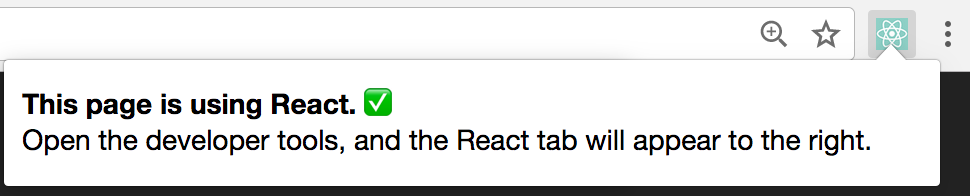
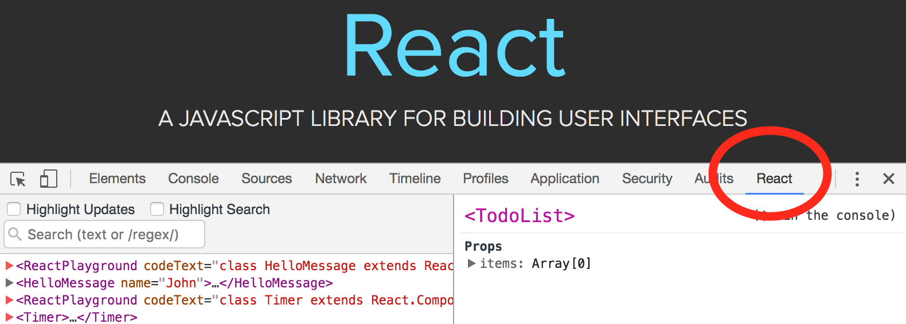

<hr/>
To encourage us and if you like the project then click star(💫) and also any PR contributions are appreciated
<hr/>

Below is a list of ReactJS interview questions and answers.
-------------------------------------------------------------------
| No. | Questions |
|---- | ---------
|1  | [What is ReactJS?](#what-is-reactjs) |
|2  | [What are the major features of ReactJS?](#what-are-the-major-features-of-reactjs)|
|3  | [What is JSX?](#what-is-jsx)|
|4  | [What is the difference between element and component?](#what-is-the-difference-between-element-and-component)|
|5  | [How to create components in ReactJS?](#how-to-create-components-in-reactjs)|
|6  | [When to use a Class Component over a Functional Component?](#when-to-use-a-class-component-over-a-functional-component)|
|7  | [What are Pure Components?](#what-are-pure-components)|
|8  | [What is state in ReactJS?](#what-is-state-in-reactjs)|
|9  | [What is props in ReactJS?](#what-is-props-in-reactjs)|
|10 | [What is the difference between state and props?](#what-is-the-difference-between-state-and-props)|
|11 | [Why we should not update the state directly?](#why-we-should-not-update-the-state-directly)|
|12 | [What is the purpose of callback function as an argument of setState?](#what-is-the-purpose-of-callback-function-as-an-argument-of-setstate)
|13 | [What is the difference between HTML and React event handling?](#what-is-the-difference-between-html-and-react-event-handling)|
|14 | [How to bind methods/event handlers in JSX callbacks?](#how-to-bind-methods/event-handlers-in-jsx-callbacks)|
|15 | [How to pass a parameter to an event handler or callback?](#how-to-pass-a-parameter-to-an-event-handler-or-callback)|
|16 | [What are synthetic events in ReactJS?](#what-are-synthetic-events-in-reactjs)|
|17 | [What is inline conditional expressions?](#what-is-inline-conditional-expressions)|
|18 | [What is key and benefit of using it in lists?](#what-is-key-and-benefit-of-using-it-in-lists)|
|19 | [What is the use of refs?](#what-is-the-use-of-refs)|
|20 | [What is virtual DOM?](#what-is-virtual-DOM)|
|21 | [What is the difference between ShadowDOM and VirtualDOM?](#what-is-the-difference-between-shadowdom-and-virtualdom)|
|22 | [What is React Fiber?](#what-is-react-fiber)|
|23 | [What are controlled components?](#what-are-controlled-components)|
|24 | [What is the difference between createElement and cloneElement?](#what-is-the-difference-between-createelement-and-cloneelement)|
|25 | [What is Lifting State Up in ReactJS?](#what-is-lifting-state-up-in-reactjs)|
|26 | [What are the different phases of ReactJS component’s lifecycle?](#what-are-the-different-phases-of-reactjs-component’s-lifecycle)|
|27 | [What are the lifecycle methods of ReactJS?](#what-are-the-lifecycle-methods-of-reactjs)|
|28 | [What are Higher-Order components?](#what-are-higher-order-components)|
|29 | [What is context?](#what-is-context)|
|30 | [What is children prop?](#what-is-children-prop)|
|31 | [How to write comments in ReactJS?](#how-to-write-comments-in-reactjs)|
|32 | [What is the purpose of using super(props)?](#what-is-the-purpose-of-using-super(props))|
|33 | [What is reconciliation?](#what-is-reconciliation)|
|34 | [How to pass a parameter to an event handler or callback?](#how-to-pass-a-parameter-to-an-event-handler-or-callback)|
|35 | [What would be the common mistake of function being called every time the component renders?](#what-would-be-the-common-mistake-of-function-being-called-every-time-the-component-renders)|
|36 | [Why is it necessary to capitalize the components?](#why-is-it-necessary-to-capitalize-the-components)|
|37 | [Why ReactJS uses className over class?](#why-reactjs-uses-classname-over-class)|
|38 | [What are fragments?](#what-are-fragments)|
|39 | [What are portals in ReactJS?](#what-are-portals-in-reactjs)|
|40 | [What are forward refs?](#what-are-forward-refs)|
|41 | [What are stateless components?](#what-are-stateless-components)|
|42 | [What are stateful components?](#what-are-stateful-components)|
|43 | [How to apply validation on Props in ReactJS?](#how-to-apply-validation-on-props-in-reactjs)|
|44 | [What are the advantages of ReactJS?](#what-are-the-advantages-of-reactjs)|
|45 | [What are the limitations of ReactJS?](#what-are-the-limitations-of-reactjs)|
|46 | [What are error boundaries in ReactJS16](#what-are-error-boundaries-in-reactjs16)|
|47 | [How error boundaries handled in React15?](#how-error-boundaries-handled-in-react15)|
|48 | [What are the recommended ways for static type checking?](#what-are-the-recommended-ways-for-static-type-checking)|
|49 | [What is the use react-dom package?](#what-is-the-use-react-dom-package)|
|50 | [What is the purpose of render() method of react-dom?](#what-is-the-purpose-of-render()-method-of-react-dom)|
|51 | [What is ReactDOMServer?](#what-is-reactdomserver)|
|52 | [How to use InnerHtml in ReactJS?](#how-to-use-innerhtml-in-reactjs)|
|53 | [How to use styles in ReactJS?](#how-to-use-styles-in-reactjs)|
|54 | [What is Shallow Renderer in ReactJS testing?](#what-is-shallow-renderer-in-reactjs-testing)|
|55 | [What is TestRenderer package in ReactJS?](#what-is-testrenderer-package-in-reactjs)|
|56 | [How events are different in ReactJS?](#how-events-are-different-in-reactjs)|
|57 | [What will happen if you use setState in constructor?](#what-will-happen-if-you-use-setstate-in-constructor)|
|58 | [What is the impact of indexes as keys?](#what-is-the-impact-of-indexes-as-keys)|
|59 | [Is it good to use setState() in componentWillMount()?](#is-it-good-to-use-setstate()-in-componentwillmount())|
|60 | [What will happen if you use Props in Initial State?](#what-will-happen-if-you-use-props-in-initial-state)|
|61 | [How do you conditionally render components?](#how-do-you-conditionally-render-components)
|62 | [Why we need to be careful when spreading props on DOM elements??](#why-we-need-to-be-careful-when-spreading-props-on-dom-elements)|
|63 | [How you use decorators in ReactJS?](#how-you-use-decorators-in-reactjs)|
|64 | [How do you memoize react components?](#how-do-you-memoize-react-components)|
|65 | [How you implement Server-Side Rendering(SSR)?](#how-you-implement-server-side-rendering(ssr))|
|66 | [How to enable production mode in React?](#how-to-enable-production-mode-in-react)|
|67 | [What are the two ways of formatting in React-Intl?](#what-are-the-two-ways-of-formatting-in-react-intl)|
|68 | [What is CRA and benefits of it?](#what-is-cra-and-benefits-of-it)|
|69 | [What is the lifecycle methods order in mounting?](#what-is-the-lifecycle-methods-order-in-mounting)|
|70 | [What are the lifecycle methods going to be deprecated in React16?](#what-are-the-lifecycle-methods-going-to-be-deprecated-in-react16)|
|71 | [What is the use of getDerivedStateFromProps lifecycle method?](#what-is-the-use-of-getderivedstatefromprops-lifecycle-method)|
|72 | [What is the use of getSnapshotBeforeUpdate lifecycle method?](#what-is-the-use-of-getsnapshotbeforeupdate-lifecycle-method)|
|73 | [What is the difference between createElement and cloneElement?](#what-is-the-difference-between-createelement-and-cloneelement)|
|74 | [What is the recommended way for naming components?](#what-is-the-recommended-way-for-naming-components)|
|75 | [What is the recommended ordering of ReactJS component class?](#what-is-the-recommended-ordering-of-reactjs-component-class)|
|76 | [Which is preferred option with in callback refs and findDOMNode()?](#which-is-preferred-option-with-in-callback-refs-and-finddomnode())|
|77 | [Why String Refs are legacy?](#why-string-refs-are-legacy)|
|78 | [What is a switching component?](#what-is-a-switching-component)|
|79 | [Why we need to pass a function to setState?](#why-we-need-to-pass-a-function-to-setstate)|
|80 | [What is strict mode in React?](#what-is-strict-mode-in-react)|
|81 | [What is uncontrolled component?](#what-is-uncontrolled-component)|
|82 | [What are React Mixins?](#what-are-react-mixins)|
|83 | [Why isMounted is an Anti-pattern and what is the proper solution?](#why-ismounted-is-an-anti-pattern-and-what-is-the-proper-solution)|
|84 | [What are the pointer events supported in ReactJS?](#what-are-the-pointer-events-supported-in-reactjs)|
|85 | [Why component names should start with capital letter?](#why-component-names-should-start-with-capital-letter)|
|86 | [Is it custom DOM attributes supported in React16?](#is-it-custom-dom-attributes-supported-in-react16)|
|87 | [What is the difference between constructor and getInitialState?](#what-is-the-difference-between-constructor-and-getinitialstate)|
|88 | [Can you force a React component to re-render without calling setState?](#can-you-force-a-react-component-to-re-render-without-calling-setstate)|
|89 | [What is the difference between React Native and React?](#what-is-the-difference-between-react-native-and-react)|
|90 | [What is the difference between “super()” and “super(props)” in React using es6 classes?](#what-is-the-difference-between-“super()”-and-“super(props)”-in-react-using-es6-classes)|
|91 | [What is the difference between mapStateToProps and mapDispatchToProps?](#what-is-the-difference-between-mapstatetoprops-and-mapdispatchtoprops)|
|92 | [Can I dispatch an action in reducer?](#can-i-dispatch-an-action-in-reducer)|
|93 | [How to access redux store outside a react component?](#how-to-access-redux-store-outside-a-react-component)|
|94 | [What are the drawbacks of MVW pattern](#what-are-the-drawbacks-of-mvw-pattern)|
|95 | [What is flux?](#what-is-flux)|
|96 | [What is redux?](#what-is-redux)|
|97 | [What are the core principles of Redux?](#what-are-the-core-principles-of-redux)|
|98 | [What is reselect?How it works?](#what-is-reselect?how-it-works)|
|99 | [What are Redux selectors?Why use them?](#what-are-redux-selectors?why-use-them)|
|100| [What is React Router?](#what-is-react-router)|
|101| [How React router is different from history library?](#how-react-router-is-different-from-history-library?)|
|102| [What are the components of React Router4?](#what-are-the-components-of-react-router4)|
|103| [What is the purpose of push and replace methods of history?](#what-is-the-purpose-of-push-and-replace-methods-of-history)|
|104| [How do you programmatically navigate using React router4?](#how-do-you-programmatically-navigate-using-react-router4)|
|105| [How to get query parameters in react-router4](#how-to-get-query-parameters-in-react-router4)|
|106| [Why you get "Router may have only one child element" warning?](#why-you-get-router-may-have-only-one-child-element-warning)|
|107| [How to pass params with history push method in v4?](#how-to-pass-params-with-history-push-method-in-v4)|
|108| [How to implement default page(not found page)?](#how-to-implement-default-page(not-found-page))|
|109| [How to get history on react-router v4?](#how-to-get-history-on-react-router-v4)|
|110| [How to perform automatic redirect after login?](#how-to-perform-automatic-redirect-after-login)|
|111| [How to loop inside JSX?](#how-to-loop-inside-jsx)|
|112| [How do you access props in attribute quotes?](#how-do-you-access-props-in-attribute-quotes)|
|113| [What is React proptype array with shape?](#what-is-react-proptype-array-with-shape?)|
|114| [How conditionally apply class attributes?](#how-conditionally-apply-class-attributes)|
|115| [What is the difference between React and ReactDOM?](#what-is-the-difference-between-react-and-reactdom)|
|116| [Why ReactDOM is separated from React?](#why-reactdom-is-separated-from-react)|
|117| [How to use React label element?](#how-to-use-react-label-element?)|
|118| [How to combine multiple inline style objects?](#how-to-combine-multiple-inline-style-objects)|
|119| [What is the difference between setState and replaceState methods?](#what-is-the-difference-between-setstate-and-replacestate-methods)|
|120| [How to listen state changes?](#how-to-listen-state-changes)|
|121| [What is the recommended approach of removing an array element in react state?](#what-is-the-recommended-approach-of-removing-an-array-element-in-react-state)|
|122| [Why fragments are better than container divs?](#why-fragments-are-better-than-container-divs)|
|123| [What is flow?](#what-is-flow)|
|124| [What is the difference between Flow and PropTypes?](#what-is-the-difference-between-flow-and-proptypes)|
|125| [Is it possible to use react without rendering html?](#is-it-possible-to-use-react-without-rendering-html)|
|126| [How to use font-awesome icons in reactjs?](#how-to-use-font-awesome-icons-in-reactjs)|
|127| [Why dev tools is not loading in Chrome browser for local files?](#why-dev-tools-is-not-loading-in-chrome-browser-for-local-files)|
|128| [How to do pretty printing JSON with React?](#how-to-do-pretty-printing-json-with-react)|
|129| [Why can not you update props in react?](#why-can-not-you-update-props-in-react)|
|130| [How to use Polymer in ReactJS?](#how-to-use-polymer-in-reactjs)|
|131| [Can Redux only be used with React?](#can-redux-only-be-used-with-react)|
|132| [Do you need to have a particular build tool to use Redux?](#do-you-need-to-have-a-particular-build-tool-to-use-redux)|
|133| [How to use FormattedMessage for placeholder purpose using ReactIntl?](#how-to-use-formattedmessage-for-placeholder-purpose-using-reactintl)|
|134| [How to access current locale with react-intl](#how-to-access-current-locale-with-react-intl)|
|135| [How to format date using react Intl?](#How-to-format-date-using-react-intl?)|
|136| [What are the downsides of Redux over Flux?](#what-are-the-downsides-of-redux-over-flux)|
|137| [Are there any similarities between Redux and RxJS?](#are-there-any-similarities-between-redux-and-rxjs)|
|138| [How to dispatch an action on load?](#how-to-dispatch-an-action-on-load)|
|139| [How to use connect from react Redux?](#how-to-use-connect-from-react-redux)|
|140| [How to reset state in redux?](#how-to-reset-state-in-redux?)|
|141| [Whats the purpose of @ symbol in the redux connect decorator?](#whats-the-purpose-of-@-symbol-in-the-redux-connect-decorator)|
|142| [What is the difference between React context and React redux?](#what-is-the-difference-between-react-context-and-react-redux)|
|143| [Why are Redux's state functions called as reducers?](#why-are-redux's-state-functions-called-as-reducers)|
|144| [How to make ajax request in redux?](#how-to-make-ajax-request-in-redux)|
|145| [Is it all component states to keep in redux store?](#is-it-all-component-states-to-keep-in-redux-store?)|
|146| [What is the proper way to access redux store?](#what-is-the-proper-way-to-access-redux-store?)|
|147| [What is the difference between component and container in react redux?](#what-is-the-difference-between-component-and-container-in-react-redux?)|
|148| [What is the purpose of the constants in redux? ](#what-is-the-purpose-of-the-constants-in-redux)|
|149| [What are the different ways to write mapDispatchToProps?](#what-are-the-different-ways-to-write-mapDispatchToProps)|
|150| [What is the use of the ownprops arg in mapStateToProps and mapDispatchToProps?](#what-is-the-use-of-the-ownprops-arg-in-mapstatetoprops-and-mapdispatchtoprops)|
|151| [How to structure redux top level directories?](#how-to-structure-redux-top-level-directories)|
|152| [What is redux saga?](#what-is-redux-saga?)|
|153| [What is the mental model of redux saga?](#what-is-the-mental-model-of-redux-saga)|
|154| [What are the differences between call and put in redux-saga](#what-are-the-differences-between-call-and-put-in-redux-saga)|
|155| [What is Redux thunk?](#what-is-redux-thunk)|
|156| [What are the differences between redux-saga and redux thunk](#what-are-the-differences-between-redux-saga-and-redux-thunk)|
|157| [What is React Dev Tools?](#what-is-react-dev-tools)|
|158| [Why React tab is not showing up for dev tools?](#why-react-tab-is-not-showing-up-for-dev-tools)|
|159| [What is Redux DevTools?](#what-is-redux-devtools)|
|160| [What are the features of Redux DevTools?](#what-are-the-features-of-redux-devtools)|
|161| [How to focus an input element on page load?](#how-to-focus-an-input-element-on-page-load)|
|162| [What are the possible ways to update object in state?](#what-are-the-possible-ways-to-update-object-in-state)|
|163| [Why function is preferred over object for setState?](#why-function-is-preferred-over-object-for-setstate)|
|164| [How can we find the version of React at runtime in the browser?](#how-can-we-find-the-version-of-react-at-runtime-in-the-browser)|
|165| [What is redux form?](#what-is-redux-form)|
|166| [What are the main features of redux form?](#what-are-the-main-features-of-redux-form)|
|167| [How to use TypeScript for create-react-app applications?](#how-to-use-typescript-for-create-react-app-applications)|
|168| [What are the approaches to include pollyfills in your create-react-app?](#what-are-the-approaches-to-include-pollyfills-in-your-create-react-app)|
|169| [How to use https instead of http in create-react-app?](#how-to-use-https-instead-of-http-in-create-react-app)|
|170| [How to avoid using relative path imports in create-react-app?](#how-to-avoid-using-relative-path-imports-in-create-react-app)|
|171| [How to add google analytics for react-router?](#how-to-add-google-analytics-for-react-router)|
|171| [How to update react component for every second?](#how-to-update-react-component-for-every-second)|
|172| [How do you apply vendor prefixes to inline styles in reactjs?](#how-do-you-apply-vendor-prefixes-to-inline-styles-in-reactjs)|

### What is ReactJS?

ReactJS is an **open-source frontend JavaScript library** which is used for building user interfaces specifically for single page applications. It is used for handling view layer for web and mobile apps. React was created by Jordan Walke, a software engineer working for Facebook. ReactJS was first deployed on Facebook’s newsfeed in 2011 and on Instagram.com in 2012.

### What are the major features of ReactJS

The major features of ReactJS are as follows,

- It uses **VirtualDOM** instead RealDOM considering that RealDom manipulations are expensive.
- Supports **server-side rendering**
- Follows **Unidirectional** data flow or data binding
- Uses **reusable/composable** UI components to develop the view

### What is JSX?

JSX is a syntax notation for **JavaScript XML**(XML-like syntax extension to ECMAScript). It stands for JavaScript XML. It provides expressiveness of JavaScript along with HTML like template syntax. For example, the below text inside h1 tag return as javascript function to the render function,

```
   render(){
    	return(
         <div>
            <h1> Welcome to React world!!</h1>
         </div>
    	);
     }
```
### What is the difference between element and component?
An **element** is a plain object describing what you want to appear on the screen in terms of the DOM nodes or other components. Elements can contain other elements in their props. Creating a React element is cheap. Once an element is created, it is never mutated.
The object representation of React element would be as follows,
```
const element = React.createElement(
  'div',
  {id: 'login-btn'},
  'Login'
)
```
The above createElement returns as object as below,
```
{
  type: 'div',
  props: {
    children: 'Login',
    id: 'login-btn'
  }
}
```
And finally it renders to the DOM using ReactDOM.render as below,
```
<div id='login-btn'>Login</div>
```
Whereas a **component** can be declared in several different ways. It can be a class with a render() method. Alternatively, in simple cases, it can be defined as a function. In either case, it takes props as an input, and returns an element tree as the output. JSX transpiled as createElement at the end.
```
function Button ({ onLogin }) {
  return React.createElement(
    'div',
    {id: 'login-btn', onClick: onLogin},
    'Login'
  )
}
```

### How to create components in ReactJS?

There are two possible ways to create ReactJS Components.

1. **Functional components:** This is the simplest way to create ReactJS components. It accepts props as an Object and returns ReactJS elements. We call it as “functional” because those are pure JavaScript functions.
```
	function Greeting(props) {
   	   return <h1> Hello, {props.message}</h1>

	}
```

2. **Class components:** You can also use Es6 class to define component. The above functional component can be written as below,
```
      class Greeting extends React.Component {
  	    render() {
    		    return <h1>Hello, {this.props.message}</h1>;
  	        }
	    }
```

### When to use a Class Component over a Functional Component?

If the component need state or lifecycle methods then use class component otherwise use functional component.

### What are Pure Components?
**PureComponent** is exactly the same as Component except that it handles the shouldComponentUpdate method for you. When props or state changes, PureComponent will do a shallow comparison on both props and state. Component on the other hand won’t compare current props and state to next out of the box. Thus, the component will re-render by default whenever shouldComponentUpdate is called.

### What is state in ReactJS?
 State of a component is an object that holds some information that may change over the lifetime of the component. We should always try to make our state as simple as possible and minimize the number of stateful components.

 Let's create user component with message state,

 ```
 class User extends React.Component {
    constructor(props) {
       super(props);

       this.state = {
          message: "Welcome to React world",
       }
    }
    render() {
       return (
          <div>
             <h1>{this.state.message}</h1>
          </div>
       );
    }
 }
 ```
 

### What is props in ReactJS?

Props are inputs to a React component. They are single values or objects containing a set of values that are passed to React Components on creation using a naming convention similar to HTML-tag attributes. i.e, They are data passed down from a parent component to a child component.

The primary purpose of props in React is to provide following component functionality:

1. Pass custom data to your React component.
2. Trigger "state" changes.
3. Use via this.props.reactProp inside component's render() method.

For example, let us create an element with reactProp property,
```
 <Element reactProp = "1" />
```

This "reactProp" (or whatever you came up with) name then becomes a property attached to React's native props object which originally already exists on all components created using React library.

```
 props.reactProp;
```

### What is the difference between state and props?
Both props and state are plain JavaScript objects. While both of them hold information that influences the output of render, they are different in their functionality with respect to component. i.e, Props get passed to the component similar to function parameters whereas state is managed within the component similar to variables declared within a function.

### Why we should not update the state directly?

If you try to update state directly then it won’t re-render the component.

```
    //Wrong
    This.state.message =”Hello world”;
```

Instead use setState() method. It schedules an update to a component’s state object. When state changes, the component responds by re-rendering

```
    //Correct
    This.setState({message: ‘Hello World’});
```

**Note:** The only place you can assign the state is constructor.


### What is the purpose of callback function as an argument of setState?
The callback function is invoked when setState finished and the component gets rendered. Since setState is **asynchronous** the callback function is used for any post action.
**Note:** It is recommended to use lifecycle method rather this callback function.
```
setState({name: 'sudheer'}, () => console.log('The name has updated and component re-rendered'));
```
### What is the difference between HTML and React event handling?

1. In HTML, the event name should be in lowercase.
```
            <button onclick="activateLasers()">
```

Whereas in ReactJS it follows camelCase convention,

```
            <button onClick={activateLasers}>
```

2. In HTML, you can return false to prevent default behavior,

```
        <a href="#" onclick="console.log('The link was clicked.'); return false"/>
```

3. Whereas in ReactJS you must call preventDefault explicitly,

```
            function handleClick(e) {
    	        e.preventDefault();
    	        console.log('The link was clicked.');
  	        }
```

### How to bind methods/event handlers in JSX callbacks?
**(Or)**
### How to use this in JSX callbacks?

There are 3 possible ways to achieve,

1.	**Binding in Constructor:** In JavaScript classes, the methods are not bound by default. The same thing applies for ReactJS event handlers defined as class methods. Normally we bind them in constructor as follows,
```
            constructor(props) {
                super(props);
                this.handleClick = this.handleClick.bind(this);
             }

            handleClick() {
                // Perform some logic
            }
```

2. **Public class fields syntax:** If you don’t like to use bind approach then public class fields syntax can be used to correctly bind callbacks
```
            handleClick = () => {
                console.log('this is:', this);
            }
            <button onClick={this.handleClick}>
               Click me
            </button>
```

3. **Arrow functions in callbacks:** You can use arrow functions directly in the callbacks as below
```
            <button onClick={(e) => this.handleClick(e)}>
                Click me
            </button>
```

**Note:** If the callback is passed as prop to lower components, those components might do an extra re-rendering.  In those cases, it is preferred to go with bind or public class fields syntax approach considering performance

### What are synthetic events in ReactJS?
SyntheticEvent is a cross-browser wrapper around the browser's native event. It's API is same as the browser's native event, including stopPropagation() and preventDefault(), except the events work identically across all browsers.

### What is inline conditional expressions?

You can use either if statements or ternary expressions which are available from JS to conditionally render expressions. Apart from these approaches, you can also embed any expressions in JSX by wrapping them in curly braces and then followed by JS logical operator(&&).
```
    <h1>Hello!</h1>
      {messages.length > 0 &&
    <h2>
          You have {messages.length} unread messages.
    </h2>
```
### What is key and benefit of using it in lists?

 A **“key”** is a special string attribute you need to include when creating lists of elements. Keys help React identify which items have changed, are added, or are removed.

   For example, most often we use IDs from your data as keys

```
    const todoItems = todos.map((todo) =>
        <li key={todo.id}>
        {todo.text}
        </li>
     );
```
 When you don’t have stable IDs for rendered items, you may use the item index as a key as a last resort:

```
    const todoItems = todos.map((todo, index) =>
        <li key={index}>
            {todo.text}
        </li>
        );
```

**Note:**

1. We don’t recommend using indexes for keys if the order of items may change. This can negatively impact performance and may cause issues with component state
2. If you extract list item as separate component then apply keys on list component instead li tag.

### What is the use of refs?
The ref is used to return a reference to the element. They should be avoided in most cases, however, they can be useful when we need direct access to DOM element or an instance of a component.

### How to create refs?
Refs are created using React.createRef() method and attached to React elements via the ref attribute. In order to use refs throughout the component, just assign the ref to the instance property with in constructor.
```
class MyComponent extends React.Component {
  constructor(props) {
    super(props);
    this.myRef = React.createRef();
  }
  render() {
    return <div ref={this.myRef} />;
  }
}
```
```
class UserForm extends Component {
  handleSubmit = () => {
    console.log("Input Value is: ", this.input.value)
  }
  render () {
    return (
      <form onSubmit={this.handleSubmit}>
        <input
          type='text'
          ref={(input) => this.input = input} /> // Access DOM input in handle submit
        <button type='submit'>Submit</button>
      </form>
    )
  }
}
```
We can also use it in functional components with the help of closures.

### What is virtual DOM?
The virtual DOM (VDOM) is an in-memory representation of Real DOM. The representation of a UI is kept in memory and synced with the “real” DOM. It’s a step that happens between the render function being called and the displaying of elements on the screen. This entire process is called reconciliation.

### What is the difference between ShadowDOM and VirtualDOM?
The Shadow DOM is a browser technology designed primarily for scoping variables and CSS in web components. The virtual DOM is a concept implemented by libraries in JavaScript on top of browser APIs.

### What is React Fiber?
Fiber is the new reconciliation engine or reimplementation core algorithm in React 16. Its main goal is to enable incremental rendering of the virtual DOM.The goal of React Fiber is to increase its suitability for areas like animation, layout, gestures, ability to pause, abort, or reuse work and  assign priority to different types of updates; and new concurrency primitives.

### What are controlled components?

A ReactJS component that controls the input elements within the forms on subsequent user input is called **“Controlled component”**. i.e, every state mutation will have an associated handler function.

  For example, to write all the names in uppercase letters, we use handleChange as below,

```
            handleChange(event) {
                this.setState({value: event.target.value.toUpperCase()});
            }
```
### What is the difference between createElement and cloneElement?
JSX elements will be transpiled to createElement JS syntax to create React elements which are going to be used for the object representation of UI. Whereas cloneElement is used to clone an element and pass it to new props.
### What are the different phases of ReactJS lifecycle?

There are four different phases of React component’s lifecycle:
1. **Initialization:** In this phase react component prepares setting up the initial state and default props.
2. **Mounting:** The react component is ready to mount in the browser DOM. This phase covers **componentWillMount** and **componentDidMount** lifecycle methods.
3. **Updating:** In this phase, the component get updated in two ways, sending the new props and updating the state. This phase covers **shouldComponentUpdate, componentWillUpdate and componentDidUpdate** lifecycle methods.
4. **Unmounting:** In this last phase, the component is not needed and get unmounted from the browser DOM. This phase include **componentWillUnmount** lifecycle method.


### What are the lifecycle methods of ReactJS?

-	**componentWillMount:** Executed before rendering and is used for App level configuration in your root component.
-	**componentDidMount:** Executed after first rendering and here all AJAX requests, DOM or state updates, and set up eventListeners should occur.
-	**componentWillReceiveProps:** Executed when particular prop updates to trigger state transitions.
-	**shouldComponentUpdate:** Determines if the component will be updated or not. By default it returns true. If you are sure that the component doesn't need to render after state or props are updated, you can return false value. It is a great place to improve performance as it allows you to prevent a rerender if component receives new prop.
-	**componentWillUpdate:** Executed before re-rendering the component when there are pros & state changes confirmed by shouldComponentUpdate  which returns true.
-	**componentDidUpdate:** Mostly it is used to update the DOM in response to prop or state changes.
-   **componentWillUnmount:** It will be used to cancel any outgoing network requests, or remove all event listeners associated with the component.

### What is Lifting State Up in ReactJS?

When several components need to share the same changing data then it is recommended to lifting the shared state up to their closest common ancestor. For example, if two child components sharing the same data from its parent then move the state to parent instead of maintaining the local state inn both child components.

### What are Higher-Order components?

A higher-order component **(HOC)** is a function that takes a component and returns a new component. Basically, it’s a pattern that is derived from React’s compositional nature
We call them as **“pure’ components”**  because they can accept any dynamically provided child component but they won’t modify or copy any behavior from their input components.
```
const EnhancedComponent = higherOrderComponent(WrappedComponent);

```
HOC can be used for many use cases as below,

1. Code reuse, logic and bootstrap abstraction
2. Render High jacking
3. State abstraction and manipulation
4. Props manipulation
### How to make AJAX class? In which component lifecycle should I make an AJAX call?

You can use AJAX libraries such as  Axios, jQuery AJAX, and the browser built-in window.fetch. You should populate data with AJAX calls in the componentDidMount lifecycle method. This is so you can use setState to update your component when the data is retrieved.
For example, the employees list fetched from API and set local state as below,
```
class MyComponent extends React.Component {
  constructor(props) {
    super(props);
    this.state = {
      employees: [],
      error: null,

    };
  }

  componentDidMount() {
      fetch("https://api.example.com/items")
        .then(res => res.json())
        .then(
          (result) => {
            this.setState({
              employees: result.employees
            });
          },
          (error) => {
            this.setState({
              error
            });
          }
        )
    }

    render() {
        const { error, employees } = this.state;
        if (error) {
          return <div>Error: {error.message}</div>;
        } else {
          return (
            <ul>
              {employees.map(item => (
                <li key={employee.name}>
                  {employee.name}-{employees.experience}
                </li>
              ))}
            </ul>
          );
        }
      }

    }
```

### What is context?
Context provides a way to pass data through the component tree without having to pass props down manually at every level. For example, authenticated user, locale preference, UI theme need to be accessed in the application by many components.
```
const {Provider, Consumer} = React.createContext(defaultValue);

```

### What is children prop?

Children is a prop(this.prop.children) that allow you to pass components as data to other components, just like any other prop you use.
There are a number of methods available in the React API to work with this prop. These include React.Children.map, React.Children.forEach, React.Children.count, React.Children.only, React.Children.toArray.

A simple usage of children prop looks as below,
```
var MyDiv = React.createClass({
  render: function() {
    return <div>{this.props.children}</div>;
  }
});

ReactDOM.render(
  <MyDiv>
    <span>Hello</span>
    <span>World</span>
  </MyDiv>,
  node
);
```
### What is the purpose of using super(props)?

A child class constructor cannot make use of **this** reference until super() method has been called. The same applies for ES6 sub-classes as well. The main reason of passing props parameter to super() call is to access this.props in your child constructors.

**Passing props:**
```
class MyComponent extends React.Component {
    constructor(props) {
        super(props);

        console.log(this.props);  // Prints { name: 'sudheer',age: 30 }
    }
}
```
**Not passing props:**
```
class MyComponent extends React.Component {
    constructor(props) {
        super();

        console.log(this.props); // Prints undefined

        // But Props parameter is still available
        console.log(props); // Prints { name: 'sudheer',age: 30 }
    }

    render() {
        // No difference outside constructor
        console.log(this.props) // Prints { name: 'sudheer',age: 30 }
    }
}
```

The above code snippets reveals that this.props behavior is different only with in the constructor. It would be same outside the constructor.

### How to write comments in ReactJS?

The comments in ReactJS/JSX is similar to javascript multiline comments which are wrapped with curly braces

**Single-line comments:**
```
<div>
  {/* Single-line comments */}
  Welcome {user}, Let's play React
</div>
```

**Multi-line comments:**
```
<div>
  {/* Multi-line comments for more than
   one line */}
  Welcome {user}, Let's play React
</div>
```

### What is reconciliation?

When a component’s props or state change, React decides whether an actual DOM update is necessary by comparing the newly returned element with the previously rendered one. When they are not equal, React will update the DOM. This process is called “reconciliation”.

### How to pass a parameter to an event handler or callback?

You can use an arrow function to wrap around an event handler and pass parameters:

```
<button onClick={() => this.handleClick(id)} />
```
This is equivalent to calling .bind as below,
```
<button onClick={this.handleClick.bind(this, id)} />
```

### What would be the common mistake of function being called every time the component renders?

You need to make sure that function is not being called while passing the function as a parameter.
```
render() {
  // Wrong way: handleClick is called instead of passed as a reference!
  return <button onClick={this.handleClick()}>Click Me</button>
}
```

Instead, pass the function itself without parenthesis:

```
render() {
  // Correct way: handleClick is passed as a reference!
  return <button onClick={this.handleClick}>Click Me</button>
}
```

### Why is it necessary to capitalize the components?
It is necessary because components are not the DOM element but they are constructors. If they are not capitalized, they can cause various issues and can confuse developers with several elements.

### Why ReactJS uses className over class?
class is a keyword in javascript and JSX is an extension of javascript. That's the principal reason why React uses className instead of class. Pass a string as the className prop.

```
render() {
  return <span className="menu navigation-menu">Menu</span>
}
```

### What are fragments?

It's common pattern in React which is used for a component to return multiple elements. Fragments let you group a list of children without adding extra nodes to the DOM.

```
render() {
  return (
    <React.Fragment>
      <ChildA />
      <ChildB />
      <ChildC />
    </React.Fragment>
  );
}
```

There is also a shorter syntax which is not supported in many tools

```
render() {
    return (
      <>
         <ChildA />
         <ChildB />
         <ChildC />
      </>
    );
  }
```

### What are portals in ReactJS?

Portal is a recommended way to render children into a DOM node that exists outside the DOM hierarchy of the parent component.

```
ReactDOM.createPortal(child, container);
```

The first argument (child) is any renderable React child, such as an element, string, or fragment. The second argument (container) is a DOM element.

### What are forward refs?

Ref forwarding is a feature that lets some components take a ref they receive, and pass it further down to a child.

```
const ButtonElement = React.forwardRef((props, ref) => (
  <button ref={ref} className="CustomButton">
    {props.children}
  </button>
));

// Create ref to the DOM button:
const ref = React.createRef();
<ButtonElement ref={ref}>Forward Ref</ButtonElement>;
```

### What are stateless components?
If the behaviour is independent of its state then it can be a stateless component.You can use either a function or a class for creating stateless components. But unless you need to use a lifecycle hook in your components, you should go for stateless functional components. There are a lot of benefits if you decide to use stateless functional components here; they are easy to write, understand, and test, and you can avoid the this keyword altogether.
### What are stateful components?
If the behaviour of a component is dependent on the state of the component then it can be termed as stateful component.These Stateful components are always class components and have a state that gets initialized in the constructor.
```
class App extends Component {
 constructor(props) {
  super(props);
  this.state = { count: 0 };
 }

  render() {
     // omitted for brevity
   }

 }
```

### How to apply validation on Props in ReactJS?
When the application is running in development mode, React will automatically check  for all props that we set on components to make sure they must right correct and right data type. For incorrect type, it will generate warning messages in the console for development mode whereas it is disabled in production mode due performance impact. The mandatory prop is defined with isRequired.

The set of predefined prop types are below

1. React.PropTypes.string
2. React.PropTypes.number
3. React.PropTypes.func
4. React.PropTypes.node
5. React.PropTypes.bool

For example, we define propTypes for user component as below,
```
import PropTypes from 'prop-types';

class User extends React.Component {
  render() {
    return (
      <h1>Welcome, {this.props.name}</h1>
      <h2>Age, {this.props.age}
    );
  }
}

User.propTypes = {
  name: PropTypes.string.isRequired,
  age: PropTypes.number.isRequired

};
```

### What are the advantages of ReactJS?
1. Increases the application’s performance with Virtual DOM
2. JSX makes code is easy to read and write
3. It renders both on client and server side
4. Easy to integrate with other frameworks(Angular, BackboneJS) since it is only a view library
5. Easy to write UI Test cases and integration with tools such as JEST.

### What are the limitations of ReactJS?
Below are the list of limitations,

1. React is just a view library, not a full-blown framework
2. There is a learning curve for beginners who are new to web development.
3. Integrating React.js into a traditional MVC framework requires some additional configuration
4. The code complexity increases with inline templating and JSX.
5. Too many smaller components leading to over engineering or boilerplate


### What are error boundaries in ReactJS16?
Error boundaries are React components that catch JavaScript errors anywhere in their child component tree, log those errors, and display a fallback UI instead of the component tree that crashed.

A class component becomes an error boundary if it defines a new lifecycle method called componentDidCatch(error, info)
```
class ErrorBoundary extends React.Component {
  constructor(props) {
    super(props);
    this.state = { hasError: false };
  }

  componentDidCatch(error, info) {
    // Display fallback UI
    this.setState({ hasError: true });
    // You can also log the error to an error reporting service
    logErrorToMyService(error, info);
  }

  render() {
    if (this.state.hasError) {
      // You can render any custom fallback UI
      return <h1>Something went wrong.</h1>;
    }
    return this.props.children;
  }
}
```

After that use it as a regular component

```
<ErrorBoundary>
  <MyWidget />
</ErrorBoundary>
```

### How error boundaries handled in React15?
React15 provided very basic support for error boundaries using the method name "unstable_handleError". Later this has been renamed as "componentDidCatch" starting from React16 beta release.

### What are the recommended ways for static type checking?
Normally we use PropTypes library(React.PropTypes moved to a different package since React15.5) for TypeChecking in the ReactJS applications. For large code bases, it is recommended to use static type checkers such as Flow or TypeScript to find out problems before run the code and provides auto-completion feature.

### What are render props?
**Render Props** is a simple technique for sharing code between React components using a prop whose value is a function. The below component uses render prop which returns a React element
```
<DataProvider render={data => (
  <h1>Hello {data.target}</h1>
)}/>
```

The libraries such as React Router and DownShift uses this render props

### What is the use react-dom package?
The react-dom package provides DOM-specific methods that can be used at the top level of your app. Most of the components are not required to use this module. Some of the methods of this package are,
1. render()
2. hydrate()
3. unmountComponentAtNode()
4. findDOMNode()
5. createPortal()

### What is the purpose of render() method of react-dom?
This method is used to render a React element into the DOM in the supplied container and return a reference to the component. If the React element was previously rendered into container, this will perform an update on it and only mutate the DOM as necessary to reflect the latest React element.
The syntax would be as follows
```
ReactDOM.render(element, container[, callback])
```
If the optional callback is provided, it will be executed after the component is rendered or updated.

### What is ReactDOMServer?
The ReactDOMServer object enables you to render components to static markup(typically used on node server). This object is mainly used for server-side rendering(SSR).The following methods can be used in both the server and browser environments:
1. renderToString()
2. renderToStaticMarkup()
For example, you generally run a Node-based web server like Express, Hapi, or Koa, and you call renderToString to render your root component to a string, which you then write to a response
```
// using Express
import { renderToString } from "react-dom/server"
import MyPage from "./MyPage"
app.get("/", (req, res) => {
  res.write("<!DOCTYPE html><html><head><title>My Page</title></head><body>");
  res.write("<div id='content'>");
  res.write(renderToString(<MyPage/>));
  res.write("</div></body></html>");
  res.end();
});
```

### How to use InnerHtml in ReactJS?
The attribute named "dangerouslySetInnerHTML" is React’s replacement for using innerHTML in the browser DOM. Just like InnerHtml, it is risky to use this attribute considering cross-site scripting (XSS) attacks. You just need to pass object __html as key and html text as the value.
For example, MyComponent uses this attribute for setting html markup using the code as below,
```
function createMarkup() {
  return {__html: 'First &middot; Second'};
}

function MyComponent() {
  return <div dangerouslySetInnerHTML={createMarkup()} />;
}
```

### How to use styles in ReactJS?
The style attribute accepts a JavaScript object with camelCased properties rather than a CSS string. This is consistent with the DOM style JavaScript property, is more efficient, and prevents XSS security holes. For example,
```
const divStyle = {
  color: 'blue',
  backgroundImage: 'url(' + imgUrl + ')',
};

function HelloWorldComponent() {
  return <div style={divStyle}>Hello World!</div>;
}
```
Style keys are camelCased in order to be consistent with accessing the properties on DOM nodes from JS (e.g. node.style.backgroundImage). The styles are not autoprefixed for vendor specific browsers. To support vendor specific browsers, you need to supply corresponding style properties,
```
const divStyle = {
  WebkitTransition: 'all', // note the capital 'W' here
  msTransition: 'all' // 'ms' is the only lowercase vendor prefix
};
```

### What is Shallow Renderer in ReactJS testing?
Shallow Rendering is useful for writing unit test cases in ReactJS. It makes you render a component “one level deep” and assert facts about what its render method returns, without worrying about the behavior of child components, which are not instantiated or rendered.
For example, if you have the following component:
```
function MyComponent() {
  return (
    <div>
      <span className="heading">Title</span>
      <span className="description">Description</span>
    </div>
  );
}
```
Then you can assert as follows
```
import ShallowRenderer from 'react-test-renderer/shallow';

// in your test:
const renderer = new ShallowRenderer();
renderer.render(<MyComponent />);
const result = renderer.getRenderOutput();

expect(result.type).toBe('div');
expect(result.props.children).toEqual([
  <span className="heading">Title</span>,
  <span className="description">Description</span>
]);
```
### What is TestRenderer package in ReactJS?
This package provides a React renderer that can be used to render React components to pure JavaScript objects, without depending on the DOM or a native mobile environment. This package makes it easy to grab a snapshot of the platform view hierarchy (similar to a DOM tree) rendered by a React DOM or React Native component without using a browser or jsdom.

```
import TestRenderer from 'react-test-renderer';

function Link(props) {
  return <a href={props.page}>{props.children}</a>;
}

const testRenderer = TestRenderer.create(
  <Link page="https://www.facebook.com/">Facebook</Link>
);

console.log(testRenderer.toJSON());
// { type: 'a',
//   props: { href: 'https://www.facebook.com/' },
//   children: [ 'Facebook' ] }
```
### How events are different in ReactJS?
Handling events with React elements has some syntactic differences:
1. React event handlers are named using camelCase, rather than lowercase.
2. With JSX you pass a function as the event handler, rather than a string.

### What will happen if you use setState in constructor?
When you use setState(), then apart from assigning to the object state react also re-renders the component and all it's children. You would get error like this:Can only update a mounted or mounting component. So we need to use this.state to initialize variables inside constructor.

### What is the impact of indexes as keys?
Keys should be stable, predictable, and unique so that React can keep track of elements.

In the below code snippet each element's key will be based on ordering, rather than tied to the data that is being represented. This limits the optimizations that React can do.

```
{todos.map((todo, index) =>
  <Todo
    {...todo}
    key={index}
  />
)}
```
If you use element data for unique key, assuming todo.id is unique to this list and stable, React would be able to reorder elements without needing to reevaluate them as much
```
{todos.map((todo) =>
  <Todo {...todo}
    key={todo.id} />
)}
```

### Is it good to use setState() in componentWillMount()?
It is recommended to avoid async initialization in componentWillMount lifecycle method. componentWillMount() is invoked immediately before mounting occurs. It is called before render(), therefore setting state in this method will not trigger a re-render. Avoid introducing any side-effects or subscriptions in this method. We need to make sure async calls for component initialization happened in componentDidMount instead of componentWillMount.
```
componentDidMount() {
  axios.get(`api/todos`)
    .then((result) => {
      this.setState({
        messages: [...result.data]
      })
    })
}
```
### What will happen if you use Props in Initial State?
If the props on the component are changed without the component being refreshed, the new prop value will never be displayed because the constructor function (or getInitialState) will never update the current state of the component. The initialization of state from props only runs when the component is first created.
For example, the below component won't display the updated input value,

```
class MyComponent extends React.Component {
  // constructor function (or getInitialState)
  constructor(props) {
    super(props);
    this.state = {
      records: [],
      inputVal: props.inputValue
    };
  }

  render() {
    return <div>
            this.state.inputVal
           </div>
  }
}
```
Where as using props inside render method will give the updated value,

```
class MyComponent extends React.Component {
  // constructor function (or getInitialState)
  constructor(props) {
    super(props);
    this.state = {
      record: [],
    };
  }

  render() {
    return <div>
            this.props.inputVal
           </div>
  }
}
```

### How do you conditionally render components?
In some cases you want to render different components depending on some state. JSX does not render false or undefined, so you can use conditional short circuting to render a given part of your component only if a certain condition is true,
```
const MyComponent = ({ name, address }) => (
  <div>
    <h2>{name}</h2>
    {address &&
      <p>{address}</p>
    }
  </div>
);
```
If you are in a if-else block condition then use ternary operator as below,
```
const MyComponent = ({ name, address }) => (
  <div>
    <h2>{name}</h2>
    {address ?
      <p>{address}</p>
      : <p>Address is not available</p>
    }
  </div>
);
```

### Why we need to be careful when spreading props on DOM elements?
When we spread props we run into the risk of adding unknown HTML attributes, which is a bad practice. Instead we can use prop destructuring with **...rest** operator So it will add only required props. For example,
```
const ComponentA = () => (<ComponentB isDisplay={true} className="componentStyle"/>);
const ComponentB = ({ isDisplay, ...domProps }) => (<div {...domProps}>ComponentB</div>);
```
### How you use decorators in ReactJS?
You can decorate your class components, which is the same as passing the component into a function. Decorators are flexible and readable way of modifying component functionality.
For example,
```
@setTitle('Profile')
class Profile extends React.Component {
    ....
}
/*
  title is a string that will be set as a document title
  WrappedComponent is what our decorator will receive when
  put directly above a component class as seen in the example above
*/
const setTitle = (title) => (WrappedComponent) => {
   return class extends React.Component {
      componentDidMount() {
          document.title = title
      }
      render() {
         return <WrappedComponent {...this.props} />
      }
   }
}
```
**Note:** Decorators are a feature that didn’t make it in ES7, but are currently a stage 2 proposal.

### How do you memoize react components?
There are memoize libraries available which can be used for functional react components. For example, moize library can memoize the component in another component as follow,
```
import moize from 'moize';
// this component will export a non-memoized version
import Foo from './components/Foo';
const MemoizedFoo = moize.react(Foo);
const Consumer = () => {
  <div>
    I will memoize the following entry:
    <MemoizedFoo/>
  </div>
};
```

### How you implement Server-Side Rendering(SSR)?
React is already equipped to handle rendering on Node servers. A special version of the DOM renderer is available, which follows the same pattern as on the client side.
```
import ReactDOMServer from 'react-dom/server';
import App from './App';
ReactDOMServer.renderToString(<App />);
```
This method will output the regular HTML as a string, which can then be placed inside a page body as part of the server response. On the client side, React detects the pre-rendered content and seamlessly picks up where it left off.

### How to enable production mode in React?
We should use Webpack’s DefinePlugin method to set NODE_ENV to production, by which it strip out things like propType validation and extra warnings. Apart from this, if you minify the code,for example, Uglify's dead-code elimination to strip out development only code and comments, which will drastically reduce the size of your bundle.

### What is React-Intl?
The React Intl library makes internalization in React straightforward, with off-the-shelf components and an API that can handle everything from formatting strings, dates, and numbers, to pluralization.React Intl is part of FormatJS which provides bindings to React via its components and API.

### What are the main features of React-Intl?
Below are the main features of React-Intl
1. Display numbers with separators.
2. Display dates and times correctly.
3. Display dates relative to "now".
4. Pluralize labels in strings.
5. Support for 150+ languages.
6. Runs in the browser and Node.js.
7. Built on standards.

### What are the two ways of formatting in React-Intl?
The library provides two ways to format strings, numbers, and dates: React components or an API.
```
<FormattedMessage
  id=”account”
  defaultMessage=“The amount is less than minimum balance.”
/>
```
```
const messages = defineMessages({
  accountMessage: {
    id: "account",
    defaultMessage: “The amount is less than minimum balance.”,
  },
});

formatMessage(messages.accountMessage);
```

### What is CRA and benefits of it?
The 'create-react-app' CLI tool recently released by Facebook's engineering team that allows you to quickly create & run React applications with no configuration.

For example, lets create todo app using tool
```
Installation
npm install -g create-react-app

Create new project
create-react-app todo-app
cd todo-app

Build,test and run
npm run build
npm run test
npm start
```
### What is the lifecycle methods order in mounting?
The below methods are called  in the following order when an instance of a component is being created and inserted into the DOM
1. constructor()
2. static getDerivedStateFromProps()
3. render()
4. componentDidMount()

### What are the lifecycle methods going to be deprecated in React16?
The following lifecycle methods going to be unsafe coding practices and will be more problematic with async rendering.
1. componentWillMount
2. componentWillReceiveProps
3. componentWillUpdate

There is an “UNSAFE_” prefix to these lifecycles in an upcoming release.

### What is the use of **getDerivedStateFromProps** lifecycle method?
The new static **getDerivedStateFromProps** lifecycle is invoked after a component is instantiated as well as before it is re-rendered. It can return an object to update state, or null to indicate that the new props do not require any state updates
```
class MyComponent extends React.Component {
  static getDerivedStateFromProps(props, state) {
    // ...
  }
}
```
This lifecycle method along with **componentDidUpdate** covers all the use cases of **componentWillReceiveProps**.
### What is the use of getSnapshotBeforeUpdate lifecycle method?
The new **getSnapshotBeforeUpdate** lifecycle is called right before DOM updates. The return value for this lifecycle will be passed as the third parameter to **componentDidUpdate**
```
class MyComponent extends React.Component {
  getSnapshotBeforeUpdate(prevProps, prevState) {
    // ...
  }
}
```
This lifecycle method along with **componentDidUpdate** covers all the use cases of **componentWillUpdate**.
### What is the difference between **createElement** and **cloneElement**?
In JSX the React element is transpiled to **createElement** which represents an UI element. Whereas **cloneElement** is used in order to clone an element and pass it new props.

### What is the recommended way for naming components?
It is recommended to name the component by reference instead of using displayName.
Using displayName for naming component as follow,
```
export default React.createClass({
  displayName: 'TodoApp',
  // stuff goes here
});
```

The recommended approach as below,
```
export default class TodoApp extends React.Component {
}
```
### What is the recommended ordering of ReactJS component class?
Below is the recommended ordering of methods from mounting to render stage
1. optional static methods
2. constructor
3. getChildContext
4. componentWillMount
5. componentDidMount
6. componentWillReceiveProps
7. shouldComponentUpdate
8. componentWillUpdate
9. componentDidUpdate
10. componentWillUnmount
11. clickHandlers or eventHandlers like onClickSubmit() or onChangeDescription()
12. getter methods for render like getSelectReason() or getFooterContent()
13. optional render methods like renderNavigation() or renderProfilePicture()
14. render

### Which is preferred option with in callback refs and findDOMNode()?
It is preferred to use callback refs over findDOMNode() API. Because findDOMNode() prevents certain improvements in React in the future.

The legacy approach of using findDOMNode
```
class MyComponent extends Component {
  componentDidMount() {
    findDOMNode(this).scrollIntoView();
  }

  render() {
    return <div />
  }
}
```
The recommended approach is
```
class MyComponent extends Component {
  componentDidMount() {
    this.node.scrollIntoView();
  }

  render() {
    return <div ref={node => this.node = node} />
  }
}
```
### Why String Refs are legacy?
If you worked with React before, you might be familiar with an older API where the ref attribute is a string, like "textInput", and the DOM node is accessed as this.refs.textInput. We advise against it because string refs have below issues, are considered legacy, and are likely to be removed in one of the future releases.
1. It requires that React keeps track of currently rendering component (since it can't guess this). This makes React a bit slower.
2. It is not composable, i.e. if a library puts a ref on the passed child, the user can't put another ref on it. Callback refs are perfectly composable.

### What is a switching component?

A **switching component** is a component that renders one of many components. We need to use object to map prop values to components. For example, a switching component to display different pages based on page as below,
```
import HomePage from './HomePage';
import AboutPage from './AboutPage';
import ServicesPage from './ServicesPage';
import ContactPage from './ContactPage';


const PAGES = {
  home: HomePage,
  about: AboutPage,
  services: ServicesPage,
  contact: ContactPage
};

const Page = (props) => {
  const Handler = PAGES[props.page] || ContactPage;

  return <Handler {...props} />
};

// The keys of the PAGES object can be used in the prop types to catch dev-time errors.
Page.propTypes = {
  page: PropTypes.oneOf(Object.keys(PAGES)).isRequired
};
```

### Why we need to pass a function to setState?

The reason behind for this suggestion is because setState an asynchronous operation. React batches state changes for performance reasons, so the state may not change immediately after setState is called. That means you should not rely on the current state when calling setState since you can’t be sure what that state will be. The solution is to pass a function to setState, with the previous state as an argument. By doing this it avoids issues with the user getting the old state value on access due to the asynchrony of behavior of setState

For example, lets say the initial count value is zero. After increment operations, the value is going to be the same
```
// assuming this.state.count === 0
this.setState({count: this.state.count + 1});
this.setState({count: this.state.count + 1});
this.setState({count: this.state.count + 1});
// this.state.count === 1, not 3
```
If we pass a function to increment the count gives the proper result as below
```
this.setState((prevState, props) => ({
  count: prevState.count + props.increment
}));
// this.state.counnt === 3 as expected
```
### What is strict mode in React?
**StrictMode** is a tool for highlighting potential problems in an application. Just like Fragment, StrictMode does not render any visible UI. It activates additional checks and warnings for its descendants. These checks applies for development mode only.
Let's see an example of how we apply strict mode
```
import React from 'react';

function ExampleApplication() {
  return (
    <div>
      <Header />
      <React.StrictMode>
        <div>
          <ComponentOne />
          <ComponentTwo />
        </div>
      </React.StrictMode>
      <Footer />
    </div>
  );
}
```
In the above example, the strict mode checks applies for ComponentOne and ComponentTwo only. StrictMode currently helps with:
1. Identifying components with unsafe lifecycles
2. Warning about legacy string ref API usage
3. Detecting unexpected side effects
4. Detecting legacy context API

### What is uncontrolled component?
An **Uncontrolled Component** is one that stores its own state internally, and you query the DOM using a ref to find its current value when you need it. This is a bit more like traditional HTML
For example, in the below UserProfile component, the name input accessed using ref as below,
```
class UserProfile extends React.Component {
  constructor(props) {
    super(props);
    this.handleSubmit = this.handleSubmit.bind(this);
    this.input = React.createRef();
  }

  handleSubmit(event) {
    alert('A name was submitted: ' + this.input.current.value);
    event.preventDefault();
  }

  render() {
    return (
      <form onSubmit={this.handleSubmit}>
        <label>
          Name:
          <input type="text" ref={this.input} />
        </label>
        <input type="submit" value="Submit" />
      </form>
    );
  }
}
```
In most cases, it is recommend using controlled components to implement forms.

### What are React Mixins?
Mixins are a way to totally separate components to have a common functionality.These Mixins are not recommended to used and can be replaced with high order components or decorators
One of the most commonly used mixins is PureRenderMixin. You might be using it in some components to prevent unnecessary re-renders when the props and state are shallowly equal to the previous props and state:
```
var PureRenderMixin = require('react-addons-pure-render-mixin');

var Button = React.createClass({
  mixins: [PureRenderMixin],

  // ...

});
```
### Why isMounted is an Anti-pattern and what is the proper solution?
The primary use case for isMounted() is to avoid calling setState() after a component has unmounted, because calling setState() after a component has unmounted will emit a warning. To avoid this warning normally developers will do,
```
if (this.isMounted()) { // This is bad.
  this.setState({...});
}
```
This way it avoids the warning when it is necessary and also isMounted() is a code smell because the only reason you would check is because you think you might be holding a reference after the component has unmounted. The solution is is to track the mounted status yourself. Just set a _isMounted property to true in componentDidMount and set it to false in componentWillUnmount, and use this variable to check your component’s status.

### What are the pointer events supported in ReactJS?
Pointer events provide a unified way of handling all input events. In the olden days we have a mouse and respective event listeners to handle them but nowadays we have many devices which don’t correlate to having a mouse, like phones with touch surface or pens. We need to remember that these events will only work in browsers that support the Pointer Events specification
The following event types are now available in React DOM:
1. onPointerDown
2. onPointerMove
3. onPointerUp
4. onPointerCancel
5. onGotPointerCapture
6. onLostPointerCapture
7. onPointerEnter
8. onPointerLeave
9. onPointerOver
10. onPointerOut

### Why component names should start with capital letter?
If you are rendering your component using JSX, the name of that component has to begin with a capital letter otherwise React will throw an error as unrecognized tag. This convention is because only HTML elements and SVG tags can begin with a lowercase.
You can define component class with lowercase but while import it should use capital letter
```
// Here lowercase is fine.
class myComponent extends Component {
  render() {
    return <div />;
  }
}
export default myComponent;

// While importing in another file it should be capital letter.
import MyComponent from 'primaryButton';
<MyComponent />
```
### Is it custom DOM attributes supported in React16?
Yes, instead of ignoring unrecognized HTML and SVG attributes, React will now pass them through to the DOM. Also, React doesn’t have to include the whole attribute whitelist in the production version.
```
// Your code:
<div mycustomattribute="something" />
// React 15 output:
<div />
// React 16 output:
<div mycustomattribute="something" />
```
It solved the below two problems
1. You could not pass a custom attribute. This is useful for supplying browser-specific non-standard attributes, trying new DOM APIs, and integrating with opinionated third-party libraries.
2. The attribute list kept growing over time, but most React canonical attribute names are already valid in the DOM. Removing most of the whitelist helped us reduce the bundle size a little bit.

### What is the difference between constructor and getInitialState?
You should initialize state in the constructor when using ES6 classes, whereas use getInitialState method when using React.createClass
Using ES6 classes
```
class MyComponent extends React.Component {
  constructor(props) {
    super(props);
    this.state = { /* initial state */ };
  }
}
```
Using React.createClass
```
var MyComponent = React.createClass({
  getInitialState() {
    return { /* initial state */ };
  },
});
```
### Can you force a React component to re-render without calling setState?
By default, when your component’s state or props change, your component will re-render. If your render() method depends on some other data, you can tell React that the component needs re-rendering by calling forceUpdate().
```
component.forceUpdate(callback)
```
It is recommended to avoid all uses of forceUpdate() and only read from this.props and this.state in render()

### What is the difference between React Native and React?
**ReactJS** is a JavaScript library, supporting both front end web and being run on the server, for building user interfaces and web applications.
**React Native** is a mobile framework that compiles to native app components, allowing you to build native mobile applications (iOS, Android, and Windows) in JavaScript that allows you to use ReactJS to build your components, and implements ReactJS under the hood.
### What is the difference between “super()” and “super(props)” in React using es6 classes?
When you want to access this.props in constructor then you should pass props to super method.
using super(props)
```
class MyComponent extends React.Component {
    constructor(props) {
        super(props)
        console.log(this.props); //{ name: 'sudheer', … }
    }
}
```
using super()
```
class MyComponent extends React.Component {
    constructor(props) {
        super()
        console.log(this.props); // undefined
    }
}
```
Outside constructor both will display same value for **this.props**
### What are the drawbacks of MVW pattern?
Below are some drawbacks of MVW pattern

1. The DOM manipulation is very expensive which causes applications behaves slowly and inefficient
3. Due to circular dependencies, a complicated model was created around models and views
3. Lot of data changes happens for collaborative applications(like google docs).
4. No way to do undo (travel back in time) easily without adding so much extra code

### What is flux?
Flux is an application design paradigm used as a replacement for the more traditional mvc pattern. It is not a framework or a library but a new kind of architecture that complements React and the concept of Unidirectional Data Flow. Facebook used this pattern internally when working with React
 The workflow between dispatcher, stores and views components with distinct inputs and outputs as follows,


### What is redux?
Redux is a predictable state container for JavaScript apps based on the Flux design pattern. Redux can be used together with reactjs, or with any other view library. It is tiny (about 2kB) and has no dependencies.

### What are the core principles of Redux?

Redux follows three fundamental principles
1. **Single source of truth:** The state of your whole application is stored in an object tree within a single store. The single state tree makes it easier to keep track of changes over time and debug or inspect the application.
2. **State is ready only:** The only way to change the state is to emit an action, an object describing what happened. This ensures that neither the views nor the network callbacks will ever write directly to the state.
3. **Changes are made with pure functions:** To specify how the state tree is transformed by actions, you write pure reducers(Reducers are just pure functions that take the previous state and an action, and return the next state).

### What are Redux selectors?Why use them?
Selectors are functions that take Redux state as an argument and return some data to pass to the component.
For example, to get user details from the state,
```
const getUserData = state => state.user.data;
```

### What is reselect?How it works?
Reselect is a selector library(for Redux) which uses memoization concept. It was originally written to compute derived data from redux-like applications state, but it cann't be tied to any architecture or library.

Reselect keeps a copy of the last inputs/outputs of the last call, and recomputes the result only if one of the inputs changes. If the the same inputs are provided twice in a row, Reselect return the cached saved output. It's memoization and cache are fully customizable.

###  What are the main features of reselect library?
Below are the major features of reselect library
1. Selectors can compute derived data, allowing Redux to store the minimal possible state.
2. Selectors are efficient. A selector is not recomputed unless one of its arguments changes.
3. Selectors are composable. They can be used as input to other selectors.

#### Give an example of reselect usage?

### What is an action in redux?
Actions are plain JavaScript objects or payloads of information that send data from your application to your store. They are the only source of information for the store.  Actions must have a type property that indicates the type of action being performed.

For example an example action which represents adding a new todo item,

```
{
  type: ADD_TODO,
  text: 'Add todo item'
}
```

### What is the difference between mapStateToProps and mapDispatchToProps?
**mapStateToProps()** is a utility which helps your component get updated state(which is updated by some other components),
```
const mapStateToProps = (state) => {
  return {
    todos: getVisibleTodos(state.todos, state.visibilityFilter)
  }
}
```
**mapDispatchToProps()** is a utility which will help your component to fire an action event (dispatching action which may cause change of application state)
```
const mapDispatchToProps = (dispatch) => {
  return {
    onTodoClick: (id) => {
      dispatch(toggleTodo(id))
    }
  }
}
```
### Can I dispatch an action in reducer?
Dispatching an action within a reducer is an anti-pattern. Your reducer should be without side effects, simply digesting the action payload and returning a new state object. Adding listeners and dispatching actions within the reducer can lead to chained actions and other side effects
### How to access redux store outside a react component?
Yes.You just need to export the store from the module where it created with createStore. Also, it shouldn't pollute the global window object
```
store = createStore(myReducer);
export default store;
```

### What is React Router?
React Router is a powerful routing library built on top of React that helps you add new screens and flows to your application incredibly quickly, all while keeping the URL in sync with what's being displayed on the page.

### How React router is different from history library?
React Router is a wrapper around the **history** library which handles interaction with the browser's window.history with its browser and hash histories. It also provides memory history which is useful for environments that don't have global history (such as mobile app development (react-native) and unit testing with Node).

### What are the components of React Router4?
ReactRouter4 provides below 3 components
1. <BrowserRouter>
2. <HashRouter>
3. <MemoryRouter>

The above components will create browser, hash, and memory instances. React Router makes the properties and methods of the history instance associated with your router available through the context, under the router object.

### What is the purpose of push and replace methods of history?
A history instance has two methods for navigation purpose.
1. Push
2. Replace

If you think of the history as an array of visited locations, push will add a new location to the array and replace will replace the current location in the array with the new one.

### How do you programmatically navigate using React router4?
There are three different ways to achieve programmatic routing/navigation within react components.
1. **Use the withRouter higher-order component:**
The **withRouter** HOC will inject the history object as a prop of the component. This object provides push and replace methods to avoid the usage of context.
```
import { withRouter } from 'react-router-dom'
// this also works with react-router-native

const Button = withRouter(({ history }) => (
  <button
    type='button'
    onClick={() => { history.push('/new-location') }}
  >
    Click Me!
  </button>
))
```
2. **Use composition and render a <Route>**
The <Route> component passes the same props as withRouter, so you will be able to access the history methods through the history prop.
```
import { Route } from 'react-router-dom'

const Button = () => (
  <Route render={({ history}) => (
    <button
      type='button'
      onClick={() => { history.push('/new-location') }}
    >
      Click Me!
    </button>
  )} />
)
```
3. **Using the context**
This option is not recommended and treated as unstable API
```
const Button = (props, context) => (
  <button
    type='button'
    onClick={() => {
      context.history.push('/new-location'); // context.history.push === history.push
    }}
  >
    Click Me!
  </button>
)
// Specify the context type then it is available within the component
Button.contextTypes = {
  history: React.PropTypes.shape({
    push: React.PropTypes.func.isRequired
  })
}
```

### How to get query parameters in react-router4?
The ability to parse query strings was taken out of react-routerV4 because there have been user requests over the years to support different implementation. So the decision has been given to users to choose the implementation they like. The recommended approach is to use query strings library.
```
const queryString = require('query-string');
const parsed = queryString.parse(props.location.search);
```
You can also use new URLSearchParams(plain javascript implemention) if you want something native,
```
const params = new URLSearchParams(props.location.search);
const foo = params.get('name'); // sudheer
```
You should use polyfills for Internet Explorer11
### Why you get "Router may have only one child element" warning?
You have to wrap your Route's in a **Switch** block because <Switch> is unique in that it renders a route exclusively.
At first you need to add Switch to your imports.
```
import { Switch, Router, Route } from 'react-router';
```
Define the routes with Switch block as follows,
```
<Router>
  <Switch>
    <Route ...>
    <Route ...>
  </Switch>
</Router>
```
### How to pass params with history push method in v4?
How to pass params with history.push in react-router v4?
While navigating you can pass props to the history object as below
```
this.props.history.push({
  pathname: '/template',
  search: '?name=sudheer',
  state: { detail: response.data }
})
```
The search property is used to pass query params with in push method.
### How to implement default page(not found page)?
A **<Switch>** renders the first child **<Route>** that matches. A **<Route>** with no path always matches. So you just need to simply drop path attribute as below
```
<Switch>
  <Route exact path="/" component={Home}/>
  <Route path="/user" component={User}/>
  <Route component={Notfound} />
</Switch>
```
### How to get history on react-router v4?
You need follow these steps to get history
1. Create a module that exports a history object and import this module across the project. For example, create history.js file
```
// history.js
import { createBrowserHistory } from 'history'

export default createBrowserHistory({
  /* pass a configuration object here if needed */
})
```
2. You should use the <Router> component instead built-in routers. Imported the above history.js inside index.js file
```
// index.js
import { Router } from 'react-router-dom'
import history from './history'
import App from './App'

ReactDOM.render((
  <Router history={history}>
    <App />
  </Router>
), holder)
```
3. You can also use push method of history object similar to built-in history object
 ```
 // some-other-file.js
 import history from './history'
 history.push('/go-here')
 ```
### How to perform automatic redirect after login?
The react-router package provides **<Redirect>** component in react-router. Rendering a <Redirect> will navigate to a new location. Like server-side redirects, the new location will override the current location in the history stack.
```
import React, { Component } from 'react';
import { Redirect } from 'react-router';
export default class LoginComponent extends Component {
    render(){
        if(this.state.isLoggedIn === true){
            return (<Redirect to="/your/redirect/page" />);
        }else{
            return (<div>Login Please</div>);
        }
    }
}
```
### How to loop inside JSX?
You can simply use **map** Array method with ES6 syntax. For example, the items array iterate and returns an array of components as below
```
<tbody>
  {items.map(item => <SomeComponent key={item.id} name={item.name} />)}
</tbody>
```

You can't iterate using for loop as below,
```
<tbody>
    for (var i=0; i < objects.length; i++) {
        <SomeComponent obj={objects[i]} key={i}> // This is similar to function call in JavaScript i.e SomeComponent()
    }
</tbody>
```
### How do you access props in attribute quotes?
ReactJS (or JSX) doesn't support variable interpolation inside an attribute value. The below representation is wrong
```

```
But  you can put any JS expression inside curly braces as the entire attribute value. So the below expression works
```

```
### What is React proptype array with shape?
If you want to pass an array of objects to a component with a particular shape then use React.PropTypes.shape() as an argument to React.PropTypes.arrayOf().
```
// an array of a particular shape.
ReactComponent.propTypes = {
   arrayWithShape: React.PropTypes.arrayOf(React.PropTypes.shape({
     color: React.PropTypes.string.isRequired,
     fontSize: React.PropTypes.number.isRequired,
   })).isRequired,
}
```

### How conditionally apply class attributes?
You shouldn't use curly braces inside quotes because it is going to be evaluated as a string.
```
<div className="btn-panel {this.props.visible ? 'show' : 'hidden'}">
```
Instead you need move curly braces outside
```
<div className={"btn-panel " + (this.props.visible ? 'show' : 'hidden')}>
```
Don't forget include spaces in between classes
### What is the difference between React and ReactDOM?
You can use React package to define and create your elements,lifecycle hooks etc. i.e, the basic building blocks of react application. For example, the below methods comes under React package.
```
React.createElement, React.createClass, React.Component, React.PropTypes, React.Children
```
Whereas all DOM related actions performed using ReactDOM. Below are some of the use cases of ReactDOM.
1. Mounting with render method
```
ReactDOM.render()
```
2. Use findDOMNode() method to gain direct access to a DOM element
```
ReactDOM.findDOMNode()
```
3. If the app is "isomorphic" then use renderToString() method in the backend code.
```
ReactDOM.renderToString()
```
### Why ReactDOM is separated from React?
The React team worked on extracting all DOM-related stuff into a separate library called ReactDOM. ReactJS Version 0.14 is the first release in which the libraries are split.  By looking at some of the packages, react-native, react-art, react-canvas, and react-three, it has become clear that the beauty and essence of React has nothing to do with browsers or the DOM. To build more environments that React can render to, React team planned to split the main react package into two: react and react-dom. This paves the way to writing components that can be shared between the web version of React and React Native.
### How to use React label element?
If you try to render a label element bound to a text input using the standard for attribute then it produces HTML missing the required (and standard) for attribute.
```
<label for="user">User</label>
<input type="text" id="user" />
```
Instead use htmlFor for consistency with the DOM property API. In development environment, you should have seen a warning in your console about this.
```
<label htmlFor="user">User</label>
<input type="text" id="user" />
```
### How to combine multiple inline style objects?
You can use spread operator in regular ReactJS
```
 <button style={{...styles.panel.button,...styles.panel.submitButton}}>Submit</button>
```
If you're using React Native then you can use the array notation
```
<button style={[styles.panel.button, styles.panel.submitButton]}>Submit</button>
```
### What is the difference between setState and replaceState methods?
When you use **setState** the current and previous states are merged. Whereas **replaceState**, it throws out the current state, and replaces it with only what you provide. Usually setState is used unless you really need to remove keys for some reason. You can also use setting false/null instead using replaceState.
### How to listen state changes?
The following lifecycle methods will be called when state changes. You can use the provided arguments and the current state to determine if something meaningful changed.
```
componentWillUpdate(object nextProps, object nextState);
componentDidUpdate(object prevProps, object prevState);
```
### What is the recommended approach of removing an array element in react state?
The better approach is to use filter method of javascript array. For example, lets create a removeItem method for updating the state
```
removeItem(index) {
  this.setState({
    data: this.state.data.filter((item, i) => i !== index)
  });
}
```
### Why fragments are better than container divs?
Below are the reasons why fragments recommended
1. Fragments bit faster and has less memory usage by without creating an extra DOM node. This only has a real benefit on very large and deep trees.
2. Some CSS mechanisms like Flexbox and CSS Grid have a special parent-child relationship, and adding divs in the middle makes it hard to keep the desired layout.
3. The DOM inspector is less cluttered
### What is flow?
Flow is a static type checker, designed to find type errors in JavaScript programs, created by Facebook. Flow types can express much more fine-grained distinctions than traditional type systems. For example, Flow helps you catch errors involving null, unlike most type systems.
### What is the difference between Flow and PropTypes?
Flow is a static analysis tool(static checker) which uses a superset of the language, allowing you to add type annotations to all of your code and catch an entire class of bugs at compile time. PropTypes is a basic type checker(runtime checker) which has been patched onto React. It can't check anything other than the types of the props being passed to a given component. If you want more flexible typechecking for your entire project then Flow/TypeScript are appropriate choices.
### Is it possible to use react without rendering html?
It is possible with latest version(>=16.2). Below are the possible options
```
render() {
   return false;
}

render() {
   return null;
}

render() {
   return [];
}

render() {
   return <React.Fragment></React.Fragment>;
}

render() {
   return <></>;
}
```
Whereas returning undefined doesn't work.
### How to use font-awesome icons in reactjs?
The below steps followed to include font-awesome in ReactJS
1. Install font-awesome
```
npm install --save font-awesome
```
2. Import font-awesome to your index.js file
```
import 'font-awesome/css/font-awesome.min.css';
```
3. Add font-awesome classes in className
```
 render: function() {
    return <div><i className="fa fa-spinner">Click</i></div>;
}
```
### Why dev tools is not loading in Chrome browser for local files?
If you opened a local html file in your browser (file://...) then you must first open chrome extensions and check off "Allow access to file URLs".
### How to do pretty printing JSON with React?
We can use PRE tag so that the formatting of the JSON's stringify is retained
```
var data = { name: "sudheer", age: 30 };

var User = React.createClass({
    render: function() {
        return <div><pre>{JSON.stringify(data, null, 2) }</pre></div>;
    }
});

React.render(<User />, document.getElementById('container'));
```
### Why can not you update props in react?
The React philosophy is that props should be immutable and top-down. This means that a parent can send whatever prop values it likes to a child, but the child cannot modify its own props.So you don't ever update your own props, or a parent's props.
### Does the statics object work with ES6 classes in React?
No, statics only works with React.createClass.
```
someComponent= React.createClass({
statics:{
        willTransitionFrom: function(transition,component){
            // check any state here .
        }
    }
});
```
But you can write statics inside ES6+ classes this way
```
class Component extends React.Component {
    static propTypes = {
    ...
    }

    static someMethod(){
    }
}
```
### How to use Polymer in ReactJS?
Yes, it is possible. You need to follow below steps
1. Create a polymer element.
```
<link rel="import" href="../../bower_components/polymer/polymer.html">
Polymer({
    is: 'calender-element',
    ready: function(){
        this.textContent = "I am a calender";
    }
});
```
2. Make the polymer component a html tag by importing it in a html page. E.g. import it in the index.html of your react application
```
<link rel="import" href="./src/polymer-components/calender-element.html">
```
3. Use that element in the jsx file.
```
'use strict';

import React from 'react';

class MyComponent extends React.Component{
    render(){
        return (
            <calender-element></calender-element>
        );
    }
}

export default MyComponent;
```
### Can Redux only be used with React?
Redux can be used as a data store for any UI layer. The most common usage is with React and React Native, but there are bindings available for Angular, Angular 2, Vue, Mithril, and more. Redux simply provides a subscription mechanism which can be used by any other code.
### Do you need to have a particular build tool to use Redux?
Redux is originally written in ES6 and transpiled for production into ES5 with Webpack and Babel. You should be able to use it regardless of your JavaScript build process. Redux also offers a UMD build that can be used directly without any build process at all.
### How to use FormattedMessage for placehoder purpose using ReactIntl?
The **<Formatted... />** React components in **react-intl** is used for rendering scenarios but not for placeholders, alternative text etc. i.e, These components render HTML, not plain text which is not useful in this scenario. In this case, we should use lower level API(**formatMessage(...)**). Even the rendering components using this API under the hood.
You should inject the intl object into your component by using the injectIntl HOC and then just format the message through the API. For example, the below component use this lower level API for input's placeholder.
```
import React from 'react';
import { injectIntl, intlShape } from 'react-intl';

const MyComponent = ({ intl }) => {
  const placeholder = intl.formatMessage({id: 'messageId'});
  return(
     <input placeholder={placeholder} />
  );
}

MyComponent.propTypes = {
  intl: intlShape.isRequired
}

export default injectIntl(MyComponent);
```
### How to access current locale with react-intl?
You can get the current locale in any component of your application by simply accessing it from React Intl's "injection API" as below
```
import {injectIntl, intlShape} from 'react-intl';

const MyComponent = ({intl}) => (
  <div>{`The current locale is ${intl.locale}`}</div>
);

MyComponent.propTypes = {
  intl: intlShape.isRequired
}

export default injectIntl(MyComponent);
```
### How to format date using react-intl?
The **injectIntl** HOC will give you access to the formatDate method via the props in your component. The method is used internally by instances of FormattedDate and it returns the string representation of the formatted date.
```
import {injectIntl, intlShape} from 'react-intl';

const stringDate = this.props.intl.formatDate(date,
            {
                year:'numeric',
                month:'numeric',
                day:'numeric'
            })
const stringWithHyphens = stringDate.replace(/\//g, "-"); // DD/MM/YYYY converted to DD-MM-YYYY

const MyComponent = ({intl}) => (
  <div>{`The formatted date is ${stringWithHyphens}`}</div>
);

MyComponent.propTypes = {
  intl: intlShape.isRequired
}

export default injectIntl(MyComponent);
```
### What are the downsides of Redux over Flux?
Instead of saying downsides we can say that there are few compromises of using Redux over Flux. Those are as follows,
1. **You will need to learn avoiding mutations:**
Flux is un-opinionated about mutating data, but Redux doesn't like mutations and many packages complementary to Redux assume you never mutate the state. You can enforce this with dev-only packages like redux-immutable-state-invariant, Immutable.js, or your team to write non-mutative code.
2. **You're going to have to carefully pick your packages:**
While Flux explicitly doesn't try to solve problems such as undo/redo, persistence, or forms, Redux has extension points such as middleware and store enhancers, and it has spawned a young but rich ecosystem. This means most packages are new ideas and haven't received the critical mass of usage yet
3. **There is no nice Flow integration yet:**
Flux currently lets you do very impressive static type checks which Redux doesn't support yet.
### Are there any similarities between Redux and RxJS?
These libraries are very different for very different purposes, but there are some vague similarities.
Redux is a tool for managing state throughout the application. It is usually used as an architecture for UIs. Think of it as an alternative to (half of) Angular. RxJS is a reactive programming library. It is usually used as a tool to accomplish asynchronous tasks in JavaScript. Think of it as an alternative to Promises. Redux uses the Reactive paradigm little bit because the Store is reactive. The Store observes actions from a distance, and changes itself. RxJS also uses the Reactive paradigm, but instead of being an architecture, it gives you basic building blocks, Observables, to accomplish this "observing from a distance" pattern.
### How to dispatch an action on load?
You can dispatch an action in Root componentDidMount method and in render method you can verify the data.
```
class App extends Component {
  componentDidMount() {
    this.props.fetchData()
  }

  render() {
    return this.props.isLoaded
      ? <div> Loaded </div>
      : <div>not Loaded</div>
  }
}

const mapStateToProps = (state) => ({
  isLoaded: state.isLoaded,
})

const mapDispatchToProps = {
  fetchData,
}

export default connect(mapStateToProps, mapDispatchToProps)(App)
```
### How to use connect from react redux?
You need to follow two steps to use your store in your container
1. **Use mapStateToProps():** It maps the state variables from your store to the props that you specify
2. **Connect the above props to your container:** The object returned by the mapStateToProps component is connected to the container. You can import connect from react-redux like import {connect} from 'react-redux'
```
import React from 'react';
import { connect } from 'react-redux';

 class App extends React.Component {
   render() {
     return <div>{this.props.containerData}</div>;
   }
 }

 function mapStateToProps(state) {
   return { containerData: state.appData };
 }

 export default connect(mapStateToProps)(App);

function mapStateToProps(state) {
  return { containerData: state.data };
}

export default connect(mapStateToProps)(App);
```
### How to reset state in redux?
You need to write a root reducer in your application which delegate handling the action to the reducer generated by combineReducers(). For example, let us take rootReducer to return the initial state after USER_LOGOUT action. As we know, reducers are supposed to return the initial state when they are called with undefined as the first argument, no matter the action.
```
const appReducer = combineReducers({
  /* your app’s top-level reducers */
})

const rootReducer = (state, action) => {
  if (action.type === 'USER_LOGOUT') {
    state = undefined
  }

  return appReducer(state, action)
}
```
In case of using redux-persist, you may also need to clean your storage. Redux-perist keeps a copy of your state in a storage engine. First, you need to import the appropriate storage engine and then, to parse the state before setting it to undefined and clean each storage state key,
```
const appReducer = combineReducers({
  /* your app’s top-level reducers */
})

const rootReducer = (state, action) => {
  if (action.type === 'USER_LOGOUT') {
    Object.keys(state).forEach(key => {
                storage.removeItem(`persist:${key}`);
            });
            state = undefined;
  }

  return appReducer(state, action)
}
```
### Whats the purpose of @ symbol in the redux connect decorator?
The @ symbol is in fact a JavaScript expression used to signify decorators. Decorators make it possible to annotate and modify classes and properties at design time. Let's take an example setting up Redux without and with a decorator
**Without decorator**
```
import React from 'react';
import * as actionCreators from './actionCreators';
import { bindActionCreators } from 'redux';
import { connect } from 'react-redux';

function mapStateToProps(state) {
  return { todos: state.todos };
}

function mapDispatchToProps(dispatch) {
  return { actions: bindActionCreators(actionCreators, dispatch) };
}

class MyApp extends React.Component {
  // ...define your main app here
}

export default connect(mapStateToProps, mapDispatchToProps)(MyApp);
```
**With decorator**
```
import React from 'react';
import * as actionCreators from './actionCreators';
import { bindActionCreators } from 'redux';
import { connect } from 'react-redux';

function mapStateToProps(state) {
  return { todos: state.todos };
}

function mapDispatchToProps(dispatch) {
  return { actions: bindActionCreators(actionCreators, dispatch) };
}

@connect(mapStateToProps, mapDispatchToProps)
export default class MyApp extends React.Component {
  // ...define your main app here
}
```
The above examples are almost similar except the usage of decorator. The decorator syntax isn't built into any Javascript runtimes yet, and is still experimental and subject to change. You can use babel for the decorators support.
### What is the difference between React context and React redux?
You can use **Context** in your application directly and is going to be great for passing down data to deeply nested components which what it was designed for. Whereas **Redux** is much more powerful and provides a large number of features that the Context Api doesn't provide. Also, React Redux uses context internally but it doesn’t expose this fact in the public API. So you should feel much safer using context via React Redux than directly because if it changes, the burden of updating the code will be on React Redux instead developer responsibility.
### Why are Redux's state functions called as reducers?
Reducers always return the accumulation of the state (based on all previous and current actions) not only default values. Therefore, they act as a reducer of state. Each time a redux reducer is called, the state is passed in with the action (state, action). This state is then reduced (or accumulated) based on the action, and then the next state is returned. i.e, You could "reduce" a collection of actions and an initial state (of the store) on which to perform these actions to get the resulting final state.
### How to make ajax request in redux?
You can use **redux-thunk** middleware which allows you to define async actions. Let's take an example of fetching specific account as a ajax call using fetch API,
```
export function fetchAccount(id) {
 return dispatch => {
   dispatch(setLoadingAccountState()); // Show a loading spinner
   fetch(`/account/${id}`, (response) => {
     dispatch(doneFetchingAccount()); // Hide loading spinner
     if(response.status == 200){
       dispatch(setAccount(response.json)); // Use a normal function to set the received state
     }else {
       dispatch(someError)
     }
   })
 }
}

function setAccount(data) {
 return { type: 'SET_Account', data: data };
}
```
### Is it all component states to keep in redux store?
 You need to keep your application state as small as possible. You don't have to push everything in there. Only do it makes a lot of sense to keep something there Or if it makes your life easier when using Dev Tools. But we shouldn't overload its importance too much.
### What is the proper way to access redux store?
The best way to access your store through a component is using the connect() function. Actually creates a new component that wraps around your existing one! This pattern is called Higher-Order Components, and is generally the preferred way of extending a component's functionality in React. This allows you to map state and action creators to your component, and have them passed in automatically as your store updates. Let's take an example of FilterLink component using connect,
```
import { connect } from 'react-redux'
import { setVisibilityFilter } from '../actions'
import Link from '../components/Link'

const mapStateToProps = (state, ownProps) => {
  return {
    active: ownProps.filter === state.visibilityFilter
  }
}

const mapDispatchToProps = (dispatch, ownProps) => {
  return {
    onClick: () => {
      dispatch(setVisibilityFilter(ownProps.filter))
    }
  }
}

const FilterLink = connect(
  mapStateToProps,
  mapDispatchToProps
)(Link)

export default FilterLink
```
Due to it having quite a few performance optimizations and generally being less likely to cause bugs, the Redux devs almost always recommend using connect over accessing the store directly(using context API).
```
class MyComponent {
  someMethod() {
    doSomethingWith(this.context.store);
  }
}
```
### What is the difference between component and container in react redux?
**Component** is part of the React API. A Component is a class or function that describes part of a React UI.
**Container** is an informal term for a React component that is connected to a redux store. Containers receive Redux state updates and dispatch actions, and they usually don't render DOM elements; they delegate rendering to presentational child components.
### What is the purpose of the constants in redux?
Constants allows you to easily find all usages of that specific functionality across the project when you use an IDE. It also prevents you from introducing silly bugs caused by typos -- in which case, you will get a ReferenceError immediately.
Normally we will save them in a single file(constants.js or actionTypes.js)
For example,
```
export const ADD_TODO = 'ADD_TODO';
export const DELETE_TODO = 'DELETE_TODO';
export const EDIT_TODO = 'EDIT_TODO';
export const COMPLETE_TODO = 'COMPLETE_TODO';
export const COMPLETE_ALL = 'COMPLETE_ALL';
export const CLEAR_COMPLETED = 'CLEAR_COMPLETED';
```
In redux you use them in two places
1. **During actions creation**
Let's take actions.js
```
import { ADD_TODO } from './actionTypes';

export function addTodo(text) {
  return { type: ADD_TODO, text };
}
```
2. **Reducers**
Let's create reducer.js
```
import { ADD_TODO } from './actionTypes';

export default (state = [], action) => {
  switch (action.type) {
    case ADD_TODO:
      return [
        ...state,
        {
          text: action.text,
          completed: false
        }
      ];
    default:
      return state
  }
};
```
### What are the different ways to write mapDispatchToProps?
You can follow different ways of dispatching an in mapDispatchToProps. Below are the possible options
```
// option 1
const mapDispatchToProps = (dispatch) => ({
 action: () => dispatch(action())
})

// option 2

const mapDispatchToProps = (dispatch) => ({
 action: bindActionCreators(action, dispatch)
})


// option 3
const mapDispatchToProps = {
 action: action
}
```
Option #3 is just a shorthand for option #1
### What is the use of the ownprops arg in mapStateToProps and mapDispatchToProps?
If the ownProps parameter is specified, react-redux will pass the props that were passed to the component into your connect functions. So, if you use a connected component like this
```
import ConnectedComponent from './containers/ConnectedComponent'

<ConnectedComponent
  user="john"
/>
```
The ownProps inside your **mapStateToProps** and **mapDispatchToProps** functions will be an object
```
{ user: 'john' }
```
You could use this object to decide what to return from those functions.
### How to structure redux top level directories?
Most of the applications has several top-level directories as below
1. **Components** Used for “dumb” React components unaware of Redux
2. **Containers** Used for “smart” React components connected to Redux
3. **Actions** Used for all action creators, where file name corresponds to part of the app
4. **Reducers** Used for all reducers, where file name corresponds to state key
5. **Store** Used for store initialization
This structure works well for small and mid-level size apps.

### What is redux-saga?
redux-saga is a library that aims to make side effects(i.e. asynchronous things like data fetching and impure things like accessing the browser cache) in React/Redux applications easier and better.
It is available in NPM as
```
npm install --save redux-saga
```
### What is the mental model of redux-saga?
The mental model is that a saga is like a separate thread in your application that's solely responsible for side effects. redux-saga is a redux middleware, which means this thread can be started, paused and cancelled from the main application with normal redux actions, it has access to the full redux application state and it can dispatch redux actions as well.
### What are the differences between call and put in redux-saga?
Both **call** and **put** are effects creators functions. call function is used to create effect description, which instructs middleware to call the promise. put function creates effect, in which instructs middleware to dispatch an action to the store.
Let's take example of how these effects work for fetching particular user data
```
function* fetchUserSaga(action) {
  // `call` function accepts rest arguments, which will be passed to `api.fetchUser` function.
  // Instructing middleware to call promise, it resolved value will be assigned to `userData` variable
  const userData = yield call(api.fetchUser, action.userId);
  // Instructing middleware to dispatch corresponding action.
  yield put({
    type: 'FETCH_USER_SUCCESS',
    userData
  });
}
```
### What is Redux thunk?
Redux Thunk middleware allows you to write action creators that return a function instead of an action. The thunk can be used to delay the dispatch of an action, or to dispatch only if a certain condition is met. The inner function receives the store methods dispatch and getState() as parameters.
### What are the differences between redux-saga and redux-thunk?
Both Redux Thunk and Redux Saga take care of dealing with side effects. In most of the scenarios, Thunk allows Promises" to deal with them, whereas Saga uses Generators. Thunk is simple to use and Promises are familiar to many developers, Saga/Generators are more powerful but you will need to learn them. But both the two middleware can coexists, so you can start with Thunks and introduce Sagas when/if you need them.
### What is React Dev Tools?
React Developer Tools makes you inspect the React component hierarchy, including component props and state. It exists both as a browser extension (for Chrome and Firefox), and as a standalone app (works with other environments including Safari, IE, and React Native).
The official extensions available for different browsers or environments.
1. **Chrome extension**
2. **Firefox extension**
3. **Standalone app (Safari, React Native, etc)**
After installation the quick navigation icon would appear as below,

and creates React new tab as below,

### Why React tab is not showing up for dev tools?
When the page loads, the devtools sets a global named __REACT_DEVTOOLS_GLOBAL_HOOK__, then React communicates with that hook during initialization. If the website is not using React or if React fails to communicate with DevTools then it won't show up the tab.
### What is Redux DevTools?
Redux DevTools is a live-editing time travel environment for redux with hot reloading, action replay, and customizable UI. If you don’t want to bother with installing Redux DevTools and integrating it into your project, consider using Redux DevTools Extension for Chrome and Firefox.
### What are the features of Redux DevTools?
Below are the major features of redux devTools
1. Lets you inspect every state and action payload
2. Lets you go back in time by “cancelling” actions
3. If you change the reducer code, each “staged” action will be re-evaluated
4. If the reducers throw, you will see during which action this happened, and what the error was
5. With persistState() store enhancer, you can persist debug sessions across page reloads

### How to focus an input element on page load?
You can do it in two steps
1. **Define ref callback for input**
```
class App extends React.Component{
  componentDidMount(){
    this.nameInput.focus();
  }
  render() {
    return(
      <div>
        <input
          defaultValue="Won't focus"
        />
        <input
          ref={(input) => { this.nameInput = input; }}
          defaultValue="will focus"
        />
      </div>
    );
  }
}

ReactDOM.render(<App />, document.getElementById('app'));
```
2. **Apply input focus in componentDidMount**
```
componentDidMount(){
   this.nameInput.focus();
}
```
### What are the possible ways to update object in state?
Below are the two ways of updating object in the state.
1. **Using an object**
First create a copy of an object then do the changes
```
let user = Object.assign({}, this.state.user);    //creating copy of object
user.age = 30;                        //updating value
this.setState({user});
```
Instead of using Object.assign we can also write it like this:
```
let user = {...this.state.user};
```
2. **Using a function**
```
this.setState(prevState => ({
    user: {
        ...prevState.user,
        age: 30
    }
}))
```
### Why function is preferred over object for setState?
React may batch multiple setState() calls into a single update for performance. Because this.props and this.state may be updated asynchronously, you should not rely on their values for calculating the next state.
For example, the below counter example will fail to update as expected,
```
// Wrong
this.setState({
  counter: this.state.counter + this.props.increment,
});
```
The preferred approach is to use function rather object for setState call. That function will receive the previous state as the first argument, and the props at the time the update is applied as the second argument.
The correct approach is to use function for the counter example,
```
// Correct
this.setState((prevState, props) => ({
  counter: prevState.counter + props.increment
}));
```
### How can we find the version of React at runtime in the browser?
You can use **React.version** to find the version. The example to find the react version as below
```
const REACT_VERSION = React.version;

ReactDOM.render(
  <div>React version: {REACT_VERSION}</div>,
  document.getElementById('app')
);
```
### What is redux form?
Redux Form works with React and Redux to enable a form in React to use Redux to store all of its state. Redux Form can be used with raw HTML5 inputs, but it also works with very well with common UI frameworks like Material UI, React Widgets and React Bootstrap.
### What are the main features of redux form?
Below are the major features of redux form?
1. Field values persistence via Redux store
2. Validation (sync/async) and submission
3. Formatting, parsing and normalization of field values
### How redux-form initialValues get updated from state?
You need to add **enableReinitialize : true** setting as below.
```
let InitializeFromStateForm = reduxForm({
    form: 'initializeFromState',
    enableReinitialize : true // this is needed!!
})(UserEdit)
```
If your initialValues prop gets updated, your form will update too.

### How to use TypeScript for create-react-app applications?
When you create a new project called my-app then supply **--scripts-version** option as **react-scripts-ts**. react-scripts-ts is a set of adjustments to take the standard create-react-app project pipeline and bring TypeScript into the mix.
Now the project layout should look like the following:
```
my-app/
├─ .gitignore
├─ images.d.ts
├─ node_modules/
├─ public/
├─ src/
│  └─ ...
├─ package.json
├─ tsconfig.json
├─ tsconfig.prod.json
├─ tsconfig.test.json
└─ tslint.json
```
### What are the approaches to include pollyfills in your create-react-app?
Below are the two way which can be used
1. **Manual import from core-js**

Create a file called (something like) polyfills.js and import it into root index.js file. Run npm install core-js or yarn add core-js and import your specific required features, like
```
/* polyfills.js */

import 'core-js/fn/array/find';
import 'core-js/fn/array/includes';
import 'core-js/fn/number/is-nan';
```
2. **Using Polyfill service**
Use the polyfill.io CDN to retrieve custom, browser-specific polyfills by adding this line to index.html
```
<script src="https://cdn.polyfill.io/v2/polyfill.min.js?features=default,Array.prototype.includes"></script>

```
In the above script we had to explicitly request the **Array.prototype.includes** feature as it is not included in the default feature set.
### How to use https instead of http in create-react-app?
You just need to use HTTPS=true configuration. You can edit your package.json scripts section as below
```
"scripts": {
        "start": "set HTTPS=true&&react-scripts start",
        ...
     }
```
or just run set HTTPS=true&&npm start
### How to avoid using relative path imports in create-react-app?
Create a file called .env in the project root and write the import path
```
NODE_PATH=src/app
```
After that restart the development server. Now you should be able to import anything inside **src/app* without relative paths.
### How to add google analytics for react-router?
You need to follow two steps
1. Keep your history object
```
var history = createBrowserHistory();

ReactDOM.render((
    <Router history={history}>
        [...]
```
2. Add a listener to record each page view
```
history.listen(function (location) {
    window.ga('set', 'page', location.pathname + location.search);
    window.ga('send', 'pageview', location.pathname + location.search);
});
```
### How to update react component for every second?
You need to use setInterval to trigger the change, but you also need to clear the timer when the component unmounts to prevent it leaving errors and leaking memory
```
componentDidMount() {
  this.interval = setInterval(() => this.setState({ time: Date.now() }), 1000);
}
componentWillUnmount() {
  clearInterval(this.interval);
}
```
### How do you apply vendor prefixes to inline styles in reactjs?
React does not apply vendor prefixes automatically. In order to add vendor prefixes, name the vendor prefix as per the following pattern, and add it as a separate prop.
```
-vendor-specific-prop: 'value'
```
It becomes
```
VendorSpecificProp: 'value'
```
For example, the transform property need to be added for vendor specific browsers as below,
```
<div style={{
    transform: 'rotate(90deg)',
    WebkitTransform: 'rotate(90deg)'
}}>Hello World</div>
```
